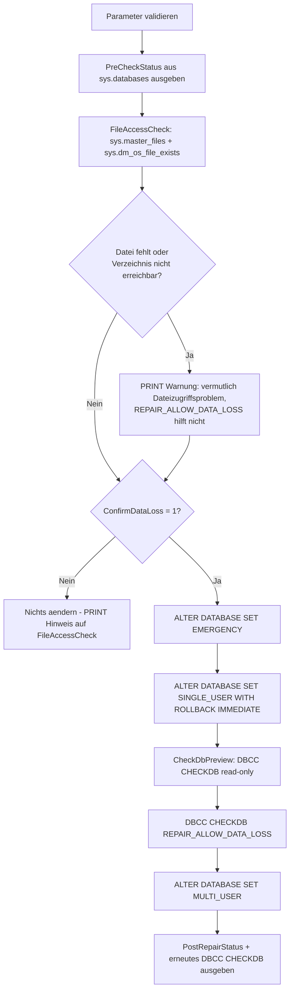

# RecoveryPendingRepairWithoutBackup.sql

Dieses Skript ist die **letzte Notloesung**, wenn eine `RECOVERY_PENDING`-Datenbank vorliegt und **kein brauchbares Backup** fuer einen vollstaendigen Restore oder einen gezielten Page Restore existiert. Es ist das eigenstaendige Pendant zu [SuspectDatabaseRepairWithoutBackup.sql](SuspectDatabaseRepairWithoutBackup.sql), unterscheidet sich aber in einem entscheidenden Punkt: Bevor irgendein Reparaturversuch unternommen wird, prueft es explizit per Dateizugriffscheck, ob die physischen Datendateien ueberhaupt vorhanden und erreichbar sind — denn genau das (nicht Seitenkorruption) ist die haeufigste Ursache fuer `RECOVERY_PENDING`.

## Uebersicht

<!-- SQLDOC:SUMMARY_TABLE:BEGIN -->
| Feld | Wert |
|---|---|
| Script | [RecoveryPendingRepairWithoutBackup.sql](RecoveryPendingRepairWithoutBackup.sql) |
| Version | `1.0` |
| Typ | `remediation` |
| Kapitel | `71_BackupRestore_Strategies` |
| Sicherheit | `destructive` (schreibend, Datenverlust) |
| Zweck | Prueft bei einer RECOVERY_PENDING-Datenbank zuerst den Dateizugriff, repariert danach ggf. ohne Backup via DBCC CHECKDB REPAIR_ALLOW_DATA_LOSS, abgesichert durch explizite Bestaetigung. |
<!-- SQLDOC:SUMMARY_TABLE:END -->

## Einordnung

Siehe [SuspectOrRecoveryPendingDatabase_RepairOptions.md](../SuspectOrRecoveryPendingDatabase_RepairOptions.md) fuer den vollstaendigen Vergleich aller Reparaturoptionen (vollstaendiger Restore, Page Restore, VM-/Disk-Level-Restore, Repair ohne Backup) sowie [SuspectOrRecoveryPendingDatabaseRootCauseCheck.sql](SuspectOrRecoveryPendingDatabaseRootCauseCheck.sql) fuer die vorgelagerte automatische Ursachenanalyse (Dateizugriff, Speicherplatz, Suspect Pages, Errorlog).

Dieses Skript ist **eigenstaendig** und getrennt von [SuspectDatabaseRepairWithoutBackup.sql](SuspectDatabaseRepairWithoutBackup.sql), das denselben letzten Reparaturweg fuer eine `SUSPECT`-Datenbank abdeckt. Der Unterschied liegt nicht im destruktiven Kernablauf (`SET EMERGENCY` → `SET SINGLE_USER` → `DBCC CHECKDB ... REPAIR_ALLOW_DATA_LOSS` → `SET MULTI_USER`), sondern in der Vorpruefung:

**Wichtiger technischer Unterschied zu `SUSPECT`:** Eine `SUSPECT`-Datenbank verweigert grundsaetzlich jeden Zugriff (auch lesend) mit `Msg 926`, solange sie nicht per `SET EMERGENCY` zugaenglich gemacht wurde — ein sinnvoller Vorab-Check ist dort unmoeglich. Eine `RECOVERY_PENDING`-Datenbank ist dagegen i.d.R. bereits ueber `sys.databases`/`sys.master_files` lesbar. Dieses Skript nutzt das aus, um **schon bei `@ConfirmDataLoss = 0`** einen Dateizugriffscheck (`sys.dm_os_file_exists`) durchzufuehren — denn eine fehlende/verschobene/nicht erreichbare Datendatei (Laufwerksausfall, geloeschte Datei, fehlende Berechtigung) ist die haeufigste Ursache fuer `RECOVERY_PENDING`, und `REPAIR_ALLOW_DATA_LOSS` loest dieses Problem **nicht**.

**Bevor dieses Skript verwendet wird, immer zuerst pruefen**, ob doch noch ein brauchbares Backup existiert (siehe `msdb.dbo.backupset`/`backupmediafamily` in [SuspectOrRecoveryPendingDatabase_RepairOptions.md](../SuspectOrRecoveryPendingDatabase_RepairOptions.md) Abschnitt 5) — ein Restore ist grundsaetzlich vorzuziehen, da er ohne Datenverlust auskommt. Ebenso lohnt sich ein Blick auf [SuspectOrRecoveryPendingDatabase_VMDiskLevelRestore.md](../SuspectOrRecoveryPendingDatabase_VMDiskLevelRestore.md), falls kein SQL-natives Backup, aber ein komplettes VM-/Disk-Backup existiert — bei `RECOVERY_PENDING` ist dieser Weg oft die naheliegendste Loesung, da eine fehlende Datei durch die alte VM-Backup-Version direkt ersetzt werden kann.

## Annahmen

- Das Skript ist wie sein `SUSPECT`-Pendant als **zweistufiger Ablauf** gebaut: Solange `@ConfirmDataLoss = 0` (Default) ist, wird **nichts** an der Datenbank geaendert.
- Bereits bei `@ConfirmDataLoss = 0` wird zusaetzlich `FileAccessCheck` ausgegeben — dieser Schritt ist rein lesend und unabhaengig vom `@ConfirmDataLoss`-Wert.
- Zeigt `FileAccessCheck` eine fehlende/nicht erreichbare Datei, ist die Ursache vermutlich ein Dateisystem-/Berechtigungsproblem und **nicht** Seitenkorruption — in diesem Fall bringt `SET EMERGENCY`/`REPAIR_ALLOW_DATA_LOSS` **keinen** Fortschritt (der anschliessende `DBCC CHECKDB`-Versuch schlaegt dann mit einem I/O-Fehler statt `Msg 926` fehl).
- Erst mit `@ConfirmDataLoss = 1` wird die Datenbank tatsaechlich in `EMERGENCY`/`SINGLE_USER` versetzt, ein lesender `DBCC CHECKDB`-Check ausgefuehrt und danach `DBCC CHECKDB ... REPAIR_ALLOW_DATA_LOSS`.
- Der Datenverlust durch `REPAIR_ALLOW_DATA_LOSS` ist **endgueltig** — es gibt keine Undo-Funktion.
- Nach der Reparatur sollte umgehend ein neues Full-Backup gezogen werden, da der reparierte Zustand sonst ungesichert bleibt.

## Anwendungsfall

Eine Datenbank ist `RECOVERY_PENDING`, und es existiert nachweislich kein Backup, das die aktuelle Situation ohne Datenverlust loesen kann. Bevor der destruktive `REPAIR_ALLOW_DATA_LOSS`-Weg beschritten wird, zeigt das Skript zuerst, ob ueberhaupt eine Datendatei fehlt — denn dann waere weder Reparatur noch Datenverlust noetig, sondern lediglich die fehlende Datei wiederherzustellen bzw. den Pfad zu korrigieren.

## Parameter

<!-- SQLDOC:PARAMETERS_TABLE:BEGIN -->
| Parameter | SQL-Typ | Pflicht | Beschreibung |
|---|---|---|---|
| `@TargetDatabaseName` | `SYSNAME` | Ja | Name der RECOVERY_PENDING-Datenbank ohne brauchbares Backup, z.B. `'BI_DQ'`. |
| `@ConfirmDataLoss` | `BIT` | Ja | Muss explizit auf `1` gesetzt werden, um den destruktiven REPAIR_ALLOW_DATA_LOSS-Schritt tatsaechlich auszufuehren. Bei `0` (Default) laeuft nur eine Vorschau/Trockenlauf-Pruefung inkl. Dateizugriffscheck. |
<!-- SQLDOC:PARAMETERS_TABLE:END -->

## Abhaengigkeiten

<!-- SQLDOC:DEPENDENCIES_LIST:BEGIN -->
- `sys.databases`
- `sys.master_files`
- `sys.dm_os_file_exists`
- `msdb.dbo.suspect_pages`
- `DBCC CHECKDB`
- `ALTER DATABASE`
<!-- SQLDOC:DEPENDENCIES_LIST:END -->

## Hinweise

- `PreCheckStatus` zeigt Status, Recovery Model und das `IsInRecovery`-Flag der Zieldatenbank aus `sys.databases` — bei `RECOVERY_PENDING` i.d.R. ohne `Msg 926` moeglich.
- `FileAccessCheck` laeuft **unabhaengig** von `@ConfirmDataLoss` und prueft je Datenbankdatei (`sys.master_files` + `sys.dm_os_file_exists`), ob sie physisch existiert und das uebergeordnete Verzeichnis erreichbar ist. Fehlt eine Datei, gibt das Skript zusaetzlich eine `PRINT`-Warnung aus, dass `SET EMERGENCY`/`REPAIR_ALLOW_DATA_LOSS` dieses Problem nicht loesen wird.
- Nur wenn `@ConfirmDataLoss = 1` gesetzt ist, folgt der destruktive Block: `SET EMERGENCY` → `SET SINGLE_USER WITH ROLLBACK IMMEDIATE` → lesender `DBCC CHECKDB`-Check (`CheckDbPreview`) → `DBCC CHECKDB ... REPAIR_ALLOW_DATA_LOSS` → `SET MULTI_USER`.
- `PostRepairStatus` (nur bei `@ConfirmDataLoss = 1`) zeigt Status und verbleibende Suspect-Page-Anzahl nach der Reparatur, gefolgt von einem erneuten lesenden `DBCC CHECKDB`-Lauf zur Kontrolle.
- Das Skript gibt per `PRINT` eine klare Meldung aus, ob der destruktive Ablauf ausgefuehrt wurde oder gar nichts passiert ist — im letzteren Fall mit dem expliziten Hinweis, zuerst `FileAccessCheck` zu pruefen.

## Versionshistorie

<!-- SQLDOC:VERSION_HISTORY_TABLE:BEGIN -->
| Version | Datum | User | Beschreibung |
|---|---|---|---|
| `1.0` | `2026-08-13` | `ER` | Erstversion als eigenstaendiges Pendant zu SuspectDatabaseRepairWithoutBackup.sql, speziell fuer RECOVERY_PENDING: zusaetzlicher Dateizugriffscheck (sys.dm_os_file_exists) VOR dem EMERGENCY-Wechsel, da RECOVERY_PENDING haeufig durch fehlende/nicht erreichbare Datendateien statt durch Seitenkorruption ausgeloest wird und REPAIR_ALLOW_DATA_LOSS in diesem Fall wirkungslos ist. |
<!-- SQLDOC:VERSION_HISTORY_TABLE:END -->

## Ablauf

<!-- SQLDOC:MERMAID:BEGIN -->

<!-- SQLDOC:MERMAID:END -->

## SQL-Code

<!-- SQLDOC:SQL_CODE:BEGIN -->
```sql
/*
BEGIN:SQL-HEADER v1
---
sql_header: v1
script_name: "RecoveryPendingRepairWithoutBackup.sql"
script_version: "1.0"
script_type: "remediation"
chapter: "71_BackupRestore_Strategies"
purpose: >
  Letzte Notloesung fuer eine RECOVERY_PENDING-Datenbank, wenn KEIN
  brauchbares Backup fuer einen vollstaendigen Restore oder einen Page
  Restore existiert. Im Unterschied zu SUSPECT ist eine RECOVERY_PENDING-
  Datenbank i.d.R. bereits ueber sys.databases/sys.master_files lesbar
  (kein Msg 926), daher prueft dieses Skript VOR jedem Reparaturversuch
  explizit, ob die physischen Datendateien ueberhaupt vorhanden und
  erreichbar sind - ein reines Dateizugriffsproblem (fehlende/verschobene
  Datei, volles Laufwerk, fehlende Berechtigung) ist die haeufigste Ursache
  fuer RECOVERY_PENDING und wird durch SET EMERGENCY + REPAIR_ALLOW_DATA_LOSS
  NICHT geloest. Erst wenn die Dateien vorhanden sind, versetzt das Skript
  die Datenbank in den EMERGENCY- und SINGLE_USER-Modus und fuehrt DBCC
  CHECKDB WITH REPAIR_ALLOW_DATA_LOSS aus. Dies ist KEINE Wiederherstellung:
  Betroffene Seiten/Zeilen werden entfernt, der Datenverlust ist endgueltig.
  Das Skript fuehrt den destruktiven Schritt nur aus, wenn @ConfirmDataLoss
  explizit auf 1 gesetzt wurde.

parameters:
  - name: "@TargetDatabaseName"
    sql_type: "SYSNAME"
    direction: "IN"
    required: true
    description: "Name der RECOVERY_PENDING-Datenbank ohne brauchbares Backup, z.B. 'BI_DQ'"
  - name: "@ConfirmDataLoss"
    sql_type: "BIT"
    direction: "IN"
    required: true
    description: "Muss explizit auf 1 gesetzt werden, um den destruktiven REPAIR_ALLOW_DATA_LOSS-Schritt tatsaechlich auszufuehren; bei 0 (Default) wird nur eine Vorschau/Trockenlauf-Pruefung inkl. Dateizugriffscheck durchgefuehrt"

result_sets:
  - name: "PreCheckStatus"
    description: "Status der Zieldatenbank vor jeder Aenderung, inkl. IsInRecovery-Flag"
  - name: "FileAccessCheck"
    description: "Je Datenbankdatei: existiert sie physisch (sys.dm_os_file_exists)? Fehlende/nicht erreichbare Dateien sind die haeufigste Ursache fuer RECOVERY_PENDING und werden durch REPAIR_ALLOW_DATA_LOSS NICHT geloest"
  - name: "CheckDbPreview"
    description: "DBCC CHECKDB (read-only) Ausgabe NACH dem Wechsel in EMERGENCY, aber VOR REPAIR_ALLOW_DATA_LOSS, zur Einschaetzung des Schadens (nur wenn @ConfirmDataLoss = 1)"
  - name: "PostRepairStatus"
    description: "Status und Suspect-Page-Anzahl der Zieldatenbank nach der Reparatur (nur wenn @ConfirmDataLoss = 1)"

dependencies:
  - "sys.databases"
  - "sys.master_files"
  - "sys.dm_os_file_exists"
  - "msdb.dbo.suspect_pages"
  - "DBCC CHECKDB"
  - "ALTER DATABASE"

safety:
  level: "destructive"
  writes_data: true

documentation:
  markdown_file: "T-SQL/71_BackupRestore_Strategies/SQLScripts/RecoveryPendingRepairWithoutBackup.md"
  sync_blocks:
    - "SUMMARY_TABLE"
    - "PARAMETERS_TABLE"
    - "DEPENDENCIES_LIST"
    - "VERSION_HISTORY_TABLE"
    - "SQL_CODE"
  mermaid:
    mode: "ai-agent-from-sql"
    source: "script-body"

main_responsible:
  name: "Erhard Rainer"
  initials: "ER"

version_history:
  - version: "1.0"
    date: "2026-08-13"
    user: "ER"
    description: "Erstversion als eigenstaendiges Pendant zu SuspectDatabaseRepairWithoutBackup.sql, speziell fuer RECOVERY_PENDING: zusaetzlicher Dateizugriffscheck (sys.dm_os_file_exists) VOR dem EMERGENCY-Wechsel, da RECOVERY_PENDING haeufig durch fehlende/nicht erreichbare Datendateien statt durch Seitenkorruption ausgeloest wird und REPAIR_ALLOW_DATA_LOSS in diesem Fall wirkungslos ist."

notes:
  - "Dies ist ein SCHREIBENDES, DESTRUKTIVES Skript. Es entfernt beschaedigte Seiten/Zeilen dauerhaft und unwiderruflich."
  - "Vor Ausfuehrung IMMER pruefen, ob doch noch ein brauchbares Backup fuer vollstaendigen Restore oder Page Restore existiert (siehe SuspectOrRecoveryPendingDatabase_RepairOptions.md), da dies ohne Datenverlust waere."
  - "Anders als bei SUSPECT (siehe SuspectDatabaseRepairWithoutBackup.sql) ist eine RECOVERY_PENDING-Datenbank i.d.R. bereits ueber sys.databases und sys.master_files lesbar (kein Msg 926). Das Skript nutzt dies, um schon bei @ConfirmDataLoss = 0 einen Dateizugriffscheck durchzufuehren."
  - "Zeigt FileAccessCheck eine fehlende/nicht erreichbare Datei, ist die Ursache vermutlich ein Dateisystem-/Berechtigungsproblem (verschobene/geloeschte Datei, getrenntes Laufwerk, Datentraegerausfall) und NICHT Seitenkorruption. In diesem Fall bringt SET EMERGENCY + REPAIR_ALLOW_DATA_LOSS keinen Fortschritt (DBCC CHECKDB schlaegt dann mit einem I/O-Fehler statt Msg 926 fehl) - stattdessen die fehlende Datei wiederherstellen/den Pfad korrigieren oder aus Backup restoren. Siehe auch SQLScripts/SuspectOrRecoveryPendingDatabaseRootCauseCheck.sql fuer eine ausfuehrlichere Ursachenanalyse (inkl. freiem Speicherplatz und Errorlog)."
  - "Solange @ConfirmDataLoss = 0 ist, aendert das Skript nichts an der Datenbank."
  - "Nach erfolgreicher Reparatur sollte umgehend ein neues Full-Backup gezogen werden (siehe SuspectOrRecoveryPendingDatabase_RepairOptions.md Abschnitt 4.5)."
---
END:SQL-HEADER v1
*/

SET NOCOUNT ON;

-- 1. Parameter vorbereiten
DECLARE @TargetDatabaseName SYSNAME = N'BI_DQ';
DECLARE @ConfirmDataLoss BIT = 0;

IF @TargetDatabaseName IS NULL OR LTRIM(RTRIM(@TargetDatabaseName)) = N''
BEGIN
    THROW 50000, '@TargetDatabaseName darf nicht leer sein.', 1;
END;

IF NOT EXISTS (SELECT 1 FROM sys.databases WHERE name = @TargetDatabaseName)
BEGIN
    THROW 50001, 'Die angegebene Datenbank wurde nicht in sys.databases gefunden.', 1;
END;

IF @ConfirmDataLoss IS NULL OR @ConfirmDataLoss NOT IN (0, 1)
BEGIN
    THROW 50002, '@ConfirmDataLoss muss 0 oder 1 sein.', 1;
END;

DECLARE @TargetDatabaseId INT = (SELECT database_id FROM sys.databases WHERE name = @TargetDatabaseName);

-- 2. Vorab-Status anzeigen (rein lesend; bei RECOVERY_PENDING i.d.R. ohne Msg 926 moeglich)
SELECT
    d.name                                                  AS DatabaseName,
    d.database_id                                           AS DatabaseId,
    d.state_desc                                            AS StateDesc,
    d.recovery_model_desc                                   AS RecoveryModel,
    d.user_access_desc                                      AS UserAccessDesc,
    DATABASEPROPERTYEX(d.name, 'IsInRecovery')              AS IsInRecoveryFlag,
    @ConfirmDataLoss                                         AS ConfirmDataLossFlag
FROM sys.databases AS d
WHERE d.name = @TargetDatabaseName;

-- 3. Dateizugriffscheck: haeufigste Ursache fuer RECOVERY_PENDING ist eine fehlende/nicht
--    erreichbare physische Datei, nicht Seitenkorruption. REPAIR_ALLOW_DATA_LOSS loest dies NICHT.
SELECT
    mf.file_id      AS FileId,
    mf.name         AS LogicalName,
    mf.physical_name AS PhysicalName,
    mf.type_desc    AS FileTypeDesc,
    fe.file_exists  AS FileExists,
    fe.parent_directory_exists AS ParentDirExists
FROM sys.master_files AS mf
CROSS APPLY sys.dm_os_file_exists(mf.physical_name) AS fe
WHERE mf.database_id = @TargetDatabaseId;

IF EXISTS (
    SELECT 1
    FROM sys.master_files AS mf
    CROSS APPLY sys.dm_os_file_exists(mf.physical_name) AS fe
    WHERE mf.database_id = @TargetDatabaseId
      AND (fe.file_exists = 0 OR fe.parent_directory_exists = 0)
)
BEGIN
    PRINT N'WARNUNG: Mindestens eine Datendatei ist physisch nicht erreichbar. RECOVERY_PENDING ist in diesem Fall vermutlich ein Dateizugriffsproblem, nicht Seitenkorruption - SET EMERGENCY / REPAIR_ALLOW_DATA_LOSS wird dies nicht beheben. Erst die fehlende Datei/den Pfad korrigieren, siehe SQLScripts/SuspectOrRecoveryPendingDatabaseRootCauseCheck.sql.';
END;

-- 4. Destruktiven Ablauf nur ausfuehren, wenn explizit bestaetigt.
IF @ConfirmDataLoss = 1
BEGIN
    DECLARE @Sql NVARCHAR(MAX);

    PRINT N'ACHTUNG: @ConfirmDataLoss = 1 - fuehre destruktive Reparatur mit Datenverlust aus fuer ' + QUOTENAME(@TargetDatabaseName) + N'.';

    -- 4a. Datenbank in EMERGENCY und SINGLE_USER versetzen
    SET @Sql = N'ALTER DATABASE ' + QUOTENAME(@TargetDatabaseName) + N' SET EMERGENCY;';
    EXEC sp_executesql @Sql;

    SET @Sql = N'ALTER DATABASE ' + QUOTENAME(@TargetDatabaseName) + N' SET SINGLE_USER WITH ROLLBACK IMMEDIATE;';
    EXEC sp_executesql @Sql;

    -- 4b. Lesender DBCC CHECKDB-Check, um den Schadensumfang zu sehen
    DBCC CHECKDB (@TargetDatabaseName) WITH NO_INFOMSGS, ALL_ERRORMSGS;

    -- 4c. Reparatur mit Datenverlust
    DBCC CHECKDB (@TargetDatabaseName, REPAIR_ALLOW_DATA_LOSS) WITH NO_INFOMSGS, ALL_ERRORMSGS;

    -- 4d. Datenbank wieder fuer alle Benutzer freigeben
    SET @Sql = N'ALTER DATABASE ' + QUOTENAME(@TargetDatabaseName) + N' SET MULTI_USER;';
    EXEC sp_executesql @Sql;

    -- 5. Ergebnis nach der Reparatur pruefen
    SELECT
        d.name                AS DatabaseName,
        d.database_id         AS DatabaseId,
        d.state_desc          AS StateDesc,
        d.recovery_model_desc AS RecoveryModel,
        d.user_access_desc    AS UserAccessDesc,
        (SELECT COUNT(*) FROM msdb.dbo.suspect_pages AS sp WHERE sp.database_id = d.database_id) AS SuspectPageCountAfterRepair
    FROM sys.databases AS d
    WHERE d.name = @TargetDatabaseName;

    DBCC CHECKDB (@TargetDatabaseName) WITH NO_INFOMSGS, ALL_ERRORMSGS;

    PRINT N'Reparatur abgeschlossen. Bitte umgehend ein neues Full-Backup ziehen und die entfernten Daten fachlich pruefen (siehe SuspectOrRecoveryPendingDatabase_RepairOptions.md Abschnitt 4.5).';
END
ELSE
BEGIN
    PRINT N'@ConfirmDataLoss = 0: Es wurde nichts an der Datenbank geaendert. Pruefen Sie zuerst das Ergebnis von FileAccessCheck: Fehlt eine Datei, liegt die Ursache vermutlich NICHT in Seitenkorruption und REPAIR_ALLOW_DATA_LOSS wird nicht helfen. Zum Ausfuehren der destruktiven Reparatur @ConfirmDataLoss auf 1 setzen.';
END;
```
<!-- SQLDOC:SQL_CODE:END -->
