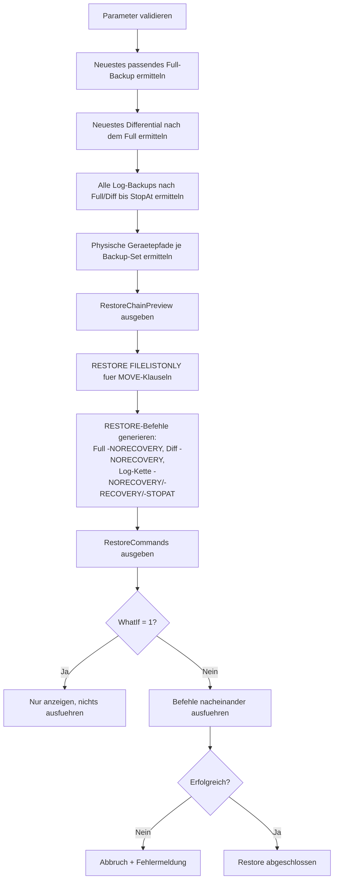

# RestoreDatabaseFromLatestBackup.sql

Dieses Skript ist das **Gegenstück zu [SmartDatabaseBackup.sql](SmartDatabaseBackup.sql)**: Während jenes Skript automatisch entscheidet, *welches Backup als Nächstes nötig ist*, ermittelt dieses Skript automatisch, *welche Kette aus vorhandenen Backups* (letztes Full, optional letztes Differential, alle nachfolgenden Log-Backups) für einen Restore zusammengehört — und führt die Restore-Kette aus.

## Übersicht

<!-- SQLDOC:SUMMARY_TABLE:BEGIN -->
| Feld | Wert |
|---|---|
| Script | [RestoreDatabaseFromLatestBackup.sql](RestoreDatabaseFromLatestBackup.sql) |
| Version | `1.0` |
| Typ | `remediation` |
| Kapitel | `71_BackupRestore_Strategies` |
| Sicherheit | `destructive` (überschreibt die Zieldatenbank per `WITH REPLACE`, falls Ziel = Quelle) |
| Zweck | Ermittelt automatisch die aktuellste Full/Diff/Log-Restore-Kette aus `msdb` und führt sie aus, wahlweise unter neuem Namen für Restore-Tests. |
<!-- SQLDOC:SUMMARY_TABLE:END -->

## Einordnung

Ergänzt [SmartDatabaseBackup.sql](SmartDatabaseBackup.md) um die Restore-Seite und ist eng verwandt mit [BackupChainIntegrityCheck.sql](BackupChainIntegrityCheck.md) (prüft die Kette **vorab** auf Lücken) und [AutomatedRestoreTest.sql](AutomatedRestoreTest.md) (nutzt diese Restore-Logik für automatisierte Testläufe). Die fachliche Grundlage der Restore-Ketten-Logik ist in [71_BackupRestore_Strategies.md](../71_BackupRestore_Strategies.md) Abschnitt 4.1 (Vollständiger Datenbank-Restore) und 4.2 (Point-in-Time-Restore) beschrieben.

## Annahmen

- Die Kettenermittlung basiert **ausschließlich** auf der `msdb`-Historie (`msdb.dbo.backupset`/`backupmediafamily`) — Backup-Dateien, deren Historieneintrag gelöscht wurde, werden nicht gefunden.
- Ist `@TargetDatabaseName` nicht angegeben, wird die **Originaldatenbank überschrieben** (`WITH REPLACE`) — für einen gefahrlosen Test immer einen abweichenden Namen angeben.
- Bei `@StopAt` wird nur bis zu dem Log-Backup wiederhergestellt, das den Zielzeitpunkt noch enthält; das letzte eingespielte Log-Backup läuft dann mit `WITH STOPAT` statt `WITH NORECOVERY`.
- Multi-File-Datenbanken werden unterstützt: `@TargetDataFilePath` wird auf alle Dateien angewendet, wobei die logischen Namen aus `RESTORE FILELISTONLY` übernommen werden.
- **Vor einer echten Notfallwiederherstellung** sollte immer zuerst ein Tail-Log-Backup versucht werden (siehe [TailLogBackupBeforeRestore.sql](TailLogBackupBeforeRestore.md)), sonst gehen Transaktionen seit dem letzten regulären Log-Backup unnötig verloren.

## Anwendungsfall

Notfallwiederherstellung, bei der schnell die *aktuellste* verfügbare Kette eingespielt werden soll, ohne manuell durch `msdb.dbo.backupset` zu suchen — oder ein automatisierter Restore-Test unter neuem Datenbanknamen, um zu verifizieren, dass die Backup-Kette tatsächlich vollständig und wiederherstellbar ist.

## Parameter

<!-- SQLDOC:PARAMETERS_TABLE:BEGIN -->
| Parameter | SQL-Typ | Pflicht | Beschreibung |
|---|---|---|---|
| `@SourceDatabaseName` | `SYSNAME` | Ja | Name der Datenbank in `msdb.dbo.backupset` (Quelle der Backup-Kette). |
| `@TargetDatabaseName` | `SYSNAME` | Nein | Zielname für den Restore; `NULL` (Default) = identisch zur Quelle (überschreibt Original). |
| `@TargetDataFilePath` | `NVARCHAR(500)` | Nein | Zielverzeichnis für die Datendateien (`MOVE`); `NULL` = Originalpfade aus dem Backup. |
| `@StopAt` | `DATETIME2(0)` | Nein | Point-in-Time für die Wiederherstellung; `NULL` (Default) = vollständigste verfügbare Kette. |
| `@WhatIf` | `BIT` | Nein | `1` = zeigt nur Kette und generierte Befehle an, ohne auszuführen; `0` (Default) = führt den Restore aus. |
<!-- SQLDOC:PARAMETERS_TABLE:END -->

## Abhängigkeiten

<!-- SQLDOC:DEPENDENCIES_LIST:BEGIN -->
- `msdb.dbo.backupset`
- `msdb.dbo.backupmediafamily`
- `msdb.dbo.backupfile`
- `RESTORE DATABASE`
- `RESTORE LOG`
- `RESTORE FILELISTONLY`
<!-- SQLDOC:DEPENDENCIES_LIST:END -->

## Hinweise

- `RestoreChainPreview` zeigt die ermittelte Kette (Full, optional Differential, alle Log-Backups) mit physischen Gerätepfaden, bevor irgendetwas ausgeführt wird.
- `RestoreCommands` zeigt die generierten `RESTORE DATABASE`/`RESTORE LOG`-Befehle in exakter Ausführungsreihenfolge — auch im `@WhatIf = 1`-Modus.
- Gestripte Backup-Sets (mehrere Dateien pro Backup) werden korrekt über `family_sequence_number` sortiert und als eine gemeinsame `FROM DISK = ..., DISK = ...`-Klausel zusammengeführt.
- Schlägt ein Zwischenschritt fehl, bricht das Skript sofort ab und gibt den Fehler klar aus, statt mit einer inkonsistenten Restore-Kette fortzufahren.

## Versionshistorie

<!-- SQLDOC:VERSION_HISTORY_TABLE:BEGIN -->
| Version | Datum | User | Beschreibung |
|---|---|---|---|
| `1.0` | `2026-08-14` | `ER` | Erstversion: automatische Ermittlung der aktuellsten Full/Diff/Log-Restore-Kette aus msdb und Ausführung als Restore-Sequenz, wahlweise unter neuem Datenbanknamen für Restore-Tests, mit optionalem Point-in-Time-Stop und WhatIf-Modus |
<!-- SQLDOC:VERSION_HISTORY_TABLE:END -->

## Ablauf

<!-- SQLDOC:MERMAID:BEGIN -->

<!-- SQLDOC:MERMAID:END -->

## SQL-Code

<!-- SQLDOC:SQL_CODE:BEGIN -->
```sql
/*
BEGIN:SQL-HEADER v1
---
sql_header: v1
script_name: "RestoreDatabaseFromLatestBackup.sql"
script_version: "1.0"
script_type: "remediation"
chapter: "71_BackupRestore_Strategies"
purpose: >
  Ermittelt automatisch die neueste vollstaendige Restore-Kette (letztes
  Full-Backup, optional letztes Differential-Backup danach, sowie alle
  Transaction-Log-Backups nach dem gewaehlten Full/Diff bis zum aktuellen
  Zeitpunkt oder bis zu einem angegebenen Point-in-Time) aus
  msdb.dbo.backupset und msdb.dbo.backupmediafamily und restored die
  Datenbank damit - wahlweise unter dem Originalnamen (fuer eine echte
  Notfallwiederherstellung) oder unter einem neuen Namen (fuer einen
  Restore-Test ohne die Produktionsdatenbank zu beruehren). Ist das Gegen-
  stueck zu SmartDatabaseBackup.sql: Waehrend jenes Skript automatisch
  entscheidet, WELCHES Backup als naechstes noetig ist, entscheidet dieses
  Skript automatisch, WELCHE Kette aus vorhandenen Backups fuer einen
  Restore zusammengehoert.

parameters:
  - name: "@SourceDatabaseName"
    sql_type: "SYSNAME"
    direction: "IN"
    required: true
    description: "Name der Datenbank, wie sie in msdb.dbo.backupset als database_name gefuehrt wird (Quelle der Backup-Kette), z.B. 'BI_DQ'"
  - name: "@TargetDatabaseName"
    sql_type: "SYSNAME"
    direction: "IN"
    required: false
    description: "Name, unter dem die Datenbank wiederhergestellt werden soll; NULL (Default) = identisch zu @SourceDatabaseName (Ueberschreiben/Ersetzen der Originaldatenbank). Fuer einen gefahrlosen Restore-Test einen abweichenden Namen angeben, z.B. 'BI_DQ_RestoreTest'."
  - name: "@TargetDataFilePath"
    sql_type: "NVARCHAR(500)"
    direction: "IN"
    required: false
    description: "Zielverzeichnis fuer die wiederhergestellten Datendateien (MOVE-Ziel); NULL (Default) = Originalpfade aus dem Backup werden verwendet (nur sinnvoll, wenn @TargetDatabaseName = @SourceDatabaseName oder der Pfad frei ist)"
  - name: "@StopAt"
    sql_type: "DATETIME2(0)"
    direction: "IN"
    required: false
    description: "Point-in-Time, bis zu dem wiederhergestellt werden soll (WITH STOPAT); NULL (Default) = bis zum letzten verfuegbaren Backup (kompletteste Kette). Nur wirksam, wenn Log-Backups in der Kette vorhanden sind."
  - name: "@WhatIf"
    sql_type: "BIT"
    direction: "IN"
    required: false
    description: "1 = zeigt nur die ermittelte Restore-Kette und die generierten RESTORE-Befehle an, ohne sie auszufuehren; 0 (Default) = fuehrt die Restore-Kette tatsaechlich aus"

result_sets:
  - name: "RestoreChainPreview"
    description: "Die ermittelte Kette aus Full-, optionalem Differential- und Log-Backups in der Reihenfolge, in der sie eingespielt werden, inkl. physischer Dateipfade"
  - name: "RestoreCommands"
    description: "Die tatsaechlich generierten RESTORE DATABASE/RESTORE LOG-Befehle in Ausfuehrungsreihenfolge"

dependencies:
  - "msdb.dbo.backupset"
  - "msdb.dbo.backupmediafamily"
  - "msdb.dbo.backupfile"
  - "RESTORE DATABASE"
  - "RESTORE LOG"
  - "RESTORE FILELISTONLY"

safety:
  level: "destructive"
  writes_data: true

documentation:
  markdown_file: "T-SQL/71_BackupRestore_Strategies/SQLScripts/RestoreDatabaseFromLatestBackup.md"
  sync_blocks:
    - "SUMMARY_TABLE"
    - "PARAMETERS_TABLE"
    - "DEPENDENCIES_LIST"
    - "VERSION_HISTORY_TABLE"
    - "SQL_CODE"
  mermaid:
    mode: "ai-agent-from-sql"
    source: "script-body"

main_responsible:
  name: "Erhard Rainer"
  initials: "ER"

version_history:
  - version: "1.0"
    date: "2026-08-14"
    user: "ER"
    description: "Erstversion: automatische Ermittlung der aktuellsten Full/Diff/Log-Restore-Kette aus msdb und Ausfuehrung als Restore-Sequenz, wahlweise unter neuem Datenbanknamen fuer Restore-Tests, mit optionalem Point-in-Time-Stop und WhatIf-Modus"

notes:
  - "Dieses Skript SCHREIBT bzw. UEBERSCHREIBT eine Datenbank und ist damit destruktiv, wenn @TargetDatabaseName = @SourceDatabaseName gesetzt ist (Default) - die Zieldatenbank wird per WITH REPLACE ersetzt. Fuer einen gefahrlosen Test immer einen abweichenden @TargetDatabaseName verwenden."
  - "Die Kettenermittlung basiert ausschliesslich auf der msdb-Historie (msdb.dbo.backupset/backupmediafamily) - sind Backup-Dateien vorhanden, deren Historieneintrag geloescht wurde (z.B. durch Cleanup-Jobs oder einen Restore der msdb selbst), findet dieses Skript sie nicht. In diesem Fall muss die Kette manuell per RESTORE FILELISTONLY/HEADERONLY gegen die Dateien rekonstruiert werden."
  - "Bei @StopAt wird nur bis zu dem Log-Backup wiederhergestellt, das den Zielzeitpunkt noch enthaelt; das letzte eingespielte Log-Backup laeuft dann mit WITH STOPAT statt WITH NORECOVERY. Liegt @StopAt vor dem gewaehlten Full-Backup, bricht das Skript mit einer verstaendlichen Fehlermeldung ab, statt einen sinnlosen Restore zu versuchen."
  - "Fuer eine Notfallwiederherstellung MUSS vor dem Ausfuehren dieses Skripts geprueft werden, ob noch ein Tail-Log-Backup moeglich ist (siehe TailLogBackupBeforeRestore.sql) - sonst gehen alle Transaktionen seit dem letzten reguleren Log-Backup unnoetig verloren."
  - "Multi-File-Datenbanken (mehrere Daten- oder Logdateien) werden unterstuetzt: @TargetDataFilePath wird auf ALLE Dateien der Datenbank angewendet, wobei die logischen Dateinamen aus RESTORE FILELISTONLY uebernommen und nur das Verzeichnis ausgetauscht wird - die urspruengliche Dateistruktur (Namen, Anzahl der Dateien) bleibt erhalten."
  - "Fuer die instanzweite Uebersicht, welche Datenbanken ueberhaupt eine vollstaendige, restorebare Kette besitzen, siehe BackupChainIntegrityCheck.sql - dieses Skript hier geht davon aus, dass die Kette bereits als intakt bekannt ist."
---
END:SQL-HEADER v1
*/

SET NOCOUNT ON;

-- 1. Parameter vorbereiten
DECLARE @SourceDatabaseName SYSNAME = N'BI_DQ';
DECLARE @TargetDatabaseName SYSNAME = NULL;
DECLARE @TargetDataFilePath NVARCHAR(500) = NULL;
DECLARE @StopAt DATETIME2(0) = NULL;
DECLARE @WhatIf BIT = 0;

PRINT N'[' + CONVERT(NVARCHAR(30), SYSDATETIME(), 121) + N'] Parameter werden geprueft: Quelle = ' + ISNULL(@SourceDatabaseName, N'<NULL>') + N'.';

-- 2. Parameter validieren
IF @SourceDatabaseName IS NULL OR LTRIM(RTRIM(@SourceDatabaseName)) = N''
BEGIN
    THROW 50000, '@SourceDatabaseName darf nicht leer sein.', 1;
END;

IF NOT EXISTS (SELECT 1 FROM msdb.dbo.backupset WHERE database_name = @SourceDatabaseName)
BEGIN
    THROW 50001, 'Fuer @SourceDatabaseName wurden keine Backups in msdb.dbo.backupset gefunden.', 1;
END;

IF @TargetDatabaseName IS NULL OR LTRIM(RTRIM(@TargetDatabaseName)) = N''
BEGIN
    SET @TargetDatabaseName = @SourceDatabaseName;
END;

IF @WhatIf IS NULL OR @WhatIf NOT IN (0, 1)
BEGIN
    THROW 50002, '@WhatIf muss 0 oder 1 sein.', 1;
END;

PRINT N'[' + CONVERT(NVARCHAR(30), SYSDATETIME(), 121) + N'] Parameter sind gueltig. Ziel-Datenbankname = ' + @TargetDatabaseName + N'.';

-- 3. Neuestes Full-Backup ermitteln, das VOR (oder an) @StopAt liegt (bzw. das neueste ueberhaupt, wenn @StopAt NULL ist)
DECLARE @FullBackupSetId INT;
DECLARE @FullBackupFinishDate DATETIME;

SELECT TOP (1)
    @FullBackupSetId = bs.backup_set_id,
    @FullBackupFinishDate = bs.backup_finish_date
FROM msdb.dbo.backupset AS bs
WHERE bs.database_name = @SourceDatabaseName
  AND bs.type = 'D'
  AND (@StopAt IS NULL OR bs.backup_finish_date <= @StopAt)
ORDER BY bs.backup_finish_date DESC;

IF @FullBackupSetId IS NULL
BEGIN
    THROW 50003, 'Kein passendes Full-Backup gefunden (ggf. liegt @StopAt vor dem aeltesten vorhandenen Full-Backup).', 1;
END;

PRINT N'[' + CONVERT(NVARCHAR(30), SYSDATETIME(), 121) + N'] Gewaehltes Full-Backup: backup_set_id = ' + CAST(@FullBackupSetId AS VARCHAR(20)) + N', abgeschlossen ' + CONVERT(NVARCHAR(30), @FullBackupFinishDate, 121) + N'.';

-- 4. Neuestes Differential-Backup NACH dem gewaehlten Full-Backup ermitteln (falls vorhanden und vor @StopAt)
DECLARE @DifferentialBackupSetId INT;
DECLARE @DifferentialBackupFinishDate DATETIME;

SELECT TOP (1)
    @DifferentialBackupSetId = bs.backup_set_id,
    @DifferentialBackupFinishDate = bs.backup_finish_date
FROM msdb.dbo.backupset AS bs
WHERE bs.database_name = @SourceDatabaseName
  AND bs.type = 'I'
  AND bs.backup_finish_date > @FullBackupFinishDate
  AND (@StopAt IS NULL OR bs.backup_finish_date <= @StopAt)
ORDER BY bs.backup_finish_date DESC;

IF @DifferentialBackupSetId IS NOT NULL
BEGIN
    PRINT N'[' + CONVERT(NVARCHAR(30), SYSDATETIME(), 121) + N'] Gewaehltes Differential-Backup: backup_set_id = ' + CAST(@DifferentialBackupSetId AS VARCHAR(20)) + N', abgeschlossen ' + CONVERT(NVARCHAR(30), @DifferentialBackupFinishDate, 121) + N'.';
END
ELSE
BEGIN
    PRINT N'[' + CONVERT(NVARCHAR(30), SYSDATETIME(), 121) + N'] Kein passendes Differential-Backup gefunden - es wird direkt vom Full-Backup aus mit Log-Backups fortgesetzt.';
END;

-- 5. Alle Log-Backups NACH dem gewaehlten Full-/Differential-Backup bis @StopAt (oder bis zum Ende) ermitteln
DECLARE @BaseFinishDate DATETIME = COALESCE(@DifferentialBackupFinishDate, @FullBackupFinishDate);

DROP TABLE IF EXISTS #LogBackupChain;
CREATE TABLE #LogBackupChain
(
    SequenceNo       INT IDENTITY(1,1) NOT NULL,
    BackupSetId      INT                NOT NULL,
    BackupFinishDate DATETIME           NOT NULL
);

INSERT INTO #LogBackupChain (BackupSetId, BackupFinishDate)
SELECT
    bs.backup_set_id,
    bs.backup_finish_date
FROM msdb.dbo.backupset AS bs
WHERE bs.database_name = @SourceDatabaseName
  AND bs.type = 'L'
  AND bs.backup_finish_date > @BaseFinishDate
  AND (@StopAt IS NULL OR bs.backup_start_date <= @StopAt)
ORDER BY bs.backup_finish_date ASC;

DECLARE @LogBackupCount INT = (SELECT COUNT(*) FROM #LogBackupChain);
PRINT N'[' + CONVERT(NVARCHAR(30), SYSDATETIME(), 121) + N'] ' + CAST(@LogBackupCount AS VARCHAR(10)) + N' Log-Backup(s) fuer die Kette gefunden.';

IF @StopAt IS NOT NULL AND @LogBackupCount = 0 AND @StopAt > @BaseFinishDate
BEGIN
    PRINT N'[' + CONVERT(NVARCHAR(30), SYSDATETIME(), 121) + N'] Hinweis: @StopAt liegt nach dem letzten verfuegbaren Full/Diff-Backup, aber es existiert kein Log-Backup, das bis dorthin reicht. Es kann nur bis ' + CONVERT(NVARCHAR(30), @BaseFinishDate, 121) + N' wiederhergestellt werden.';
END;

-- 6. Physische Dateipfade je gewaehltem Backup-Set ermitteln (Striped Sets werden per family_sequence_number sortiert)
DROP TABLE IF EXISTS #RestoreChain;
CREATE TABLE #RestoreChain
(
    SequenceNo       INT           NOT NULL,
    BackupType       VARCHAR(20)   NOT NULL,
    BackupSetId      INT           NOT NULL,
    BackupFinishDate DATETIME      NOT NULL,
    PhysicalDeviceName NVARCHAR(260) NOT NULL
);

INSERT INTO #RestoreChain (SequenceNo, BackupType, BackupSetId, BackupFinishDate, PhysicalDeviceName)
SELECT 1, 'FULL', @FullBackupSetId, @FullBackupFinishDate, bmf.physical_device_name
FROM msdb.dbo.backupmediafamily AS bmf
WHERE bmf.media_set_id = (SELECT media_set_id FROM msdb.dbo.backupset WHERE backup_set_id = @FullBackupSetId)
ORDER BY bmf.family_sequence_number;

IF @DifferentialBackupSetId IS NOT NULL
BEGIN
    INSERT INTO #RestoreChain (SequenceNo, BackupType, BackupSetId, BackupFinishDate, PhysicalDeviceName)
    SELECT 2, 'DIFFERENTIAL', @DifferentialBackupSetId, @DifferentialBackupFinishDate, bmf.physical_device_name
    FROM msdb.dbo.backupmediafamily AS bmf
    WHERE bmf.media_set_id = (SELECT media_set_id FROM msdb.dbo.backupset WHERE backup_set_id = @DifferentialBackupSetId)
    ORDER BY bmf.family_sequence_number;
END;

INSERT INTO #RestoreChain (SequenceNo, BackupType, BackupSetId, BackupFinishDate, PhysicalDeviceName)
SELECT
    2 + lbc.SequenceNo,
    'LOG',
    lbc.BackupSetId,
    lbc.BackupFinishDate,
    bmf.physical_device_name
FROM #LogBackupChain AS lbc
JOIN msdb.dbo.backupmediafamily AS bmf
    ON bmf.media_set_id = (SELECT media_set_id FROM msdb.dbo.backupset WHERE backup_set_id = lbc.BackupSetId)
ORDER BY lbc.SequenceNo, bmf.family_sequence_number;

-- 7. Kette anzeigen
SELECT
    rc.SequenceNo,
    rc.BackupType,
    rc.BackupSetId,
    rc.BackupFinishDate,
    rc.PhysicalDeviceName
FROM #RestoreChain AS rc
ORDER BY rc.SequenceNo;

-- 8. Dateiliste des Full-Backups ermitteln (fuer MOVE-Klauseln, falls @TargetDataFilePath angegeben)
DROP TABLE IF EXISTS #FileList;
CREATE TABLE #FileList
(
    LogicalName      NVARCHAR(128),
    PhysicalName     NVARCHAR(260),
    Type             CHAR(1),
    FileGroupName    NVARCHAR(128) NULL,
    Size             NUMERIC(20,0) NULL,
    MaxSize          NUMERIC(20,0) NULL,
    FileId           BIGINT NULL,
    CreateLSN        NUMERIC(25,0) NULL,
    DropLSN          NUMERIC(25,0) NULL,
    UniqueId         UNIQUEIDENTIFIER NULL,
    ReadOnlyLSN      NUMERIC(25,0) NULL,
    ReadWriteLSN     NUMERIC(25,0) NULL,
    BackupSizeInBytes BIGINT NULL,
    SourceBlockSize  INT NULL,
    FileGroupId      INT NULL,
    LogGroupGUID     UNIQUEIDENTIFIER NULL,
    DifferentialBaseLSN NUMERIC(25,0) NULL,
    DifferentialBaseGUID UNIQUEIDENTIFIER NULL,
    IsReadOnly       BIT NULL,
    IsPresent        BIT NULL,
    TDEThumbprint    VARBINARY(32) NULL,
    SnapshotUrl      NVARCHAR(360) NULL
);

DECLARE @FullBackupFirstDevice NVARCHAR(260) = (SELECT TOP (1) PhysicalDeviceName FROM #RestoreChain WHERE BackupType = 'FULL' ORDER BY SequenceNo);
DECLARE @FileListSql NVARCHAR(MAX) = N'RESTORE FILELISTONLY FROM DISK = ' + QUOTENAME(@FullBackupFirstDevice, N'''') + N';';

INSERT INTO #FileList
EXEC sp_executesql @FileListSql;

-- 9. RESTORE-Befehle generieren
DROP TABLE IF EXISTS #RestoreCommands;
CREATE TABLE #RestoreCommands
(
    ExecutionOrder INT IDENTITY(1,1) NOT NULL,
    CommandType    VARCHAR(20)       NOT NULL,
    CommandText    NVARCHAR(MAX)     NOT NULL
);

DECLARE @MoveClause NVARCHAR(MAX) = N'';
IF @TargetDataFilePath IS NOT NULL
BEGIN
    SELECT @MoveClause = @MoveClause
        + CASE WHEN @MoveClause = N'' THEN N'' ELSE N', ' END
        + N'MOVE ' + QUOTENAME(fl.LogicalName, N'''') + N' TO ' + QUOTENAME(@TargetDataFilePath + N'\' + fl.LogicalName + CASE WHEN fl.Type = 'L' THEN N'.ldf' ELSE N'.mdf' END, N'''')
    FROM #FileList AS fl;
END;

DECLARE @FullDevices NVARCHAR(MAX) = (
    SELECT STRING_AGG(CAST(N'DISK = ' + QUOTENAME(PhysicalDeviceName, N'''') AS NVARCHAR(MAX)), N', ') WITHIN GROUP (ORDER BY SequenceNo)
    FROM #RestoreChain WHERE BackupType = 'FULL'
);

INSERT INTO #RestoreCommands (CommandType, CommandText)
VALUES ('FULL', N'RESTORE DATABASE ' + QUOTENAME(@TargetDatabaseName) + N' FROM ' + @FullDevices
    + N' WITH ' + CASE WHEN @TargetDatabaseName = @SourceDatabaseName THEN N'REPLACE, ' ELSE N'' END
    + CASE WHEN @MoveClause <> N'' THEN @MoveClause + N', ' ELSE N'' END
    + N'NORECOVERY, STATS = 10;');

IF @DifferentialBackupSetId IS NOT NULL
BEGIN
    DECLARE @DiffDevices NVARCHAR(MAX) = (
        SELECT STRING_AGG(CAST(N'DISK = ' + QUOTENAME(PhysicalDeviceName, N'''') AS NVARCHAR(MAX)), N', ') WITHIN GROUP (ORDER BY SequenceNo)
        FROM #RestoreChain WHERE BackupType = 'DIFFERENTIAL'
    );
    INSERT INTO #RestoreCommands (CommandType, CommandText)
    VALUES ('DIFFERENTIAL', N'RESTORE DATABASE ' + QUOTENAME(@TargetDatabaseName) + N' FROM ' + @DiffDevices + N' WITH NORECOVERY, STATS = 10;');
END;

DECLARE @LogSeq INT;
DECLARE @LogCount INT = (SELECT COUNT(DISTINCT BackupSetId) FROM #RestoreChain WHERE BackupType = 'LOG');
DECLARE @LogCounter INT = 0;
DECLARE @CurrentLogBackupSetId INT;

DECLARE LogCursor CURSOR LOCAL FAST_FORWARD FOR
    SELECT DISTINCT BackupSetId FROM #RestoreChain WHERE BackupType = 'LOG' ORDER BY BackupSetId;

OPEN LogCursor;
FETCH NEXT FROM LogCursor INTO @CurrentLogBackupSetId;

WHILE @@FETCH_STATUS = 0
BEGIN
    SET @LogCounter += 1;

    DECLARE @LogDevices NVARCHAR(MAX) = (
        SELECT STRING_AGG(CAST(N'DISK = ' + QUOTENAME(PhysicalDeviceName, N'''') AS NVARCHAR(MAX)), N', ') WITHIN GROUP (ORDER BY SequenceNo)
        FROM #RestoreChain WHERE BackupType = 'LOG' AND BackupSetId = @CurrentLogBackupSetId
    );

    DECLARE @IsLastLog BIT = CASE WHEN @LogCounter = @LogCount THEN 1 ELSE 0 END;
    DECLARE @RecoveryOption NVARCHAR(100) = CASE
        WHEN @IsLastLog = 0 THEN N'NORECOVERY'
        WHEN @StopAt IS NOT NULL THEN N'RECOVERY, STOPAT = ''' + CONVERT(NVARCHAR(30), @StopAt, 121) + N''''
        ELSE N'RECOVERY'
    END;

    INSERT INTO #RestoreCommands (CommandType, CommandText)
    VALUES ('LOG', N'RESTORE LOG ' + QUOTENAME(@TargetDatabaseName) + N' FROM ' + @LogDevices + N' WITH ' + @RecoveryOption + N', STATS = 10;');

    FETCH NEXT FROM LogCursor INTO @CurrentLogBackupSetId;
END;

CLOSE LogCursor;
DEALLOCATE LogCursor;

-- Falls es keine Log-Backups gibt, muss der Full- bzw. Differential-Befehl direkt mit RECOVERY abschliessen.
IF @LogCount = 0
BEGIN
    UPDATE #RestoreCommands
    SET CommandText = REPLACE(CommandText, N'NORECOVERY', CASE WHEN @StopAt IS NOT NULL THEN N'RECOVERY, STOPAT = ''' + CONVERT(NVARCHAR(30), @StopAt, 121) + N'''' ELSE N'RECOVERY' END)
    WHERE ExecutionOrder = (SELECT MAX(ExecutionOrder) FROM #RestoreCommands);
END;

-- 10. Generierte Befehle ausgeben
SELECT
    rc.ExecutionOrder,
    rc.CommandType,
    rc.CommandText
FROM #RestoreCommands AS rc
ORDER BY rc.ExecutionOrder;

-- 11. Befehle ausfuehren (ausser bei @WhatIf = 1)
IF @WhatIf = 1
BEGIN
    PRINT N'[' + CONVERT(NVARCHAR(30), SYSDATETIME(), 121) + N'] @WhatIf = 1: Es wurde KEIN Restore ausgefuehrt. Obige Befehle wuerden bei @WhatIf = 0 der Reihe nach ausgefuehrt werden.';
END
ELSE
BEGIN
    DECLARE @CurrentCommand NVARCHAR(MAX);
    DECLARE @CurrentOrder INT;

    DECLARE CommandCursor CURSOR LOCAL FAST_FORWARD FOR
        SELECT ExecutionOrder, CommandText FROM #RestoreCommands ORDER BY ExecutionOrder;

    OPEN CommandCursor;
    FETCH NEXT FROM CommandCursor INTO @CurrentOrder, @CurrentCommand;

    WHILE @@FETCH_STATUS = 0
    BEGIN
        BEGIN TRY
            PRINT N'[' + CONVERT(NVARCHAR(30), SYSDATETIME(), 121) + N'] Schritt ' + CAST(@CurrentOrder AS VARCHAR(10)) + N': ' + @CurrentCommand;
            EXEC sp_executesql @CurrentCommand;
            PRINT N'[' + CONVERT(NVARCHAR(30), SYSDATETIME(), 121) + N'] Schritt ' + CAST(@CurrentOrder AS VARCHAR(10)) + N' erfolgreich abgeschlossen.';
        END TRY
        BEGIN CATCH
            PRINT N'[' + CONVERT(NVARCHAR(30), SYSDATETIME(), 121) + N'] FEHLER in Schritt ' + CAST(@CurrentOrder AS VARCHAR(10)) + N': ' + ERROR_MESSAGE();
            CLOSE CommandCursor;
            DEALLOCATE CommandCursor;
            THROW;
        END CATCH;

        FETCH NEXT FROM CommandCursor INTO @CurrentOrder, @CurrentCommand;
    END;

    CLOSE CommandCursor;
    DEALLOCATE CommandCursor;

    PRINT N'[' + CONVERT(NVARCHAR(30), SYSDATETIME(), 121) + N'] Restore-Kette fuer ' + QUOTENAME(@TargetDatabaseName) + N' vollstaendig abgeschlossen.';
END;
```
<!-- SQLDOC:SQL_CODE:END -->
