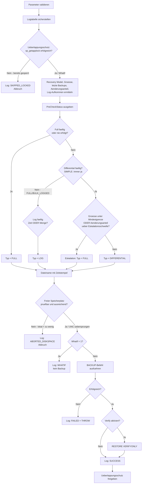

# SmartDatabaseBackup.sql

Dieses Skript führt für **eine** angegebene Datenbank automatisch das jeweils passende Backup aus — abhängig vom aktuell aktiven **Recovery Model**, der bestehenden Backup-Historie in `msdb.dbo.backupset` **und** dem tatsächlichen Änderungsvolumen seit dem letzten Backup (`sys.dm_db_file_space_usage`, `sys.dm_db_log_stats`). Der Zielpfad (z. B. ein Netzlaufwerk) ist frei konfigurierbar, jeder Schritt wird mit **Zeitstempel** protokolliert — sowohl per `PRINT` als auch persistent in einer Logtabelle.

## Übersicht

<!-- SQLDOC:SUMMARY_TABLE:BEGIN -->
| Feld | Wert |
|---|---|
| Script | [SmartDatabaseBackup.sql](SmartDatabaseBackup.sql) |
| Version | `2.0` |
| Typ | `remediation` |
| Kapitel | `71_BackupRestore_Strategies` |
| Sicherheit | `destructive-limited` (erzeugt eine Backup-Datei, ändert aber keine Datenbankinhalte) |
| Zweck | Wählt automatisch Full-, Differential- oder Log-Backup je nach Recovery Model, Backup-Historie und Änderungsvolumen, mit Verifikation, Speicherplatz-Check, Überlappungsschutz und persistenter Protokollierung. |
<!-- SQLDOC:SUMMARY_TABLE:END -->

## Einordnung

Dieses Skript ergänzt [LastBackupOverview.sql](LastBackupOverview.sql) (Doku: [LastBackupOverview.md](LastBackupOverview.md)), das nur den **Ist-Zustand** aller Datenbanken anzeigt, um die **aktive Komponente**: Es trifft für eine konkrete Datenbank die Entscheidung, welcher Backup-Typ jetzt sinnvoll ist, und führt ihn tatsächlich aus. Die zugrunde liegende fachliche Logik (welches Backup-Konzept zu welchem Recovery Model passt) ist ausführlich in [71_BackupRestore_Strategies.md](../71_BackupRestore_Strategies.md) Abschnitt 2.3 beschrieben.

Für die **automatisierte, wiederkehrende** Ausführung dieses Skripts (z. B. stündlich per SQL Server Agent Job) sowie für Alternativen wie Maintenance Plans oder Ola Hallengren's Maintenance Solution siehe [71_BackupRestore_Strategies.md](../71_BackupRestore_Strategies.md) Abschnitt 2.9, inklusive der eigenen Schritt-für-Schritt-Anleitung [MaintenancePlan_BackupSetup_Anleitung.md](../MaintenancePlan_BackupSetup_Anleitung.md).

## Annahmen

- **Entscheidungsreihenfolge** (siehe auch das Ablaufdiagramm unten):
  1. Full-Backup fehlt komplett **oder** ist älter als `@FullBackupIntervalHours` → **immer** `FULL`, unabhängig von allen anderen Parametern.
  2. Andernfalls würde grundsätzlich ein Differential-Backup gewählt (bei `SIMPLE` immer, bei `FULL`/`BULK_LOGGED` wenn das Differential-Intervall erreicht ist) — **bevor** dieser Typ endgültig feststeht, werden zwei Eskalationsregeln geprüft:
     - **Mindestgrößen-Regel:** Liegt die Datenbankgröße unter `@MinDatabaseSizeForDifferentialMB`, wird stattdessen `FULL` gewählt (bei kleinen Datenbanken bringt Differential keinen Vorteil).
     - **Änderungsanteil-Eskalation:** Liegt der Anteil geänderter Seiten seit dem letzten Full-Backup (`sys.dm_db_file_space_usage`) über `@DifferentialToFullEscalationPercent`, wird ebenfalls zu `FULL` eskaliert (ein Differential wäre dann nicht mehr günstiger).
  3. Ist weder Full noch Differential fällig (nur bei `FULL`/`BULK_LOGGED` relevant): `LOG`, ausgelöst **entweder** zeitbasiert (`@LogBackupIntervalMinutes`) **oder** mengenbasiert (`@LogBackupSizeThresholdMB` via `sys.dm_db_log_stats`) — je nachdem, was zuerst zutrifft.
- **Im `SIMPLE` Recovery Model** wird nie `LOG` gewählt, da keine fortlaufende Log-Kette existiert.
- **Überlappungsschutz:** Vor dem eigentlichen Backup wird per `sp_getapplock` (Ressource `SmartDatabaseBackup_<Datenbankname>`, `@LockTimeout = 0`) geprüft, ob bereits ein Lauf für dieselbe Datenbank aktiv ist — falls ja, bricht der neue Aufruf sofort mit klarer Fehlermeldung ab, statt zu warten oder parallel zu schreiben.
- **Speicherplatzprüfung** (`@CheckFreeDiskSpace`) funktioniert nur für **lokale** Laufwerke des SQL-Server-Hosts (`sys.dm_os_volume_stats`) — bei UNC-Pfaden (Netzlaufwerken) wird sie automatisch übersprungen und das per `PRINT` vermerkt, nicht stillschweigend als "OK" gewertet.
- **Verifikation** (`@VerifyAfterBackup`, Default an) führt nach erfolgreichem Backup ein `RESTORE VERIFYONLY WITH CHECKSUM` gegen die erzeugte Datei aus und protokolliert das Ergebnis.
- **Persistente Logtabelle** `msdb.dbo.SmartDatabaseBackupLog` wird beim ersten Lauf automatisch angelegt (analog zu Ola Hallengren's `dbo.CommandLog`) und hält jeden Lauf dauerhaft fest — unabhängig davon, ob die Session/der Agent-Job-Output noch verfügbar ist.
- Bei `@WhatIf = 1` wird **kein** Lock gesetzt, **kein** Backup ausgeführt und nur eine `WHATIF`-Zeile protokolliert.

## Anwendungsfall

Ein einzelner, robuster Baustein für die Backup-Automatisierung: Statt für jede Datenbank manuell zu entscheiden, ob gerade ein Full-, Differential- oder Log-Backup ansteht, ruft ein SQL Server Agent Job dieses Skript regelmäßig (z. B. alle 15–60 Minuten) für jede zu sichernde Datenbank auf — das Skript entscheidet bei jedem Lauf selbst, welcher Backup-Typ gerade fällig ist, verifiziert das Ergebnis und schützt sich gegen parallele Läufe.

## Parameter

<!-- SQLDOC:PARAMETERS_TABLE:BEGIN -->
| Parameter | SQL-Typ | Pflicht | Beschreibung |
|---|---|---|---|
| `@TargetDatabaseName` | `SYSNAME` | Ja | Name der zu sichernden Datenbank, z. B. `'BI_DQ'`. |
| `@BackupRootPath` | `NVARCHAR(500)` | Ja | Zielverzeichnis für die Backup-Datei, lokal oder als UNC-Pfad zu einem Netzlaufwerk, z. B. `'D:\Backup'` oder `'\\fileserver\Backups'`. Ohne abschließenden Backslash angeben. |
| `@FullBackupIntervalHours` | `INT` | Nein | Nach wie vielen Stunden seit dem letzten Full-Backup zwingend ein neues Full-Backup erzwungen wird. Default `168` (7 Tage). |
| `@DifferentialBackupIntervalHours` | `INT` | Nein | Nach wie vielen Stunden seit dem letzten Differential-Backup ein neues Differential-Backup gewählt wird. Default `24` (1 Tag). |
| `@LogBackupIntervalMinutes` | `INT` | Nein | Nach wie vielen Minuten seit dem letzten Log-Backup (zeitbasiert) ein neues Log-Backup gewählt wird; nur relevant bei `FULL`/`BULK_LOGGED`. Default `60`. |
| `@LogBackupSizeThresholdMB` | `INT` | Nein | Zusätzliches, **mengenbasiertes** Kriterium: Übersteigt das Log-Aufkommen seit dem letzten Log-Backup (`sys.dm_db_log_stats`) diesen MB-Wert, wird ein Log-Backup ausgelöst, auch wenn das Zeitintervall noch nicht erreicht ist. Default `500`. `0` = deaktiviert. |
| `@DifferentialToFullEscalationPercent` | `DECIMAL(5,2)` | Nein | Schwellwert (0–100) für den Anteil geänderter Seiten seit dem letzten Full-Backup: darüber wird statt Differential automatisch Full gewählt. Default `60.00`. `100` = deaktiviert. |
| `@MinDatabaseSizeForDifferentialMB` | `INT` | Nein | Datenbanken unterhalb dieser Größe werden nie per Differential, sondern immer per Full gesichert. Default `1024` (1 GB). `0` = deaktiviert. |
| `@UseCompression` | `BIT` | Nein | `1` (Default) = Backup mit `WITH COMPRESSION`; `0` = kein expliziter Wert (Instanz-Default). |
| `@VerifyAfterBackup` | `BIT` | Nein | `1` (Default) = führt nach dem Backup `RESTORE VERIFYONLY` aus und protokolliert das Ergebnis; `0` = keine Verifikation. |
| `@CheckFreeDiskSpace` | `BIT` | Nein | `1` (Default) = prüft vor dem Backup den freien Speicherplatz (nur bei lokalen Pfaden möglich); `0` = Prüfung immer überspringen. |
| `@MinFreeDiskSpaceMB` | `INT` | Nein | Mindestens erforderlicher freier Speicherplatz in MB, falls prüfbar. Default `5120` (5 GB). |
| `@WhatIf` | `BIT` | Nein | `1` = zeigt nur Entscheidung und generierten Befehl an, ohne auszuführen (kein Lock, kein Backup); `0` (Default) = führt das Backup tatsächlich aus. |
<!-- SQLDOC:PARAMETERS_TABLE:END -->

## Abhängigkeiten

<!-- SQLDOC:DEPENDENCIES_LIST:BEGIN -->
- `sys.databases`
- `sys.master_files`
- `sys.dm_db_file_space_usage`
- `sys.dm_db_log_stats`
- `sys.dm_os_volume_stats`
- `msdb.dbo.backupset`
- `sp_getapplock` / `sp_releaseapplock`
- `BACKUP DATABASE`
- `BACKUP LOG`
- `RESTORE VERIFYONLY`
<!-- SQLDOC:DEPENDENCIES_LIST:END -->

## Hinweise

- `PreCheckStatus` zeigt Recovery Model, Datenbankgröße, Zeitpunkt/Alter des letzten Full-/Differential-/Log-Backups, den Anteil geänderter Seiten seit dem letzten Full-Backup sowie das Log-Aufkommen seit dem letzten Log-Backup.
- `BackupDecision` zeigt den ermittelten Backup-Typ, den vollständigen Entscheidungsgrund (inklusive etwaiger Eskalation von Differential zu Full), den Zielpfad, den generierten `BACKUP`-Befehl, das Ergebnis der Speicherplatzprüfung und das Verifikationsergebnis.
- `msdb.dbo.SmartDatabaseBackupLog` wird automatisch angelegt und protokolliert **jeden** Lauf dauerhaft — inklusive `WhatIf`-Läufen, durch den Überlappungsschutz abgelehnten Läufen (`SKIPPED_LOCKED`), wegen Speicherplatzmangel abgebrochenen Läufen (`ABORTED_DISKSPACE`) und fehlgeschlagenen Backups (`FAILED`).
- Läuft für dieselbe Datenbank bereits ein Backup dieses Skripts, bricht ein zweiter, gleichzeitiger Aufruf sofort mit `Msg 50016` ab, statt zu warten — das verhindert sowohl doppelte Backup-Dateien als auch mögliche `msdb`-Sperrenkonflikte.
- **Cleanup ist bewusst nicht Teil dieses Skripts.** Wird später ein automatisches Löschen alter Backups ergänzt, gilt zwingend: **niemals** Log-Backups löschen, die jünger sind als das letzte Full- oder Differential-Backup — sonst bricht die Restore-Kette unwiederbringlich (siehe Ola Hallengren's entsprechende Cleanup-Schutzregel unten).

## Alternativen und Vergleich

Vor Version 2.0 wurde recherchiert, welche vergleichbaren, öffentlich verfügbaren Lösungen für eine automatische/intelligente Backup-Typ-Wahl existieren. Ergebnis und Einordnung:

| Lösung | Entscheidungslogik | Was sie zusätzlich bietet | Wo dieses Skript einen anderen Ansatz wählt |
|---|---|---|---|
| **[Ola Hallengren's `DatabaseBackup`](https://ola.hallengren.com/sql-server-backup.html)** — die De-facto-Standardlösung (siehe [71_BackupRestore_Strategies.md](../71_BackupRestore_Strategies.md) Abschnitt 2.9) | Backup-Typ wird primär als Parameter vorgegeben (mehrere separate Agent-Jobs: stündlich LOG, täglich DIFF, wöchentlich FULL); die Prozedur *validiert und korrigiert* nachträglich (`@ChangeBackupType='Y'` wandelt bei fehlender Basis DIFF→FULL bzw. LOG→FULL um) statt primär selbst zu entscheiden, welcher Typ "jetzt dran" ist. | Verify, Cleanup mit Schutzregel (keine Log-Backups löschen, die neuer als das letzte Full/Diff sind), Kompressionsalgorithmus-Auswahl (MS_XPRESS/QAT_DEFLATE/ZSTD), Availability-Groups-Support, Parallelverarbeitung mehrerer Datenbanken, `@MinModificationLevel` (identisches Prinzip wie `@DifferentialToFullEscalationPercent` in diesem Skript), `@MinDatabaseSizeForDifferentialBackup` (identisches Prinzip wie `@MinDatabaseSizeForDifferentialMB`), tabellenbasiertes Logging (`dbo.CommandLog`). | Dieses Skript trifft die **komplette** Entscheidung (welcher Typ jetzt fällig ist) in einem einzigen Aufruf pro Datenbank — sinnvoll, wenn ein einzelner Scheduler-Trigger je Datenbank gewünscht ist, statt mehrerer separat geplanter Jobs pro Backup-Typ. |
| **Tracy Boggiano — ["Smart" Log-/Differential-Backups](https://tracyboggiano.com/archive/2018/01/implementing-smart-transaction-log-backups-using-ola-hallengrens-backup-scripts-in-sql-server-2017/) (Erweiterung um Ola Hallengren)** | Konfigurierbare Tabelle mit **kombinierten** Schwellwerten pro Datenbank: Log-Backup bei Zeit **ODER** Log-Größe (`sys.dm_db_log_stats`); Differential→Full bei Änderungsanteil (`sys.dm_db_file_space_usage`), Faustregel ca. 70–80 %. | Pro-Datenbank-konfigurierbare Schwellwerte statt globaler Parameter. | Dieses Skript übernimmt genau dieses Muster (Zeit **oder** Menge für Log-Backups, Änderungsanteil für Differential→Full-Eskalation) direkt als eingebaute Parameter (`@LogBackupSizeThresholdMB`, `@DifferentialToFullEscalationPercent`), ohne eine zusätzliche Konfigurationstabelle und Wrapper-Job-Logik zu benötigen. |
| **[MSSQLTips — Check for full backups before other backups](https://www.mssqltips.com/sqlservertip/1877/check-for-full-sql-server-database-backups-before-creating-other-backups/)** | Prüft nur, ob ein Full-Backup existiert (Vorbedingung für Diff/Log), plus Änderungsanteil-Schwellwert für Diff→Full — **kein** Zeitintervall-Fallback. | Einfaches, fokussiertes Muster. | Ohne Zeitintervall-Fallback könnte bei sehr stabilen Datenbanken (wenig Änderungen) sehr lange kein neues Full-Backup erzwungen werden, was die Restore-Kette unnötig verlängert. Dieses Skript erzwingt über `@FullBackupIntervalHours` unabhängig von der Änderungsrate turnusmäßig ein neues Full-Backup — robuster gegenüber langen, unbemerkten Ketten. |
| **[dbatools `Backup-DbaDatabase`](https://docs.dbatools.io/Backup-DbaDatabase.html)** | Kein autonomes "wähle für mich" — der Backup-Typ (`-Type Full/Log/Differential`) muss explizit übergeben werden; Voraussetzungsprüfung (Full Recovery Model für Log, vorheriges Full für Diff) findet statt, aber keine Kaskadenlogik. | PowerShell-Ökosystem, Massenoperationen über viele Instanzen. | Reine Ausführungsschicht ohne eingebaute Entscheidungslogik — die "Smart"-Komponente müsste dort separat (meist kalenderbasiert) gebaut werden. Der intervallbasierte Ansatz dieses Skripts (Stunden/Minuten seit letztem Backup) ist robuster bei unregelmäßigen Ausführungszeitpunkten oder ausgefallenen Läufen als ein reiner Wochentags-Check. |

**Wann welche Lösung wählen:**

- **Dieses Skript** eignet sich, wenn eine **einzelne, in sich geschlossene** Entscheidungslogik pro Datenbank gewünscht ist, ohne separate Konfigurationstabellen oder mehrere getrennt geplante Jobs pro Backup-Typ einzurichten.
- **Ola Hallengren's Maintenance Solution** ist die richtige Wahl, sobald **viele Datenbanken gleichzeitig**, **Availability Groups**, oder **Cleanup/Retention** ebenfalls automatisiert werden sollen — siehe [71_BackupRestore_Strategies.md](../71_BackupRestore_Strategies.md) Abschnitt 2.9 für die Einordnung.
- **Tracy Boggianos Erweiterungen** sind sinnvoll, wenn bereits eine Ola-Hallengren-Installation besteht und zusätzlich mengenbasierte statt rein zeitbasierte Trigger gewünscht sind, ohne die Wartungslösung komplett zu ersetzen.

## Versionshistorie

<!-- SQLDOC:VERSION_HISTORY_TABLE:BEGIN -->
| Version | Datum | User | Beschreibung |
|---|---|---|---|
| `1.0` | `2026-08-14` | `ER` | Erstversion: automatische Wahl des Backup-Typs (Full/Differential/Log) je nach Recovery Model und Backup-Historie, konfigurierbarer Zielpfad, Zeitstempel-Protokollierung jedes Schritts per PRINT, WhatIf-Modus zum gefahrlosen Testen der Entscheidungslogik |
| `2.0` | `2026-08-14` | `ER` | Nach Recherche vergleichbarer Lösungen (Ola Hallengren `DatabaseBackup`, Tracy Boggiano "Smart Backups", MSSQLTips) um acht Verbesserungen erweitert: mengenbasierte Differential→Full-Eskalation, mengenbasierter Log-Backup-Trigger, RESTORE VERIFYONLY, Speicherplatz-Check, Überlappungsschutz per sp_getapplock, persistente Logtabelle, Mindestgrößen-Regel für Differential, dokumentierte Cleanup-Schutzregel |
<!-- SQLDOC:VERSION_HISTORY_TABLE:END -->

## Ablauf

<!-- SQLDOC:MERMAID:BEGIN -->

<!-- SQLDOC:MERMAID:END -->

## SQL-Code

<!-- SQLDOC:SQL_CODE:BEGIN -->
```sql
/*
BEGIN:SQL-HEADER v1
---
sql_header: v1
script_name: "SmartDatabaseBackup.sql"
script_version: "2.0"
script_type: "remediation"
chapter: "71_BackupRestore_Strategies"
purpose: >
  Fuehrt fuer EINE angegebene Datenbank automatisch das jeweils passende
  Backup aus, abhaengig vom aktuell aktiven Recovery Model, der bestehenden
  Backup-Historie in msdb.dbo.backupset UND dem tatsaechlichen Aenderungs-
  volumen seit dem letzten Backup (sys.dm_db_file_space_usage). Im SIMPLE-
  Modell kommen ausschliesslich Full- und Differential-Backups infrage
  (kein Log-Backup moeglich); im FULL/BULK_LOGGED-Modell wird zusaetzlich
  das Transaction-Log-Backup beruecksichtigt. Existiert noch kein Full-
  Backup oder liegt das letzte Full-Backup laenger als
  @FullBackupIntervalHours zurueck, wird zwingend ein neues Full-Backup
  erzwungen. Ein geplantes Differential-Backup wird automatisch zu einem
  Full-Backup eskaliert, wenn der Anteil geaenderter Seiten seit dem
  letzten Full-Backup einen konfigurierbaren Schwellwert uebersteigt (ab
  diesem Punkt ist ein Differential nicht mehr guenstiger als ein Full).
  Sehr kleine Datenbanken werden unterhalb einer konfigurierbaren
  Groessengrenze direkt per Full statt Differential gesichert. Vor dem
  Start wird per sp_getapplock ein Ueberlappungsschutz gesetzt, damit nicht
  zwei parallele Laeufe fuer dieselbe Datenbank gleichzeitig sichern.
  Optional wird der Zielordner auf freien Speicherplatz geprueft (nur bei
  lokalen Laufwerkspfaden, nicht bei UNC-Pfaden) und nach dem Backup ein
  RESTORE VERIFYONLY durchgefuehrt. Jeder Schritt wird per PRINT mit
  Zeitstempel UND zusaetzlich persistent in einer Logtabelle protokolliert,
  die den Aufruf ueberlebt und sich spaeter auswerten laesst.

parameters:
  - name: "@TargetDatabaseName"
    sql_type: "SYSNAME"
    direction: "IN"
    required: true
    description: "Name der zu sichernden Datenbank, z.B. 'BI_DQ'"
  - name: "@BackupRootPath"
    sql_type: "NVARCHAR(500)"
    direction: "IN"
    required: true
    description: "Zielverzeichnis fuer die Backup-Datei, lokal oder als UNC-Pfad zu einem Netzlaufwerk, z.B. 'D:\Backup' oder '\\\\fileserver\Backups'. Muss ohne abschliessenden Backslash angegeben werden und fuer das SQL-Server-Dienstkonto beschreibbar sein."
  - name: "@FullBackupIntervalHours"
    sql_type: "INT"
    direction: "IN"
    required: false
    description: "Nach wie vielen Stunden seit dem letzten Full-Backup zwingend ein neues Full-Backup erzwungen wird, unabhaengig vom Recovery Model; Default 168 (7 Tage)"
  - name: "@DifferentialBackupIntervalHours"
    sql_type: "INT"
    direction: "IN"
    required: false
    description: "Nach wie vielen Stunden seit dem letzten Differential-Backup (bzw. seit dem letzten Full-Backup, falls noch kein Differential existiert) ein neues Differential-Backup gewaehlt wird, sofern kein Full-Backup faellig ist; Default 24 (1 Tag)"
  - name: "@LogBackupIntervalMinutes"
    sql_type: "INT"
    direction: "IN"
    required: false
    description: "Nach wie vielen Minuten seit dem letzten Log-Backup ein neues Log-Backup gewaehlt wird, sofern weder Full- noch Differential-Backup faellig sind; nur relevant bei Recovery Model FULL/BULK_LOGGED; Default 60 (1 Stunde)"
  - name: "@LogBackupSizeThresholdMB"
    sql_type: "INT"
    direction: "IN"
    required: false
    description: "Zusaetzliches, mengenbasiertes Kriterium fuer das Log-Backup: Ist seit dem letzten Log-Backup mehr als dieser MB-Wert an Log-Aufkommen entstanden (sys.dm_db_log_stats), wird ein Log-Backup ausgeloest, auch wenn @LogBackupIntervalMinutes noch nicht erreicht ist. Default 500. Auf 0 setzen, um dieses Kriterium zu deaktivieren."
  - name: "@DifferentialToFullEscalationPercent"
    sql_type: "DECIMAL(5,2)"
    direction: "IN"
    required: false
    description: "Schwellwert (0-100) fuer den Anteil geaenderter Seiten seit dem letzten Full-Backup (sys.dm_db_file_space_usage): Wird dieser Anteil ueberschritten, wird statt eines geplanten Differential-Backups automatisch ein Full-Backup durchgefuehrt, da ein Differential dann keinen Effizienzvorteil mehr bietet. Default 60.00. Auf 100 setzen, um diese Eskalation zu deaktivieren."
  - name: "@MinDatabaseSizeForDifferentialMB"
    sql_type: "INT"
    direction: "IN"
    required: false
    description: "Datenbanken, deren aktuelle Groesse (sys.master_files) unter diesem Wert liegt, werden nie per Differential, sondern immer per Full gesichert, da der Aufwandsunterschied bei kleinen Datenbanken vernachlaessigbar ist. Default 1024 (1 GB). Auf 0 setzen, um diese Regel zu deaktivieren."
  - name: "@UseCompression"
    sql_type: "BIT"
    direction: "IN"
    required: false
    description: "1 (Default) = Backup mit WITH COMPRESSION erstellen; 0 = ohne explizite Kompressionsangabe (nutzt den Instanz-Default)"
  - name: "@VerifyAfterBackup"
    sql_type: "BIT"
    direction: "IN"
    required: false
    description: "1 (Default) = fuehrt nach erfolgreichem Backup ein RESTORE VERIFYONLY gegen die erzeugte Datei aus und protokolliert das Ergebnis; 0 = keine Verifikation"
  - name: "@CheckFreeDiskSpace"
    sql_type: "BIT"
    direction: "IN"
    required: false
    description: "1 (Default) = prueft vor dem Backup ueber sys.dm_os_volume_stats den freien Speicherplatz am Zielpfad und bricht bei weniger als @MinFreeDiskSpaceMB ab; wird bei UNC-Pfaden (Netzlaufwerken) automatisch uebersprungen, da sys.dm_os_volume_stats nur lokale Volumes des SQL-Server-Hosts abfragen kann. 0 = Pruefung immer ueberspringen."
  - name: "@MinFreeDiskSpaceMB"
    sql_type: "INT"
    direction: "IN"
    required: false
    description: "Mindestens erforderlicher freier Speicherplatz in MB am Zielpfad, wenn @CheckFreeDiskSpace = 1 und der Pfad lokal pruefbar ist; Default 5120 (5 GB)"
  - name: "@WhatIf"
    sql_type: "BIT"
    direction: "IN"
    required: false
    description: "1 = zeigt nur an, welcher Backup-Typ gewaehlt und welcher Befehl ausgefuehrt WUERDE, ohne das Backup tatsaechlich durchzufuehren (kein Ueberlappungsschutz-Lock, keine Log-Tabellen-Eintraege ausser der WhatIf-Zeile selbst); 0 (Default) = fuehrt das ermittelte Backup tatsaechlich aus"

result_sets:
  - name: "PreCheckStatus"
    description: "Status, Recovery Model, Backup-Historie-Kennzahlen, Datenbankgroesse und Anteil geaenderter Seiten der Zieldatenbank vor der Entscheidung"
  - name: "BackupDecision"
    description: "Der ermittelte Backup-Typ (FULL/DIFFERENTIAL/LOG), der Entscheidungsgrund in Klartext, der Zielpfad, der tatsaechlich generierte BACKUP-Befehl sowie das Ergebnis der Verifikation (falls aktiviert)"
  - name: "dbo.SmartDatabaseBackupLog"
    description: "Persistente, abfragbare Logtabelle in der Zieldatenbank-Instanz (angelegt in msdb), die jeden Lauf mit Zeitstempel, Entscheidung, Befehl, Erfolg/Fehler und Verifikationsergebnis dauerhaft festhaelt"

dependencies:
  - "sys.databases"
  - "sys.master_files"
  - "sys.dm_db_file_space_usage"
  - "sys.dm_db_log_stats"
  - "sys.dm_os_volume_stats"
  - "msdb.dbo.backupset"
  - "sp_getapplock / sp_releaseapplock"
  - "BACKUP DATABASE"
  - "BACKUP LOG"
  - "RESTORE VERIFYONLY"

safety:
  level: "destructive-limited"
  writes_data: true

documentation:
  markdown_file: "T-SQL/71_BackupRestore_Strategies/SQLScripts/SmartDatabaseBackup.md"
  sync_blocks:
    - "SUMMARY_TABLE"
    - "PARAMETERS_TABLE"
    - "DEPENDENCIES_LIST"
    - "VERSION_HISTORY_TABLE"
    - "SQL_CODE"
  mermaid:
    mode: "ai-agent-from-sql"
    source: "script-body"

main_responsible:
  name: "Erhard Rainer"
  initials: "ER"

version_history:
  - version: "1.0"
    date: "2026-08-14"
    user: "ER"
    description: "Erstversion: automatische Wahl des Backup-Typs (Full/Differential/Log) je nach Recovery Model und Backup-Historie, konfigurierbarer Zielpfad, Zeitstempel-Protokollierung jedes Schritts per PRINT, WhatIf-Modus zum gefahrlosen Testen der Entscheidungslogik"
  - version: "2.0"
    date: "2026-08-14"
    user: "ER"
    description: "Nach Recherche vergleichbarer Loesungen (Ola Hallengren DatabaseBackup, Tracy Boggiano 'Smart Backups', MSSQLTips) um acht Verbesserungen erweitert: (1) mengenbasierte Differential->Full-Eskalation ueber sys.dm_db_file_space_usage, (2) zusaetzlicher mengenbasierter Log-Backup-Trigger ueber sys.dm_db_log_stats, (3) optionales RESTORE VERIFYONLY nach dem Backup, (4) optionaler Freier-Speicherplatz-Check vor dem Backup ueber sys.dm_os_volume_stats (nur lokale Pfade), (5) Ueberlappungsschutz per sp_getapplock, damit nicht zwei Laeufe fuer dieselbe Datenbank gleichzeitig sichern, (6) persistente, abfragbare Logtabelle msdb.dbo.SmartDatabaseBackupLog zusaetzlich zu PRINT, (7) Mindestgroessen-Regel: sehr kleine Datenbanken werden immer per Full statt Differential gesichert, (8) Hinweis-Dokumentation der Cleanup-Schutzregel (kein automatisches Loeschen implementiert, aber als Notiz fuer nachgelagerte Cleanup-Skripte festgehalten)."

notes:
  - "Dieses Skript SCHREIBT ein Backup und ist damit kein reines Leseskript - es aendert aber keine Datenbankinhalte, sondern erzeugt lediglich eine neue Backup-Datei. Bei @WhatIf = 1 werden keine Aenderungen vorgenommen (kein Lock, kein Backup, kein Logtabellen-Eintrag ausser der WhatIf-Zeile selbst)."
  - "Im SIMPLE Recovery Model sind ausschliesslich FULL und DIFFERENTIAL moeglich - ein Log-Backup wuerde ohnehin fehlschlagen, da keine fortlaufende Log-Kette existiert (siehe 71_BackupRestore_Strategies.md Abschnitt 2.1/2.3). Das Skript waehlt in diesem Fall nie LOG als Typ."
  - "Die Entscheidungsreihenfolge ist immer: (1) Full faellig/nie erfolgt -> IMMER Full. (2) Datenbank kleiner als @MinDatabaseSizeForDifferentialMB UND ein Differential waere naechster Schritt -> stattdessen Full. (3) Differential-Intervall erreicht UND Aenderungsanteil unter @DifferentialToFullEscalationPercent -> Differential. (4) Differential-Intervall erreicht UND Aenderungsanteil ueber @DifferentialToFullEscalationPercent -> Eskalation zu Full. (5) sonst im FULL/BULK_LOGGED-Modell: Log-Intervall (Zeit ODER Menge) erreicht -> Log. (6) SIMPLE-Modell ohne faelliges Differential -> dennoch Differential zur Absicherung."
  - "Der Ueberlappungsschutz nutzt sp_getapplock mit dem Ressourcennamen 'SmartDatabaseBackup_<Datenbankname>' im Owner-Bereich 'Session' und @LockTimeout = 0 (kein Warten) - laeuft bereits ein Backup fuer dieselbe Datenbank, bricht der neue Aufruf sofort mit einer klaren Fehlermeldung ab, statt zu blockieren oder parallel zu schreiben."
  - "Der Freier-Speicherplatz-Check via sys.dm_os_volume_stats funktioniert NUR fuer lokale Laufwerke des SQL-Server-Hosts. Bei UNC-Pfaden (\\\\server\\freigabe) kann SQL Server den freien Platz auf einem entfernten Server nicht ueber diese DMF ermitteln - die Pruefung wird dann automatisch uebersprungen und per PRINT vermerkt, nicht stillschweigend als 'OK' gewertet."
  - "sys.dm_db_file_space_usage liefert den Anteil geaenderter Extents seit dem letzten Full-Backup nur naeherungsweise (Bitmap-basiert, keine exakte Byte-Aenderungsmenge) - ausreichend fuer die Eskalationsentscheidung Differential vs. Full, aber kein Ersatz fuer eine exakte Aenderungsstatistik."
  - "Der Dateiname enthaelt Datenbankname, Backup-Typ und Zeitstempel im Format yyyyMMdd_HHmmss, um Ueberschreiben zu vermeiden (z.B. BI_DQ_FULL_20260814_083015.bak)."
  - "dbo.SmartDatabaseBackupLog wird bei Bedarf automatisch in msdb angelegt (CREATE TABLE IF NOT EXISTS-Muster) - msdb wurde gewaehlt, da diese Tabelle instanzweit fuer alle mit diesem Skript gesicherten Datenbanken genutzt werden kann, analog zu Ola Hallengren's dbo.CommandLog."
  - "WICHTIG fuer nachgelagerte Cleanup-Skripte (in diesem Skript NICHT implementiert): Wird spaeter ein automatisches Loeschen alter Backup-Dateien ergaenzt, duerfen dabei NIEMALS Log-Backups geloescht werden, die juenger sind als das letzte Full- oder Differential-Backup, da sonst die Restore-Kette unwiederbringlich unterbrochen wird."
  - "Fuer eine instanzweite Uebersicht ueber alle Datenbanken statt einer gezielten Einzeldatenbank siehe LastBackupOverview.sql. Fuer produktionsreife Mehrfach-Datenbank-Automatisierung mit noch mehr Funktionsumfang (Cleanup, Availability Groups, Parallelverarbeitung) empfiehlt sich Ola Hallengren's SQL Server Maintenance Solution - siehe die Gegenueberstellung in SmartDatabaseBackup.md Abschnitt 'Alternativen und Vergleich'."
  - "COMPRESSION wird nur angewendet, wenn @UseCompression = 1 UND die Edition/Konfiguration Backup-Kompression unterstuetzt; ist Kompression instanzweit deaktiviert und nicht ueberschreibbar, meldet SQL Server dies ueber den regulaeren BACKUP-Fehler."
---
END:SQL-HEADER v1
*/

SET NOCOUNT ON;

-- 1. Parameter vorbereiten
DECLARE @TargetDatabaseName SYSNAME = N'BI_DQ';
DECLARE @BackupRootPath NVARCHAR(500) = N'D:\Backup';
DECLARE @FullBackupIntervalHours INT = 168;
DECLARE @DifferentialBackupIntervalHours INT = 24;
DECLARE @LogBackupIntervalMinutes INT = 60;
DECLARE @LogBackupSizeThresholdMB INT = 500;
DECLARE @DifferentialToFullEscalationPercent DECIMAL(5,2) = 60.00;
DECLARE @MinDatabaseSizeForDifferentialMB INT = 1024;
DECLARE @UseCompression BIT = 1;
DECLARE @VerifyAfterBackup BIT = 1;
DECLARE @CheckFreeDiskSpace BIT = 1;
DECLARE @MinFreeDiskSpaceMB INT = 5120;
DECLARE @WhatIf BIT = 0;

PRINT N'[' + CONVERT(NVARCHAR(30), SYSDATETIME(), 121) + N'] Parameter werden geprueft: Datenbank = ' + ISNULL(@TargetDatabaseName, N'<NULL>') + N', Zielpfad = ' + ISNULL(@BackupRootPath, N'<NULL>') + N'.';

-- 2. Parameter validieren
IF @TargetDatabaseName IS NULL OR LTRIM(RTRIM(@TargetDatabaseName)) = N''
BEGIN
    THROW 50000, '@TargetDatabaseName darf nicht leer sein.', 1;
END;

IF NOT EXISTS (SELECT 1 FROM sys.databases WHERE name = @TargetDatabaseName)
BEGIN
    THROW 50001, 'Die angegebene Datenbank wurde nicht in sys.databases gefunden.', 1;
END;

IF EXISTS (SELECT 1 FROM sys.databases WHERE name = @TargetDatabaseName AND state_desc <> 'ONLINE')
BEGIN
    THROW 50002, 'Die angegebene Datenbank ist nicht ONLINE. Ein regulaeres Backup ist in diesem Zustand nicht sinnvoll moeglich - siehe Kapitel 3 (Datenbank-Status) in 71_BackupRestore_Strategies.md.', 1;
END;

IF @BackupRootPath IS NULL OR LTRIM(RTRIM(@BackupRootPath)) = N''
BEGIN
    THROW 50003, '@BackupRootPath darf nicht leer sein.', 1;
END;

IF RIGHT(@BackupRootPath, 1) = N'\'
BEGIN
    THROW 50004, '@BackupRootPath darf keinen abschliessenden Backslash enthalten.', 1;
END;

IF @FullBackupIntervalHours IS NULL OR @FullBackupIntervalHours <= 0
BEGIN
    THROW 50005, '@FullBackupIntervalHours muss ein positiver Wert sein.', 1;
END;

IF @DifferentialBackupIntervalHours IS NULL OR @DifferentialBackupIntervalHours <= 0
BEGIN
    THROW 50006, '@DifferentialBackupIntervalHours muss ein positiver Wert sein.', 1;
END;

IF @LogBackupIntervalMinutes IS NULL OR @LogBackupIntervalMinutes <= 0
BEGIN
    THROW 50007, '@LogBackupIntervalMinutes muss ein positiver Wert sein.', 1;
END;

IF @LogBackupSizeThresholdMB IS NULL OR @LogBackupSizeThresholdMB < 0
BEGIN
    THROW 50008, '@LogBackupSizeThresholdMB darf nicht negativ sein (0 = deaktiviert).', 1;
END;

IF @DifferentialToFullEscalationPercent IS NULL OR @DifferentialToFullEscalationPercent <= 0 OR @DifferentialToFullEscalationPercent > 100
BEGIN
    THROW 50009, '@DifferentialToFullEscalationPercent muss zwischen 0 (exklusiv) und 100 (inklusiv) liegen.', 1;
END;

IF @MinDatabaseSizeForDifferentialMB IS NULL OR @MinDatabaseSizeForDifferentialMB < 0
BEGIN
    THROW 50010, '@MinDatabaseSizeForDifferentialMB darf nicht negativ sein (0 = deaktiviert).', 1;
END;

IF @UseCompression IS NULL OR @UseCompression NOT IN (0, 1)
BEGIN
    THROW 50011, '@UseCompression muss 0 oder 1 sein.', 1;
END;

IF @VerifyAfterBackup IS NULL OR @VerifyAfterBackup NOT IN (0, 1)
BEGIN
    THROW 50012, '@VerifyAfterBackup muss 0 oder 1 sein.', 1;
END;

IF @CheckFreeDiskSpace IS NULL OR @CheckFreeDiskSpace NOT IN (0, 1)
BEGIN
    THROW 50013, '@CheckFreeDiskSpace muss 0 oder 1 sein.', 1;
END;

IF @MinFreeDiskSpaceMB IS NULL OR @MinFreeDiskSpaceMB < 0
BEGIN
    THROW 50014, '@MinFreeDiskSpaceMB darf nicht negativ sein.', 1;
END;

IF @WhatIf IS NULL OR @WhatIf NOT IN (0, 1)
BEGIN
    THROW 50015, '@WhatIf muss 0 oder 1 sein.', 1;
END;

PRINT N'[' + CONVERT(NVARCHAR(30), SYSDATETIME(), 121) + N'] Parameter sind gueltig.';

-- 3. Persistente Logtabelle sicherstellen (in msdb, instanzweit nutzbar - analog zu Ola Hallengren's dbo.CommandLog)
IF NOT EXISTS (SELECT 1 FROM msdb.sys.tables WHERE name = 'SmartDatabaseBackupLog' AND schema_id = SCHEMA_ID('dbo'))
BEGIN
    EXEC msdb.sys.sp_executesql N'
        CREATE TABLE dbo.SmartDatabaseBackupLog
        (
            LogId            INT IDENTITY(1,1) NOT NULL PRIMARY KEY,
            LogTimestamp     DATETIME2(3)       NOT NULL DEFAULT SYSDATETIME(),
            DatabaseName     SYSNAME            NOT NULL,
            RecoveryModel    NVARCHAR(60)       NULL,
            ChosenBackupType VARCHAR(20)        NULL,
            DecisionReason   VARCHAR(400)       NULL,
            BackupFilePath   NVARCHAR(600)      NULL,
            WasWhatIf        BIT                NOT NULL,
            Status           VARCHAR(20)        NOT NULL,
            VerifyResult     VARCHAR(200)       NULL,
            ErrorDetail      NVARCHAR(2000)     NULL
        );';
    PRINT N'[' + CONVERT(NVARCHAR(30), SYSDATETIME(), 121) + N'] Logtabelle msdb.dbo.SmartDatabaseBackupLog wurde neu angelegt.';
END;

-- 4. Ueberlappungsschutz: verhindert, dass zwei parallele Laeufe fuer dieselbe Datenbank
--    gleichzeitig ein Backup starten. Wird bei @WhatIf = 1 nicht gesetzt.
DECLARE @LockResource NVARCHAR(200) = N'SmartDatabaseBackup_' + @TargetDatabaseName;
DECLARE @LockResult INT = 0;

IF @WhatIf = 0
BEGIN
    EXEC @LockResult = sp_getapplock
        @Resource = @LockResource,
        @LockMode = 'Exclusive',
        @LockOwner = 'Session',
        @LockTimeout = 0;

    IF @LockResult < 0
    BEGIN
        INSERT INTO msdb.dbo.SmartDatabaseBackupLog (DatabaseName, WasWhatIf, Status, ErrorDetail)
        VALUES (@TargetDatabaseName, 0, 'SKIPPED_LOCKED', 'Es laeuft bereits ein SmartDatabaseBackup-Lauf fuer diese Datenbank (sp_getapplock-Ergebnis: ' + CAST(@LockResult AS VARCHAR(10)) + '). Neuer Lauf wurde abgebrochen, um Ueberlappung zu vermeiden.');

        THROW 50016, 'Es laeuft bereits ein Backup-Lauf dieses Skripts fuer diese Datenbank (Ueberlappungsschutz). Abbruch, um Konflikte zu vermeiden.', 1;
    END;

    PRINT N'[' + CONVERT(NVARCHAR(30), SYSDATETIME(), 121) + N'] Ueberlappungsschutz (Applock) fuer ' + QUOTENAME(@TargetDatabaseName) + N' erfolgreich gesetzt.';
END;

BEGIN TRY

    -- 5. Aktuellen Status, Recovery Model und Datenbankgroesse ermitteln
    DECLARE @RecoveryModel NVARCHAR(60);
    DECLARE @LastFullBackup DATETIME;
    DECLARE @LastDifferentialBackup DATETIME;
    DECLARE @LastLogBackup DATETIME;
    DECLARE @DatabaseSizeMB DECIMAL(18,2);
    DECLARE @ModifiedPercentSinceFull DECIMAL(5,2);
    DECLARE @LogSinceLastBackupMB DECIMAL(18,2);

    SELECT @RecoveryModel = d.recovery_model_desc
    FROM sys.databases AS d
    WHERE d.name = @TargetDatabaseName;

    SELECT @LastFullBackup = MAX(bs.backup_finish_date)
    FROM msdb.dbo.backupset AS bs
    WHERE bs.database_name = @TargetDatabaseName AND bs.type = 'D';

    SELECT @LastDifferentialBackup = MAX(bs.backup_finish_date)
    FROM msdb.dbo.backupset AS bs
    WHERE bs.database_name = @TargetDatabaseName AND bs.type = 'I';

    SELECT @LastLogBackup = MAX(bs.backup_finish_date)
    FROM msdb.dbo.backupset AS bs
    WHERE bs.database_name = @TargetDatabaseName AND bs.type = 'L';

    SELECT @DatabaseSizeMB = SUM(CAST(mf.size AS BIGINT) * 8.0 / 1024)
    FROM sys.master_files AS mf
    WHERE mf.database_id = DB_ID(@TargetDatabaseName) AND mf.type = 0;

    DECLARE @ModifiedPagesSql NVARCHAR(MAX) = N'
        USE ' + QUOTENAME(@TargetDatabaseName) + N';
        SELECT
            @ModifiedPercentOut = CASE
                WHEN SUM(allocated_extent_page_count) = 0 THEN 0
                ELSE CAST(SUM(modified_extent_page_count) AS DECIMAL(18,4)) * 100.0 / SUM(allocated_extent_page_count)
            END
        FROM sys.dm_db_file_space_usage;';

    BEGIN TRY
        EXEC sp_executesql @ModifiedPagesSql, N'@ModifiedPercentOut DECIMAL(5,2) OUTPUT', @ModifiedPercentOut = @ModifiedPercentSinceFull OUTPUT;
    END TRY
    BEGIN CATCH
        SET @ModifiedPercentSinceFull = NULL;
        PRINT N'[' + CONVERT(NVARCHAR(30), SYSDATETIME(), 121) + N'] Hinweis: Anteil geaenderter Seiten konnte nicht ermittelt werden (' + ERROR_MESSAGE() + N'). Differential->Full-Eskalation wird in diesem Lauf uebersprungen.';
    END CATCH;

    IF @RecoveryModel IN ('FULL', 'BULK_LOGGED') AND @LogBackupSizeThresholdMB > 0
    BEGIN
        DECLARE @LogStatsSql NVARCHAR(MAX) = N'
            USE ' + QUOTENAME(@TargetDatabaseName) + N';
            SELECT @LogSinceLastOut = log_since_last_log_backup_mb
            FROM sys.dm_db_log_stats(DB_ID());';
        BEGIN TRY
            EXEC sp_executesql @LogStatsSql, N'@LogSinceLastOut DECIMAL(18,2) OUTPUT', @LogSinceLastOut = @LogSinceLastBackupMB OUTPUT;
        END TRY
        BEGIN CATCH
            SET @LogSinceLastBackupMB = NULL;
            PRINT N'[' + CONVERT(NVARCHAR(30), SYSDATETIME(), 121) + N'] Hinweis: sys.dm_db_log_stats nicht verfuegbar (' + ERROR_MESSAGE() + N'). Mengenbasierter Log-Backup-Trigger wird in diesem Lauf uebersprungen.';
        END CATCH;
    END;

    PRINT N'[' + CONVERT(NVARCHAR(30), SYSDATETIME(), 121) + N'] Status ermittelt: Recovery Model = ' + @RecoveryModel
        + N', Groesse = ' + ISNULL(CAST(@DatabaseSizeMB AS VARCHAR(20)), N'?') + N' MB'
        + N', letztes Full = ' + ISNULL(CONVERT(NVARCHAR(30), @LastFullBackup, 121), N'nie')
        + N', letztes Diff = ' + ISNULL(CONVERT(NVARCHAR(30), @LastDifferentialBackup, 121), N'nie')
        + N', letztes Log = ' + ISNULL(CONVERT(NVARCHAR(30), @LastLogBackup, 121), N'nie')
        + N', geaendert seit Full = ' + ISNULL(CAST(@ModifiedPercentSinceFull AS VARCHAR(10)) + N'%', N'unbekannt')
        + N', Log seit letztem Log-Backup = ' + ISNULL(CAST(@LogSinceLastBackupMB AS VARCHAR(20)) + N' MB', N'unbekannt') + N'.';

    -- 6. Vorab-Status ausgeben
    SELECT
        @TargetDatabaseName                                    AS DatabaseName,
        @RecoveryModel                                         AS RecoveryModel,
        @DatabaseSizeMB                                        AS DatabaseSizeMB,
        @LastFullBackup                                        AS LastFullBackup,
        DATEDIFF(HOUR, @LastFullBackup, SYSDATETIME())         AS HoursSinceLastFullBackup,
        @LastDifferentialBackup                                AS LastDifferentialBackup,
        DATEDIFF(HOUR, @LastDifferentialBackup, SYSDATETIME()) AS HoursSinceLastDifferentialBackup,
        @LastLogBackup                                         AS LastLogBackup,
        DATEDIFF(MINUTE, @LastLogBackup, SYSDATETIME())        AS MinutesSinceLastLogBackup,
        @ModifiedPercentSinceFull                              AS ModifiedPercentSinceLastFull,
        @LogSinceLastBackupMB                                  AS LogSinceLastLogBackupMB;

    -- 7. Backup-Typ automatisch ermitteln
    DECLARE @ChosenBackupType VARCHAR(20);
    DECLARE @DecisionReason VARCHAR(400);
    DECLARE @DifferentialWouldBeChosen BIT = 0;

    IF @LastFullBackup IS NULL OR DATEDIFF(HOUR, @LastFullBackup, SYSDATETIME()) >= @FullBackupIntervalHours
    BEGIN
        SET @ChosenBackupType = 'FULL';
        SET @DecisionReason = CASE
            WHEN @LastFullBackup IS NULL THEN 'Noch nie ein Full-Backup vorhanden - Full-Backup ist zwingend erforderlich, bevor Differential/Log sinnvoll sind.'
            ELSE 'Letztes Full-Backup liegt ' + CAST(DATEDIFF(HOUR, @LastFullBackup, SYSDATETIME()) AS VARCHAR(10)) + ' Stunden zurueck (Schwelle: ' + CAST(@FullBackupIntervalHours AS VARCHAR(10)) + ' Stunden).'
        END;
    END
    ELSE IF @RecoveryModel = 'SIMPLE'
    BEGIN
        SET @DifferentialWouldBeChosen = 1;
        SET @DecisionReason = 'SIMPLE Recovery Model: kein Log-Backup moeglich, Differential-Pfad gewaehlt.';
    END
    ELSE
    BEGIN
        IF @LastDifferentialBackup IS NULL OR DATEDIFF(HOUR, @LastDifferentialBackup, SYSDATETIME()) >= @DifferentialBackupIntervalHours
        BEGIN
            SET @DifferentialWouldBeChosen = 1;
            SET @DecisionReason = CASE
                WHEN @LastDifferentialBackup IS NULL THEN 'Noch nie ein Differential-Backup vorhanden.'
                ELSE 'Letztes Differential-Backup liegt ' + CAST(DATEDIFF(HOUR, @LastDifferentialBackup, SYSDATETIME()) AS VARCHAR(10)) + ' Stunden zurueck (Schwelle: ' + CAST(@DifferentialBackupIntervalHours AS VARCHAR(10)) + ' Stunden).'
            END;
        END
        ELSE IF @LastLogBackup IS NULL
                OR DATEDIFF(MINUTE, @LastLogBackup, SYSDATETIME()) >= @LogBackupIntervalMinutes
                OR (@LogSinceLastBackupMB IS NOT NULL AND @LogBackupSizeThresholdMB > 0 AND @LogSinceLastBackupMB >= @LogBackupSizeThresholdMB)
        BEGIN
            SET @ChosenBackupType = 'LOG';
            SET @DecisionReason = CASE
                WHEN @LastLogBackup IS NULL THEN 'Noch nie ein Log-Backup vorhanden.'
                WHEN @LogSinceLastBackupMB IS NOT NULL AND @LogBackupSizeThresholdMB > 0 AND @LogSinceLastBackupMB >= @LogBackupSizeThresholdMB
                    THEN 'Log-Aufkommen seit letztem Log-Backup betraegt ' + CAST(@LogSinceLastBackupMB AS VARCHAR(20)) + ' MB (Schwelle: ' + CAST(@LogBackupSizeThresholdMB AS VARCHAR(10)) + ' MB) - mengenbasiert ausgeloest.'
                ELSE 'Letztes Log-Backup liegt ' + CAST(DATEDIFF(MINUTE, @LastLogBackup, SYSDATETIME()) AS VARCHAR(10)) + ' Minuten zurueck (Schwelle: ' + CAST(@LogBackupIntervalMinutes AS VARCHAR(10)) + ' Minuten) - zeitbasiert ausgeloest.'
            END;
        END
        ELSE
        BEGIN
            SET @ChosenBackupType = 'LOG';
            SET @DecisionReason = 'Kein Intervall zwingend erreicht; es wird dennoch ein Log-Backup durchgefuehrt, um das RPO im FULL/BULK_LOGGED-Modell moeglichst klein zu halten.';
        END;
    END;

    IF @DifferentialWouldBeChosen = 1
    BEGIN
        IF @MinDatabaseSizeForDifferentialMB > 0 AND @DatabaseSizeMB IS NOT NULL AND @DatabaseSizeMB < @MinDatabaseSizeForDifferentialMB
        BEGIN
            SET @ChosenBackupType = 'FULL';
            SET @DecisionReason = 'Datenbankgroesse (' + CAST(@DatabaseSizeMB AS VARCHAR(20)) + ' MB) liegt unter der Mindestgroesse fuer Differential-Backups (' + CAST(@MinDatabaseSizeForDifferentialMB AS VARCHAR(10)) + ' MB) - Full ist bei dieser Groesse nicht teurer und einfacher restorebar. Urspruenglicher Grund fuer Differential: ' + @DecisionReason;
        END
        ELSE IF @ModifiedPercentSinceFull IS NOT NULL AND @ModifiedPercentSinceFull >= @DifferentialToFullEscalationPercent
        BEGIN
            SET @ChosenBackupType = 'FULL';
            SET @DecisionReason = 'Anteil geaenderter Seiten seit dem letzten Full-Backup betraegt ' + CAST(@ModifiedPercentSinceFull AS VARCHAR(10)) + '% (Eskalationsschwelle: ' + CAST(@DifferentialToFullEscalationPercent AS VARCHAR(10)) + '%) - ein Differential-Backup waere nicht mehr guenstiger als ein Full-Backup, daher Eskalation zu Full. Urspruenglicher Grund fuer Differential: ' + @DecisionReason;
        END
        ELSE
        BEGIN
            SET @ChosenBackupType = 'DIFFERENTIAL';
        END;
    END;

    PRINT N'[' + CONVERT(NVARCHAR(30), SYSDATETIME(), 121) + N'] Entscheidung: Backup-Typ = ' + @ChosenBackupType + N'. Grund: ' + @DecisionReason;

    -- 8. Optionaler Freier-Speicherplatz-Check (nur lokale Pfade; UNC wird uebersprungen)
    DECLARE @IsUncPath BIT = CASE WHEN LEFT(@BackupRootPath, 2) = N'\\' THEN 1 ELSE 0 END;
    DECLARE @FreeSpaceMB DECIMAL(18,2) = NULL;
    DECLARE @FreeSpaceCheckNote VARCHAR(300) = 'Nicht geprueft.';

    IF @CheckFreeDiskSpace = 1
    BEGIN
        IF @IsUncPath = 1
        BEGIN
            SET @FreeSpaceCheckNote = 'Uebersprungen: sys.dm_os_volume_stats kann freien Speicherplatz auf UNC-/Netzlaufwerkpfaden nicht ermitteln.';
            PRINT N'[' + CONVERT(NVARCHAR(30), SYSDATETIME(), 121) + N'] Hinweis: ' + @FreeSpaceCheckNote;
        END
        ELSE
        BEGIN
            DECLARE @DriveLetter NCHAR(1) = LEFT(@BackupRootPath, 1);
            BEGIN TRY
                SELECT @FreeSpaceMB = vs.available_bytes / 1024.0 / 1024.0
                FROM sys.master_files AS mf
                CROSS APPLY sys.dm_os_volume_stats(mf.database_id, mf.file_id) AS vs
                WHERE mf.database_id = DB_ID(@TargetDatabaseName)
                  AND LEFT(vs.volume_mount_point, 1) = @DriveLetter;

                IF @FreeSpaceMB IS NULL
                BEGIN
                    SET @FreeSpaceCheckNote = 'Konnte nicht ermittelt werden (kein passendes Volume ueber sys.dm_os_volume_stats gefunden) - Pruefung uebersprungen.';
                    PRINT N'[' + CONVERT(NVARCHAR(30), SYSDATETIME(), 121) + N'] Hinweis: ' + @FreeSpaceCheckNote;
                END
                ELSE IF @FreeSpaceMB < @MinFreeDiskSpaceMB
                BEGIN
                    SET @FreeSpaceCheckNote = 'Zu wenig freier Speicherplatz: ' + CAST(@FreeSpaceMB AS VARCHAR(20)) + ' MB verfuegbar, ' + CAST(@MinFreeDiskSpaceMB AS VARCHAR(20)) + ' MB erforderlich.';
                    INSERT INTO msdb.dbo.SmartDatabaseBackupLog (DatabaseName, RecoveryModel, ChosenBackupType, DecisionReason, WasWhatIf, Status, ErrorDetail)
                    VALUES (@TargetDatabaseName, @RecoveryModel, @ChosenBackupType, @DecisionReason, @WhatIf, 'ABORTED_DISKSPACE', @FreeSpaceCheckNote);
                    THROW 50017, 'Zu wenig freier Speicherplatz am Zielpfad - Backup wurde nicht gestartet. Details siehe vorherige Meldung.', 1;
                END
                ELSE
                BEGIN
                    SET @FreeSpaceCheckNote = 'OK: ' + CAST(@FreeSpaceMB AS VARCHAR(20)) + ' MB verfuegbar (Mindestanforderung: ' + CAST(@MinFreeDiskSpaceMB AS VARCHAR(20)) + ' MB).';
                    PRINT N'[' + CONVERT(NVARCHAR(30), SYSDATETIME(), 121) + N'] Speicherplatzpruefung: ' + @FreeSpaceCheckNote;
                END;
            END TRY
            BEGIN CATCH
                IF ERROR_NUMBER() = 50017 THROW;
                SET @FreeSpaceCheckNote = 'Pruefung fehlgeschlagen (' + ERROR_MESSAGE() + N') - wird uebersprungen, Backup laeuft trotzdem weiter.';
                PRINT N'[' + CONVERT(NVARCHAR(30), SYSDATETIME(), 121) + N'] Hinweis: ' + @FreeSpaceCheckNote;
            END CATCH;
        END;
    END;

    -- 9. Ziel-Dateinamen und BACKUP-Befehl zusammenstellen
    DECLARE @Timestamp VARCHAR(20) = FORMAT(SYSDATETIME(), 'yyyyMMdd_HHmmss');
    DECLARE @FileExtension VARCHAR(10) = CASE @ChosenBackupType WHEN 'LOG' THEN 'trn' ELSE 'bak' END;
    DECLARE @BackupFilePath NVARCHAR(600) = @BackupRootPath + N'\' + @TargetDatabaseName + N'_' + @ChosenBackupType + N'_' + @Timestamp + N'.' + @FileExtension;
    DECLARE @Sql NVARCHAR(MAX);
    DECLARE @CompressionClause NVARCHAR(60) = CASE WHEN @UseCompression = 1 THEN N', COMPRESSION' ELSE N'' END;

    IF @ChosenBackupType = 'LOG'
    BEGIN
        SET @Sql = N'BACKUP LOG ' + QUOTENAME(@TargetDatabaseName)
            + N' TO DISK = ' + QUOTENAME(@BackupFilePath, N'''')
            + N' WITH CHECKSUM, STATS = 10' + @CompressionClause + N';';
    END
    ELSE IF @ChosenBackupType = 'DIFFERENTIAL'
    BEGIN
        SET @Sql = N'BACKUP DATABASE ' + QUOTENAME(@TargetDatabaseName)
            + N' TO DISK = ' + QUOTENAME(@BackupFilePath, N'''')
            + N' WITH DIFFERENTIAL, CHECKSUM, STATS = 10' + @CompressionClause + N';';
    END
    ELSE -- FULL
    BEGIN
        SET @Sql = N'BACKUP DATABASE ' + QUOTENAME(@TargetDatabaseName)
            + N' TO DISK = ' + QUOTENAME(@BackupFilePath, N'''')
            + N' WITH CHECKSUM, STATS = 10' + @CompressionClause + N';';
    END;

    -- 10. Backup tatsaechlich ausfuehren (ausser bei @WhatIf = 1), danach optional verifizieren
    DECLARE @VerifyResult VARCHAR(200) = NULL;

    IF @WhatIf = 1
    BEGIN
        PRINT N'[' + CONVERT(NVARCHAR(30), SYSDATETIME(), 121) + N'] @WhatIf = 1: Es wurde KEIN Backup ausgefuehrt. Obiger Befehl wuerde bei @WhatIf = 0 ausgefuehrt werden.';

        INSERT INTO msdb.dbo.SmartDatabaseBackupLog (DatabaseName, RecoveryModel, ChosenBackupType, DecisionReason, BackupFilePath, WasWhatIf, Status, VerifyResult)
        VALUES (@TargetDatabaseName, @RecoveryModel, @ChosenBackupType, @DecisionReason, @BackupFilePath, 1, 'WHATIF', NULL);
    END
    ELSE
    BEGIN
        PRINT N'[' + CONVERT(NVARCHAR(30), SYSDATETIME(), 121) + N'] Starte ' + @ChosenBackupType + N'-Backup fuer ' + QUOTENAME(@TargetDatabaseName) + N' nach ' + @BackupFilePath + N' ...';

        EXEC sp_executesql @Sql;

        PRINT N'[' + CONVERT(NVARCHAR(30), SYSDATETIME(), 121) + N'] ' + @ChosenBackupType + N'-Backup fuer ' + QUOTENAME(@TargetDatabaseName) + N' erfolgreich abgeschlossen: ' + @BackupFilePath;

        IF @VerifyAfterBackup = 1
        BEGIN
            BEGIN TRY
                PRINT N'[' + CONVERT(NVARCHAR(30), SYSDATETIME(), 121) + N'] Starte RESTORE VERIFYONLY fuer ' + @BackupFilePath + N' ...';

                DECLARE @VerifySql NVARCHAR(MAX) = N'RESTORE VERIFYONLY FROM DISK = ' + QUOTENAME(@BackupFilePath, N'''') + N' WITH CHECKSUM;';
                EXEC sp_executesql @VerifySql;

                SET @VerifyResult = 'OK - Backup ist laut RESTORE VERIFYONLY gueltig und lesbar.';
                PRINT N'[' + CONVERT(NVARCHAR(30), SYSDATETIME(), 121) + N'] ' + @VerifyResult;
            END TRY
            BEGIN CATCH
                SET @VerifyResult = 'FEHLER bei der Verifikation: ' + ERROR_MESSAGE();
                PRINT N'[' + CONVERT(NVARCHAR(30), SYSDATETIME(), 121) + N'] ' + @VerifyResult;
            END CATCH;
        END
        ELSE
        BEGIN
            SET @VerifyResult = 'Uebersprungen (@VerifyAfterBackup = 0).';
        END;

        INSERT INTO msdb.dbo.SmartDatabaseBackupLog (DatabaseName, RecoveryModel, ChosenBackupType, DecisionReason, BackupFilePath, WasWhatIf, Status, VerifyResult)
        VALUES (@TargetDatabaseName, @RecoveryModel, @ChosenBackupType, @DecisionReason, @BackupFilePath, 0, 'SUCCESS', @VerifyResult);
    END;

    -- 11. Entscheidung + generierten Befehl + Verifikationsergebnis ausgeben
    SELECT
        @TargetDatabaseName AS DatabaseName,
        @RecoveryModel      AS RecoveryModel,
        @ChosenBackupType   AS ChosenBackupType,
        @DecisionReason     AS DecisionReason,
        @BackupFilePath     AS BackupFilePath,
        @Sql                AS GeneratedBackupCommand,
        @FreeSpaceCheckNote AS DiskSpaceCheckNote,
        @VerifyResult       AS VerifyResult,
        @WhatIf             AS WhatIfFlag;

END TRY
BEGIN CATCH
    DECLARE @ErrorMsg NVARCHAR(2000) = ERROR_MESSAGE();

    PRINT N'[' + CONVERT(NVARCHAR(30), SYSDATETIME(), 121) + N'] FEHLER: ' + @ErrorMsg;

    INSERT INTO msdb.dbo.SmartDatabaseBackupLog (DatabaseName, WasWhatIf, Status, ErrorDetail)
    VALUES (@TargetDatabaseName, @WhatIf, 'FAILED', @ErrorMsg);

    IF @WhatIf = 0 AND @LockResult >= 0
    BEGIN
        EXEC sp_releaseapplock @Resource = @LockResource, @LockOwner = 'Session';
    END;

    THROW;
END CATCH;

-- 12. Ueberlappungsschutz wieder freigeben
IF @WhatIf = 0 AND @LockResult >= 0
BEGIN
    EXEC sp_releaseapplock @Resource = @LockResource, @LockOwner = 'Session';
    PRINT N'[' + CONVERT(NVARCHAR(30), SYSDATETIME(), 121) + N'] Ueberlappungsschutz (Applock) fuer ' + QUOTENAME(@TargetDatabaseName) + N' wieder freigegeben.';
END;
```
<!-- SQLDOC:SQL_CODE:END -->
