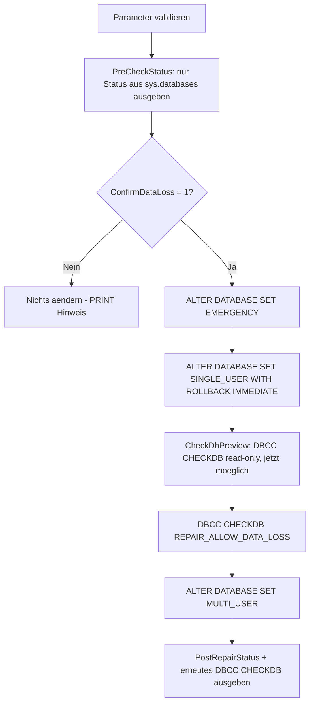

# SuspectDatabaseRepairWithoutBackup.sql

Dieses Skript ist die **letzte Notloesung**, wenn eine `SUSPECT`-Datenbank Seitenkorruption zeigt (`msdb.dbo.suspect_pages`) und **kein brauchbares Backup** fuer einen vollstaendigen Restore oder einen gezielten Page Restore existiert. Es fuehrt `DBCC CHECKDB ... WITH REPAIR_ALLOW_DATA_LOSS` aus — das ist **keine Wiederherstellung**, sondern das dauerhafte Entfernen beschaedigter Seiten/Zeilen, um die Datenbank wieder konsistent zu machen.

## Uebersicht

<!-- SQLDOC:SUMMARY_TABLE:BEGIN -->
| Feld | Wert |
|---|---|
| Script | [SuspectDatabaseRepairWithoutBackup.sql](SuspectDatabaseRepairWithoutBackup.sql) |
| Version | `1.1` |
| Typ | `remediation` |
| Kapitel | `71_BackupRestore_Strategies` |
| Sicherheit | `destructive` (schreibend, Datenverlust) |
| Zweck | Repariert eine SUSPECT-Datenbank ohne Backup via DBCC CHECKDB REPAIR_ALLOW_DATA_LOSS, abgesichert durch explizite Bestaetigung. |
<!-- SQLDOC:SUMMARY_TABLE:END -->

## Einordnung

Siehe [SuspectOrRecoveryPendingDatabase_RepairOptions.md](../SuspectOrRecoveryPendingDatabase_RepairOptions.md) fuer den vollstaendigen Vergleich aller drei Reparaturoptionen (vollstaendiger Restore, Page Restore, Repair ohne Backup) sowie [SuspectOrRecoveryPendingDatabaseRootCauseCheck.sql](SuspectOrRecoveryPendingDatabaseRootCauseCheck.sql) fuer die vorgelagerte automatische Ursachenanalyse. Dieses Skript deckt ausschliesslich **Option 3** ab: den Fall, dass weder ein vollstaendiger Restore noch ein Page Restore moeglich ist.

**Bevor dieses Skript verwendet wird, immer zuerst pruefen**, ob doch noch ein brauchbares Backup existiert (siehe `msdb.dbo.backupset`/`backupmediafamily` in [SuspectOrRecoveryPendingDatabase_RepairOptions.md](../SuspectOrRecoveryPendingDatabase_RepairOptions.md) Abschnitt 5) — ein Restore ist grundsaetzlich vorzuziehen, da er ohne Datenverlust auskommt.

**Wichtiger technischer Hintergrund (Version 1.1):** Eine `SUSPECT`-Datenbank verweigert grundsaetzlich **jeden** Zugriff — auch einen rein lesenden `DBCC CHECKDB`-Aufruf — solange sie nicht per `ALTER DATABASE ... SET EMERGENCY` zugaenglich gemacht wurde. Ein Versuch, `DBCC CHECKDB` vorher auszufuehren, scheitert mit:

```text
Msg 926, Level 14, State 1
Database 'BI_DQ' cannot be opened. It has been marked SUSPECT by recovery. See the SQL Server errorlog for more information.
```

Deshalb gibt es bei `@ConfirmDataLoss = 0` **keinen** Vorab-`DBCC CHECKDB`-Check mehr — nur die Statuszeile aus `sys.databases`. Der lesende Schadens-Check (`CheckDbPreview`) laeuft erst **nach** dem Wechsel in `EMERGENCY`/`SINGLE_USER`, also nur im tatsaechlichen Reparaturpfad bei `@ConfirmDataLoss = 1`.

## Annahmen

- Das Skript ist bewusst als **zweistufiger Ablauf** gebaut: Solange `@ConfirmDataLoss = 0` (Default) ist, wird **nichts** an der Datenbank geaendert — es wird lediglich der aktuelle Status aus `sys.databases` angezeigt.
- Erst mit `@ConfirmDataLoss = 1` wird die Datenbank tatsaechlich in `EMERGENCY`/`SINGLE_USER` versetzt, ein lesender `DBCC CHECKDB`-Check ausgefuehrt und danach `DBCC CHECKDB ... REPAIR_ALLOW_DATA_LOSS`.
- Der Datenverlust durch `REPAIR_ALLOW_DATA_LOSS` ist **endgueltig** — es gibt keine Undo-Funktion.
- Nach der Reparatur sollte umgehend ein neues Full-Backup gezogen werden, da der reparierte Zustand sonst ungesichert bleibt.
- **Bei sehr grossflaechiger Korruption kann `REPAIR_ALLOW_DATA_LOSS` selbst scheitern** (`Msg 7909: The emergency-mode repair failed. You must restore from backup.`) — die Datenbank faellt danach wieder auf `SUSPECT` zurueck. In diesem Fall ist [SuspectDatabaseScriptSchemaOnly.sql](SuspectDatabaseScriptSchemaOnly.sql) der naechste Schritt: Es versucht, wenigstens die Objektstruktur (ohne Daten) zu retten.

## Anwendungsfall

Eine Datenbank ist `SUSPECT`, `msdb.dbo.suspect_pages` zeigt Eintraege, und es existiert nachweislich kein Backup, das die betroffenen Seiten unbeschaedigt enthaelt (z.B. eine reine Log-/Staging-Datenbank ohne eigene Backup-Strategie, deren Inhalt jederzeit aus der Quelle neu aufgebaut werden kann). In diesem Fall ist der Datenverlust durch `REPAIR_ALLOW_DATA_LOSS` akzeptabel, um die Datenbank schnell wieder online und konsistent zu bekommen.

## Parameter

<!-- SQLDOC:PARAMETERS_TABLE:BEGIN -->
| Parameter | SQL-Typ | Pflicht | Beschreibung |
|---|---|---|---|
| `@TargetDatabaseName` | `SYSNAME` | Ja | Name der SUSPECT-Datenbank ohne brauchbares Backup, z.B. `'BI_DQ'`. |
| `@ConfirmDataLoss` | `BIT` | Ja | Muss explizit auf `1` gesetzt werden, um den destruktiven Ablauf tatsaechlich auszufuehren. Bei `0` (Default) aendert sich nichts an der Datenbank. |
<!-- SQLDOC:PARAMETERS_TABLE:END -->

## Abhaengigkeiten

<!-- SQLDOC:DEPENDENCIES_LIST:BEGIN -->
- `sys.databases`
- `msdb.dbo.suspect_pages`
- `DBCC CHECKDB`
- `ALTER DATABASE`
<!-- SQLDOC:DEPENDENCIES_LIST:END -->

## Hinweise

- `PreCheckStatus` zeigt nur Status und Recovery Model der Zieldatenbank aus `sys.databases` — **ohne** Suspect-Page-Zaehlung und **ohne** `DBCC CHECKDB`, da beides bei `SUSPECT` vor dem `EMERGENCY`-Wechsel mit `Msg 926` fehlschlagen wuerde.
- Nur wenn `@ConfirmDataLoss = 1` gesetzt ist, folgt der destruktive Block: `SET EMERGENCY` → `SET SINGLE_USER WITH ROLLBACK IMMEDIATE` → lesender `DBCC CHECKDB`-Check (`CheckDbPreview`) → `DBCC CHECKDB ... REPAIR_ALLOW_DATA_LOSS` → `SET MULTI_USER`.
- `PostRepairStatus` (nur bei `@ConfirmDataLoss = 1`) zeigt Status und verbleibende Suspect-Page-Anzahl nach der Reparatur, gefolgt von einem erneuten lesenden `DBCC CHECKDB`-Lauf zur Kontrolle.
- Das Skript gibt per `PRINT` eine klare Meldung aus, ob der destruktive Ablauf ausgefuehrt wurde oder gar nichts passiert ist.

## Versionshistorie

<!-- SQLDOC:VERSION_HISTORY_TABLE:BEGIN -->
| Version | Datum | User | Beschreibung |
|---|---|---|---|
| `1.0` | `2026-08-13` | `ER` | Erstversion: Notloesung ohne Backup mit DBCC CHECKDB REPAIR_ALLOW_DATA_LOSS, abgesichert durch @ConfirmDataLoss-Bestaetigung und vorgeschalteten Read-Only-Check |
| `1.1` | `2026-08-13` | `ER` | Fix fuer Msg 926 'Database cannot be opened, marked SUSPECT': Der lesende DBCC CHECKDB-Vorab-Check schlug fehl, da eine SUSPECT-Datenbank vor ALTER DATABASE SET EMERGENCY generell keinen Zugriff erlaubt. Bei @ConfirmDataLoss = 0 wird jetzt gar kein DBCC CHECKDB mehr versucht (nur Status aus sys.databases); bei @ConfirmDataLoss = 1 laeuft der lesende Check erst NACH dem EMERGENCY/SINGLE_USER-Wechsel |
<!-- SQLDOC:VERSION_HISTORY_TABLE:END -->

## Ablauf

<!-- SQLDOC:MERMAID:BEGIN -->

<!-- SQLDOC:MERMAID:END -->

## SQL-Code

<!-- SQLDOC:SQL_CODE:BEGIN -->
```sql
/*
BEGIN:SQL-HEADER v1
---
sql_header: v1
script_name: "SuspectDatabaseRepairWithoutBackup.sql"
script_version: "1.1"
script_type: "remediation"
chapter: "71_BackupRestore_Strategies"
purpose: >
  Letzte Notloesung fuer eine SUSPECT-Datenbank mit Seitenkorruption, wenn
  KEIN brauchbares Backup fuer einen vollstaendigen Restore oder einen Page
  Restore existiert. Versetzt die Datenbank in den EMERGENCY- und
  SINGLE_USER-Modus und fuehrt DBCC CHECKDB WITH REPAIR_ALLOW_DATA_LOSS aus.
  Dies ist KEINE Wiederherstellung: Betroffene Seiten/Zeilen werden entfernt,
  der Datenverlust ist endgueltig. Das Skript fuehrt den destruktiven Schritt
  nur aus, wenn @ConfirmDataLoss explizit auf 1 gesetzt wurde.

parameters:
  - name: "@TargetDatabaseName"
    sql_type: "SYSNAME"
    direction: "IN"
    required: true
    description: "Name der SUSPECT-Datenbank ohne brauchbares Backup, z.B. 'BI_DQ'"
  - name: "@ConfirmDataLoss"
    sql_type: "BIT"
    direction: "IN"
    required: true
    description: "Muss explizit auf 1 gesetzt werden, um den destruktiven REPAIR_ALLOW_DATA_LOSS-Schritt tatsaechlich auszufuehren; bei 0 (Default) wird nur eine Vorschau/Trockenlauf-Pruefung durchgefuehrt"

result_sets:
  - name: "PreCheckStatus"
    description: "Status der Zieldatenbank vor jeder Aenderung (ohne Suspect-Page-Anzahl, da die DB im SUSPECT-Zustand fuer msdb-Abfragen mit database_id-Bezug u.U. noch nicht zugreifbar ist)"
  - name: "CheckDbPreview"
    description: "DBCC CHECKDB (read-only) Ausgabe NACH dem Wechsel in EMERGENCY, aber VOR REPAIR_ALLOW_DATA_LOSS, zur Einschaetzung des Schadens (nur wenn @ConfirmDataLoss = 1)"
  - name: "PostRepairStatus"
    description: "Status und Suspect-Page-Anzahl der Zieldatenbank nach der Reparatur (nur wenn @ConfirmDataLoss = 1)"

dependencies:
  - "sys.databases"
  - "msdb.dbo.suspect_pages"
  - "DBCC CHECKDB"
  - "ALTER DATABASE"

safety:
  level: "destructive"
  writes_data: true

documentation:
  markdown_file: "T-SQL/71_BackupRestore_Strategies/SQLScripts/SuspectDatabaseRepairWithoutBackup.md"
  sync_blocks:
    - "SUMMARY_TABLE"
    - "PARAMETERS_TABLE"
    - "DEPENDENCIES_LIST"
    - "VERSION_HISTORY_TABLE"
    - "SQL_CODE"
  mermaid:
    mode: "ai-agent-from-sql"
    source: "script-body"

main_responsible:
  name: "Erhard Rainer"
  initials: "ER"

version_history:
  - version: "1.0"
    date: "2026-08-13"
    user: "ER"
    description: "Erstversion: Notloesung ohne Backup mit DBCC CHECKDB REPAIR_ALLOW_DATA_LOSS, abgesichert durch @ConfirmDataLoss-Bestaetigung und vorgeschalteten Read-Only-Check"
  - version: "1.1"
    date: "2026-08-13"
    user: "ER"
    description: "Fix fuer Msg 926 'Database cannot be opened, marked SUSPECT': Der lesende DBCC CHECKDB-Vorab-Check schlug fehl, da eine SUSPECT-Datenbank vor ALTER DATABASE SET EMERGENCY generell keinen Zugriff erlaubt. Bei @ConfirmDataLoss = 0 wird jetzt gar kein DBCC CHECKDB mehr versucht (nur Status aus sys.databases); bei @ConfirmDataLoss = 1 laeuft der lesende Check erst NACH dem EMERGENCY/SINGLE_USER-Wechsel."

notes:
  - "Dies ist ein SCHREIBENDES, DESTRUKTIVES Skript. Es entfernt beschaedigte Seiten/Zeilen dauerhaft und unwiderruflich."
  - "Vor Ausfuehrung IMMER pruefen, ob doch noch ein brauchbares Backup fuer vollstaendigen Restore oder Page Restore existiert (siehe SuspectOrRecoveryPendingDatabase_RepairOptions.md), da dies ohne Datenverlust waere."
  - "Solange @ConfirmDataLoss = 0 ist, aendert das Skript nichts an der Datenbank und zeigt nur den Status aus sys.databases (kein DBCC CHECKDB, da dies bei SUSPECT ohne vorherigen EMERGENCY-Wechsel mit Msg 926 fehlschlaegt)."
  - "Nach erfolgreicher Reparatur sollte umgehend ein neues Full-Backup gezogen werden (siehe SuspectOrRecoveryPendingDatabase_RepairOptions.md Abschnitt 4.5)."
---
END:SQL-HEADER v1
*/

SET NOCOUNT ON;

-- 1. Parameter vorbereiten
DECLARE @TargetDatabaseName SYSNAME = N'BI_DQ';
DECLARE @ConfirmDataLoss BIT = 0;

IF @TargetDatabaseName IS NULL OR LTRIM(RTRIM(@TargetDatabaseName)) = N''
BEGIN
    THROW 50000, '@TargetDatabaseName darf nicht leer sein.', 1;
END;

IF NOT EXISTS (SELECT 1 FROM sys.databases WHERE name = @TargetDatabaseName)
BEGIN
    THROW 50001, 'Die angegebene Datenbank wurde nicht in sys.databases gefunden.', 1;
END;

IF @ConfirmDataLoss IS NULL OR @ConfirmDataLoss NOT IN (0, 1)
BEGIN
    THROW 50002, '@ConfirmDataLoss muss 0 oder 1 sein.', 1;
END;

-- 2. Vorab-Status anzeigen (rein lesend; Suspect-Page-Anzahl ist bei SUSPECT ggf. nicht ermittelbar,
--    da die Datenbank fuer normale Abfragen noch gesperrt ist)
SELECT
    d.name                AS DatabaseName,
    d.database_id         AS DatabaseId,
    d.state_desc          AS StateDesc,
    d.recovery_model_desc AS RecoveryModel,
    d.user_access_desc    AS UserAccessDesc,
    @ConfirmDataLoss       AS ConfirmDataLossFlag
FROM sys.databases AS d
WHERE d.name = @TargetDatabaseName;

-- 3. Destruktiven Ablauf nur ausfuehren, wenn explizit bestaetigt.
--    Hinweis: Eine SUSPECT-Datenbank verweigert JEDEN Zugriff (auch lesendes DBCC CHECKDB),
--    solange sie nicht per ALTER DATABASE SET EMERGENCY zugaenglich gemacht wurde (Msg 926).
--    Deshalb ist bei @ConfirmDataLoss = 0 kein sinnvoller Vorab-Check moeglich - das Skript
--    aendert in diesem Fall bewusst NICHTS an der Datenbank.
IF @ConfirmDataLoss = 1
BEGIN
    DECLARE @Sql NVARCHAR(MAX);

    PRINT N'ACHTUNG: @ConfirmDataLoss = 1 - fuehre destruktive Reparatur mit Datenverlust aus fuer ' + QUOTENAME(@TargetDatabaseName) + N'.';

    -- 3a. Datenbank in EMERGENCY und SINGLE_USER versetzen (erst danach ist die DB ueberhaupt lesbar)
    SET @Sql = N'ALTER DATABASE ' + QUOTENAME(@TargetDatabaseName) + N' SET EMERGENCY;';
    EXEC sp_executesql @Sql;

    SET @Sql = N'ALTER DATABASE ' + QUOTENAME(@TargetDatabaseName) + N' SET SINGLE_USER WITH ROLLBACK IMMEDIATE;';
    EXEC sp_executesql @Sql;

    -- 3b. Jetzt (nach EMERGENCY) ist ein lesender DBCC CHECKDB-Check moeglich, um den Schadensumfang zu sehen
    DBCC CHECKDB (@TargetDatabaseName) WITH NO_INFOMSGS, ALL_ERRORMSGS;

    -- 3c. Reparatur mit Datenverlust
    DBCC CHECKDB (@TargetDatabaseName, REPAIR_ALLOW_DATA_LOSS) WITH NO_INFOMSGS, ALL_ERRORMSGS;

    -- 3d. Datenbank wieder fuer alle Benutzer freigeben
    SET @Sql = N'ALTER DATABASE ' + QUOTENAME(@TargetDatabaseName) + N' SET MULTI_USER;';
    EXEC sp_executesql @Sql;

    -- 4. Ergebnis nach der Reparatur pruefen
    SELECT
        d.name                AS DatabaseName,
        d.database_id         AS DatabaseId,
        d.state_desc          AS StateDesc,
        d.recovery_model_desc AS RecoveryModel,
        d.user_access_desc    AS UserAccessDesc,
        (SELECT COUNT(*) FROM msdb.dbo.suspect_pages AS sp WHERE sp.database_id = d.database_id) AS SuspectPageCountAfterRepair
    FROM sys.databases AS d
    WHERE d.name = @TargetDatabaseName;

    DBCC CHECKDB (@TargetDatabaseName) WITH NO_INFOMSGS, ALL_ERRORMSGS;

    PRINT N'Reparatur abgeschlossen. Bitte umgehend ein neues Full-Backup ziehen und die entfernten Daten fachlich pruefen (siehe SuspectOrRecoveryPendingDatabase_RepairOptions.md Abschnitt 4.5).';
END
ELSE
BEGIN
    PRINT N'@ConfirmDataLoss = 0: Es wurde nichts an der Datenbank geaendert. Eine SUSPECT-Datenbank kann vor ALTER DATABASE SET EMERGENCY nicht sinnvoll gelesen werden (auch DBCC CHECKDB schlaegt sonst mit Msg 926 fehl). Zum Ausfuehren der destruktiven Reparatur @ConfirmDataLoss auf 1 setzen.';
END;
```
<!-- SQLDOC:SQL_CODE:END -->
