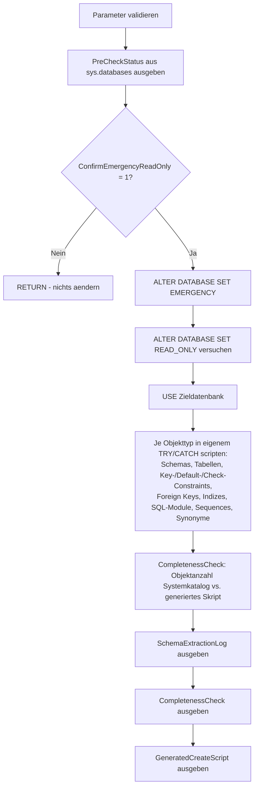

# SuspectDatabaseScriptSchemaOnly.sql

Dieses Skript ist der **letzte Rettungsversuch**, wenn `DBCC CHECKDB ... WITH REPAIR_ALLOW_DATA_LOSS` bereits fehlgeschlagen ist ("*emergency-mode repair failed, you must restore from backup*") und kein Backup existiert. Es versetzt die Datenbank **nur** in `EMERGENCY` + `READ_ONLY` (**ohne** Reparaturversuch, **ohne** `SINGLE_USER WITH ROLLBACK IMMEDIATE`) und versucht anschliessend, die **CREATE-Definitionen aller Objekte** (Schemas, Tabellen, Constraints, Indizes, Views, Functions, Stored Procedures, Trigger, Sequences, Synonyme) ueber Systemkataloge und `sys.sql_modules` auszulesen. Ziel ist **nicht** die Datenrettung, sondern das reine Schema, um die Datenbankstruktur an anderer Stelle neu aufbauen zu koennen.

**Achtung:** Die Ergebnistabelle `GeneratedCreateScript` ist **nicht direkt als `.sql`-Datei ausfuehrbar** — es fehlt der `CREATE DATABASE`/`USE`-Kontext, und zwischen den Statements fehlen `GO`-Batch-Trenner (zwingend erforderlich, da `CREATE VIEW`/`PROCEDURE`/`FUNCTION`/`TRIGGER` jeweils alleine in ihrem Batch stehen muessen). Um daraus ein tatsaechlich lauffaehiges Skript zu erzeugen, direkt im Anschluss (selbe Session) [AssembleExecutableCreateScript.sql](AssembleExecutableCreateScript.sql) ausfuehren.

## Uebersicht

<!-- SQLDOC:SUMMARY_TABLE:BEGIN -->
| Feld | Wert |
|---|---|
| Script | [SuspectDatabaseScriptSchemaOnly.sql](SuspectDatabaseScriptSchemaOnly.sql) |
| Version | `1.1` |
| Typ | `diagnostic` |
| Kapitel | `71_BackupRestore_Strategies` |
| Sicherheit | `destructive-limited` (aendert Datenbankeigenschaften, aber keine Daten/Reparatur) |
| Zweck | Extrahiert das Schema (CREATE-Statements) einer SUSPECT-Datenbank, wenn REPAIR_ALLOW_DATA_LOSS bereits gescheitert ist. |
<!-- SQLDOC:SUMMARY_TABLE:END -->

## Einordnung

Dieses Skript ist **eigenstaendig** und getrennt von [SuspectDatabaseRepairWithoutBackup.sql](SuspectDatabaseRepairWithoutBackup.sql). Es kommt erst dann zum Einsatz, wenn dieses Repair-Skript bereits gelaufen ist und SQL Server den Reparaturversuch explizit verweigert hat (`Msg 7909: The emergency-mode repair failed. You must restore from backup.`), z.B. bei sehr grossflaechiger Storage-Korruption (im Praxisfall: 294 Allocation Errors, 136.381 Consistency Errors — praktisch die gesamte Datendatei mit `PageId = 0:0`). Siehe auch [SuspectOrRecoveryPendingDatabase_RepairOptions.md](../SuspectOrRecoveryPendingDatabase_RepairOptions.md) fuer den Gesamtzusammenhang aller Reparaturoptionen.

**Wichtig:** Dieses Skript fuehrt **kein** `DBCC CHECKDB ... REPAIR_ALLOW_DATA_LOSS` aus. Es aendert nur `EMERGENCY`/`READ_ONLY` und liest danach ausschliesslich Metadaten — es ist der Versuch, wenigstens die **Struktur** zu retten, wenn die **Daten** ohnehin verloren sind.

**Kein Beweis fuer Vollstaendigkeit (Version 1.1):** Ein `Status = OK` je Objekttyp bedeutet nur, dass die jeweilige Abfrage **ohne SQL-Fehler** durchlief — es bedeutet **nicht**, dass jedes einzelne Objekt dieses Typs tatsaechlich erfasst wurde. Ist z.B. nur die Metadatenseite einer einzelnen Tabelle beschaedigt, kann `sys.tables` fuer die uebrigen Tabellen weiterhin problemlos lesbar sein — die Abfrage liefert dann **still und ohne Fehlermeldung** eine unvollstaendige Ergebnismenge. Deshalb enthaelt das Skript zusaetzlich einen `CompletenessCheck`-Block, der die Objektanzahl direkt aus dem Systemkatalog mit der Anzahl im generierten Skript vergleicht. Auch das ist nur ein **Indiz**, kein absoluter Beweis — der Systemkatalog selbst koennte ebenfalls unvollstaendig sein, wenn ein Index/B-Baum darin defekt ist.

## Annahmen

- Ob die Systemkataloge (`sys.objects`, `sys.columns`, `sys.sql_modules`, ...) ueberhaupt lesbar sind, haengt davon ab, ob die zugehoerigen Metadaten-Seiten selbst beschaedigt sind. Bei sehr grossflaechiger Korruption kann auch dieser Versuch fehlschlagen oder nur teilweise Ergebnisse liefern — deshalb laeuft jeder Objekttyp in einem eigenen `TRY/CATCH`-Block, damit ein Fehler bei einem Typ nicht die anderen blockiert.
- **Ein `Status = OK` ist kein Beweis fuer Vollstaendigkeit** — siehe Hinweis oben. Nur `CompletenessCheck.LikelyComplete = 1` ist ein zusaetzliches (aber ebenfalls nicht absolutes) Indiz.
- Generierte `CREATE`-Statements sind eine Annaeherung (*best effort*) und decken nicht jede SQL-Server-Feinheit ab (z.B. Partitionierung, erweiterte Sicherheitsmerkmale, Extended Properties, Trigger-Feinheiten jenseits von `sys.sql_modules`). Ist die Datenbank nach der Extraktion doch wieder lesbar, zusaetzlich SSMS **Generate Scripts** oder `sqlpackage` fuer ein vollstaendigeres Skript verwenden.
- `USE [BI_DQ];` (Schritt 4) akzeptiert **keine** T-SQL-Variable — dieser Datenbankname muss beim Einsatz fuer eine andere Datenbank manuell an den Wert von `@TargetDatabaseName` (Schritt 1) angepasst werden. Es ist die einzige Stelle im Skript, an der der Name doppelt gepflegt werden muss.
- Das Skript ist rein lesend gegenueber den Daten selbst; es schreibt nichts in die Zieldatenbank.

## Anwendungsfall

`DBCC CHECKDB ... REPAIR_ALLOW_DATA_LOSS` wurde bereits versucht und ist mit `Msg 7909` gescheitert — die Datenbank ist danach wieder `SUSPECT` und nicht zugreifbar. Ein vollstaendiger Restore ist nicht moeglich (kein Backup). Bevor die Datenbank endgueltig verworfen wird, soll wenigstens die Objektstruktur (Tabellen, Views, Procedures, Functions, Trigger, Constraints, Indizes) gerettet werden, um sie in einer neu angelegten, leeren Datenbank wieder aufzubauen.

## Parameter

<!-- SQLDOC:PARAMETERS_TABLE:BEGIN -->
| Parameter | SQL-Typ | Pflicht | Beschreibung |
|---|---|---|---|
| `@TargetDatabaseName` | `SYSNAME` | Ja | Name der SUSPECT-Datenbank, deren Schema gerettet werden soll, z.B. `'BI_DQ'`. Muss zusaetzlich manuell in der `USE`-Zeile (Schritt 4) gepflegt werden. |
| `@ConfirmEmergencyReadOnly` | `BIT` | Ja | Muss explizit auf `1` gesetzt werden, um die Datenbank in `EMERGENCY`/`READ_ONLY` zu versetzen. Bei `0` (Default) wird nur der aktuelle Status angezeigt und nichts geaendert. |
<!-- SQLDOC:PARAMETERS_TABLE:END -->

## Abhaengigkeiten

<!-- SQLDOC:DEPENDENCIES_LIST:BEGIN -->
- `sys.databases`
- `sys.schemas`
- `sys.tables`
- `sys.columns`
- `sys.types`
- `sys.indexes`
- `sys.key_constraints`
- `sys.check_constraints`
- `sys.default_constraints`
- `sys.foreign_keys`
- `sys.sql_modules`
- `sys.objects`
- `sys.sequences`
- `sys.synonyms`
<!-- SQLDOC:DEPENDENCIES_LIST:END -->

## Hinweise

- `PreCheckStatus` zeigt den aktuellen Status der Datenbank aus `sys.databases`, bevor irgendetwas geaendert wird.
- Bei `@ConfirmEmergencyReadOnly = 0` bricht das Skript nach der Statusanzeige per `RETURN` ab — es passiert nichts weiter.
- Bei `@ConfirmEmergencyReadOnly = 1`: `ALTER DATABASE SET EMERGENCY`, danach der Versuch `ALTER DATABASE SET READ_ONLY` (schlaegt dieser fehl, laeuft das Skript im reinen `EMERGENCY`-Modus weiter — per `PRINT` protokolliert).
- `SchemaExtractionLog` zeigt je Objekttyp (Schema, Tabelle, Key-Constraint, Default-Constraint, Check-Constraint, Foreign Key, Index, SQL-Module, Sequence, Synonym), ob das Auslesen erfolgreich war (`OK`, mit Anzahl gefundener Objekte) oder fehlschlug (`FAILED`, mit Fehlermeldung). **`OK` heisst nur "kein SQL-Fehler", nicht "vollstaendig"** — siehe `CompletenessCheck`.
- `CompletenessCheck` (neu in Version 1.1) vergleicht fuer `TABLE` und `SQL_MODULE` (Views/Procedures/Functions/Trigger) die Objektanzahl direkt aus dem Systemkatalog (`sys.tables`, `sys.sql_modules`) mit der Anzahl, die tatsaechlich in `GeneratedCreateScript` gelandet ist. `LikelyComplete = 1` bedeutet: Die Zaehler stimmen ueberein — ein Indiz, aber kein Beweis, dass wirklich jedes Objekt korrekt gescriptet wurde (z.B. koennte ein `STRING_AGG` bei einer Tabelle mit besonders vielen Spalten an interne Limits stossen, ohne dass die Zeile fehlt).
- `GeneratedCreateScript` enthaelt die generierten `CREATE`/`ALTER`-Statements in sinnvoller Abhaengigkeitsreihenfolge (Schemas → Tabellen → Key-Constraints → Default-Constraints → Check-Constraints → Foreign Keys → Indizes → Sequences → Synonyme → Views/Procedures/Functions/Trigger via `sys.sql_modules`). **Wichtig:** Diese Tabellenausgabe ist NICHT direkt ausfuehrbar — es fehlen `CREATE DATABASE`/`USE` und `GO`-Batch-Trenner (SQL Server verlangt, dass `CREATE VIEW`/`PROCEDURE`/`FUNCTION`/`TRIGGER` jeweils als erstes Statement im Batch stehen). Fuer eine tatsaechlich lauffaehige `.sql`-Datei direkt im Anschluss [AssembleExecutableCreateScript.sql](AssembleExecutableCreateScript.sql) in derselben Session ausfuehren.
- Views, Stored Procedures, Functions und Trigger werden nicht einzeln rekonstruiert, sondern direkt als Originaltext aus `sys.sql_modules.definition` uebernommen — das ist zuverlaessiger als ein Nachbau aus Metadaten.
- Nach erfolgreicher Extraktion: Die Zieldatenbank sollte **nicht** dauerhaft im `EMERGENCY`-Modus verbleiben. Sie kann vollstaendig entfernt werden — dafuer gibt es [DropDatabaseCompletely.sql](DropDatabaseCompletely.sql) (killt Verbindungen, `DROP DATABASE`, entfernt auch verbliebene Dateien via `xp_cmdshell`-Fallback) — und aus dem per [AssembleExecutableCreateScript.sql](AssembleExecutableCreateScript.sql) zusammengestellten, direkt ausfuehrbaren Skript neu aufgebaut werden.

## Versionshistorie

<!-- SQLDOC:VERSION_HISTORY_TABLE:BEGIN -->
| Version | Datum | User | Beschreibung |
|---|---|---|---|
| `1.0` | `2026-08-13` | `ER` | Erstversion: Schema-Rettung per EMERGENCY+READ_ONLY (ohne REPAIR) und objektweises Scripten aller Tabellen, Constraints, Indizes, Views, Functions, Procedures und Trigger ueber Systemkataloge |
| `1.1` | `2026-08-13` | `ER` | Neuer CompletenessCheck-Block: Ein 'OK' in SchemaExtractionLog bedeutet nur fehlerfreie Ausfuehrung der Abfrage, NICHT dass jedes Objekt vollstaendig erfasst wurde (stille Teil-Auslassungen bei partiell beschaedigten Metadaten sind sonst nicht erkennbar). CompletenessCheck vergleicht Objektanzahl aus dem Systemkatalog direkt gegen die Anzahl im generierten Skript. |
<!-- SQLDOC:VERSION_HISTORY_TABLE:END -->

## Ablauf

<!-- SQLDOC:MERMAID:BEGIN -->

<!-- SQLDOC:MERMAID:END -->

## SQL-Code

<!-- SQLDOC:SQL_CODE:BEGIN -->
```sql
/*
BEGIN:SQL-HEADER v1
---
sql_header: v1
script_name: "SuspectDatabaseScriptSchemaOnly.sql"
script_version: "1.1"
script_type: "diagnostic"
chapter: "71_BackupRestore_Strategies"
purpose: >
  Letzter Rettungsversuch fuer eine SUSPECT-Datenbank, bei der DBCC CHECKDB
  WITH REPAIR_ALLOW_DATA_LOSS bereits fehlgeschlagen ist ("emergency-mode
  repair failed, you must restore from backup") und kein Backup existiert.
  Versetzt die Datenbank NUR in EMERGENCY + READ_ONLY (OHNE REPAIR, OHNE
  SINGLE_USER WITH ROLLBACK IMMEDIATE) und versucht anschliessend, die
  CREATE-Definitionen aller Objekte (Tabellen, Views, Stored Procedures,
  Funktionen, Trigger, Indizes, Constraints, Sequences, Synonyme) ueber
  Systemkatalogsichten und sys.sql_modules auszulesen. Ziel ist NICHT die
  Datenrettung, sondern das reine Schema, um die Datenbankstruktur an
  anderer Stelle neu aufbauen zu koennen. Jeder Objekttyp wird einzeln in
  einem eigenen TRY/CATCH-Block gescriptet, damit ein Fehler bei einem Typ
  (z.B. wegen beschaedigter Metadatenseiten) nicht die anderen Typen
  blockiert.

parameters:
  - name: "@TargetDatabaseName"
    sql_type: "SYSNAME"
    direction: "IN"
    required: true
    description: "Name der SUSPECT-Datenbank, deren Schema noch gerettet werden soll, z.B. 'BI_DQ'"
  - name: "@ConfirmEmergencyReadOnly"
    sql_type: "BIT"
    direction: "IN"
    required: true
    description: "Muss explizit auf 1 gesetzt werden, um die Datenbank in EMERGENCY + READ_ONLY zu versetzen; bei 0 (Default) wird nur der aktuelle Status angezeigt und nichts geaendert"

result_sets:
  - name: "PreCheckStatus"
    description: "Aktueller Status der Zieldatenbank aus sys.databases vor jeder Aenderung"
  - name: "SchemaExtractionLog"
    description: "Protokoll je Objekttyp: wie viele Objekte gefunden/erfolgreich gescriptet wurden bzw. welcher Fehler auftrat. WICHTIG: 'OK' bedeutet nur fehlerfreie Ausfuehrung, nicht garantierte Vollstaendigkeit - siehe CompletenessCheck"
  - name: "CompletenessCheck"
    description: "Vergleicht die Objektanzahl direkt aus dem Systemkatalog (z.B. sys.tables) mit der tatsaechlich ins generierte Skript uebernommenen Anzahl, um stille Teil-Auslassungen bei partiell beschaedigten Metadaten aufzudecken"
  - name: "GeneratedCreateScript"
    description: "Die generierten CREATE-Statements aller erfolgreich ausgelesenen Objekte, in Abhaengigkeitsreihenfolge (Schemas, Tabellen, Constraints, Indizes, Views, Functions, Procedures, Trigger)"

dependencies:
  - "sys.databases"
  - "sys.schemas"
  - "sys.tables"
  - "sys.columns"
  - "sys.types"
  - "sys.indexes"
  - "sys.key_constraints"
  - "sys.check_constraints"
  - "sys.default_constraints"
  - "sys.foreign_keys"
  - "sys.sql_modules"
  - "sys.objects"
  - "sys.sequences"
  - "sys.synonyms"

safety:
  level: "destructive-limited"
  writes_data: false

documentation:
  markdown_file: "T-SQL/71_BackupRestore_Strategies/SQLScripts/SuspectDatabaseScriptSchemaOnly.md"
  sync_blocks:
    - "SUMMARY_TABLE"
    - "PARAMETERS_TABLE"
    - "DEPENDENCIES_LIST"
    - "VERSION_HISTORY_TABLE"
    - "SQL_CODE"
  mermaid:
    mode: "ai-agent-from-sql"
    source: "script-body"

main_responsible:
  name: "Erhard Rainer"
  initials: "ER"

version_history:
  - version: "1.0"
    date: "2026-08-13"
    user: "ER"
    description: "Erstversion: Schema-Rettung per EMERGENCY+READ_ONLY (ohne REPAIR) und objektweises Scripten aller Tabellen, Constraints, Indizes, Views, Functions, Procedures und Trigger ueber Systemkataloge"
  - version: "1.1"
    date: "2026-08-13"
    user: "ER"
    description: "Neuer CompletenessCheck-Block: Ein 'OK' in SchemaExtractionLog bedeutet nur fehlerfreie Ausfuehrung der Abfrage, NICHT dass jedes Objekt vollstaendig erfasst wurde (stille Teil-Auslassungen bei partiell beschaedigten Metadaten sind sonst nicht erkennbar). CompletenessCheck vergleicht Objektanzahl aus dem Systemkatalog direkt gegen die Anzahl im generierten Skript."

notes:
  - "Dieses Skript aendert die Datenbankeigenschaften (EMERGENCY, READ_ONLY), fuehrt aber KEIN DBCC CHECKDB REPAIR_ALLOW_DATA_LOSS aus - es ist ausdruecklich NICHT identisch mit SuspectDatabaseRepairWithoutBackup.sql."
  - "Ob die Systemkataloge (sys.objects, sys.columns, sys.sql_modules, ...) ueberhaupt lesbar sind, haengt davon ab, ob die zugehoerigen Metadaten-Seiten selbst beschaedigt sind. Bei sehr grossflaechiger Korruption (siehe Praxisbeispiel: 294 allocation errors, 136381 consistency errors) kann auch dieser Versuch fehlschlagen oder nur teilweise Ergebnisse liefern."
  - "WICHTIG: 'Status = OK' in SchemaExtractionLog ist KEIN Beweis fuer Vollstaendigkeit, sondern nur dafuer, dass die jeweilige Abfrage ohne SQL-Fehler durchlief. Sind nur einzelne Metadaten-Seiten beschaedigt, kann die Abfrage fuer die uebrigen, unbeschaedigten Objekte klaglos durchlaufen und dabei die beschaedigten Objekte STILL auslassen, ohne dass dies als Fehler markiert wird. Der neue CompletenessCheck-Block vergleicht deshalb zusaetzlich die Objektanzahl direkt aus dem Systemkatalog mit der Anzahl im generierten Skript."
  - "Generierte CREATE-Statements sind eine Annaeherung (best effort) und decken nicht jede SQL-Server-Feinheit ab (z.B. Partitionierung, erweiterte Eigenschaften, Security). Fuer produktionsreife Skripte nach erfolgreichem Auslesen zusaetzlich SSMS 'Generate Scripts' oder sqlpackage gegen die (dann lesbare) Datenbank verwenden."
  - "Nach Abschluss sollte die Datenbank NICHT dauerhaft im EMERGENCY-Modus verbleiben; sie kann anschliessend verworfen und aus dem extrahierten Schema neu aufgebaut werden (DROP DATABASE + CREATE DATABASE + generiertes Skript)."
---
END:SQL-HEADER v1
*/

SET NOCOUNT ON;

-- 1. Parameter vorbereiten
DECLARE @TargetDatabaseName SYSNAME = N'BI_DQ';
DECLARE @ConfirmEmergencyReadOnly BIT = 0;

IF @TargetDatabaseName IS NULL OR LTRIM(RTRIM(@TargetDatabaseName)) = N''
BEGIN
    THROW 50000, '@TargetDatabaseName darf nicht leer sein.', 1;
END;

IF NOT EXISTS (SELECT 1 FROM sys.databases WHERE name = @TargetDatabaseName)
BEGIN
    THROW 50001, 'Die angegebene Datenbank wurde nicht in sys.databases gefunden.', 1;
END;

IF @ConfirmEmergencyReadOnly IS NULL OR @ConfirmEmergencyReadOnly NOT IN (0, 1)
BEGIN
    THROW 50002, '@ConfirmEmergencyReadOnly muss 0 oder 1 sein.', 1;
END;

-- 2. Vorab-Status anzeigen (rein lesend)
SELECT
    d.name                AS DatabaseName,
    d.database_id         AS DatabaseId,
    d.state_desc          AS StateDesc,
    d.recovery_model_desc AS RecoveryModel,
    d.user_access_desc    AS UserAccessDesc,
    d.is_read_only        AS IsReadOnly,
    @ConfirmEmergencyReadOnly AS ConfirmEmergencyReadOnlyFlag
FROM sys.databases AS d
WHERE d.name = @TargetDatabaseName;

IF @ConfirmEmergencyReadOnly <> 1
BEGIN
    PRINT N'@ConfirmEmergencyReadOnly = 0: Es wurde nichts an der Datenbank geaendert. Zum Versuch der Schema-Rettung @ConfirmEmergencyReadOnly auf 1 setzen.';
    RETURN;
END;

-- 3. Datenbank NUR in EMERGENCY + READ_ONLY versetzen (kein REPAIR, kein SINGLE_USER WITH ROLLBACK IMMEDIATE)
DECLARE @Sql NVARCHAR(MAX);

PRINT N'Versetze ' + QUOTENAME(@TargetDatabaseName) + N' in EMERGENCY + READ_ONLY, um Systemkataloge lesbar zu machen (keine Reparatur, keine Datenaenderung).';

SET @Sql = N'ALTER DATABASE ' + QUOTENAME(@TargetDatabaseName) + N' SET EMERGENCY;';
EXEC sp_executesql @Sql;

BEGIN TRY
    SET @Sql = N'ALTER DATABASE ' + QUOTENAME(@TargetDatabaseName) + N' SET READ_ONLY;';
    EXEC sp_executesql @Sql;
END TRY
BEGIN CATCH
    PRINT N'Hinweis: SET READ_ONLY schlug fehl (' + ERROR_MESSAGE() + N'). Fahre trotzdem im EMERGENCY-Modus fort.';
END CATCH;
GO

-- 4. Ab hier laufen alle Abfragen DIREKT gegen die Zieldatenbank.
--    ACHTUNG - EINZIGE STELLE ZUM ANPASSEN: USE akzeptiert keine T-SQL-Variablen.
--    Der Datenbankname unten MUSS manuell identisch zu @TargetDatabaseName oben
--    (Schritt 1) gesetzt werden, sonst laeuft die Extraktion gegen die falsche DB.
USE [BI_DQ];
GO

DROP TABLE IF EXISTS #SchemaExtractionLog;
CREATE TABLE #SchemaExtractionLog
(
    StepOrder    INT           NOT NULL,
    ObjectType   VARCHAR(60)   NOT NULL,
    ObjectsFound INT           NULL,
    Status       VARCHAR(20)   NOT NULL,
    ErrorDetail  NVARCHAR(2000) NULL
);

DROP TABLE IF EXISTS #GeneratedCreateScript;
CREATE TABLE #GeneratedCreateScript
(
    ScriptOrder  INT IDENTITY(1,1) NOT NULL,
    ObjectType   VARCHAR(60)       NOT NULL,
    SchemaName   SYSNAME           NULL,
    ObjectName   SYSNAME           NULL,
    CreateScript NVARCHAR(MAX)     NOT NULL
);

-- 4a. Schemas
BEGIN TRY
    INSERT INTO #GeneratedCreateScript (ObjectType, SchemaName, ObjectName, CreateScript)
    SELECT
        'SCHEMA',
        s.name,
        s.name,
        N'CREATE SCHEMA ' + QUOTENAME(s.name) + N';'
    FROM sys.schemas AS s
    WHERE s.schema_id > 4 AND s.principal_id IS NOT NULL;

    INSERT INTO #SchemaExtractionLog (StepOrder, ObjectType, ObjectsFound, Status, ErrorDetail)
    SELECT 1, 'SCHEMA', @@ROWCOUNT, 'OK', NULL;
END TRY
BEGIN CATCH
    INSERT INTO #SchemaExtractionLog (StepOrder, ObjectType, ObjectsFound, Status, ErrorDetail)
    VALUES (1, 'SCHEMA', NULL, 'FAILED', ERROR_MESSAGE());
END CATCH;

-- 4b. Tabellen mit Spalten
BEGIN TRY
    INSERT INTO #GeneratedCreateScript (ObjectType, SchemaName, ObjectName, CreateScript)
    SELECT
        'TABLE',
        SCHEMA_NAME(t.schema_id),
        t.name,
        N'CREATE TABLE ' + QUOTENAME(SCHEMA_NAME(t.schema_id)) + N'.' + QUOTENAME(t.name) + N' (' + CHAR(13) + CHAR(10) +
        STRING_AGG(
            CAST(
                N'    ' + QUOTENAME(c.name) + N' ' +
                UPPER(ty.name) +
                CASE
                    WHEN ty.name IN ('varchar','char','varbinary','binary') THEN N'(' + CASE WHEN c.max_length = -1 THEN N'MAX' ELSE CAST(c.max_length AS NVARCHAR(10)) END + N')'
                    WHEN ty.name IN ('nvarchar','nchar') THEN N'(' + CASE WHEN c.max_length = -1 THEN N'MAX' ELSE CAST(c.max_length / 2 AS NVARCHAR(10)) END + N')'
                    WHEN ty.name IN ('decimal','numeric') THEN N'(' + CAST(c.precision AS NVARCHAR(10)) + N',' + CAST(c.scale AS NVARCHAR(10)) + N')'
                    ELSE N''
                END +
                CASE WHEN c.is_identity = 1 THEN N' IDENTITY(1,1)' ELSE N'' END +
                CASE WHEN c.is_nullable = 0 THEN N' NOT NULL' ELSE N' NULL' END
            AS NVARCHAR(MAX)),
            N',' + CHAR(13) + CHAR(10)
        ) WITHIN GROUP (ORDER BY c.column_id) +
        CHAR(13) + CHAR(10) + N');'
    FROM sys.tables AS t
    JOIN sys.columns AS c ON c.object_id = t.object_id
    JOIN sys.types AS ty ON ty.user_type_id = c.user_type_id
    WHERE t.is_ms_shipped = 0
    GROUP BY t.schema_id, t.name;

    INSERT INTO #SchemaExtractionLog (StepOrder, ObjectType, ObjectsFound, Status, ErrorDetail)
    SELECT 2, 'TABLE', @@ROWCOUNT, 'OK', NULL;
END TRY
BEGIN CATCH
    INSERT INTO #SchemaExtractionLog (StepOrder, ObjectType, ObjectsFound, Status, ErrorDetail)
    VALUES (2, 'TABLE', NULL, 'FAILED', ERROR_MESSAGE());
END CATCH;

-- 4c. Primary Keys / Unique Constraints
BEGIN TRY
    INSERT INTO #GeneratedCreateScript (ObjectType, SchemaName, ObjectName, CreateScript)
    SELECT
        'KEY_CONSTRAINT',
        SCHEMA_NAME(t.schema_id),
        kc.name,
        N'ALTER TABLE ' + QUOTENAME(SCHEMA_NAME(t.schema_id)) + N'.' + QUOTENAME(t.name) +
        N' ADD CONSTRAINT ' + QUOTENAME(kc.name) +
        CASE WHEN kc.type = 'PK' THEN N' PRIMARY KEY ' ELSE N' UNIQUE ' END +
        CASE WHEN i.type = 1 THEN N'CLUSTERED ' ELSE N'NONCLUSTERED ' END + N'(' +
        STRING_AGG(CAST(QUOTENAME(c.name) + CASE WHEN ic.is_descending_key = 1 THEN N' DESC' ELSE N' ASC' END AS NVARCHAR(MAX)), N', ') WITHIN GROUP (ORDER BY ic.key_ordinal) +
        N');'
    FROM sys.key_constraints AS kc
    JOIN sys.tables AS t ON t.object_id = kc.parent_object_id
    JOIN sys.indexes AS i ON i.object_id = kc.parent_object_id AND i.index_id = kc.unique_index_id
    JOIN sys.index_columns AS ic ON ic.object_id = i.object_id AND ic.index_id = i.index_id
    JOIN sys.columns AS c ON c.object_id = ic.object_id AND c.column_id = ic.column_id
    GROUP BY t.schema_id, t.name, kc.name, kc.type, i.type;

    INSERT INTO #SchemaExtractionLog (StepOrder, ObjectType, ObjectsFound, Status, ErrorDetail)
    SELECT 3, 'KEY_CONSTRAINT', @@ROWCOUNT, 'OK', NULL;
END TRY
BEGIN CATCH
    INSERT INTO #SchemaExtractionLog (StepOrder, ObjectType, ObjectsFound, Status, ErrorDetail)
    VALUES (3, 'KEY_CONSTRAINT', NULL, 'FAILED', ERROR_MESSAGE());
END CATCH;

-- 4d. Default Constraints
BEGIN TRY
    INSERT INTO #GeneratedCreateScript (ObjectType, SchemaName, ObjectName, CreateScript)
    SELECT
        'DEFAULT_CONSTRAINT',
        SCHEMA_NAME(t.schema_id),
        dc.name,
        N'ALTER TABLE ' + QUOTENAME(SCHEMA_NAME(t.schema_id)) + N'.' + QUOTENAME(t.name) +
        N' ADD CONSTRAINT ' + QUOTENAME(dc.name) + N' DEFAULT ' + dc.definition +
        N' FOR ' + QUOTENAME(c.name) + N';'
    FROM sys.default_constraints AS dc
    JOIN sys.tables AS t ON t.object_id = dc.parent_object_id
    JOIN sys.columns AS c ON c.object_id = dc.parent_object_id AND c.column_id = dc.parent_column_id;

    INSERT INTO #SchemaExtractionLog (StepOrder, ObjectType, ObjectsFound, Status, ErrorDetail)
    SELECT 4, 'DEFAULT_CONSTRAINT', @@ROWCOUNT, 'OK', NULL;
END TRY
BEGIN CATCH
    INSERT INTO #SchemaExtractionLog (StepOrder, ObjectType, ObjectsFound, Status, ErrorDetail)
    VALUES (4, 'DEFAULT_CONSTRAINT', NULL, 'FAILED', ERROR_MESSAGE());
END CATCH;

-- 4e. Check Constraints
BEGIN TRY
    INSERT INTO #GeneratedCreateScript (ObjectType, SchemaName, ObjectName, CreateScript)
    SELECT
        'CHECK_CONSTRAINT',
        SCHEMA_NAME(t.schema_id),
        cc.name,
        N'ALTER TABLE ' + QUOTENAME(SCHEMA_NAME(t.schema_id)) + N'.' + QUOTENAME(t.name) +
        N' ADD CONSTRAINT ' + QUOTENAME(cc.name) + N' CHECK ' + cc.definition + N';'
    FROM sys.check_constraints AS cc
    JOIN sys.tables AS t ON t.object_id = cc.parent_object_id;

    INSERT INTO #SchemaExtractionLog (StepOrder, ObjectType, ObjectsFound, Status, ErrorDetail)
    SELECT 5, 'CHECK_CONSTRAINT', @@ROWCOUNT, 'OK', NULL;
END TRY
BEGIN CATCH
    INSERT INTO #SchemaExtractionLog (StepOrder, ObjectType, ObjectsFound, Status, ErrorDetail)
    VALUES (5, 'CHECK_CONSTRAINT', NULL, 'FAILED', ERROR_MESSAGE());
END CATCH;

-- 4f. Foreign Keys
BEGIN TRY
    INSERT INTO #GeneratedCreateScript (ObjectType, SchemaName, ObjectName, CreateScript)
    SELECT
        'FOREIGN_KEY',
        SCHEMA_NAME(t.schema_id),
        fk.name,
        N'ALTER TABLE ' + QUOTENAME(SCHEMA_NAME(t.schema_id)) + N'.' + QUOTENAME(t.name) +
        N' ADD CONSTRAINT ' + QUOTENAME(fk.name) + N' FOREIGN KEY (' +
        STRING_AGG(CAST(QUOTENAME(c.name) AS NVARCHAR(MAX)), N', ') WITHIN GROUP (ORDER BY fkc.constraint_column_id) +
        N') REFERENCES ' + QUOTENAME(SCHEMA_NAME(rt.schema_id)) + N'.' + QUOTENAME(rt.name) + N' (' +
        STRING_AGG(CAST(QUOTENAME(rc.name) AS NVARCHAR(MAX)), N', ') WITHIN GROUP (ORDER BY fkc.constraint_column_id) +
        N');'
    FROM sys.foreign_keys AS fk
    JOIN sys.tables AS t ON t.object_id = fk.parent_object_id
    JOIN sys.tables AS rt ON rt.object_id = fk.referenced_object_id
    JOIN sys.foreign_key_columns AS fkc ON fkc.constraint_object_id = fk.object_id
    JOIN sys.columns AS c ON c.object_id = fkc.parent_object_id AND c.column_id = fkc.parent_column_id
    JOIN sys.columns AS rc ON rc.object_id = fkc.referenced_object_id AND rc.column_id = fkc.referenced_column_id
    GROUP BY t.schema_id, t.name, fk.name, rt.schema_id, rt.name;

    INSERT INTO #SchemaExtractionLog (StepOrder, ObjectType, ObjectsFound, Status, ErrorDetail)
    SELECT 6, 'FOREIGN_KEY', @@ROWCOUNT, 'OK', NULL;
END TRY
BEGIN CATCH
    INSERT INTO #SchemaExtractionLog (StepOrder, ObjectType, ObjectsFound, Status, ErrorDetail)
    VALUES (6, 'FOREIGN_KEY', NULL, 'FAILED', ERROR_MESSAGE());
END CATCH;

-- 4g. Nicht durch Constraints erzeugte Indizes
BEGIN TRY
    INSERT INTO #GeneratedCreateScript (ObjectType, SchemaName, ObjectName, CreateScript)
    SELECT
        'INDEX',
        SCHEMA_NAME(t.schema_id),
        i.name,
        N'CREATE ' + CASE WHEN i.is_unique = 1 THEN N'UNIQUE ' ELSE N'' END +
        CASE WHEN i.type = 1 THEN N'CLUSTERED ' ELSE N'NONCLUSTERED ' END +
        N'INDEX ' + QUOTENAME(i.name) + N' ON ' + QUOTENAME(SCHEMA_NAME(t.schema_id)) + N'.' + QUOTENAME(t.name) + N' (' +
        STRING_AGG(CAST(QUOTENAME(c.name) + CASE WHEN ic.is_descending_key = 1 THEN N' DESC' ELSE N' ASC' END AS NVARCHAR(MAX)), N', ') WITHIN GROUP (ORDER BY ic.key_ordinal) +
        N');'
    FROM sys.indexes AS i
    JOIN sys.tables AS t ON t.object_id = i.object_id
    JOIN sys.index_columns AS ic ON ic.object_id = i.object_id AND ic.index_id = i.index_id AND ic.is_included_column = 0
    JOIN sys.columns AS c ON c.object_id = ic.object_id AND c.column_id = ic.column_id
    WHERE i.is_primary_key = 0 AND i.is_unique_constraint = 0 AND i.name IS NOT NULL
    GROUP BY t.schema_id, t.name, i.name, i.is_unique, i.type;

    INSERT INTO #SchemaExtractionLog (StepOrder, ObjectType, ObjectsFound, Status, ErrorDetail)
    SELECT 7, 'INDEX', @@ROWCOUNT, 'OK', NULL;
END TRY
BEGIN CATCH
    INSERT INTO #SchemaExtractionLog (StepOrder, ObjectType, ObjectsFound, Status, ErrorDetail)
    VALUES (7, 'INDEX', NULL, 'FAILED', ERROR_MESSAGE());
END CATCH;

-- 4h. Views, Stored Procedures, Functions, Trigger (Definition direkt aus sys.sql_modules)
BEGIN TRY
    INSERT INTO #GeneratedCreateScript (ObjectType, SchemaName, ObjectName, CreateScript)
    SELECT
        o.type_desc,
        SCHEMA_NAME(o.schema_id),
        o.name,
        m.definition
    FROM sys.sql_modules AS m
    JOIN sys.objects AS o ON o.object_id = m.object_id
    WHERE o.is_ms_shipped = 0;

    INSERT INTO #SchemaExtractionLog (StepOrder, ObjectType, ObjectsFound, Status, ErrorDetail)
    SELECT 8, 'SQL_MODULE (VIEW/PROC/FUNCTION/TRIGGER)', @@ROWCOUNT, 'OK', NULL;
END TRY
BEGIN CATCH
    INSERT INTO #SchemaExtractionLog (StepOrder, ObjectType, ObjectsFound, Status, ErrorDetail)
    VALUES (8, 'SQL_MODULE (VIEW/PROC/FUNCTION/TRIGGER)', NULL, 'FAILED', ERROR_MESSAGE());
END CATCH;

-- 4i. Sequences
BEGIN TRY
    INSERT INTO #GeneratedCreateScript (ObjectType, SchemaName, ObjectName, CreateScript)
    SELECT
        'SEQUENCE',
        SCHEMA_NAME(sq.schema_id),
        sq.name,
        N'CREATE SEQUENCE ' + QUOTENAME(SCHEMA_NAME(sq.schema_id)) + N'.' + QUOTENAME(sq.name) +
        N' AS ' + UPPER(ty.name) +
        N' START WITH ' + CAST(sq.start_value AS NVARCHAR(40)) +
        N' INCREMENT BY ' + CAST(sq.increment AS NVARCHAR(40)) + N';'
    FROM sys.sequences AS sq
    JOIN sys.types AS ty ON ty.user_type_id = sq.user_type_id;

    INSERT INTO #SchemaExtractionLog (StepOrder, ObjectType, ObjectsFound, Status, ErrorDetail)
    SELECT 9, 'SEQUENCE', @@ROWCOUNT, 'OK', NULL;
END TRY
BEGIN CATCH
    INSERT INTO #SchemaExtractionLog (StepOrder, ObjectType, ObjectsFound, Status, ErrorDetail)
    VALUES (9, 'SEQUENCE', NULL, 'FAILED', ERROR_MESSAGE());
END CATCH;

-- 4j. Synonyme
BEGIN TRY
    INSERT INTO #GeneratedCreateScript (ObjectType, SchemaName, ObjectName, CreateScript)
    SELECT
        'SYNONYM',
        SCHEMA_NAME(sy.schema_id),
        sy.name,
        N'CREATE SYNONYM ' + QUOTENAME(SCHEMA_NAME(sy.schema_id)) + N'.' + QUOTENAME(sy.name) +
        N' FOR ' + sy.base_object_name + N';'
    FROM sys.synonyms AS sy;

    INSERT INTO #SchemaExtractionLog (StepOrder, ObjectType, ObjectsFound, Status, ErrorDetail)
    SELECT 10, 'SYNONYM', @@ROWCOUNT, 'OK', NULL;
END TRY
BEGIN CATCH
    INSERT INTO #SchemaExtractionLog (StepOrder, ObjectType, ObjectsFound, Status, ErrorDetail)
    VALUES (10, 'SYNONYM', NULL, 'FAILED', ERROR_MESSAGE());
END CATCH;

-- 5. Cross-Check: Wie viele Tabellen/Objekte KENNT der Systemkatalog insgesamt,
--    verglichen mit dem, was tatsaechlich ins generierte Skript uebernommen wurde?
--    WICHTIG: Ein "OK" in SchemaExtractionLog bedeutet nur "die Abfrage lief ohne
--    SQL-Fehler durch" - es bedeutet NICHT, dass jedes einzelne Objekt erfasst wurde.
--    Ist z.B. nur die Metadatenseite EINER Tabelle beschaedigt, kann sys.tables fuer
--    die uebrigen Tabellen weiterhin lesbar sein: Die Abfrage liefert dann still und
--    ohne Fehler eine unvollstaendige Ergebnismenge. Ein "OK" ist daher ein Hinweis,
--    kein Beweis fuer Vollstaendigkeit. Dieser Vergleich deckt zumindest die Luecke
--    zwischen "Tabellen laut sys.tables" und "Tabellen, die tatsaechlich vollstaendig
--    gescriptet werden konnten" auf.
DROP TABLE IF EXISTS #CompletenessCheck;
CREATE TABLE #CompletenessCheck
(
    CheckName        VARCHAR(60) NOT NULL,
    CountInCatalog    INT         NULL,
    CountInScript     INT         NULL,
    LikelyComplete    BIT         NULL
);

BEGIN TRY
    INSERT INTO #CompletenessCheck (CheckName, CountInCatalog, CountInScript, LikelyComplete)
    SELECT
        'TABLE (sys.tables vs. GeneratedCreateScript)',
        (SELECT COUNT(*) FROM sys.tables WHERE is_ms_shipped = 0),
        (SELECT COUNT(*) FROM #GeneratedCreateScript WHERE ObjectType = 'TABLE'),
        CASE WHEN (SELECT COUNT(*) FROM sys.tables WHERE is_ms_shipped = 0)
                = (SELECT COUNT(*) FROM #GeneratedCreateScript WHERE ObjectType = 'TABLE')
             THEN 1 ELSE 0 END;
END TRY
BEGIN CATCH
    INSERT INTO #CompletenessCheck (CheckName, CountInCatalog, CountInScript, LikelyComplete)
    VALUES ('TABLE (sys.tables vs. GeneratedCreateScript)', NULL, NULL, 0);
END CATCH;

BEGIN TRY
    INSERT INTO #CompletenessCheck (CheckName, CountInCatalog, CountInScript, LikelyComplete)
    SELECT
        'SQL_MODULE (sys.sql_modules vs. GeneratedCreateScript)',
        (SELECT COUNT(*) FROM sys.sql_modules AS m JOIN sys.objects AS o ON o.object_id = m.object_id WHERE o.is_ms_shipped = 0),
        (SELECT COUNT(*) FROM #GeneratedCreateScript WHERE ObjectType NOT IN ('SCHEMA','TABLE','KEY_CONSTRAINT','DEFAULT_CONSTRAINT','CHECK_CONSTRAINT','FOREIGN_KEY','INDEX','SEQUENCE','SYNONYM')),
        CASE WHEN (SELECT COUNT(*) FROM sys.sql_modules AS m JOIN sys.objects AS o ON o.object_id = m.object_id WHERE o.is_ms_shipped = 0)
                = (SELECT COUNT(*) FROM #GeneratedCreateScript WHERE ObjectType NOT IN ('SCHEMA','TABLE','KEY_CONSTRAINT','DEFAULT_CONSTRAINT','CHECK_CONSTRAINT','FOREIGN_KEY','INDEX','SEQUENCE','SYNONYM'))
             THEN 1 ELSE 0 END;
END TRY
BEGIN CATCH
    INSERT INTO #CompletenessCheck (CheckName, CountInCatalog, CountInScript, LikelyComplete)
    VALUES ('SQL_MODULE (sys.sql_modules vs. GeneratedCreateScript)', NULL, NULL, 0);
END CATCH;

-- 6. Ergebnisse ausgeben
SELECT
    sel.StepOrder,
    sel.ObjectType,
    sel.ObjectsFound,
    sel.Status,
    sel.ErrorDetail
FROM #SchemaExtractionLog AS sel
ORDER BY
    sel.StepOrder;

SELECT
    cc.CheckName,
    cc.CountInCatalog,
    cc.CountInScript,
    cc.LikelyComplete
FROM #CompletenessCheck AS cc;

SELECT
    gcs.ScriptOrder,
    gcs.ObjectType,
    gcs.SchemaName,
    gcs.ObjectName,
    gcs.CreateScript
FROM #GeneratedCreateScript AS gcs
ORDER BY
    CASE gcs.ObjectType
        WHEN 'SCHEMA' THEN 1
        WHEN 'TABLE' THEN 2
        WHEN 'KEY_CONSTRAINT' THEN 3
        WHEN 'DEFAULT_CONSTRAINT' THEN 4
        WHEN 'CHECK_CONSTRAINT' THEN 5
        WHEN 'FOREIGN_KEY' THEN 6
        WHEN 'INDEX' THEN 7
        WHEN 'SEQUENCE' THEN 8
        WHEN 'SYNONYM' THEN 9
        ELSE 10
    END,
    gcs.ScriptOrder;

PRINT N'Schema-Extraktion abgeschlossen. WICHTIG: "Status OK" in SchemaExtractionLog bedeutet nur, dass die Abfrage ohne SQL-Fehler durchlief - NICHT, dass jedes einzelne Objekt vollstaendig erfasst wurde (stille Teil-Auslassungen bei partiell beschaedigten Metadaten sind moeglich und werden NICHT als Fehler markiert). Pruefe zusaetzlich CompletenessCheck: Nur wenn LikelyComplete = 1, decken sich die Zaehler aus dem Systemkatalog und dem generierten Skript - das ist ein Indiz, aber kein Beweis fuer Vollstaendigkeit. Ergaenzend empfiehlt es sich, DBCC CHECKDB-Ausgaben und ggf. bekannte Objektlisten (z.B. aus alten Backups/Dokumentation) manuell abzugleichen.';
```
<!-- SQLDOC:SQL_CODE:END -->
