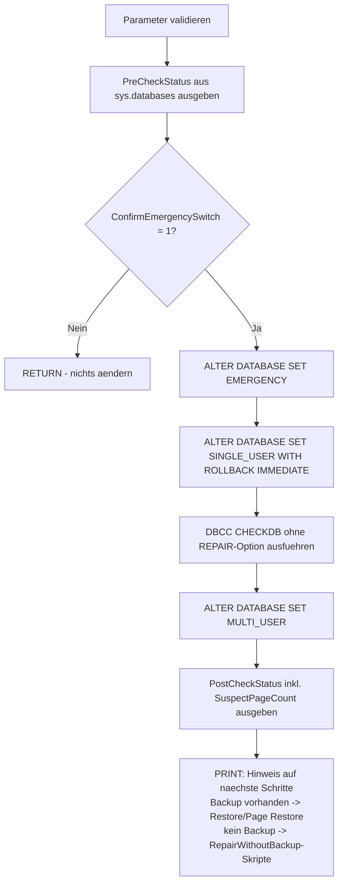

# SuspectOrRecoveryPendingDatabaseCheckDb.sql

Dieses Skript fuehrt einen **reinen, lesenden** `DBCC CHECKDB`-Check fuer eine `SUSPECT`- oder `RECOVERY_PENDING`-Datenbank aus, **ohne zu reparieren**. [CheckDbAllDatabases.sql](CheckDbAllDatabases.sql) ueberspringt solche Datenbanken bewusst, da `DBCC CHECKDB` dort normalerweise mit einem Zugriffsfehler scheitert (bei `SUSPECT` sogar mit `Msg 926 "Database ... cannot be opened. It has been marked SUSPECT"`). Dieses Skript versetzt die Datenbank dafuer voruebergehend nach `EMERGENCY` + `SINGLE_USER` (das macht sie ueberhaupt erst lesbar), fuehrt `DBCC CHECKDB` **ohne jede REPAIR-Option** aus, gibt die Datenbank anschliessend wieder frei (`MULTI_USER`) und liefert damit den tatsaechlichen Schadensumfang, bevor irgendeine Reparatur- oder Restore-Entscheidung getroffen wird.

## Uebersicht

<!-- SQLDOC:SUMMARY_TABLE:BEGIN -->
| Feld | Wert |
|---|---|
| Script | [SuspectOrRecoveryPendingDatabaseCheckDb.sql](SuspectOrRecoveryPendingDatabaseCheckDb.sql) |
| Version | `1.0` |
| Typ | `diagnostic` |
| Kapitel | `71_BackupRestore_Strategies` |
| Sicherheit | `destructive-limited` (aendert Datenbankeigenschaften voruebergehend, aber keine Daten/Reparatur) |
| Zweck | Fuehrt DBCC CHECKDB (ohne REPAIR) fuer eine SUSPECT/RECOVERY_PENDING-Datenbank aus, um den Schadensumfang zu ermitteln, ohne zu reparieren. |
<!-- SQLDOC:SUMMARY_TABLE:END -->

## Einordnung

Dieses Skript schliesst eine Luecke zwischen zwei bereits vorhandenen Skripten in diesem Kapitel:

- [CheckDbAllDatabases.sql](CheckDbAllDatabases.sql) — prueft alle Datenbanken der Instanz per `DBCC CHECKDB`, **ueberspringt aber standardmaessig** (`@SkipOfflineOrInaccessible = 1`) alle nicht-`ONLINE`-Datenbanken, also auch `SUSPECT`/`RECOVERY_PENDING` — dort wuerde `DBCC CHECKDB` ohnehin mit einem Zugriffsfehler abbrechen.
- [SuspectDatabaseRepairWithoutBackup.sql](SuspectDatabaseRepairWithoutBackup.sql) und [RecoveryPendingRepairWithoutBackup.sql](RecoveryPendingRepairWithoutBackup.sql) — fuehren ebenfalls einen lesenden `DBCC CHECKDB`-Check nach `EMERGENCY`/`SINGLE_USER` aus, aber **nur als Zwischenschritt** innerhalb des destruktiven Ablaufs: Der Check laeuft dort erst, wenn `@ConfirmDataLoss = 1` bereits gesetzt ist, direkt gefolgt von `DBCC CHECKDB ... REPAIR_ALLOW_DATA_LOSS`. Wer den Schaden erst **sehen** moechte, ohne sich schon auf die Reparatur mit Datenverlust festzulegen, hat mit jenen Skripten keine Moeglichkeit dazu.

Dieses Skript hier fuellt genau diese Luecke: Es macht **ausschliesslich** den Diagnose-Check (`EMERGENCY` + `SINGLE_USER` → `DBCC CHECKDB` ohne REPAIR-Option → `MULTI_USER`) und trifft keine Reparaturentscheidung. Siehe auch [SuspectOrRecoveryPendingDatabase_RepairOptions.md](../SuspectOrRecoveryPendingDatabase_RepairOptions.md) fuer den Gesamtzusammenhang aller Optionen bei `SUSPECT`/`RECOVERY_PENDING`.

## Annahmen

- Die Datenbank ist `SUSPECT` oder `RECOVERY_PENDING` (oder in einem vergleichbar unlesbaren Zustand) und muss erst durch `SET EMERGENCY` wieder ansprechbar gemacht werden, bevor `DBCC CHECKDB` ueberhaupt laufen kann.
- `SET SINGLE_USER WITH ROLLBACK IMMEDIATE` ist erforderlich, damit `DBCC CHECKDB` exklusiv auf die Datenbank zugreifen kann; waehrend des Checks kann sich kein anderer Benutzer verbinden.
- Das Skript fuehrt **keine** `REPAIR_ALLOW_DATA_LOSS`-Option aus und aendert daher keine Daten — es liest nur.
- Nach dem Check wird die Datenbank wieder auf `MULTI_USER` gesetzt; sie verbleibt aber im Status, den `DBCC CHECKDB` vorfindet (i.d.R. weiterhin `EMERGENCY`, da der Check selbst keine Recovery durchfuehrt).

## Anwendungsfall

Eine Datenbank ist `SUSPECT` oder `RECOVERY_PENDING`, [SuspectOrRecoveryPendingDatabaseRootCauseCheck.sql](SuspectOrRecoveryPendingDatabaseRootCauseCheck.sql) deutet auf Seitenkorruption hin (Eintraege in `msdb.dbo.suspect_pages`), und bevor entschieden wird, ob ein vollstaendiger Restore, ein Page Restore oder als letzte Notloesung `REPAIR_ALLOW_DATA_LOSS` noetig ist, soll der **tatsaechliche** `DBCC CHECKDB`-Befund vorliegen — ohne dabei schon Daten zu verlieren.

## Parameter

<!-- SQLDOC:PARAMETERS_TABLE:BEGIN -->
| Parameter | SQL-Typ | Pflicht | Beschreibung |
|---|---|---|---|
| `@TargetDatabaseName` | `SYSNAME` | Ja | Name der SUSPECT- oder RECOVERY_PENDING-Datenbank, die geprueft werden soll, z.B. `'BI_DQ'`. |
| `@ConfirmEmergencySwitch` | `BIT` | Ja | Muss explizit auf `1` gesetzt werden, damit das Skript die Datenbank nach `EMERGENCY` + `SINGLE_USER` versetzt und `DBCC CHECKDB` ausfuehrt. Bei `0` (Default) wird nur der aktuelle Status angezeigt und nichts geaendert. |
<!-- SQLDOC:PARAMETERS_TABLE:END -->

## Abhaengigkeiten

<!-- SQLDOC:DEPENDENCIES_LIST:BEGIN -->
- `sys.databases`
- `msdb.dbo.suspect_pages`
- `DBCC CHECKDB`
- `ALTER DATABASE`
<!-- SQLDOC:DEPENDENCIES_LIST:END -->

## Hinweise

- `PreCheckStatus` zeigt den aktuellen Status der Datenbank aus `sys.databases`, bevor irgendetwas geaendert wird.
- Bei `@ConfirmEmergencySwitch = 0` bricht das Skript nach der Statusanzeige per `RETURN` ab, da eine `SUSPECT`-Datenbank vor `ALTER DATABASE SET EMERGENCY` generell keinen Zugriff erlaubt (auch lesendes `DBCC CHECKDB` wuerde sonst mit `Msg 926` fehlschlagen) — es passiert nichts weiter.
- Bei `@ConfirmEmergencySwitch = 1`: `ALTER DATABASE SET EMERGENCY`, danach `ALTER DATABASE SET SINGLE_USER WITH ROLLBACK IMMEDIATE`, dann `DBCC CHECKDB (@TargetDatabaseName) WITH NO_INFOMSGS, ALL_ERRORMSGS` **ohne jede REPAIR-Option**, abschliessend `ALTER DATABASE SET MULTI_USER`.
- `CheckDbResult` ist die eigentliche `DBCC CHECKDB`-Ausgabe und zeigt den tatsaechlichen Schadensumfang (z.B. Konsistenzfehler, betroffene Objekte/Seiten).
- `PostCheckStatus` zeigt den Status nach dem Check inkl. der Anzahl Eintraege in `msdb.dbo.suspect_pages`.
- **EMERGENCY + SINGLE_USER sind dennoch spuerbare Eingriffe**, auch wenn keine Daten geaendert werden: Waehrend des Checks kann sich kein anderer Benutzer verbinden, und bei sehr grossen Datenbanken kann `DBCC CHECKDB` entsprechend lange dauern.
- Fuer die vorgelagerte Ursachenanalyse (fehlende Datei, voller Datentraeger, Errorlog) [SuspectOrRecoveryPendingDatabaseRootCauseCheck.sql](SuspectOrRecoveryPendingDatabaseRootCauseCheck.sql) verwenden. Dieses Skript hier ist der gezielte naechste Schritt, wenn eine Seitenkorruption vermutet wird und der `DBCC CHECKDB`-Befund vor einer Reparaturentscheidung gebraucht wird.
- Zeigt `CheckDbResult` Fehler, aber es existiert noch ein brauchbares Backup, ist ein vollstaendiger Restore oder ein Page Restore (`RESTORE DATABASE ... PAGE = ...`) der Reparatur mit Datenverlust vorzuziehen — siehe [SuspectOrRecoveryPendingDatabase_RepairOptions.md](../SuspectOrRecoveryPendingDatabase_RepairOptions.md).
- Erst wenn **kein** brauchbares Backup existiert, kommen [SuspectDatabaseRepairWithoutBackup.sql](SuspectDatabaseRepairWithoutBackup.sql) bzw. [RecoveryPendingRepairWithoutBackup.sql](RecoveryPendingRepairWithoutBackup.sql) (`DBCC CHECKDB ... REPAIR_ALLOW_DATA_LOSS`, echter Datenverlust) infrage.

## Versionshistorie

<!-- SQLDOC:VERSION_HISTORY_TABLE:BEGIN -->
| Version | Datum | User | Beschreibung |
|---|---|---|---|
| `1.0` | `2026-08-17` | `ER` | Erstversion: eigenstaendiges Diagnose-Skript fuer DBCC CHECKDB auf einer SUSPECT/RECOVERY_PENDING-Datenbank, das ausschliesslich den Schaden ermittelt (EMERGENCY + SINGLE_USER, DBCC CHECKDB ohne REPAIR-Option, danach MULTI_USER) und keine Reparatur durchfuehrt - Luecke zwischen CheckDbAllDatabases.sql (ueberspringt nicht-ONLINE Datenbanken) und SuspectDatabaseRepairWithoutBackup.sql/RecoveryPendingRepairWithoutBackup.sql (koppeln den lesenden Check an @ConfirmDataLoss = 1 und damit an die Reparaturbereitschaft). |
<!-- SQLDOC:VERSION_HISTORY_TABLE:END -->

## Ablauf

<!-- SQLDOC:MERMAID:BEGIN -->

<!-- SQLDOC:MERMAID:END -->

## SQL-Code

<!-- SQLDOC:SQL_CODE:BEGIN -->
```sql
/*
BEGIN:SQL-HEADER v1
---
sql_header: v1
script_name: "SuspectOrRecoveryPendingDatabaseCheckDb.sql"
script_version: "1.0"
script_type: "diagnostic"
chapter: "71_BackupRestore_Strategies"
purpose: >
  Fuehrt einen reinen, lesenden DBCC CHECKDB-Check fuer eine SUSPECT- oder
  RECOVERY_PENDING-Datenbank aus, OHNE zu reparieren. CheckDbAllDatabases.sql
  ueberspringt solche Datenbanken bewusst (DBCC CHECKDB scheitert dort
  normalerweise mit einem Zugriffsfehler, bei SUSPECT sogar mit Msg 926
  "Database ... cannot be opened. It has been marked SUSPECT"). Dieses
  Skript versetzt die Datenbank dafuer temporaer in EMERGENCY + SINGLE_USER
  (das macht sie ueberhaupt erst lesbar), fuehrt DBCC CHECKDB WITH
  NO_INFOMSGS, ALL_ERRORMSGS (ohne jede REPAIR-Option) aus, gibt die
  Datenbank anschliessend wieder fuer alle Benutzer frei (MULTI_USER) und
  liefert damit den tatsaechlichen Schadensumfang, bevor irgendeine
  Reparatur- oder Restore-Entscheidung getroffen wird.

parameters:
  - name: "@TargetDatabaseName"
    sql_type: "SYSNAME"
    direction: "IN"
    required: true
    description: "Name der SUSPECT- oder RECOVERY_PENDING-Datenbank, die geprueft werden soll, z.B. 'BI_DQ'"
  - name: "@ConfirmEmergencySwitch"
    sql_type: "BIT"
    direction: "IN"
    required: true
    description: "Muss explizit auf 1 gesetzt werden, damit das Skript die Datenbank nach EMERGENCY + SINGLE_USER versetzt und DBCC CHECKDB ausfuehrt; bei 0 (Default) wird nur der aktuelle Status angezeigt und nichts geaendert"

result_sets:
  - name: "PreCheckStatus"
    description: "Status der Zieldatenbank aus sys.databases vor jeder Aenderung"
  - name: "CheckDbResult"
    description: "DBCC CHECKDB (rein lesend, ohne REPAIR-Option) Ausgabe nach dem Wechsel nach EMERGENCY + SINGLE_USER (nur wenn @ConfirmEmergencySwitch = 1)"
  - name: "PostCheckStatus"
    description: "Status der Zieldatenbank nach dem Check inkl. Anzahl Eintraege in msdb.dbo.suspect_pages (nur wenn @ConfirmEmergencySwitch = 1)"

dependencies:
  - "sys.databases"
  - "msdb.dbo.suspect_pages"
  - "DBCC CHECKDB"
  - "ALTER DATABASE"

safety:
  level: "destructive-limited"
  writes_data: false

documentation:
  markdown_file: "T-SQL/71_BackupRestore_Strategies/SQLScripts/SuspectOrRecoveryPendingDatabaseCheckDb.md"
  sync_blocks:
    - "SUMMARY_TABLE"
    - "PARAMETERS_TABLE"
    - "DEPENDENCIES_LIST"
    - "VERSION_HISTORY_TABLE"
    - "SQL_CODE"
  mermaid:
    mode: "ai-agent-from-sql"
    source: "script-body"

main_responsible:
  name: "Erhard Rainer"
  initials: "ER"

version_history:
  - version: "1.0"
    date: "2026-08-17"
    user: "ER"
    description: "Erstversion: eigenstaendiges Diagnose-Skript fuer DBCC CHECKDB auf einer SUSPECT/RECOVERY_PENDING-Datenbank, das ausschliesslich den Schaden ermittelt (EMERGENCY + SINGLE_USER, DBCC CHECKDB ohne REPAIR-Option, danach MULTI_USER) und keine Reparatur durchfuehrt - Luecke zwischen CheckDbAllDatabases.sql (ueberspringt nicht-ONLINE Datenbanken) und SuspectDatabaseRepairWithoutBackup.sql/RecoveryPendingRepairWithoutBackup.sql (koppeln den lesenden Check an @ConfirmDataLoss = 1 und damit an die Reparaturbereitschaft)."

notes:
  - "Dieses Skript aendert die Datenbankeigenschaften voruebergehend (EMERGENCY, SINGLE_USER), fuehrt aber KEIN DBCC CHECKDB REPAIR_ALLOW_DATA_LOSS aus und entfernt keine Seiten/Zeilen - es ist ein reiner Diagnose-Schritt, keine Reparatur."
  - "EMERGENCY + SINGLE_USER sind dennoch spuerbare Eingriffe: Waehrend des Checks kann sich kein anderer Benutzer verbinden, und die Datenbank ist fuer die Dauer der Pruefung im EMERGENCY-Modus (schreibgeschuetzt, keine Log-basierte Wiederherstellungsgarantie). Bei sehr grossen Datenbanken kann DBCC CHECKDB entsprechend lange dauern."
  - "Solange @ConfirmEmergencySwitch = 0 ist, aendert das Skript nichts an der Datenbank und zeigt nur den Status aus sys.databases (kein DBCC CHECKDB, da dies bei SUSPECT ohne vorherigen EMERGENCY-Wechsel mit Msg 926 fehlschlaegt)."
  - "Nach Abschluss wird die Datenbank wieder auf MULTI_USER gesetzt, verbleibt aber im Status, den DBCC CHECKDB vorfindet (i.d.R. weiterhin EMERGENCY, da der Check selbst keine Recovery durchfuehrt) - PostCheckStatus zeigt den tatsaechlichen Zustand nach dem Lauf."
  - "Fuer die eigentliche Ursachenanalyse VOR diesem Skript (fehlende Datei, voller Datentraeger, Errorlog) SuspectOrRecoveryPendingDatabaseRootCauseCheck.sql verwenden; dieses Skript ist der gezielte naechste Schritt, wenn eine Seitenkorruption vermutet wird und der tatsaechliche CHECKDB-Befund vor einer Reparaturentscheidung gebraucht wird."
  - "Zeigt CheckDbResult Fehler, aber es existiert noch ein brauchbares Backup, ist ein vollstaendiger Restore oder ein Page Restore (RESTORE DATABASE ... PAGE = ...) der Reparatur mit Datenverlust vorzuziehen - siehe SuspectOrRecoveryPendingDatabase_RepairOptions.md."
  - "Erst wenn KEIN brauchbares Backup existiert, kommen SuspectDatabaseRepairWithoutBackup.sql bzw. RecoveryPendingRepairWithoutBackup.sql (DBCC CHECKDB ... REPAIR_ALLOW_DATA_LOSS, echter Datenverlust) infrage."
---
END:SQL-HEADER v1
*/

SET NOCOUNT ON;

-- 1. Parameter vorbereiten
DECLARE @TargetDatabaseName SYSNAME = N'BI_DQ';
DECLARE @ConfirmEmergencySwitch BIT = 0;

IF @TargetDatabaseName IS NULL OR LTRIM(RTRIM(@TargetDatabaseName)) = N''
BEGIN
    THROW 50000, '@TargetDatabaseName darf nicht leer sein.', 1;
END;

IF NOT EXISTS (SELECT 1 FROM sys.databases WHERE name = @TargetDatabaseName)
BEGIN
    THROW 50001, 'Die angegebene Datenbank wurde nicht in sys.databases gefunden.', 1;
END;

IF @ConfirmEmergencySwitch IS NULL OR @ConfirmEmergencySwitch NOT IN (0, 1)
BEGIN
    THROW 50002, '@ConfirmEmergencySwitch muss 0 oder 1 sein.', 1;
END;

-- 2. Vorab-Status anzeigen (rein lesend; bei SUSPECT ist ausser sys.databases meist nichts abfragbar)
SELECT
    d.name                    AS DatabaseName,
    d.database_id             AS DatabaseId,
    d.state_desc              AS StateDesc,
    d.recovery_model_desc     AS RecoveryModel,
    d.user_access_desc        AS UserAccessDesc,
    @ConfirmEmergencySwitch   AS ConfirmEmergencySwitchFlag
FROM sys.databases AS d
WHERE d.name = @TargetDatabaseName;

-- 3. Ohne Bestaetigung bewusst keinen Zugriffsversuch: Eine SUSPECT-Datenbank verweigert
--    JEDEN Zugriff (auch lesendes DBCC CHECKDB) vor ALTER DATABASE SET EMERGENCY (Msg 926).
IF @ConfirmEmergencySwitch <> 1
BEGIN
    PRINT N'@ConfirmEmergencySwitch = 0: Es wurde nichts an der Datenbank geaendert. Eine SUSPECT-Datenbank kann vor ALTER DATABASE SET EMERGENCY nicht sinnvoll gelesen werden (auch DBCC CHECKDB schlaegt sonst mit Msg 926 fehl). Zum Ausfuehren des reinen Diagnose-Checks @ConfirmEmergencySwitch auf 1 setzen.';
    RETURN;
END;

DECLARE @Sql NVARCHAR(MAX);

PRINT N'ACHTUNG: @ConfirmEmergencySwitch = 1 - versetze ' + QUOTENAME(@TargetDatabaseName) + N' voruebergehend nach EMERGENCY + SINGLE_USER, um einen rein lesenden DBCC CHECKDB-Check auszufuehren (keine Reparatur).';

-- 4a. Datenbank in EMERGENCY und SINGLE_USER versetzen (erst danach ist die DB ueberhaupt lesbar)
SET @Sql = N'ALTER DATABASE ' + QUOTENAME(@TargetDatabaseName) + N' SET EMERGENCY;';
EXEC sp_executesql @Sql;

SET @Sql = N'ALTER DATABASE ' + QUOTENAME(@TargetDatabaseName) + N' SET SINGLE_USER WITH ROLLBACK IMMEDIATE;';
EXEC sp_executesql @Sql;

-- 4b. Rein lesender DBCC CHECKDB-Check OHNE jede REPAIR-Option, um den Schadensumfang zu ermitteln
DBCC CHECKDB (@TargetDatabaseName) WITH NO_INFOMSGS, ALL_ERRORMSGS;

-- 4c. Datenbank wieder fuer alle Benutzer freigeben (Reparatur erfolgte bewusst nicht)
SET @Sql = N'ALTER DATABASE ' + QUOTENAME(@TargetDatabaseName) + N' SET MULTI_USER;';
EXEC sp_executesql @Sql;

-- 5. Ergebnis nach dem Check pruefen
SELECT
    d.name                AS DatabaseName,
    d.database_id         AS DatabaseId,
    d.state_desc          AS StateDesc,
    d.recovery_model_desc AS RecoveryModel,
    d.user_access_desc    AS UserAccessDesc,
    (SELECT COUNT(*) FROM msdb.dbo.suspect_pages AS sp WHERE sp.database_id = d.database_id) AS SuspectPageCount
FROM sys.databases AS d
WHERE d.name = @TargetDatabaseName;

PRINT N'--------------------------------------------------------------------------------';
PRINT N'Diagnose-Check fuer ' + QUOTENAME(@TargetDatabaseName) + N' abgeschlossen. Es wurde NICHT repariert.';
PRINT N'Zeigt CheckDbResult Fehler und existiert ein brauchbares Backup: vollstaendiger Restore';
PRINT N'oder Page Restore statt Reparatur mit Datenverlust - siehe SuspectOrRecoveryPendingDatabase_RepairOptions.md.';
PRINT N'Ohne brauchbares Backup: SuspectDatabaseRepairWithoutBackup.sql bzw. RecoveryPendingRepairWithoutBackup.sql';
PRINT N'als naechster (destruktiver) Schritt.';
PRINT N'--------------------------------------------------------------------------------';
```
<!-- SQLDOC:SQL_CODE:END -->
