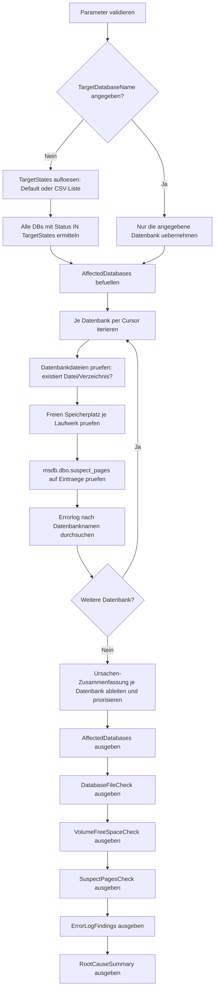

# SuspectOrRecoveryPendingDatabaseRootCauseCheck.sql

Dieses Skript unterstuetzt die Ursachenanalyse, wenn eine oder mehrere Datenbanken einen kritischen Status zeigen. **Ohne Angabe eines Datenbanknamens findet das Skript selbststaendig alle Datenbanken, deren Status in `@TargetStates` enthalten ist** (Default: `SUSPECT`, `RECOVERY_PENDING`, `EMERGENCY` — wahlweise z.B. nur `SUSPECT` oder nur `RECOVERY_PENDING`), so wie [DatabaseStatusOverview.sql](DatabaseStatusOverview.sql), und durchlaeuft fuer jede davon dieselbe Diagnose: Dateizugriff, freier Speicherplatz, bekannte Seitenkorruption und passende Errorlog-Eintraege. Am Ende steht je Datenbank eine verdichtete Ursachen-Einschaetzung mit konkretem naechsten Schritt.

## Uebersicht

<!-- SQLDOC:SUMMARY_TABLE:BEGIN -->
| Feld | Wert |
|---|---|
| Script | [SuspectOrRecoveryPendingDatabaseRootCauseCheck.sql](SuspectOrRecoveryPendingDatabaseRootCauseCheck.sql) |
| Version | `2.6` |
| Typ | `diagnostic` |
| Kapitel | `71_BackupRestore_Strategies` |
| Sicherheit | `read-only` |
| Zweck | Findet automatisch alle Datenbanken mit Status gemaess @TargetStates (Default SUSPECT/RECOVERY_PENDING/EMERGENCY) und ermittelt je Datenbank typische Ursachen. |
<!-- SQLDOC:SUMMARY_TABLE:END -->

## Einordnung

Siehe auch [SQL_Crash-Recovery_Startup.ipynb](../SQL_Crash-Recovery_Startup.ipynb) fuer den Hintergrund zu `RECOVERING`, `RECOVERY_PENDING` und `SUSPECT`, sowie [DatabaseStatusOverview.sql](DatabaseStatusOverview.sql) fuer eine reine Statusuebersicht aller Datenbanken. Dieses Skript kombiniert die Erkennung betroffener Datenbanken mit der eigentlichen Ursachenanalyse: Es muss kein Datenbankname mehr uebergeben werden, das Skript weiss selbst, welche Datenbanken kritisch sind.

`RECOVERY_PENDING` bedeutet laut Microsoft-Dokumentation, dass SQL Server weiss, dass eine Recovery noetig ist, sie aber aus einem erkannten Grund nicht startet (z.B. eine Datei fehlt oder der Datentraeger ist voll). `SUSPECT` bedeutet dagegen, dass eine Recovery versucht wurde und dabei fehlgeschlagen ist (z.B. wegen Seitenkorruption oder eines I/O-Fehlers waehrend Redo/Undo). `EMERGENCY` zeigt eine Datenbank, die manuell in den Reparaturmodus versetzt wurde. Alle drei Ursachengruppen werden von diesem Skript automatisch adressiert.

**Praxisbeispiel:** In einem realen Fall zeigte das Errorlog fuer eine `SUSPECT`-Datenbank den Eintrag *"SQL Server detected a logical consistency-based I/O error: incorrect pageid ... This is a severe error condition that threatens database integrity"*, gefolgt von *"An error occurred during recovery, preventing the database ... from restarting"*. `SuspectPagesCheck` zeigte dazu passend einen Eintrag in `msdb.dbo.suspect_pages`. Das ist ein klassischer **823-Fehler**: echte Seitenkorruption auf Storage-Ebene, kein Zugriffs- oder Platzproblem. Die Empfehlung lautet in diesem Fall `DBCC CHECKDB` sowie Page Restore bzw. Restore aus einem sauberen Backup.

## Annahmen

- Es handelt sich um eine didaktische Diagnose-Version; sie repariert nichts, sondern zeigt nur Befunde und Handlungsempfehlungen.
- Ohne `@TargetDatabaseName` werden ausschliesslich Datenbanken mit `state_desc IN (@TargetStates)` untersucht (Default `SUSPECT,RECOVERY_PENDING,EMERGENCY`); sind keine betroffen, liefern alle Ergebnismengen leere Resultate (kein Fehler).
- Mit explizitem `@TargetDatabaseName` wird genau diese eine Datenbank untersucht, unabhaengig von ihrem aktuellen Status; `@TargetStates` wird in diesem Fall ignoriert.
- `@TargetStates` akzeptiert eine kommagetrennte Liste (z.B. `'SUSPECT'` oder `'SUSPECT,RECOVERY_PENDING'`); unbekannte Werte fuehren zu einem Fehler (THROW 50003).
- `sys.dm_os_file_exists` und `sp_readerrorlog` erfordern ausreichende Serverrechte (i.d.R. `sysadmin` oder `securityadmin`/`serveradmin` mit VIEW SERVER STATE).
- `sys.dm_os_volume_stats` liefert nur Daten fuer Dateien, die die Instanz **aktuell geoeffnet** hat. Bei einer `SUSPECT`/`RECOVERY_PENDING`-Datenbank ist das oft nicht der Fall, sodass `VolumeFreeSpaceCheck` je Datenbank leer bleiben kann, ohne dass dies ein Fehler ist — `RootCauseSummary` weist in diesem Fall explizit darauf hin und empfiehlt eine manuelle Pruefung des Laufwerks.
- Die Ursachen-Zusammenfassung ist eine Heuristik auf Basis der haeufigsten Faelle (fehlende Datei, voller Datentraeger, Seitenkorruption); seltenere Ursachen (z.B. Berechtigungsprobleme des Dienstkontos) muessen ggf. manuell im Errorlog-Ergebnis nachgelesen werden.
- Bei vielen betroffenen Datenbanken kann `sp_readerrorlog` je Datenbank spuerbar Zeit kosten, da es sequenziell in einer Schleife aufgerufen wird.

## Anwendungsfall

Nach einem Neustart oder Vorfall sollen alle Datenbanken mit kritischem Status automatisch gefunden und je Datenbank sofort die passende Ursachenanalyse geliefert werden — ohne zuerst manuell `DatabaseStatusOverview.sql` auszufuehren und dann jeden betroffenen Namen einzeln zu uebergeben. Ueber `@TargetStates` laesst sich gezielt steuern, ob nur `SUSPECT`, nur `RECOVERY_PENDING`, eine andere Kombination oder das Standard-Set untersucht werden soll. Optional laesst sich das Skript auch gezielt auf eine einzelne, bereits bekannte Datenbank einschraenken.

## Parameter

<!-- SQLDOC:PARAMETERS_TABLE:BEGIN -->
| Parameter | SQL-Typ | Pflicht | Beschreibung |
|---|---|---|---|
| `@TargetDatabaseName` | `SYSNAME` | Nein | Name einer einzelnen zu untersuchenden Datenbank. `NULL` (Default) untersucht automatisch alle Datenbanken mit Status gemaess `@TargetStates`. |
| `@TargetStates` | `NVARCHAR(400)` | Nein | Kommagetrennte Liste der zu beruecksichtigenden `state_desc`-Werte (z.B. `'SUSPECT'` oder `'SUSPECT,RECOVERY_PENDING'`); wird nur beachtet, wenn `@TargetDatabaseName` `NULL` ist. `NULL`/leer (Default) = `'SUSPECT,RECOVERY_PENDING,EMERGENCY'`. |
| `@ErrorLogEntriesToScan` | `INT` | Nein | Anzahl der juengsten passenden Errorlog-Eintraege je Datenbank, die ausgegeben werden (Default `200`). |
<!-- SQLDOC:PARAMETERS_TABLE:END -->

## Abhaengigkeiten

<!-- SQLDOC:DEPENDENCIES_LIST:BEGIN -->
- `sys.databases`
- `sys.master_files`
- `sys.dm_os_file_exists`
- `sys.dm_os_volume_stats`
- `msdb.dbo.suspect_pages`
- `sp_readerrorlog`
- `DATABASEPROPERTYEX`
<!-- SQLDOC:DEPENDENCIES_LIST:END -->

## Hinweise

- `AffectedDatabases` zeigt alle im Lauf untersuchten Datenbanken inkl. `state_desc` und den `DATABASEPROPERTYEX`-Flags `IsSuspect`, `IsInRecovery` und `IsEmergencyMode`.
- `DatabaseFileCheck` prueft je Datenbank und Datenbankdatei per `sys.dm_os_file_exists`, ob Datei und uebergeordnetes Verzeichnis vorhanden sind — die haeufigste Ursache fuer `RECOVERY_PENDING` ist eine fehlende oder verschobene Log- bzw. Datendatei.
- `VolumeFreeSpaceCheck` deckt die zweithaeufigste Ursache ab: ein voller Datentraeger, auf dem Log- oder Datendateien nicht mehr wachsen koennen. Bleibt diese Ausgabe fuer eine Datenbank leer, obwohl die Datei laut `DatabaseFileCheck` existiert, ist die Datei aktuell vermutlich nicht geoeffnet — `RootCauseSummary` (Check 4) macht darauf aufmerksam und liefert direkt den passenden PowerShell-Befehl (`Get-Volume -DriveLetter 'X'`) sowie den passenden CMD-Befehl (`fsutil volume diskfree X:`) mit dem tatsaechlichen Laufwerksbuchstaben der betroffenen Datei zur manuellen Pruefung.
- `SuspectPagesCheck` zeigt Eintraege aus `msdb.dbo.suspect_pages` je Datenbank — ein Hinweis auf tatsaechliche Seitenkorruption statt eines reinen Zugriffsproblems (siehe Praxisbeispiel oben). Der zugehoerige `NextStep` in `RootCauseSummary` (Check 3) listet die drei konkreten Optionen explizit auf: (1) vollstaendiger Restore der kompletten Datenbank aus der Full-/Diff-/Log-Backup-Kette (sicherste Option, laengste Downtime), (2) Page Restore nur der betroffenen Seiten aus Backup (`RESTORE DATABASE ... PAGE = ...`, setzt Full-Backup + luecklose Log-Kette im `FULL`/`BULK_LOGGED` Recovery Model voraus), (3) ohne brauchbares Backup als letzte Notloesung `DBCC CHECKDB ... WITH REPAIR_ALLOW_DATA_LOSS` — das ist echter, unwiderruflicher Datenverlust und keine Wiederherstellung. Eine ausfuehrliche Anleitung mit vollstaendigen T-SQL-Befehlen fuer alle drei Optionen (am Beispiel einer Datenbank `BI_DQ`) findet sich in [SuspectOrRecoveryPendingDatabase_RepairOptions.md](../SuspectOrRecoveryPendingDatabase_RepairOptions.md).
- `ErrorLogFindings` durchsucht das aktuelle Errorlog je Datenbank nach deren Namen; hier stehen oft die praezisesten Fehlermeldungen (z.B. konkrete Betriebssystem- oder I/O-Fehlercodes wie 823/824).
- `RootCauseSummary` verdichtet die vorherigen Ergebnisse je Datenbank in eine priorisierte Liste mit Schweregrad und empfohlenem naechsten Schritt.
- Das Skript fuehrt bewusst **keine** Reparatur durch (kein `ALTER DATABASE ... SET EMERGENCY`, kein `DBCC CHECKDB ... REPAIR_ALLOW_DATA_LOSS`) — das bleibt eine bewusste, manuelle Entscheidung des DBA.
- Intern durchlaeuft das Skript die betroffenen Datenbanken per `CURSOR`/`WHILE`-Schleife, da `sp_readerrorlog` und die Dateipruefungen je Datenbank ausgefuehrt werden muessen.
- Das Skript enthaelt bewusst ein `GO` zwischen Vorbereitungsblock und Cursor-Block. Ohne dieses `GO` versucht SQL Server, den kompletten Batch inkl. Cursor/`WHILE`-Schleife auf einmal zu kompilieren, was bei den verwendeten Table-Valued Functions (`sys.dm_os_file_exists`, `sys.dm_os_volume_stats`) zu `Invalid column name`-Fehlern durch verfruehte Deferred-Name-Resolution fuehren kann. Da lokale Variablen einen `GO`-Batch nicht ueberleben, wird `@ErrorLogEntriesToScan` vor dem `GO` in einer kleinen Tabelle `#ScriptParams` gesichert; `#temp`-Tabellen selbst bleiben ueber `GO`-Grenzen hinweg innerhalb derselben Session gueltig.
- Der Vergleich `sys.databases.state_desc IN (#TargetStates)` verwendet `COLLATE DATABASE_DEFAULT` auf beiden Seiten. `#temp`-Tabellen erben die Collation von `tempdb`, die von der Server-/Datenbank-Collation abweichen kann — ohne den expliziten `COLLATE`-Hinweis fuehrt das zu `Msg 468: Cannot resolve the collation conflict`.
- `@TargetStates` wird per XML-Trick (`CAST ... AS XML` / `.nodes('/r')`) statt `STRING_SPLIT` zerlegt, da `STRING_SPLIT` ein Compatibility Level von 130+ (SQL Server 2016+) voraussetzt und auf aelteren Instanzen bzw. Datenbanken mit niedrigerem Compatibility Level mit `Msg 208: Invalid object name 'STRING_SPLIT'` fehlschlaegt — dieser Fehler tritt bereits im Vorbereitungsblock auf und verhindert dadurch auch die spaetere Erstellung von `#AffectedDatabases` (Folgefehler `Invalid object name '#AffectedDatabases'`). Die XML-Variante funktioniert unabhaengig vom Compatibility Level.

## Versionshistorie

<!-- SQLDOC:VERSION_HISTORY_TABLE:BEGIN -->
| Version | Datum | User | Beschreibung |
|---|---|---|---|
| `1.0` | `2026-08-13` | `ER` | Erstversion der Root-Cause-Analyse fuer SUSPECT/RECOVERY_PENDING Datenbanken (ein Datenbankname als Pflichtparameter) |
| `1.1` | `2026-08-13` | `ER` | Zusaetzlicher RootCauseSummary-Hinweis, wenn sys.dm_os_volume_stats keine Zeile liefert (Datei aktuell nicht geoeffnet) |
| `2.0` | `2026-08-13` | `ER` | @TargetDatabaseName ist jetzt optional; ohne Angabe ermittelt das Skript automatisch alle Datenbanken mit Status SUSPECT, RECOVERY_PENDING oder EMERGENCY und durchlaeuft die Diagnose je Datenbank per WHILE-Schleife |
| `2.1` | `2026-08-13` | `ER` | GO nach dem Vorbereitungsblock ergaenzt, um 'Invalid column name' durch verfruehte Deferred-Name-Resolution im grossen Batch zu vermeiden; Parameter werden dafuer ueber eine #ScriptParams-Tabelle batch-uebergreifend gehalten |
| `2.2` | `2026-08-13` | `ER` | Neuer Parameter @TargetStates erlaubt die gezielte Auswahl der zu beruecksichtigenden state_desc-Werte (z.B. nur SUSPECT oder nur RECOVERY_PENDING) statt der fest verdrahteten Kombination aus SUSPECT/RECOVERY_PENDING/EMERGENCY |
| `2.3` | `2026-08-13` | `ER` | COLLATE DATABASE_DEFAULT beim Vergleich von sys.databases.state_desc gegen #TargetStates ergaenzt, um einen Collation-Konflikt (Msg 468) zwischen Server-/DB-Collation und der tempdb-Collation zu vermeiden |
| `2.4` | `2026-08-13` | `ER` | NextStep fuer den Volume-Freiraum-Hinweis (Check 4) enthaelt jetzt den konkreten PowerShell-Befehl (Get-Volume -DriveLetter) und den passenden CMD-Befehl (fsutil volume diskfree) mit dem tatsaechlichen Laufwerksbuchstaben der betroffenen Datei |
| `2.5` | `2026-08-13` | `ER` | NextStep fuer Seitenkorruption (Check 3) listet jetzt explizit die drei konkreten Optionen auf: (1) vollstaendiger DB-Restore aus Backup-Kette, (2) Page Restore nur der betroffenen Seiten aus Backup, (3) DBCC CHECKDB WITH REPAIR_ALLOW_DATA_LOSS als letzte, datenverlustbehaftete Notloesung ohne Backup; NextStep-Spalte auf VARCHAR(600) vergroessert |
| `2.6` | `2026-08-17` | `ER` | STRING_SPLIT (erfordert SQL Server 2016+ bzw. Compatibility Level 130+) durch eine XML-basierte Split-Logik (CAST ... AS XML / nodes()) ersetzt, da STRING_SPLIT auf Instanzen/Datenbanken mit niedrigerem Compatibility Level mit Msg 208 'Invalid object name STRING_SPLIT' fehlschlaegt und dadurch den gesamten Batch samt #AffectedDatabases-Erstellung verhindert |
<!-- SQLDOC:VERSION_HISTORY_TABLE:END -->

## Ablauf

<!-- SQLDOC:MERMAID:BEGIN -->

<!-- SQLDOC:MERMAID:END -->

## SQL-Code

<!-- SQLDOC:SQL_CODE:BEGIN -->
```sql
/*
BEGIN:SQL-HEADER v1
---
sql_header: v1
script_name: "SuspectOrRecoveryPendingDatabaseRootCauseCheck.sql"
script_version: "2.6"
script_type: "diagnostic"
chapter: "71_BackupRestore_Strategies"
purpose: >
  Unterstuetzt die Ursachenanalyse, wenn eine oder mehrere Datenbanken einen
  kritischen Status zeigen. Ohne Angabe eines Datenbanknamens ermittelt das
  Skript selbststaendig alle Datenbanken, deren state_desc in @TargetStates
  enthalten ist (Default: SUSPECT, RECOVERY_PENDING, EMERGENCY; wahlweise
  z.B. nur SUSPECT oder nur RECOVERY_PENDING), und durchlaeuft fuer jede
  davon Dateizugriff/-existenz, freien Speicherplatz auf den zugehoerigen
  Laufwerken, bekannte Suspect Pages (moegliche Korruption) sowie die
  juengsten Errorlog-Eintraege, um typische Ursachen (fehlendes/beschaedigtes
  Log, voller Datentraeger, Seitenkorruption, Zugriffsproblem) sichtbar zu
  machen.

parameters:
  - name: "@TargetDatabaseName"
    sql_type: "SYSNAME"
    direction: "IN"
    required: false
    description: "Name einer einzelnen zu untersuchenden Datenbank; NULL (Default) untersucht automatisch alle Datenbanken mit Status gemaess @TargetStates"
  - name: "@TargetStates"
    sql_type: "NVARCHAR(400)"
    direction: "IN"
    required: false
    description: "Kommagetrennte Liste der zu beruecksichtigenden state_desc-Werte (z.B. 'SUSPECT,RECOVERY_PENDING'); wird nur beachtet, wenn @TargetDatabaseName NULL ist. NULL/leer (Default) = 'SUSPECT,RECOVERY_PENDING,EMERGENCY'"
  - name: "@ErrorLogEntriesToScan"
    sql_type: "INT"
    direction: "IN"
    required: false
    description: "Anzahl der juengsten Errorlog-Eintraege je Datenbank, die nach dem Datenbanknamen durchsucht werden (Default 200)"

result_sets:
  - name: "AffectedDatabases"
    description: "Alle Datenbanken, die in diesem Lauf untersucht wurden, mit Status, Recovery Model und Zugriffsmodus"
  - name: "DatabaseFileCheck"
    description: "Je untersuchter Datenbank und Datenbankdatei: Pfad, existiert die Datei (per sys.dm_os_file_exists), Dateityp und Groesse laut Metadaten"
  - name: "VolumeFreeSpaceCheck"
    description: "Freier Speicherplatz je Laufwerk, auf dem Datenbankdateien der untersuchten Datenbanken liegen (sys.dm_os_volume_stats)"
  - name: "SuspectPagesCheck"
    description: "Eintraege aus msdb.dbo.suspect_pages fuer die untersuchten Datenbanken als Hinweis auf Seitenkorruption"
  - name: "ErrorLogFindings"
    description: "Juengste Errorlog-Eintraege je Datenbank, die den Datenbanknamen erwaehnen (z.B. Recovery-, IO- oder Startup-Meldungen)"
  - name: "RootCauseSummary"
    description: "Verdichtete Einschaetzung moeglicher Ursachen je Datenbank basierend auf den vorherigen Pruefungen"

dependencies:
  - "sys.databases"
  - "sys.master_files"
  - "sys.dm_os_volume_stats"
  - "msdb.dbo.suspect_pages"
  - "sys.dm_os_file_exists"
  - "sp_readerrorlog"

safety:
  level: "read-only"
  writes_data: false

documentation:
  markdown_file: "T-SQL/71_BackupRestore_Strategies/SQLScripts/SuspectOrRecoveryPendingDatabaseRootCauseCheck.md"
  sync_blocks:
    - "SUMMARY_TABLE"
    - "PARAMETERS_TABLE"
    - "DEPENDENCIES_LIST"
    - "VERSION_HISTORY_TABLE"
    - "SQL_CODE"
  mermaid:
    mode: "ai-agent-from-sql"
    source: "script-body"

main_responsible:
  name: "Erhard Rainer"
  initials: "ER"

version_history:
  - version: "1.0"
    date: "2026-08-13"
    user: "ER"
    description: "Erstversion der Root-Cause-Analyse fuer SUSPECT/RECOVERY_PENDING Datenbanken (ein Datenbankname als Pflichtparameter)"
  - version: "1.1"
    date: "2026-08-13"
    user: "ER"
    description: "Zusaetzlicher RootCauseSummary-Hinweis, wenn sys.dm_os_volume_stats keine Zeile liefert (Datei aktuell nicht geoeffnet)"
  - version: "2.0"
    date: "2026-08-13"
    user: "ER"
    description: "@TargetDatabaseName ist jetzt optional; ohne Angabe ermittelt das Skript automatisch alle Datenbanken mit Status SUSPECT, RECOVERY_PENDING oder EMERGENCY und durchlaeuft die Diagnose je Datenbank per WHILE-Schleife"
  - version: "2.1"
    date: "2026-08-13"
    user: "ER"
    description: "GO nach dem Vorbereitungsblock ergaenzt, um 'Invalid column name' durch verfruehte Deferred-Name-Resolution im grossen Batch zu vermeiden; Parameter werden dafuer ueber eine #ScriptParams-Tabelle batch-uebergreifend gehalten"
  - version: "2.2"
    date: "2026-08-13"
    user: "ER"
    description: "Neuer Parameter @TargetStates erlaubt die gezielte Auswahl der zu beruecksichtigenden state_desc-Werte (z.B. nur SUSPECT oder nur RECOVERY_PENDING) statt der fest verdrahteten Kombination aus SUSPECT/RECOVERY_PENDING/EMERGENCY"
  - version: "2.3"
    date: "2026-08-13"
    user: "ER"
    description: "COLLATE DATABASE_DEFAULT beim Vergleich von sys.databases.state_desc gegen #TargetStates ergaenzt, um einen Collation-Konflikt (Msg 468) zwischen Server-/DB-Collation und der tempdb-Collation zu vermeiden"
  - version: "2.4"
    date: "2026-08-13"
    user: "ER"
    description: "NextStep fuer den Volume-Freiraum-Hinweis (Check 4) enthaelt jetzt den konkreten PowerShell-Befehl (Get-Volume -DriveLetter) und den passenden CMD-Befehl (fsutil volume diskfree) mit dem tatsaechlichen Laufwerksbuchstaben der betroffenen Datei"
  - version: "2.5"
    date: "2026-08-13"
    user: "ER"
    description: "NextStep fuer Seitenkorruption (Check 3) listet jetzt explizit die drei konkreten Optionen auf: (1) vollstaendiger DB-Restore aus Backup-Kette, (2) Page Restore nur der betroffenen Seiten aus Backup, (3) DBCC CHECKDB WITH REPAIR_ALLOW_DATA_LOSS als letzte, datenverlustbehaftete Notloesung ohne Backup; NextStep-Spalte auf VARCHAR(600) vergroessert"
  - version: "2.6"
    date: "2026-08-17"
    user: "ER"
    description: "STRING_SPLIT (erfordert SQL Server 2016+ bzw. Compatibility Level 130+) durch eine XML-basierte Split-Logik (CAST ... AS XML / nodes()) ersetzt, da STRING_SPLIT auf Instanzen/Datenbanken mit niedrigerem Compatibility Level mit Msg 208 'Invalid object name STRING_SPLIT' fehlschlaegt und dadurch den gesamten Batch samt #AffectedDatabases-Erstellung verhindert"

notes:
  - "Reines Leseskript; es fuehrt keine Reparatur (kein SET EMERGENCY, kein CHECKDB REPAIR) durch."
  - "sys.dm_os_file_exists und sp_readerrorlog erfordern sysadmin- bzw. ausreichende Serverrechte."
  - "sys.dm_os_volume_stats liefert nur Werte fuer Dateien, die SQL Server aktuell oeffnen kann; bei komplett fehlendem Volume oder einer nicht geoeffneten Datei (z.B. bei SUSPECT) kann die Abfrage leer bleiben - RootCauseSummary weist in diesem Fall explizit darauf hin."
  - "Der Auto-Discovery-Modus (@TargetDatabaseName IS NULL) durchlaeuft die betroffenen Datenbanken sequenziell per WHILE-Schleife, da sp_readerrorlog und die Dateipruefungen je Datenbank ausgefuehrt werden muessen."
  - "Das Skript enthaelt bewusst ein GO zwischen Vorbereitung und Cursor-Block; lokale Variablen (@TargetDatabaseName, @ErrorLogEntriesToScan) werden deshalb vor dem GO ausschliesslich gelesen bzw. in #ScriptParams gesichert, da sie nach GO nicht mehr existieren."
  - "Der Vergleich von sys.databases.state_desc gegen die Werte aus #TargetStates verwendet bewusst COLLATE DATABASE_DEFAULT auf beiden Seiten, da #temp-Tabellen die tempdb-Collation erben, die von der Server-/Datenbank-Collation abweichen kann (Msg 468 'Cannot resolve the collation conflict')."
  - "@TargetStates wird bewusst per XML-Trick (CAST ... AS XML / .nodes('/r')) statt STRING_SPLIT zerlegt, da STRING_SPLIT ein Compatibility Level von 130+ voraussetzt und auf aelteren Instanzen bzw. Datenbanken mit niedrigerem Level mit Msg 208 'Invalid object name STRING_SPLIT' fehlschlaegt; die XML-Variante funktioniert unabhaengig vom Compatibility Level."
---
END:SQL-HEADER v1
*/

SET NOCOUNT ON;

-- 1. Parameter vorbereiten
DECLARE @TargetDatabaseName SYSNAME = NULL;
DECLARE @TargetStates NVARCHAR(400) = NULL;
DECLARE @ErrorLogEntriesToScan INT = 200;

IF @TargetDatabaseName IS NOT NULL AND LTRIM(RTRIM(@TargetDatabaseName)) = N''
BEGIN
    THROW 50000, '@TargetDatabaseName darf, wenn angegeben, nicht leer sein.', 1;
END;

IF @ErrorLogEntriesToScan IS NULL OR @ErrorLogEntriesToScan <= 0
BEGIN
    THROW 50001, '@ErrorLogEntriesToScan muss ein positiver Wert sein.', 1;
END;

IF @TargetDatabaseName IS NOT NULL AND NOT EXISTS (SELECT 1 FROM sys.databases WHERE name = @TargetDatabaseName)
BEGIN
    THROW 50002, 'Die angegebene Datenbank wurde nicht in sys.databases gefunden.', 1;
END;

-- @TargetStates: NULL/leer bedeutet das Standard-Set; wird nur beachtet, wenn @TargetDatabaseName NULL ist.
IF @TargetDatabaseName IS NULL AND (@TargetStates IS NULL OR LTRIM(RTRIM(@TargetStates)) = N'')
BEGIN
    SET @TargetStates = N'SUSPECT,RECOVERY_PENDING,EMERGENCY';
END;

IF @TargetDatabaseName IS NULL AND EXISTS (
    SELECT 1
    FROM (
        SELECT UPPER(LTRIM(RTRIM(x.i.value(N'.', N'NVARCHAR(60)')))) AS StateDesc
        FROM (SELECT CAST(N'<r><![CDATA[' + REPLACE(@TargetStates, N',', N']]></r><r><![CDATA[') + N']]></r>' AS XML) AS x) AS xt
        CROSS APPLY xt.x.nodes(N'/r') AS x(i)
    ) AS s
    WHERE s.StateDesc NOT IN (N'SUSPECT', N'RECOVERY_PENDING', N'EMERGENCY', N'RESTORING', N'RECOVERING', N'OFFLINE', N'COPYING', N'ONLINE')
)
BEGIN
    THROW 50003, '@TargetStates enthaelt einen unbekannten state_desc-Wert. Gueltig sind z.B. SUSPECT, RECOVERY_PENDING, EMERGENCY, RESTORING, RECOVERING, OFFLINE, COPYING, ONLINE.', 1;
END;

DROP TABLE IF EXISTS #ScriptParams;
DROP TABLE IF EXISTS #TargetStates;
DROP TABLE IF EXISTS #AffectedDatabases;
DROP TABLE IF EXISTS #FileCheck;
DROP TABLE IF EXISTS #VolumeCheck;
DROP TABLE IF EXISTS #SuspectPagesCheck;
DROP TABLE IF EXISTS #ErrorLogFindings;
DROP TABLE IF EXISTS #RootCauseSummary;

-- Parameter batch-uebergreifend verfuegbar halten (noetig wegen GO vor dem Cursor-Block).
CREATE TABLE #ScriptParams
(
    ErrorLogEntriesToScan INT NOT NULL
);
INSERT INTO #ScriptParams (ErrorLogEntriesToScan) VALUES (@ErrorLogEntriesToScan);

CREATE TABLE #TargetStates
(
    StateDesc NVARCHAR(60) NOT NULL
);

IF @TargetDatabaseName IS NULL
BEGIN
    INSERT INTO #TargetStates (StateDesc)
    SELECT DISTINCT s.StateDesc
    FROM (
        SELECT UPPER(LTRIM(RTRIM(x.i.value(N'.', N'NVARCHAR(60)')))) AS StateDesc
        FROM (SELECT CAST(N'<r><![CDATA[' + REPLACE(@TargetStates, N',', N']]></r><r><![CDATA[') + N']]></r>' AS XML) AS x) AS xt
        CROSS APPLY xt.x.nodes(N'/r') AS x(i)
    ) AS s
    WHERE s.StateDesc <> N'';
END;

-- 2. Zu untersuchende Datenbanken ermitteln:
--    ohne @TargetDatabaseName automatisch alle mit Status gemaess @TargetStates,
--    sonst nur die explizit angegebene Datenbank (unabhaengig von ihrem Status).
CREATE TABLE #AffectedDatabases
(
    DatabaseId       INT           NOT NULL,
    DatabaseName     SYSNAME       NOT NULL,
    StateDesc        NVARCHAR(60)  NOT NULL,
    RecoveryModel    NVARCHAR(60)  NULL,
    UserAccessDesc   NVARCHAR(60)  NULL
);

INSERT INTO #AffectedDatabases (DatabaseId, DatabaseName, StateDesc, RecoveryModel, UserAccessDesc)
SELECT
    d.database_id,
    d.name,
    d.state_desc,
    d.recovery_model_desc,
    d.user_access_desc
FROM sys.databases AS d
WHERE (@TargetDatabaseName IS NULL AND d.state_desc COLLATE DATABASE_DEFAULT IN (SELECT ts.StateDesc COLLATE DATABASE_DEFAULT FROM #TargetStates AS ts))
   OR (@TargetDatabaseName IS NOT NULL AND d.name = @TargetDatabaseName);

-- 3. Ergebnistabellen fuer alle untersuchten Datenbanken vorbereiten
CREATE TABLE #FileCheck
(
    DatabaseName    SYSNAME       NOT NULL,
    FileId          INT           NOT NULL,
    LogicalName     SYSNAME       NOT NULL,
    PhysicalName    NVARCHAR(260) NOT NULL,
    FileTypeDesc    NVARCHAR(60)  NOT NULL,
    SizeMB          DECIMAL(18,2) NOT NULL,
    FileExists      BIT           NULL,
    IsDirectory     BIT           NULL,
    ParentDirExists BIT           NULL
);

CREATE TABLE #VolumeCheck
(
    DatabaseName         SYSNAME       NOT NULL,
    LogicalName          SYSNAME       NOT NULL,
    VolumeMountPoint     NVARCHAR(260) NULL,
    TotalSizeGB          DECIMAL(18,2) NULL,
    AvailableFreeSpaceGB DECIMAL(18,2) NULL
);

CREATE TABLE #SuspectPagesCheck
(
    DatabaseName         SYSNAME       NOT NULL,
    file_id              INT           NOT NULL,
    page_id              BIGINT        NOT NULL,
    EventTypeDescription VARCHAR(60)   NOT NULL,
    error_count          INT           NOT NULL,
    last_update_date     DATETIME      NOT NULL
);

CREATE TABLE #ErrorLogFindings
(
    DatabaseName SYSNAME       NOT NULL,
    LogDate      DATETIME      NULL,
    ProcessInfo  NVARCHAR(50)  NULL,
    LogText      NVARCHAR(MAX) NULL
);

DROP TABLE IF EXISTS #ErrorLogFindingsRaw;
CREATE TABLE #ErrorLogFindingsRaw
(
    LogDate     DATETIME      NULL,
    ProcessInfo NVARCHAR(50)  NULL,
    LogText     NVARCHAR(MAX) NULL
);

CREATE TABLE #RootCauseSummary
(
    DatabaseName SYSNAME       NOT NULL,
    CheckOrder   INT           NOT NULL,
    CheckName    VARCHAR(60)   NOT NULL,
    Finding      VARCHAR(400)  NOT NULL,
    Severity     VARCHAR(10)   NOT NULL,
    NextStep     VARCHAR(600)  NOT NULL
);
GO

-- 4. Je betroffener Datenbank die Diagnose durchlaufen
DECLARE @CurrentDatabaseId INT;
DECLARE @CurrentDatabaseName SYSNAME;

DECLARE DatabaseCursor CURSOR LOCAL FAST_FORWARD FOR
    SELECT DatabaseId, DatabaseName FROM #AffectedDatabases ORDER BY DatabaseName;

OPEN DatabaseCursor;
FETCH NEXT FROM DatabaseCursor INTO @CurrentDatabaseId, @CurrentDatabaseName;

WHILE @@FETCH_STATUS = 0
BEGIN
    -- 4a. Datenbankdateien pruefen: existiert die Datei physisch noch?
    INSERT INTO #FileCheck (DatabaseName, FileId, LogicalName, PhysicalName, FileTypeDesc, SizeMB, FileExists, IsDirectory, ParentDirExists)
    SELECT
        @CurrentDatabaseName,
        mf.file_id,
        mf.name,
        mf.physical_name,
        mf.type_desc,
        CAST(mf.size * 8.0 / 1024 AS DECIMAL(18,2)),
        fe.file_exists,
        fe.file_is_a_directory,
        fe.parent_directory_exists
    FROM sys.master_files AS mf
    CROSS APPLY sys.dm_os_file_exists(mf.physical_name) AS fe
    WHERE mf.database_id = @CurrentDatabaseId;

    -- 4b. Freien Speicherplatz je betroffenem Laufwerk pruefen (typische Ursache: voller Datentraeger)
    INSERT INTO #VolumeCheck (DatabaseName, LogicalName, VolumeMountPoint, TotalSizeGB, AvailableFreeSpaceGB)
    SELECT
        @CurrentDatabaseName,
        mf.name,
        vs.volume_mount_point,
        CAST(vs.total_bytes / 1024.0 / 1024 / 1024 AS DECIMAL(18,2)),
        CAST(vs.available_bytes / 1024.0 / 1024 / 1024 AS DECIMAL(18,2))
    FROM sys.master_files AS mf
    CROSS APPLY sys.dm_os_volume_stats(mf.database_id, mf.file_id) AS vs
    WHERE mf.database_id = @CurrentDatabaseId;

    -- 4c. Bekannte Suspect Pages (Hinweis auf Seitenkorruption statt reinem Zugriffsproblem)
    INSERT INTO #SuspectPagesCheck (DatabaseName, file_id, page_id, EventTypeDescription, error_count, last_update_date)
    SELECT
        @CurrentDatabaseName,
        sp.file_id,
        sp.page_id,
        CASE sp.event_type
            WHEN 1 THEN '823/824: Bad checksum oder Torn Page'
            WHEN 2 THEN '823: Bad Page ID'
            WHEN 3 THEN 'Nicht behebbarer Hardware-I/O-Fehler'
            WHEN 4 THEN 'Page wurde per DBCC/Restore als korrekt bestaetigt'
            WHEN 5 THEN 'Deallociert per Repair'
            WHEN 7 THEN 'Ueber Restore-Vorgang repariert'
            ELSE 'Sonstiges'
        END,
        sp.error_count,
        sp.last_update_date
    FROM msdb.dbo.suspect_pages AS sp
    WHERE sp.database_id = @CurrentDatabaseId;

    -- 4d. Errorlog nach Eintraegen zur aktuellen Datenbank durchsuchen
    TRUNCATE TABLE #ErrorLogFindingsRaw;

    INSERT INTO #ErrorLogFindingsRaw (LogDate, ProcessInfo, LogText)
    EXEC sp_readerrorlog 0, 1, @CurrentDatabaseName;

    INSERT INTO #ErrorLogFindings (DatabaseName, LogDate, ProcessInfo, LogText)
    SELECT @CurrentDatabaseName, LogDate, ProcessInfo, LogText
    FROM #ErrorLogFindingsRaw;

    FETCH NEXT FROM DatabaseCursor INTO @CurrentDatabaseId, @CurrentDatabaseName;
END;

CLOSE DatabaseCursor;
DEALLOCATE DatabaseCursor;

DROP TABLE IF EXISTS #ErrorLogFindingsRaw;

-- 5. Ursachen-Zusammenfassung je Datenbank ableiten
INSERT INTO #RootCauseSummary (DatabaseName, CheckOrder, CheckName, Finding, Severity, NextStep)
SELECT
    fc.DatabaseName,
    1,
    'Fehlende/nicht erreichbare Datei',
    CONCAT('Datei fehlt oder ist nicht erreichbar: ', fc.PhysicalName, ' (', fc.FileTypeDesc, ')'),
    'high',
    'Datei am gemeldeten Pfad wiederherstellen, Laufwerksbuchstabe/Freigabe pruefen oder Datenbank aus Backup restoren.'
FROM #FileCheck AS fc
WHERE fc.FileExists = 0 OR fc.ParentDirExists = 0;

INSERT INTO #RootCauseSummary (DatabaseName, CheckOrder, CheckName, Finding, Severity, NextStep)
SELECT
    vc.DatabaseName,
    2,
    'Speicherplatz auf Datentraeger',
    CONCAT('Nur noch ', vc.AvailableFreeSpaceGB, ' GB frei auf dem Volume von ', vc.LogicalName, ' (', vc.VolumeMountPoint, ').'),
    CASE WHEN vc.AvailableFreeSpaceGB < 1 THEN 'high' ELSE 'medium' END,
    'Speicherplatz freigeben (alte Backups/Logs verschieben) oder Datei auf ein Laufwerk mit mehr Platz verlegen, dann Recovery/Restore erneut versuchen.'
FROM #VolumeCheck AS vc
WHERE vc.AvailableFreeSpaceGB IS NOT NULL AND vc.AvailableFreeSpaceGB < 5;

INSERT INTO #RootCauseSummary (DatabaseName, CheckOrder, CheckName, Finding, Severity, NextStep)
SELECT
    sp.DatabaseName,
    3,
    'Seitenkorruption (Suspect Pages)',
    CONCAT('msdb.dbo.suspect_pages enthaelt ', COUNT(*), ' Eintrag/Eintraege fuer diese Datenbank.'),
    'high',
    'DBCC CHECKDB ausfuehren, dann je nach Backup-Lage: (1) Vollstaendiger Restore der kompletten DB aus Full-/Diff-/Log-Backup-Kette - sicherste Option, aber laengste Downtime. (2) Page Restore nur der betroffenen Seiten aus Backup (RESTORE DATABASE ... PAGE = ...) - schneller, setzt Full-Backup + luecklose Log-Kette (FULL/BULK_LOGGED Recovery Model) voraus. (3) Ohne brauchbares Backup: DBCC CHECKDB ... WITH REPAIR_ALLOW_DATA_LOSS als letzte Notloesung - entfernt die betroffenen Seiten/Zeilen, bedeutet echten Datenverlust und ist keine Wiederherstellung.'
FROM #SuspectPagesCheck AS sp
GROUP BY sp.DatabaseName
HAVING COUNT(*) > 0;

INSERT INTO #RootCauseSummary (DatabaseName, CheckOrder, CheckName, Finding, Severity, NextStep)
SELECT
    fc.DatabaseName,
    4,
    'Volume-Freiraum nicht ermittelbar',
    CONCAT('sys.dm_os_volume_stats lieferte keine Zeile fuer Datei ', fc.PhysicalName, ' (', fc.FileTypeDesc, '); die Datenbankdatei ist aktuell vermutlich nicht geoeffnet.'),
    'low',
    CONCAT(
        'Freien Speicherplatz auf dem Laufwerk manuell pruefen, da die DMV nur fuer aktuell geoeffnete Dateien Werte liefert. PowerShell: Get-Volume -DriveLetter ''',
        LEFT(fc.PhysicalName, 1),
        '''  |  Alternativ CMD: fsutil volume diskfree ',
        LEFT(fc.PhysicalName, 2)
    )
FROM #FileCheck AS fc
WHERE fc.FileExists = 1
  AND NOT EXISTS (
        SELECT 1 FROM #VolumeCheck AS vc
        WHERE vc.DatabaseName = fc.DatabaseName AND vc.LogicalName = fc.LogicalName
      );

INSERT INTO #RootCauseSummary (DatabaseName, CheckOrder, CheckName, Finding, Severity, NextStep)
SELECT
    ad.DatabaseName,
    5,
    'Fehlende Voraussetzung nicht erkannt',
    'Kein fehlender Dateizugriff, kein knapper Speicherplatz und keine Suspect Pages gefunden.',
    'medium',
    'Errorlog-Eintraege (ErrorLogFindings) im Detail lesen: oft liegt die Ursache in Berechtigungen des Dienstkontos, einem beschaedigten Log-VLF oder einem I/O-Fehler, der nur im Log-Text sichtbar wird.'
FROM #AffectedDatabases AS ad
WHERE NOT EXISTS (SELECT 1 FROM #FileCheck WHERE DatabaseName = ad.DatabaseName AND (FileExists = 0 OR ParentDirExists = 0))
  AND NOT EXISTS (SELECT 1 FROM #VolumeCheck WHERE DatabaseName = ad.DatabaseName AND AvailableFreeSpaceGB IS NOT NULL AND AvailableFreeSpaceGB < 5)
  AND NOT EXISTS (SELECT 1 FROM #SuspectPagesCheck WHERE DatabaseName = ad.DatabaseName);

-- 6. Ergebnisse ausgeben
SELECT
    ad.DatabaseName,
    ad.DatabaseId,
    ad.StateDesc,
    ad.RecoveryModel,
    ad.UserAccessDesc,
    DATABASEPROPERTYEX(ad.DatabaseName, 'IsSuspect')       AS IsSuspectFlag,
    DATABASEPROPERTYEX(ad.DatabaseName, 'IsInRecovery')    AS IsInRecoveryFlag,
    DATABASEPROPERTYEX(ad.DatabaseName, 'IsEmergencyMode') AS IsEmergencyModeFlag
FROM #AffectedDatabases AS ad
ORDER BY
    ad.DatabaseName;

SELECT
    fc.DatabaseName,
    fc.FileId,
    fc.LogicalName,
    fc.PhysicalName,
    fc.FileTypeDesc,
    fc.SizeMB,
    fc.FileExists,
    fc.IsDirectory,
    fc.ParentDirExists
FROM #FileCheck AS fc
ORDER BY
    fc.DatabaseName,
    fc.FileId;

SELECT
    vc.DatabaseName,
    vc.LogicalName,
    vc.VolumeMountPoint,
    vc.TotalSizeGB,
    vc.AvailableFreeSpaceGB
FROM #VolumeCheck AS vc
ORDER BY
    vc.DatabaseName,
    vc.LogicalName;

SELECT
    sp.DatabaseName,
    sp.file_id,
    sp.page_id,
    sp.EventTypeDescription,
    sp.error_count,
    sp.last_update_date
FROM #SuspectPagesCheck AS sp
ORDER BY
    sp.DatabaseName,
    sp.last_update_date DESC;

SELECT
    elf.DatabaseName,
    elf.LogDate,
    elf.ProcessInfo,
    elf.LogText
FROM (
    SELECT
        e.*,
        ROW_NUMBER() OVER (PARTITION BY e.DatabaseName ORDER BY e.LogDate DESC) AS RowNum
    FROM #ErrorLogFindings AS e
) AS elf
WHERE elf.RowNum <= (SELECT ErrorLogEntriesToScan FROM #ScriptParams)
ORDER BY
    elf.DatabaseName,
    elf.LogDate DESC;

SELECT
    rcs.DatabaseName,
    rcs.CheckOrder,
    rcs.CheckName,
    rcs.Finding,
    rcs.Severity,
    rcs.NextStep
FROM #RootCauseSummary AS rcs
ORDER BY
    rcs.DatabaseName,
    rcs.CheckOrder;
```
<!-- SQLDOC:SQL_CODE:END -->
