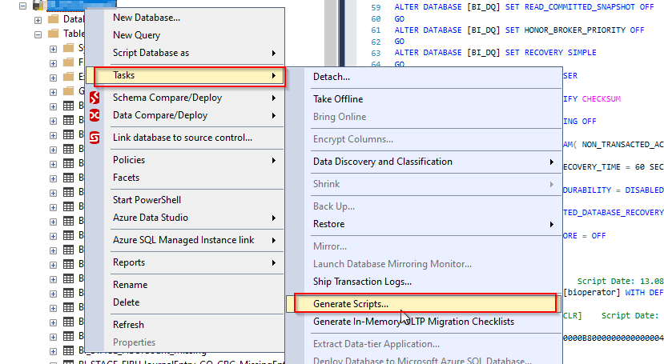
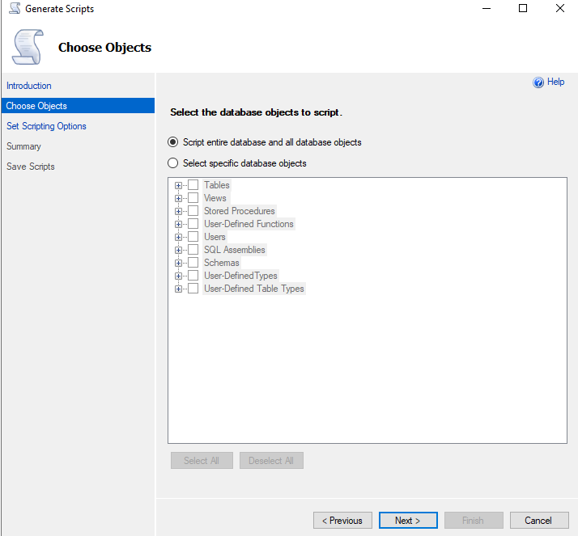
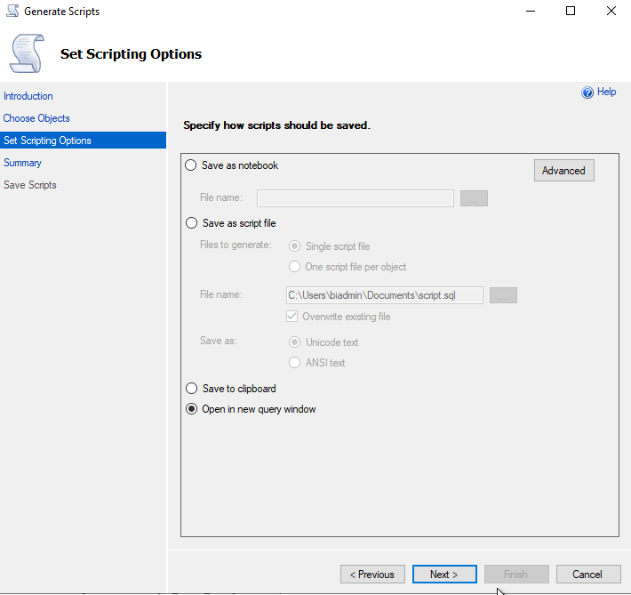

# SSMS "Generate Scripts": Datenbank-CREATE-Skript per Wizard erzeugen

Dieses Dokument beschreibt den **eingebauten SSMS-Weg**, ein vollständiges `CREATE`-Skript für eine Datenbank zu erzeugen — als Alternative bzw. Ergänzung zu den eigenen T-SQL-Skripten [SuspectDatabaseScriptSchemaOnly.sql](SQLScripts/SuspectDatabaseScriptSchemaOnly.sql) und [AssembleExecutableCreateScript.sql](SQLScripts/AssembleExecutableCreateScript.sql). Es erklärt den Ablauf anhand der Screenshots in [assets/](assets/), welche Möglichkeiten der Wizard bietet, und wo seine Einschränkungen liegen — insbesondere, warum auch sein Ergebnis nicht in jedem Fall ohne Weiteres direkt ausführbar ist.

Siehe auch [SuspectOrRecoveryPendingDatabase_RepairOptions.md](SuspectOrRecoveryPendingDatabase_RepairOptions.md) für den Gesamtzusammenhang (Restore-Optionen bei `SUSPECT`-Datenbanken) und [SQLScripts/SuspectDatabaseScriptSchemaOnly.md](SQLScripts/SuspectDatabaseScriptSchemaOnly.md) für den skriptbasierten Weg, ein Schema auch bei einer noch teilweise beschädigten Datenbank zu retten.

**Inhalt:** [1 Ablauf des Wizards](#1--ablauf-des-wizards) · [2 Möglichkeiten](#2--möglichkeiten-des-wizards) · [3 Einschränkungen](#3--einschränkungen-des-wizards) · [4 Wann welchen Weg wählen?](#4--wann-welchen-weg-wählen) · [5 Fallanalyse `BI_DQ_20260813.sql`](#5--konkrete-fallanalyse-bi_dq_20260813sql) · [6 Recherche zu bekannten Reihenfolge-Problemen](#6--recherche-gibt-es-bekannte-fälle-von-falscher-reihenfolge-bei-generate-scripts) · [7 Programmatische Automatisierung ohne GUI](#7--kann-man-generate-scripts-programmatisch-ohne-gui-auslösen)

---

## 1 | Ablauf des Wizards

### Schritt 1: Wizard starten



Rechtsklick auf die Datenbank im Objekt-Explorer → **Tasks** → **Generate Scripts...**

Der Kontextmenü-Ausschnitt zeigt zusätzlich benachbarte Optionen, die leicht verwechselt werden können:
- **Script Database as** (oberhalb von *Tasks*) erzeugt nur ein einzelnes Statement (z.B. `CREATE DATABASE`), **nicht** die enthaltenen Objekte — für ein vollständiges Schema ungeeignet.
- **Generate Scripts...** (unter *Tasks*) ist der hier beschriebene, vollständige Wizard.
- **Extract Data-tier Application...** und **Deploy Database to Microsoft Azure SQL Database...** sind alternative Exportwege (DACPAC-basiert), die hier nicht behandelt werden.

### Schritt 2: Objekte auswählen



Im Schritt **Choose Objects** stehen zwei Möglichkeiten zur Wahl:

- **Script entire database and all database objects** — scriptet die komplette Datenbank inklusive aller Objekttypen in einem Rutsch (Tabellen, Views, Stored Procedures, Functions, Users, SQL Assemblies, Schemas, User-Defined Types, User-Defined Table Types, ...).
- **Select specific database objects** — erlaubt die gezielte Auswahl einzelner Objekttypen bzw. einzelner Objekte über die aufklappbare Baumstruktur (Tables, Views, Stored Procedures, User-Defined Functions, Users, SQL Assemblies, Schemas, User-Defined Types, User-Defined Table Types).

Für eine vollständige Schema-Rettung ist **"Script entire database and all database objects"** die richtige Wahl.

### Schritt 3: Scripting-Optionen und Speicherziel festlegen



Im Schritt **Set Scripting Options** wird festgelegt, **wie** das Ergebnis gespeichert wird:

| Option | Bedeutung |
|---|---|
| **Save as notebook** | Speichert das Skript als Jupyter-Notebook (`.ipynb`) statt als reine `.sql`-Datei. |
| **Save as script file** | Klassische `.sql`-Datei. Zusätzliche Wahl: **Single script file** (alles in einer Datei) oder **One script file per object** (ein File je Objekt). Speicherort frei wählbar, Kodierung als **Unicode text** oder **ANSI text**. |
| **Save to clipboard** | Kopiert das generierte Skript direkt in die Zwischenablage. |
| **Open in new query window** | Öffnet das Ergebnis direkt als neues Abfragefenster in SSMS, ohne vorher eine Datei zu speichern. |

Über den Button **Advanced** (oben rechts neben *Save as notebook*) lassen sich weitere, hier nicht abgebildete Detaileinstellungen konfigurieren — u.a. ob `DROP`-Statements vor jedem `CREATE` eingefügt werden, ob Berechtigungen (`GRANT`/`DENY`), Indizes, Trigger, Extended Properties oder Daten (`INSERT`-Statements) mit gescriptet werden sollen, und ob für die Zielversion kompatibler SQL-Server-Syntax generiert wird.

---

## 2 | Möglichkeiten des Wizards

Im Vergleich zu den eigenen [SuspectDatabaseScriptSchemaOnly.sql](SQLScripts/SuspectDatabaseScriptSchemaOnly.sql)/[AssembleExecutableCreateScript.sql](SQLScripts/AssembleExecutableCreateScript.sql)-Skripten bietet der SSMS-Wizard deutlich mehr Abdeckung, **wenn die Datenbank normal online und lesbar ist**:

- **Vollständigere Objektabdeckung**: Users, SQL Assemblies, Schemas, User-Defined Types, User-Defined Table Types werden zusätzlich erfasst — das leisten die eigenen Skripte nicht.
- **Berechtigungen und Sicherheitsobjekte**: Über die *Advanced*-Optionen lassen sich `GRANT`/`DENY`-Statements sowie Benutzerzuordnungen mitscripten.
- **Korrekte interne Abhängigkeitsauflösung**: SSMS ermittelt die Reihenfolge der Objekte (inkl. verschachtelter Sichten, die andere Sichten referenzieren) über das SQL Server Management Object (SMO) Modell — nicht über eine feste, grob kategorisierte Sortierung wie im eigenen Skript.
- **Bereits korrekt formatierte Batches**: Der Wizard fügt automatisch `GO`-Trenner an den richtigen Stellen ein, inklusive der Pflicht, dass `CREATE VIEW`/`PROCEDURE`/`FUNCTION`/`TRIGGER` jeweils allein in ihrem Batch stehen.
- **Flexible Speicherziele**: Direkt als Datei, als Notebook, in die Zwischenablage oder direkt als neues Query-Fenster — ohne manuelles Kopieren aus einem Ergebnis-Grid.
- **Zusätzliche Objekttypen wie Indizes, Trigger, Extended Properties, Partitionierungsschemata** lassen sich über *Advanced* individuell zu- oder abschalten.

---

## 3 | Einschränkungen des Wizards

Trotz der größeren Abdeckung hat auch der SSMS-Wizard entscheidende Grenzen — die genau der Grund sind, warum in diesem Repo zusätzlich die eigenen T-SQL-Skripte existieren:

### 3.1 Der Wizard benötigt eine **online und lesbare** Datenbank

**Das ist die entscheidende Einschränkung im SUSPECT-Kontext:** Der Generate-Scripts-Wizard arbeitet über SMO (SQL Server Management Objects) und muss dafür die Datenbankmetadaten regulär abfragen können. Ist die Datenbank `SUSPECT` oder befindet sich (wie in den vorherigen Diagnoseschritten in diesem Kapitel beschrieben) in einem Zustand, in dem selbst einfache `SELECT`-Abfragen gegen Systemkataloge fehlschlagen, **kann der Wizard gar nicht erst gestartet werden** oder bricht mit einem Verbindungs-/Metadatenfehler ab.

**Erster Schritt — Datenbank ueberhaupt lesbar machen:** Bevor der Wizard (oder eine seiner programmatischen Alternativen aus Abschnitt 7) ueberhaupt ansetzen kann, muss die Datenbank per `ALTER DATABASE SET EMERGENCY` (optional zusaetzlich `SET READ_ONLY`) in einen zumindest eingeschraenkt lesbaren Zustand versetzt werden. Dafuer gibt es [SQLScripts/DatabaseEmergencyReadOnlyForGenerateScripts.sql](SQLScripts/DatabaseEmergencyReadOnlyForGenerateScripts.sql) (Doku: [SQLScripts/DatabaseEmergencyReadOnlyForGenerateScripts.md](SQLScripts/DatabaseEmergencyReadOnlyForGenerateScripts.md)): Es fuehrt **ausschliesslich** diesen Statuswechsel durch (kein `REPAIR_ALLOW_DATA_LOSS`, keine eigene Schema-Extraktion) und gibt danach eine konkrete Anleitung fuer die anschliessende Nutzung von Generate Scripts bzw. SMO/`dbatools`/`mssql-scripter` aus.

**Falls Generate Scripts/SMO danach trotzdem abbricht:** Selbst im `EMERGENCY`-Modus lesbar zu sein, garantiert noch nicht, dass SMO **jedes** Objekt erfolgreich abfragen kann — SMO fragt Objekte i.d.R. pauschal je Objekttyp ab und kann beim ersten beschädigten Objekt komplett abbrechen. Genau für diesen Fall — wenn selbst der Wizard/SMO an einzelnen beschädigten Metadaten-Objekten scheitert — wurde [SuspectDatabaseScriptSchemaOnly.sql](SQLScripts/SuspectDatabaseScriptSchemaOnly.sql) gebaut: Es liest die Systemkataloge objektweise mit einzelnen `TRY/CATCH`-Blöcken aus, sodass ein Fehler bei einem beschädigten Objekt nicht die gesamte Extraktion blockiert — etwas, das der monolithische SMO-Ansatz des Wizards nicht leistet.

### 3.2 "Fertig gespeichert" ist nicht automatisch "fehlerfrei ausführbar"

Auch wenn der Wizard in der Regel korrekt formatierte `GO`-Trenner setzt, gelten dieselben grundsätzlichen Einschränkungen, die bereits für die eigene Skript-Zusammenstellung dokumentiert sind (siehe [AssembleExecutableCreateScript.md](SQLScripts/AssembleExecutableCreateScript.md)):

- Das generierte Skript enthält **kein automatisches** `CREATE DATABASE`-Statement, wenn nur "spezifische Objekte" statt der ganzen Datenbank gescriptet wurden — in diesem Fall muss die Zieldatenbank vorher manuell angelegt und der `USE`-Kontext ergänzt werden.
- Bei sehr großen Schemata mit zirkulären oder ungewöhnlichen Abhängigkeiten (z. B. Views, die sich gegenseitig über mehrere Ebenen referenzieren, oder Funktionen, die von noch nicht existierenden Tabellentypen abhängen) kann auch SMO die Reihenfolge nicht immer perfekt auflösen — in seltenen Fällen bricht die Ausführung dennoch mit einem "Objekt nicht gefunden"-Fehler ab und erfordert manuelles Nachsortieren.
- Standardmäßig werden **keine Daten** mitgescriptet (nur Struktur) — falls Dateninhalte benötigt werden, muss das über *Advanced* → *Types of data to script* explizit aktiviert werden, was bei großen Tabellen zu sehr großen, langsam auszuführenden Skripten führt.
- Berechtigungen, die auf Ebene der **Instanz** (Logins, Server-Rollen) statt der Datenbank vergeben sind, werden nicht mitgescriptet — nur die Datenbank-Ebene.

### 3.3 Kein Schutz vor teilweise beschädigten Metadaten

Anders als [SuspectDatabaseScriptSchemaOnly.sql](SQLScripts/SuspectDatabaseScriptSchemaOnly.sql) mit seinem `CompletenessCheck`-Mechanismus (siehe dortige Dokumentation) hat der SSMS-Wizard **keinen eingebauten Mechanismus**, um stille Teil-Auslassungen bei partiell beschädigten Metadaten zu erkennen. Bricht die interne SMO-Abfrage für ein einzelnes Objekt ab, kann das im ungünstigsten Fall zum Abbruch des gesamten Wizard-Laufs führen, statt (wie im eigenen Skript) nur den betroffenen Objekttyp als `FAILED` zu protokollieren und mit den übrigen Objekttypen fortzufahren.

### 3.4 `Execution Timeout Expired` bei der Prefetch-Phase (z. B. `PrefetchStoredProcedures`)

In der Praxis beobachteter Fehler beim Ausführen von Generate Scripts gegen eine (auch nur eingeschränkt lesbare, z. B. `EMERGENCY`/`READ_ONLY`) Datenbank:

```text
Microsoft.SqlServer.Management.SqlScriptPublish.SqlScriptPublishException: An error occurred while scripting the objects.
 ---> Microsoft.SqlServer.Management.Common.ExecutionFailureException: An exception occurred while executing a Transact-SQL statement or batch.
 ---> Microsoft.Data.SqlClient.SqlException: Execution Timeout Expired. The timeout period elapsed prior to completion of the operation or the server is not responding.
 ---> System.ComponentModel.Win32Exception: The wait operation timed out
   ...
   at Microsoft.SqlServer.Management.Smo.DatabasePrefetchBase.PrefetchAllObjects(String urnType)
   at Microsoft.SqlServer.Management.Smo.Database.PrefetchStoredProcedures(ScriptingPreferences options)
   ...
   at Microsoft.SqlServer.Management.SqlScriptPublish.SqlScriptGenerator.DoScript(ScriptOutputOptions outputOptions)
```

**Was das bedeutet:** Dieser Fehler tritt **nicht** beim eigentlichen Scripten auf, sondern bereits in der vorgelagerten **Prefetch/Discovery-Phase** (`PrefetchStoredProcedures` → `PrefetchAllObjects`), in der SMO für "Script entire database and all database objects" die Definitionen **aller** Objekte eines Typs (hier: Stored Procedures) in einer Abfrage vorab lädt, bevor überhaupt die Reihenfolge/Abhängigkeiten aufgelöst werden. Es ist ein reiner **clientseitiger Verbindungstimeout** (`SqlException: Execution Timeout Expired`) — kein Hinweis auf Seitenkorruption (keine Msg 823/824/926/7909) und keine dauerhafte serverseitige Fehlermeldung.

**Warum das gerade bei `EMERGENCY`/beschädigten Datenbanken wahrscheinlicher ist:**
- Im `EMERGENCY`-Modus laufen interne Systemkatalogabfragen oft langsamer (u. a. weil Caches/Statistiken nach dem Zustandswechsel neu aufgebaut werden oder SQL Server bei potenziell beschädigten Strukturen vorsichtiger/mit mehr IO-Retries vorgeht).
- Je mehr Objekte eines Typs existieren (hier: viele Stored Procedures), desto größer und langsamer die eine, monolithische Prefetch-Abfrage — ein Muster, das sich mit der in Abschnitt 3.1 beschriebenen Grenze deckt: SMO fragt pauschal je Objekttyp ab, nicht objektweise mit Einzel-Timeout.

**Gegenmaßnahmen:**
1. **Timeout erhöhen:** In SSMS unter *Tools → Options → SQL Server Object Explorer → General* (bzw. den Timeout-Wert im Verbindungsdialog des Wizards) den Command-/Verbindungstimeout deutlich hochsetzen oder auf `0` (unbegrenzt) setzen.
2. **Objektmenge reduzieren:** Statt *"Script entire database and all database objects"* gezielt *"Select specific database objects"* wählen und z. B. die Stored Procedures in kleineren Gruppen scripten, um die eine große Prefetch-Abfrage zu vermeiden.
3. **Programmatisch mit explizitem Timeout (Abschnitt 7):** Beim SMO/PowerShell-Weg lässt sich der Timeout direkt setzen, z. B. `$server.ConnectionContext.StatementTimeout = 0` (unbegrenzt) — das ist über den Wizard selbst nicht in dieser Form steuerbar.
4. **Strukturelles Signal statt Konfigurationsproblem:** Tritt der Timeout wiederholt und unabhängig vom eingestellten Wert auf, ist das ein Indiz, dass Generate Scripts/SMO an dieser (beschädigten) Datenbank grundsätzlich an seine Grenzen stößt. In diesem Fall ist [SuspectDatabaseScriptSchemaOnly.sql](SQLScripts/SuspectDatabaseScriptSchemaOnly.sql) der robustere Fallback, da es objektweise mit eigenem `TRY/CATCH` arbeitet, statt in einer einzigen großen Prefetch-Abfrage hängen zu bleiben.

---

## 4 | Wann welchen Weg wählen?

| Situation | Empfohlener Weg |
|---|---|
| Datenbank ist online, normal lesbar, Schema soll gesichert/migriert werden | **SSMS Generate Scripts** — deckt mehr Objekttypen ab, korrekte Abhängigkeitsauflösung, komfortabler |
| Datenbank ist `SUSPECT`, soll aber nur fuer Generate Scripts (bzw. SMO/`dbatools`) lesbar gemacht werden, ohne selbst zu extrahieren | **[DatabaseEmergencyReadOnlyForGenerateScripts.sql](SQLScripts/DatabaseEmergencyReadOnlyForGenerateScripts.sql)** — versetzt nur nach `EMERGENCY`/`READ_ONLY`, danach Generate Scripts bzw. Abschnitt 7 nutzen; deckt mehr Objekttypen ab als die eigene T-SQL-Extraktion (Users, Permissions, SQL Assemblies, User-Defined Types) |
| Datenbank ist `SUSPECT`/`EMERGENCY`, `DBCC CHECKDB ... REPAIR_ALLOW_DATA_LOSS` bereits gescheitert, oder Generate Scripts/SMO bricht wegen beschädigter Metadaten ab | **[SuspectDatabaseScriptSchemaOnly.sql](SQLScripts/SuspectDatabaseScriptSchemaOnly.sql)** + **[AssembleExecutableCreateScript.sql](SQLScripts/AssembleExecutableCreateScript.sql)** — funktioniert auch bei teilweise beschädigten Metadaten, mit Fehlertoleranz je Objekttyp |
| Datenbank ist online, aber Wizard soll automatisiert/unbeaufsichtigt laufen (z.B. in einem Job) | Der Wizard selbst ist nicht automatisierbar, aber SMO-PowerShell, `dbatools`, `mssql-scripter` oder `sqlpackage`/DACPAC-Export bilden dasselbe Ergebnis programmatisch nach — siehe [Abschnitt 7](#7--kann-man-generate-scripts-programmatisch-ohne-gui-auslösen) |
| Zusätzliche Absicherung nach erfolgreicher Schema-Extraktion aus einer beschädigten Datenbank | Ergebnis von `SuspectDatabaseScriptSchemaOnly.sql` nachträglich **zusätzlich** mit SSMS Generate Scripts gegen die (zwischenzeitlich wiederhergestellte oder neu aufgebaute) Datenbank abgleichen, um Vollständigkeit zu verifizieren |

**Fazit:** Beide Wege liefern am Ende ein `CREATE`-Skript, aber keiner der beiden ist automatisch und in jedem Fall ohne Weiteres direkt ausführbar. Der SSMS-Wizard ist komfortabler und vollständiger, setzt aber eine online zugängliche Datenbank voraus. Die eigenen T-SQL-Skripte sind der einzige Weg, wenn die Datenbank bereits so beschädigt ist, dass reguläre Werkzeuge wie SMO gar nicht mehr ansetzen können — erkaufen sich das aber mit geringerer Abdeckung (keine Users, Berechtigungen, SQL Assemblies, User-Defined Types) und der Notwendigkeit, das Ergebnis mit [AssembleExecutableCreateScript.sql](SQLScripts/AssembleExecutableCreateScript.sql) erst noch zu einem lauffähigen Skript zusammenzusetzen.

---

## 5 | Konkrete Fallanalyse: `BI_DQ_20260813.sql`

Ein per SSMS Generate Scripts erzeugtes Skript für die Datenbank `BI_DQ` (Datei `U:\DataAnalytics\_CreateDB_Scripts\BI_DQ_20260813.sql`, 9.876 Zeilen) wurde vollständig auf die in Abschnitt 3 beschriebenen Risiken geprüft. Ergebnis:

### 5.1 Was korrekt war

- **`USE [master]` → `CREATE DATABASE [BI_DQ]` → `USE [BI_DQ]`** waren vollständig und korrekt vorhanden (Zeilen 1–81), da *"Script entire database and all database objects"* gewählt worden war.
- **Alle 440 Vorkommen von `SET ANSI_NULLS`/`SET QUOTED_IDENTIFIER`** waren korrekt jeweils direkt vor jedem `CREATE VIEW`/`FUNCTION`/`PROCEDURE`/`TRIGGER` platziert, mit `GO` davor und danach — kein einziger Verstoß gegen die Batch-Regel.
- **Keine `SCHEMABINDING`-Views** vorhanden, die eine strikte Objekt-Reihenfolge erzwingen würden.
- **Keine `FOREIGN KEY`-Constraints** im gesamten Skript (nur ein einziger `DEFAULT`-Constraint); alle `PRIMARY KEY`s waren inline in den `CREATE TABLE`-Statements definiert. Damit entfiel praktisch das komplette Abhängigkeits-Reihenfolge-Risiko aus Abschnitt 6.
- Scheinbar "verdächtige" Reihenfolgen wie `CREATE VIEW [tSQLt].[TestClasses]` und `CREATE VIEW [tSQLt].[Tests]` **vor** der zugehörigen Tabelle `CREATE TABLE [tSQLt].[TestResult]` erwiesen sich bei genauer Prüfung als unproblematisch: Die beiden Views referenzieren ausschließlich Systemkataloge (`sys.schemas`, `sys.procedures`, `sys.extended_properties`), nicht die Tabelle selbst.

### 5.2 Das tatsächlich gefundene Problem: fehlende CLR-Serverkonfiguration

Das Skript installiert das Open-Source-Test-Framework **tSQLt** und bringt dafür ein CLR-Assembly mit:

```sql
CREATE ASSEMBLY [tSQLtCLR]
FROM 0x4D5A9000...   -- Binärdaten der Assembly
WITH PERMISSION_SET = UNSAFE
GO
```

Weiter unten im Skript wird zusätzlich versucht, `ALTER ASSEMBLY tSQLtCLR WITH PERMISSION_SET = EXTERNAL_ACCESS` auszuführen. Beides setzt voraus, dass die **CLR-Integration auf der Instanz aktiviert** ist:

```sql
sp_configure 'clr enabled', 1;
RECONFIGURE;
```

**Diese Zeile fehlte vollständig im generierten Skript.** Das ist keine Reihenfolge-Frage innerhalb der Datenbank, sondern eine fehlende **serverweite Voraussetzung**, die SSMS beim datenbankbezogenen Generate-Scripts-Lauf grundsätzlich nicht mitscriptet (siehe Abschnitt 6.3 für die Bestätigung dieses bekannten Verhaltens). Auf einer frischen Instanz, auf der CLR-Integration noch nie aktiviert wurde, schlägt `CREATE ASSEMBLY [tSQLtCLR]` dadurch fehl.

`TRUSTWORTHY ON` (Zeile 53) war im Skript korrekt gesetzt, wodurch der `UNSAFE`-Permission-Set nach Aktivierung von CLR grundsätzlich funktionieren sollte, ohne dass eine Assembly-Signatur mit vertrauenswürdigem Zertifikat nötig wäre.

### 5.3 Fazit für diesen konkreten Fall

Die generelle Sorge — SSMS ordnet Objekte in falscher Abhängigkeitsreihenfolge an — hat sich für `BI_DQ_20260813.sql` **nicht bestätigt**: Struktur, Batch-Trennung und Objektreihenfolge waren technisch einwandfrei. Das tatsächliche Ausführungsrisiko lag an einer **fehlenden, externen Server-Voraussetzung** (CLR-Aktivierung), nicht an der Reihenfolge der Objekte selbst. Vor der Ausführung eines vergleichbaren Skripts auf einer neuen Instanz empfiehlt sich daher, zusätzlich zur Objektreihenfolge zu prüfen, ob das Skript `CREATE ASSEMBLY`-Anweisungen enthält — und in diesem Fall `sp_configure 'clr enabled', 1; RECONFIGURE;` vor der Ausführung manuell voranzustellen.

---

## 6 | Recherche: Gibt es bekannte Fälle von falscher Reihenfolge bei Generate Scripts?

Eine gezielte Internet-Recherche wurde durchgeführt, um zu prüfen, ob das in Abschnitt 3.2 beschriebene Risiko (SSMS ordnet Objekte gelegentlich in falscher Abhängigkeitsreihenfolge an) über Einzelfälle hinaus dokumentiert ist. Ergebnis: **Ja, es gibt mehrere unabhängig dokumentierte Fälle.**

### 6.1 Views vor ihren Basistabellen (bestätigter, wiederkehrender Fall)

In einem Microsoft-Diskussionsforum-Thread wurde explizit berichtet, dass der Generate-Scripts-Wizard **Views vor den referenzierten Basistabellen** erzeugt hat — ein seit Langem bekanntes Verhalten ("shortcoming"), für das als Workaround empfohlen wird, stattdessen direkt über SMO (SQL Server Management Objects) in Kombination mit einem eigenen Dependency Walker zu scripten, um die korrekte Reihenfolge zu erzwingen. Das Problem tritt vor allem dann sichtbar zutage, wenn das Ergebnis **nicht** als einzelne Datei, sondern als *"One script file per object"* gespeichert und die Dateien anschließend einzeln (statt in einer Sitzung als ein zusammenhängender Batch) ausgeführt werden — dann muss die Ausführungsreihenfolge manuell nachvollzogen werden, da keine automatische Gesamtreihenfolge mehr existiert.

### 6.2 Fehlende Schema-Qualifizierung als Ursache für falsche Reihenfolge

Ein Microsoft-Q&A-Beitrag zu "Invalid Object Name"-Fehlern nach Generate Scripts beschreibt eine konkrete Ursache: **Wird ein referenziertes Objekt in einer View/Function/Procedure nicht schema-qualifiziert angesprochen** (also z.B. `SELECT * FROM MyTable` statt `SELECT * FROM dbo.MyTable`), kann die interne Abhängigkeitserkennung von SSMS/SMO diese Referenz **nicht zuverlässig erkennen**. Die Folge: Das abhängige Objekt kann vor dem referenzierten Objekt landen, was beim Ausführen zu genau dem "Invalid Object Name"-Fehler führt, den auch die eigenen Skripte in diesem Kapitel als bekannte Grenze dokumentieren (siehe [AssembleExecutableCreateScript.md](SQLScripts/AssembleExecutableCreateScript.md), `AssemblyWarnings`). Als Workaround wird empfohlen, unter *Tools → Options → SQL Server Object Explorer → Scripting* die Option **"Generate script for dependent objects"** zu aktivieren und beim Scripting-Kontextmenü **"Script As" → "DROP and CREATE To"** statt nur "CREATE To" zu wählen, da nur diese Kombination die Abhängigkeitsoption zuverlässig berücksichtigt.

### 6.3 CLR-Assemblies: fehlende Serverkonfiguration ist ein bekanntes, dokumentiertes Verhalten

Unabhängig von der Objektreihenfolge innerhalb der Datenbank bestätigt die offizielle Dokumentation, dass CLR-Objekte (`CREATE ASSEMBLY`, CLR-Funktionen/Prozeduren/Trigger) **grundsätzlich nicht ausgeführt werden**, solange die Serverkonfigurationsoption `clr enabled` nicht aktiviert ist — diese Option ist standardmäßig deaktiviert. Recherchen bestätigen, dass SSMS beim Scripting einer Datenbank **keine** `sp_configure`-Serverkonfigurationsbefehle mitscriptet, da diese außerhalb des Gültigkeitsbereichs "Datenbank" liegen. Das deckt sich exakt mit dem in Abschnitt 5.2 beschriebenen, tatsächlich aufgetretenen Fall bei `BI_DQ_20260813.sql`.

### 6.4 Einordnung: Wann tritt das Problem typischerweise auf?

Zusammengefasst aus den recherchierten Quellen entsteht das Reihenfolge-Risiko bei SSMS Generate Scripts vor allem in folgenden Konstellationen:

| Konstellation | Risiko |
|---|---|
| Views/Functions referenzieren andere Objekte **ohne** Schema-Qualifizierung (`dbo.` fehlt) | Hoch — Abhängigkeit wird von SMO ggf. nicht erkannt |
| Ergebnis wird als **"One script file per object"** gespeichert und Dateien einzeln/parallel statt als ein zusammenhängender Batch ausgeführt | Hoch — keine automatische Gesamtreihenfolge mehr vorhanden |
| Datenbank enthält **CLR-Assemblies** | Sicher betroffen — `sp_configure 'clr enabled'` fehlt grundsätzlich und muss manuell ergänzt werden |
| Zirkuläre oder mehrstufig verschachtelte View-Abhängigkeiten (View A → View B → View C) | Mittel — in Einzelfällen dokumentiert, aber seltener als die anderen Fälle |
| Alle Objekte durchgängig schema-qualifiziert, Ergebnis als **"Single script file"** in einer Sitzung ausgeführt (wie bei `BI_DQ_20260813.sql`) | Gering — wie die Fallanalyse in Abschnitt 5 zeigt, arbeitet SMO in diesem Szenario zuverlässig |

**Praktische Konsequenz:** Vor der Ausführung eines per Generate Scripts erzeugten Skripts lohnt sich eine kurze Prüfung auf: (1) durchgängige Schema-Qualifizierung in den Objektdefinitionen, (2) ob `CREATE ASSEMBLY`-Anweisungen enthalten sind (→ `sp_configure 'clr enabled'` manuell ergänzen), und (3) ob das Ergebnis als **eine** zusammenhängende Datei vorliegt statt als viele Einzeldateien ohne definierte Ausführungsreihenfolge.

Quellen:
- [Generate scripts has incorrect dependency order (Microsoft-Forumsarchiv)](https://learn.microsoft.com/en-us/archive/msdn-technet-forums/04adaa15-9c2b-4759-b0f4-b3726d376549)
- [SSMS Generate Scripts – Microsoft Q&A](https://learn.microsoft.com/en-us/answers/questions/962344/ssms-generate-scripts)
- [How to fix the Invalid Object Name error in SQL Server – Simple Talk (Redgate)](https://www.red-gate.com/simple-talk/databases/sql-server/common-sql-server-problems-invalid-object-name/)
- [Generate Scripts Result in a order of tables and then stored procedures – SQLServerCentral Forums](https://www.sqlservercentral.com/forums/topic/generate-scripts-result-in-a-order-of-tables-and-then-stored-procedures-in-sql-server)
- [Export View and SP Create Scripts in Dependency Order – SQLServerCentral Forums](https://www.sqlservercentral.com/forums/topic/export-view-and-sp-create-scripts-in-dependency-order)
- [Create CLR Functions – SQL Server, Microsoft Learn](https://learn.microsoft.com/en-us/sql/relational-databases/user-defined-functions/create-clr-functions?view=sql-server-ver17)
- [Implementing Assemblies – SQL Server, Microsoft Learn](https://learn.microsoft.com/en-us/sql/relational-databases/clr-integration/assemblies-implementing?view=sql-server-ver17)

---

## 7 | Kann man "Generate Scripts" programmatisch (ohne GUI) auslösen?

**Kurzantwort: Ja.** Der SSMS-Wizard ist selbst nur eine grafische Oberfläche über **SMO** (SQL Server Management Objects) — dieselben SMO-Klassen (`Server`, `Database`, `Scripter`, `ScriptingOptions`) lassen sich direkt per PowerShell oder .NET ansteuern, ganz ohne SSMS zu öffnen. Der SSMS-Wizard selbst besitzt aber **keinen** Kommandozeilen-/Silent-Modus (kein `ssms.exe /GenerateScripts ...` o.Ä.) — man muss stattdessen eines der folgenden Werkzeuge einsetzen, die das gleiche SMO-Fundament nutzen.

### 7.1 Direkt per SMO/PowerShell (kein zusätzliches Tool nötig)

Voraussetzung ist lediglich das `SqlServer`-PowerShell-Modul (bringt die SMO-Assemblies mit):

```powershell
Import-Module SqlServer

$server   = New-Object Microsoft.SqlServer.Management.Smo.Server "MeinServer"
$database = $server.Databases["BI_DQ"]

$scripter = New-Object Microsoft.SqlServer.Management.Smo.Scripter $server
$scripter.Options.ToFileOnly         = $true
$scripter.Options.FileName           = "C:\Export\BI_DQ_Export.sql"
$scripter.Options.AppendToFile       = $true
$scripter.Options.ScriptSchema       = $true
$scripter.Options.ScriptData         = $false   # $true fuer zusaetzliche INSERT-Statements
$scripter.Options.ScriptDrops        = $false   # $true fuer "Script As -> Drop and Create"
$scripter.Options.IncludeIfNotExists = $true
$scripter.Options.WithDependencies   = $true    # Abhaengigkeiten/Reihenfolge aufloesen
$scripter.Options.Indexes            = $true    # Achtung: Default ist FALSE
$scripter.Options.Triggers           = $true    # Achtung: Default ist FALSE
$scripter.Options.DriAll             = $true    # alle Constraints (PK/FK/Unique/Check); Default FALSE
$scripter.Options.Permissions        = $true    # GRANT/DENY; Default FALSE
$scripter.Options.ExtendedProperties = $true

$urns = @()
$database.Tables               | ForEach-Object { $urns += $_.Urn }
$database.Views                | ForEach-Object { $urns += $_.Urn }
$database.StoredProcedures     | Where-Object { -not $_.IsSystemObject } | ForEach-Object { $urns += $_.Urn }
$database.UserDefinedFunctions | Where-Object { -not $_.IsSystemObject } | ForEach-Object { $urns += $_.Urn }

$scripter.EnumScript($urns)
```

**Wichtiger Stolperstein**, der in mehreren Quellen (Red Gate, MSSQLTips, SQLServerCentral) übereinstimmend genannt wird: Etliche Optionen, die der Wizard-Dialog standardmäßig aktiviert hat (`Indexes`, `Triggers`, `DriAll`/Constraints, `ExtendedProperties`, `Permissions`), sind bei direkter SMO-Nutzung **standardmäßig `FALSE`** — wer sie vergisst zu setzen, bekommt ein unvollständiges Skript, ohne dass ein Fehler geworfen wird.

Alternativ existiert das `Transfer`-Objekt (`Microsoft.SqlServer.Management.Smo.Transfer` → `.ScriptTransfer()`), das die Objektsammlung automatisch übernimmt (kein manuelles `$urns`-Sammeln nötig), aber denselben Optionen-Stolperstein hat.

### 7.2 dbatools (PowerShell-Modul, Open Source, Community)

[dbatools](https://dbatools.io) bietet mit `Export-DbaScript` einen fertigen, dokumentierten Wrapper um genau diese SMO-Funktionalität — laut eigener Dokumentation ausdrücklich als Ersatz für den Wizard gedacht ("Whatever you can script out in SSMS, you can script out using Export-DbaScript"):

```powershell
# Scripting-Optionen wie im Wizard "Advanced"-Dialog setzen
$options = New-DbaScriptingOption   # Wrapper um Microsoft.SqlServer.Management.Smo.ScriptingOptions
$options.ScriptSchema           = $true
$options.IncludeDatabaseContext = $true
$options.Permissions            = $true
$options.DriAll                 = $true
$options.Indexes                = $true
$options.Triggers               = $true

# Beliebige Objekttypen per Pipeline einsammeln und in eine Datei scripten
Get-DbaDbTable -SqlInstance MeinServer -Database BI_DQ |
    Export-DbaScript -ScriptingOptionsObject $options -FilePath C:\Export\BI_DQ_Tables.sql

# Ganze Datenbank als DACPAC statt reinem SQL-Skript exportieren
Export-DbaDacPackage -SqlInstance MeinServer -Database BI_DQ -Path C:\Export
```

Vorteil gegenüber rohem SMO-Code: `Get-DbaDbTable`/`Get-DbaDbView`/`Get-DbaDbStoredProcedure`/`Get-DbaAgentJob` usw. liefern die Objektlisten bereits vorgefiltert (z.B. ohne Systemobjekte), sodass das manuelle `$urns`-Sammeln entfällt.

### 7.3 mssql-scripter (Microsoft, Python, GitHub) — **archiviert, nicht mehr gepflegt**

[github.com/microsoft/mssql-scripter](https://github.com/microsoft/mssql-scripter) wurde von Microsoft explizit als *"multiplatform command line equivalent of the widely used Generate Scripts Wizard experience in SSMS"* beschrieben und wäre inhaltlich die naheliegendste 1:1-Entsprechung:

```bash
pip install mssql-scripter

# Nur Schema (entspricht "Script entire database and all database objects")
mssql-scripter -S localhost -d BI_DQ -U sa -f ./BI_DQ_Export.sql

# Schema + Daten
mssql-scripter -S localhost -d BI_DQ -U sa --schema-and-data > ./BI_DQ_Export.sql

# Ein File pro Objekt (wie Wizard-Option "One script file per object")
mssql-scripter -S localhost -d BI_DQ -U sa -f ./output_dir --file-per-object
```

**Wichtig:** Das Repository wurde am 7. Mai 2024 von Microsoft archiviert (read-only, "no longer actively maintained") mit dem Hinweis, stattdessen direkt den SSMS-Wizard zu verwenden. Für neue Automatisierungen ist es daher nur noch bedingt empfehlenswert — `dbatools` oder eigener SMO-Code sind die aktiveren Alternativen.

### 7.4 sqlpackage / DACPAC als konzeptionell andere Alternative

`SqlPackage.exe` (Microsoft, aktiv gepflegt) verfolgt ein anderes Modell:

- `/Action:Extract` erzeugt eine **binäre** `.dacpac`-Datei (kein lesbares SQL), optional mit Daten als `.bacpac` (`/Action:Export`).
- `/Action:Script` vergleicht Quelle gegen Ziel und erzeugt ein **Diff-/Deployment-Skript** — näher an einer Migration als an "scripte die ganze DB wie sie jetzt ist".

Für einen vollständigen 1:1-Snapshot wie im Wizard ist SMO/dbatools/mssql-scripter also näher am gewünschten Ergebnis; `sqlpackage` eignet sich eher für CI/CD-Deployment-Pipelines.

### 7.5 Bekannte GitHub-Repos mit fertigen SMO-Scripting-Lösungen

- [ScriptDB (lambacck)](https://github.com/lambacck/ScriptDB) — Konsolenanwendung, scriptet via SMO alle Objekte einer Datenbank in eine Verzeichnisstruktur analog zum SSMS Object Explorer (Tables/, Views/, StoredProcedures/ als Einzeldateien).
- [Export MSSQL schema with PowerShell (Gist, cheynewallace)](https://gist.github.com/cheynewallace/9558179) — exportiert Tabellen, Stored Procedures, Trigger, Functions, Views als einzelne `.sql`-Dateien via SMO.
- [SMO PowerShell Script Generator (Gist, badmotorfinger)](https://gist.github.com/badmotorfinger/1755925) — generiert Skripte für die meisten SQL-Server-Objekttypen über SMO in PowerShell, methodisch sehr nah am Beispiel in Abschnitt 7.1.
- [SQL-Export-Scripts (lovescott)](https://github.com/lovescott/SQL-Export-Scripts) — PowerShell-Sammlung zum Extrahieren von Stored Procedures/SSIS-Paketen für Backup-/Automatisierungszwecke.

**Reddit-Recherche:** Trotz gezielter Suche (r/SQLServer, r/PowerShell, r/sysadmin, verschiedene Formulierungen) wurden keine konkreten, eindeutig zuordenbaren Reddit-Threads zu diesem Thema gefunden — nur Microsoft-Learn-Seiten und Fachblog-Artikel. Es werden hier bewusst keine erfundenen Reddit-Links aufgefuehrt.

### 7.6 Einschränkungen der programmatischen Wege gegenüber dem Wizard

| Aspekt | Einschränkung |
|---|---|
| Default-Optionen | SMO-`ScriptingOptions` haben für Indexes, Triggers, Constraints (`DriAll`), Extended Properties und Permissions den Default `FALSE` — der Wizard aktiviert einen Teil davon standardmäßig. Muss beim Scripten explizit gesetzt werden. |
| Abhängigkeitsreihenfolge bei Daten (DML) | `WithDependencies` löst die Reihenfolge für DDL-Objekte auf; für Dateninhalte (INSERTs) garantiert SMO keine automatisch FK-korrekte Einfügereihenfolge — dafür ist zusätzlich ein `DependencyWalker` nötig, den der Wizard intern übernimmt. |
| Performance | Objektweises Enumerieren/Scripten via SMO ist bei sehr vielen Objekten oder großen Datenmengen spürbar langsamer/speicherintensiver; bei großen DBs eher Backup/Restore, BCP oder DACPAC/BACPAC in Betracht ziehen. |
| CLR-Assemblies/Permissions | `Permissions` ist wie im Wizard standardmäßig nicht Teil des Ergebnisses und muss aktiv angefordert werden; `sp_configure 'clr enabled'` wird auch hier (wie im Wizard, siehe Abschnitt 6.3) grundsätzlich **nicht** mitgescriptet, da es eine Instanz- statt Datenbank-Einstellung ist. |
| mssql-scripter | Archiviert (Mai 2024), keine Weiterentwicklung/Bugfixes mehr zu erwarten. |

**Fazit:** Für ein Ergebnis, das inhaltlich am nächsten am Wizard liegt (vollständiges CREATE-Skript, Struktur + optional Daten, ohne GUI), sind **eigener SMO-PowerShell-Code** oder **dbatools `Export-DbaScript`** die robustesten, aktiv gepflegten Wege. `mssql-scripter` ist inhaltlich die genaueste 1:1-Entsprechung, aber nicht mehr gepflegt. `sqlpackage`/DACPAC ist die richtige Wahl, wenn ohnehin ein Diff-/Deployment-Workflow (CI/CD) statt eines reinen Snapshot-Exports benötigt wird.

Quellen:
- [PowerShell SMO: Automate SQL Server Script Generation – Simple Talk (Red Gate)](https://www.red-gate.com/simple-talk/databases/sql-server/database-administration-sql-server/automated-script-generation-with-powershell-and-smo/)
- [Generate Scripts for database objects with SMO for SQL Server – MSSQLTips](https://www.mssqltips.com/sqlservertip/1833/generate-scripts-for-database-objects-with-smo-for-sql-server/)
- [Generating SQL Scripts using Windows PowerShell – MSSQLTips](https://www.mssqltips.com/sqlservertip/1842/generating-sql-scripts-using-windows-powershell/)
- [Stairway to Server Management Objects (SMO) Level 4: Scripting and Copying Small Databases – SQLServerCentral](https://www.sqlservercentral.com/steps/stairway-to-server-management-objects-smo-level-4-scripting-and-copying-small-databases)
- [Copy SQL Server Database with SMO – Geeky Tidbits](https://www.geekytidbits.com/copy-sql-server-database-smo/)
- [Export-DbaScript – dbatools Dokumentation](https://dbatools.io/Export-DbaScript)
- [Script SQL Server objects using DBATools – SQLShack](https://www.sqlshack.com/script-sql-server-objects-using-dbatools/)
- [Scripting SQL Server objects with dbatools – Beyond default options](https://claudioessilva.eu/2019/05/15/Scripting-SQL-Server-objects-with-dbatools-Beyond-default-options/)
- [GitHub: microsoft/mssql-scripter](https://github.com/microsoft/mssql-scripter)
- [mssql-scripter usage_guide.md](https://github.com/microsoft/mssql-scripter/blob/dev/doc/usage_guide.md)
- [Try new SQL Server command line tools to generate T-SQL scripts – Microsoft SQL Server Blog](https://www.microsoft.com/en-us/sql-server/blog/2017/05/17/try-new-sql-server-command-line-tools-to-generate-t-sql-scripts-and-monitor-dynamic-management-views/)
- [SqlPackage – SQL Server – Microsoft Learn](https://learn.microsoft.com/en-us/sql/tools/sqlpackage/sqlpackage?view=sql-server-ver17)
- [Exploring actions and tasks in the SQLPackage Utility – SQLShack](https://www.sqlshack.com/exploring-the-sqlpackage-actions/)
- [SqlPackage Extract parameters and properties – Microsoft Learn](https://learn.microsoft.com/nl-nl/sql/tools/sqlpackage/sqlpackage-extract?view=sql-server-2016)
- [ScriptDB – GitHub (lambacck)](https://github.com/lambacck/ScriptDB)
- [Export MSSQL schema with PowerShell – Gist (cheynewallace)](https://gist.github.com/cheynewallace/9558179)
- [SMO PowerShell Script Generator – Gist (badmotorfinger)](https://gist.github.com/badmotorfinger/1755925)
- [SQL-Export-Scripts – GitHub (lovescott)](https://github.com/lovescott/SQL-Export-Scripts)
