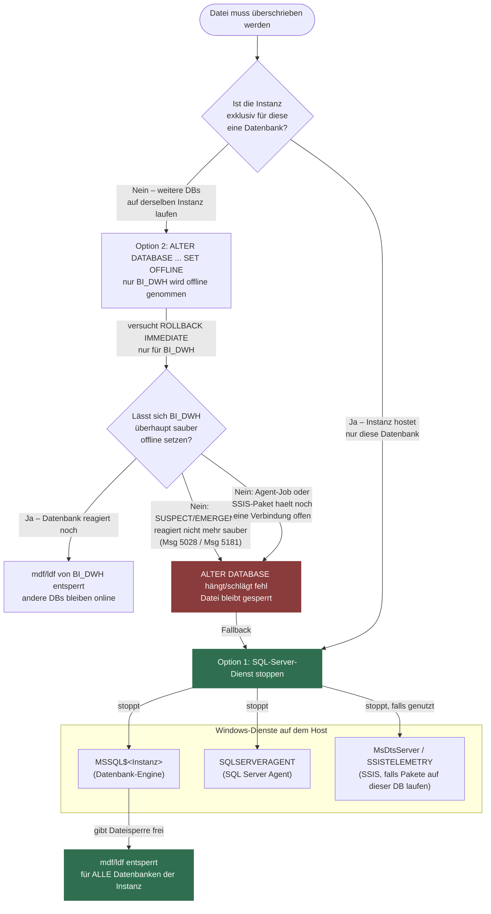

# SUSPECT- oder RECOVERY_PENDING-Datenbank reparieren: Wiederherstellung über ein komplettes VM-/Disk-Backup

Dieses Dokument beschreibt eine **vierte Option** neben den drei in [SuspectOrRecoveryPendingDatabase_RepairOptions.md](SuspectOrRecoveryPendingDatabase_RepairOptions.md) beschriebenen Wegen (vollständiger DB-Restore, Page Restore, `REPAIR_ALLOW_DATA_LOSS` ohne Backup): Wenn ein **komplettes Backup der virtuellen Maschine** existiert — inklusive der Partition/virtuellen Festplatte, auf der die (jetzt beschädigten oder nicht zugänglichen) Datenbankdateien liegen —, lässt sich die alte, unbeschädigte Version der `.mdf`/`.ldf`-Dateien direkt aus diesem VM-Backup zurückkopieren, ohne einen SQL-Server-`RESTORE`-Befehl zu benötigen.

**Gilt sowohl für `SUSPECT` als auch für `RECOVERY_PENDING`** — siehe [Abschnitt 0.1](#01--funktioniert-das-auch-bei-recovery_pending) für die Analyse der Unterschiede zwischen den beiden Zuständen.

**Kernidee:** Der Mechanismus setzt rein auf Dateisystemebene an und ist unabhängig davon, *warum* SQL Server die aktuelle Datei nicht öffnen kann — ob Seitenkorruption (Fehler 823/824, `msdb.dbo.suspect_pages`, typischer Auslöser für `SUSPECT`) oder eine fehlende/gesperrte/beschädigte Datendatei (typischer Auslöser für `RECOVERY_PENDING`). Ein VM-Backup von **vor** dem Ereignis enthält eine vollständige, unbeschädigte Kopie derselben Datei auf Dateisystemebene. Wird die virtuelle Festplatte (VHD/VHDX/VMDK) dieses Backups als **zusätzliche Disk** an die VM (oder eine andere Maschine mit Zugriff auf die Ziel-Instanz) angehängt, kann die alte `.mdf`/`.ldf` einfach per Dateikopie an die richtige Stelle gebracht werden — technisch entspricht das einem manuellen, dateibasierten Restore ohne `BACKUP`/`RESTORE`-Historie.

**Inhalt:** [0 Entscheidung: Dienst stoppen oder Datenbank offline nehmen?](#0--entscheidung-dienst-stoppen-oder-datenbank-offline-nehmen) · [0.1 Funktioniert das auch bei RECOVERY_PENDING?](#01--funktioniert-das-auch-bei-recovery_pending) · [1 Voraussetzungen](#1--voraussetzungen) · [2 Ablauf](#2--ablauf-schritt-für-schritt) · [3 Datenverlust und Zeitpunkt](#3--datenverlust-und-zeitpunkt-der-wiederherstellung) · [4 Risiken und Fallstricke](#4--risiken-und-fallstricke) · [5 Wann diese Option gegenüber den anderen bevorzugen?](#5--wann-diese-option-gegenüber-den-anderen-bevorzugen) · [6 Alternative ohne Disk-Mount](#6--alternative-ohne-disk-mount-datei-direkt-aus-dem-vm-backup-extrahieren) · [7 Weiterführende Informationen](#7--weiterführende-informationen)

---

## 0 | Entscheidung: Dienst stoppen oder Datenbank offline nehmen?

Bevor die Dateien kopiert werden können (Abschnitt 2.4), müssen alle Sperren auf die Ziel-Datei(en) gelöst sein. Dafür gibt es zwei grundsätzlich verschiedene Wege — das folgende Diagramm zeigt, welche Sperren jeder Weg tatsächlich löst und wo Option 2 (nur Datenbank offline) ins Leere läuft:



**Option 1 — SQL-Server-Dienst(e) stoppen.** Konkret zu stoppen sind:

| Dienst (Standardname) | Rolle | Muss gestoppt werden? |
|---|---|---|
| `MSSQLSERVER` (Default-Instanz) bzw. `MSSQL$<Instanzname>` (benannte Instanz) | Die eigentliche Datenbank-Engine — hält die `.mdf`/`.ldf`-Dateisperren | **Ja, immer** — ohne diesen Stopp bleibt die Datei gesperrt |
| `SQLSERVERAGENT` (bzw. `SQLAgent$<Instanzname>`) | SQL Server Agent — kann Jobs ausführen, die Verbindungen zur Datenbank offen halten | Ja, vorsorglich mitstoppen, damit kein Agent-Job während des Dateiaustauschs neu verbindet |
| `MsDtsServer150` / `SSISTELEMETRY150` (Versionsnummer je SQL-Server-Version) | SQL Server Integration Services, falls SSIS-Pakete gegen diese Datenbank laufen | Nur falls SSIS aktiv auf dieser Datenbank arbeitet |

```powershell
# Reihenfolge: zuerst Agent (falls vorhanden), dann die Engine selbst
Stop-Service -Name "SQLSERVERAGENT" -Force -ErrorAction SilentlyContinue
Stop-Service -Name "MSSQLSERVER" -Force
# bei benannter Instanz statt MSSQLSERVER/SQLSERVERAGENT:
# Stop-Service -Name "MSSQL$<Instanzname>" -Force
# Stop-Service -Name "SQLAgent$<Instanzname>" -Force -ErrorAction SilentlyContinue
```

Das stoppt **alle** Datenbanken dieser Instanz, gibt dafür aber garantiert jede Dateisperre frei — unabhängig davon, in welchem (ggf. nicht mehr kooperativen) Zustand die beschädigte Datenbank selbst ist.

**Option 2 — nur die betroffene Datenbank offline nehmen** (`ALTER DATABASE ... SET OFFLINE WITH ROLLBACK IMMEDIATE`, siehe Abschnitt 2.2) **führt in folgenden Fällen nicht zum gewünschten Erfolg:**

- **Die Datenbank ist bereits `SUSPECT` oder in `EMERGENCY`** und reagiert nicht mehr zuverlässig auf `ALTER DATABASE` — der Befehl kann mit Fehlern wie `Msg 5028`/`Msg 5181` fehlschlagen oder unbestimmt lange hängen, weil SQL Server intern noch versucht, mit der beschädigten Datenbank zu interagieren (siehe die konkreten Fehlerbeispiele in [SuspectOrRecoveryPendingDatabase_RepairOptions.md](SuspectOrRecoveryPendingDatabase_RepairOptions.md)).
- **Ein SQL-Server-Agent-Job oder ein laufendes SSIS-Paket hält noch eine aktive Verbindung** zur Datenbank offen, die durch `ROLLBACK IMMEDIATE` nicht zuverlässig beendet wird (z. B. bei Verbindungen, die gerade eine Systemebene-Operation ausführen) — die Datei bleibt dann trotz "erfolgreichem" `OFFLINE`-Befehl gesperrt.
- **Mehrere Datenbankdateien liegen auf gemeinsam genutzten Ressourcen** (z. B. tempdb-Aktivität durch andere Sessions, die indirekt noch auf Strukturen der betroffenen Datenbank zugreifen) — `SET OFFLINE` betrifft nur die eine Datenbank, nicht instanzweite Hintergrundprozesse.
- **Verbindungen mit offener Transaktion, die `ROLLBACK IMMEDIATE` nicht sauber zurückrollen kann**, etwa bei bereits beschädigten Transaktionslog-Strukturen — genau die Situation, die bei einer korrupten Datenbank wahrscheinlich ist.

In all diesen Fällen ist der Dienst-Stopp (Option 1) der zuverlässigere Ausweg, da er keine Kooperation der beschädigten Datenbank voraussetzt.

### 0.1 | Funktioniert das auch bei `RECOVERY_PENDING`?

**Ja — der Mechanismus in diesem Dokument (alte Datei aus VM-Backup zurückkopieren) funktioniert identisch bei `SUSPECT` und bei `RECOVERY_PENDING`.** Der Grund: Der Dateiaustausch selbst (Abschnitte 0–2.4) läuft komplett auf **Betriebssystemebene**, nachdem SQL Server die Datei entweder per Dienst-Stopp oder per `OFFLINE`-Setzung freigegeben hat. Der konkrete `state_desc`-Wert in `sys.databases` spielt für den eigentlichen Kopiervorgang keine Rolle mehr.

Es gibt jedoch reale Unterschiede **davor** — beim Zugriff auf die Datenbank und beim Weg, wie man zur freien Datei kommt:

| Aspekt | `SUSPECT` | `RECOVERY_PENDING` |
|---|---|---|
| Ursache (typisch) | Seitenkorruption (Fehler 823/824, Einträge in `msdb.dbo.suspect_pages`) | Meist eine fehlende, gesperrte oder nicht zugängliche Datendatei (siehe [SQLScripts/SuspectOrRecoveryPendingDatabaseRootCauseCheck.sql](SQLScripts/SuspectOrRecoveryPendingDatabaseRootCauseCheck.sql)) — seltener Korruption |
| Lesbarkeit von `sys.databases`/`sys.master_files` (Schritt 2.1) | Kann bereits mit `Msg 926` fehlschlagen, da SQL Server jeden Zugriff verweigert, solange kein `SET EMERGENCY` erfolgt ist | I.d.R. **problemlos lesbar**, da `RECOVERY_PENDING` selbst keine derart strikte Zugriffssperre wie `SUSPECT` auslöst |
| Verhalten von `ALTER DATABASE ... SET OFFLINE` (Option 2 aus Abschnitt 0) | Kann mit `Msg 5028`/`Msg 5181` fehlschlagen oder hängen, da SQL Server intern noch mit der beschädigten Datenbank interagiert | Tendenziell **zuverlässiger**, da die Datenbank nicht als beschädigt, sondern nur als "Recovery konnte nicht starten" markiert ist — trotzdem vorher testen, siehe Fallliste in Abschnitt 0 |
| Naheliegende alternative Reparatur ohne VM-Restore | `DBCC CHECKDB ... REPAIR_ALLOW_DATA_LOSS` ([SuspectDatabaseRepairWithoutBackup.sql](SQLScripts/SuspectDatabaseRepairWithoutBackup.sql), Doku: [SuspectDatabaseRepairWithoutBackup.md](SQLScripts/SuspectDatabaseRepairWithoutBackup.md)) | Zunächst prüfen, ob die Datei tatsächlich fehlt/gesperrt ist ([SQLScripts/RecoveryPendingRepairWithoutBackup.sql](SQLScripts/RecoveryPendingRepairWithoutBackup.sql), Doku: [SQLScripts/RecoveryPendingRepairWithoutBackup.md](SQLScripts/RecoveryPendingRepairWithoutBackup.md), führt vor jedem Reparaturversuch einen Dateizugriffscheck durch) |
| Eignung der VM-Restore-Methode | Gut geeignet, wenn CHECKDB bereits an großflächiger Korruption gescheitert ist (siehe [SuspectOrRecoveryPendingDatabase_RepairOptions.md](SuspectOrRecoveryPendingDatabase_RepairOptions.md) Abschnitt 4.6) | **Oft die naheliegendste Lösung überhaupt**, da `RECOVERY_PENDING` häufig direkt durch eine fehlende/nicht zugängliche Datei ausgelöst wird — die alte VM-Backup-Version der Datei ersetzt das fehlende Original 1:1, ohne dass überhaupt eine Reparatur (`CHECKDB`) nötig ist |

**Praktische Konsequenz:** Bei `RECOVERY_PENDING` ist dieser VM-/Disk-Level-Restore-Weg tendenziell **noch direkter anwendbar** als bei `SUSPECT`, weil die Ursache oft exakt das Problem ist, das eine wiederhergestellte Datei löst (fehlende Datei), statt eines Konsistenzproblems, das eine reine Dateikopie nicht zwangsläufig behebt (bei Korruption könnte auch die alte VM-Backup-Version bereits fehlerhafte, nur noch nicht erkannte Daten enthalten — deshalb bleibt `DBCC CHECKDB` in Schritt 2.6 in beiden Fällen zwingend).

---

## 1 | Voraussetzungen

- Ein **vollständiges VM-Backup** (Snapshot, Image-Backup, Hypervisor-Backup wie Veeam/Hyper-V-Checkpoints/VMware-Snapshot, oder ein Backup auf Storage-/SAN-Ebene), das **älter** ist als das Korruptionsereignis und die betroffene(n) Partition(en) vollständig enthält.
- Ausreichend freier Speicherplatz, um die Backup-Disk zusätzlich einzubinden (typischerweise als read-only Mount oder als Kopie/Klon der virtuellen Festplatte, **nicht** das Original-Backup direkt beschreibbar mounten).
- Administrativer Zugriff auf den Hypervisor bzw. die Backup-Software, um eine virtuelle Festplatte aus einem Backup-Zeitpunkt als zusätzliches Laufwerk bereitzustellen (z.B. "Mount Backup" / "Instant Disk Recovery" / "Restore individual files" je nach Produkt).
- Kenntnis der physischen Pfade der betroffenen Datenbankdateien (`sys.master_files.physical_name`), um sie im gemounteten Backup wiederzufinden.

---

## 2 | Ablauf (Schritt für Schritt)

### 2.1 Betroffene Dateien identifizieren

```sql
SELECT
    mf.database_id,
    DB_NAME(mf.database_id) AS DatabaseName,
    mf.file_id,
    mf.name          AS LogicalName,
    mf.physical_name AS PhysicalPath,
    mf.type_desc
FROM sys.master_files AS mf
WHERE mf.database_id = DB_ID(N'BI_DQ');
```

Notiert werden die vollständigen physischen Pfade aller Daten- (`.mdf`/`.ndf`) und Log-Dateien (`.ldf`) der betroffenen Datenbank — siehe auch [SQLScripts/SuspectOrRecoveryPendingDatabaseRootCauseCheck.sql](SQLScripts/SuspectOrRecoveryPendingDatabaseRootCauseCheck.sql), das diese Pfade zusammen mit einem Dateizugriffscheck ausgibt.

### 2.2 Datenbank auf der laufenden Instanz offline nehmen bzw. Dateisperren lösen

Solange SQL Server die beschädigten Dateien geöffnet hält, können sie nicht überschrieben werden. Dafür gibt es zwei Wege:

**Option A — nur die betroffene Datenbank offline nehmen:**

```sql
ALTER DATABASE [BI_DQ] SET OFFLINE WITH ROLLBACK IMMEDIATE;
```

Ist die Datenbank bereits `SUSPECT`, hält SQL Server die Dateien meist ohnehin nur eingeschränkt offen — trotzdem vor dem Kopieren prüfen, ob die Datei durch den SQL-Server-Prozess gesperrt ist (z.B. über `sys.dm_os_file_exists` bzw. einen Kopierversuch). **Nachteil:** Bei einer bereits `SUSPECT`/beschädigten Datenbank kann `ALTER DATABASE` selbst unzuverlässig sein oder mit Fehlern wie `Msg 5028`/`Msg 5181` (siehe [SuspectOrRecoveryPendingDatabase_RepairOptions.md](SuspectOrRecoveryPendingDatabase_RepairOptions.md)) fehlschlagen bzw. hängen bleiben, da SQL Server dabei intern noch versucht, mit der Datenbank zu interagieren.

**Option B — den kompletten SQL-Server-Dienst stoppen (oft der einfachere und zuverlässigere Weg):**

```powershell
Stop-Service -Name "MSSQLSERVER" -Force
# bei benanntem Instanznamen: Stop-Service -Name "MSSQL$<Instanzname>" -Force
```

Ein Dienst-Stopp ist ein reiner Betriebssystem-Befehl und umgeht damit potenziell unzuverlässiges Verhalten von `ALTER DATABASE` gegen eine bereits beschädigte Datenbank vollständig — er gibt garantiert **alle** Dateisperren frei, nicht nur die der betroffenen Datenbank. **Nachteil:** Dabei werden zwangsläufig **alle** Datenbanken dieser Instanz offline genommen, nicht nur die betroffene — das ist nur akzeptabel, wenn die Instanz exklusiv für diese Datenbank verwendet wird oder eine kurze Downtime aller Datenbanken vertretbar ist. Nach dem Dateiaustausch (Abschnitt 2.4) den Dienst wieder starten:

```powershell
Start-Service -Name "MSSQLSERVER"
```

**Empfehlung:** Bei einer Instanz mit mehreren produktiv genutzten Datenbanken zuerst Option A versuchen; schlägt `ALTER DATABASE` fehl oder hängt, auf Option B (Dienst-Stopp) ausweichen. Bei einer Instanz, die ohnehin nur die betroffene Datenbank hostet, ist Option B von vornherein der einfachere, robustere Weg.

### 2.3 VM-Backup als zusätzliche Disk einbinden

Je nach Backup-Lösung unterschiedlich, im Kern immer gleich: Die virtuelle Festplatte (oder ein Klon davon) aus dem gewünschten Backup-Zeitpunkt wird der (Produktions- oder einer separaten Wiederherstellungs-)VM als **zusätzliches Laufwerk** hinzugefügt:

- **Hyper-V:** Checkpoint/Backup-VHDX über den Hyper-V-Manager oder PowerShell (`Mount-VHD -Path ... -ReadOnly`) einbinden.
- **VMware:** Über den Backup-Server (z.B. Veeam "Instant Disk Recovery" / "Publish Backup Content") die VMDK aus dem Backup direkt als Netzlaufwerk oder virtuelle Disk bereitstellen, ohne die komplette VM zurückzuspielen.
- **Cloud-VMs (Azure/AWS):** Einen Snapshot des betroffenen Datenträgers als neue verwaltete Disk erstellen und diese zusätzlich an die (oder eine andere) VM anhängen.
- **SAN-/Storage-Snapshot:** Einen vorhandenen Snapshot als neues LUN/Volume mounten.

**Wichtig:** Wo immer möglich, das Backup **read-only** oder als **Klon** einbinden, nicht das einzige vorhandene Backup direkt live mounten und potenziell verändern.

```powershell
# Beispiel Hyper-V: Backup-VHDX schreibgeschuetzt einbinden
Mount-VHD -Path "D:\Backups\VM_BI_DWH\BI_DWH_Snapshot_2026-08-10.vhdx" -ReadOnly
```

### 2.4 Alte, unbeschädigte Datei(en) kopieren

Sobald die Backup-Disk einen Laufwerksbuchstaben erhalten hat (z.B. `E:`), wird die alte Version der Datei an den Ort der aktuellen (kaputten) Datei kopiert:

```powershell
# Alte, unbeschaedigte MDF/LDF aus dem gemounteten VM-Backup zurueckkopieren
Copy-Item -Path "E:\MSSQL15.MSSQLSERVER\MSSQL\DATA\BI_DWH.mdf" `
          -Destination "D:\MSSQL15.MSSQLSERVER\MSSQL\DATA\BI_DWH.mdf" `
          -Force

Copy-Item -Path "E:\MSSQL15.MSSQLSERVER\MSSQL\DATA\BI_DWH_log.ldf" `
          -Destination "D:\MSSQL15.MSSQLSERVER\MSSQL\DATA\BI_DWH_log.ldf" `
          -Force
```

**Empfehlung:** Die aktuellen (beschädigten) Dateien vorher umbenennen/sichern statt sie direkt zu überschreiben (`BI_DWH.mdf` → `BI_DWH_corrupt_20260813.mdf`), falls doch noch forensisch nachvollzogen werden muss, wie die Korruption entstanden ist.

### 2.5 Datenbank wieder online nehmen bzw. neu anhängen

Ist die Datenbank noch in `sys.databases` bekannt (nur `OFFLINE`/`SUSPECT`), reicht meist:

```sql
ALTER DATABASE [BI_DQ] SET ONLINE;
```

War die Datenbank zuvor bereits verworfen ([DropDatabaseCompletely.sql](SQLScripts/DropDatabaseCompletely.sql)) oder soll unter neuem Namen geprüft werden, stattdessen `CREATE DATABASE ... FOR ATTACH`:

```sql
CREATE DATABASE [BI_DQ]
    ON (FILENAME = N'D:\MSSQL15.MSSQLSERVER\MSSQL\DATA\BI_DQ.mdf'),
       (FILENAME = N'D:\MSSQL15.MSSQLSERVER\MSSQL\DATA\BI_DQ_log.ldf')
    FOR ATTACH;
```

### 2.6 Konsistenz prüfen

```sql
DBCC CHECKDB (N'BI_DQ') WITH NO_INFOMSGS, ALL_ERRORMSGS;
```

Nur wenn dies fehlerfrei durchläuft, ist die aus dem VM-Backup zurückkopierte Datei tatsächlich konsistent. Anschließend sofort ein frisches Full-Backup ziehen (siehe [SuspectOrRecoveryPendingDatabase_RepairOptions.md](SuspectOrRecoveryPendingDatabase_RepairOptions.md) Abschnitt 4.5).

---

## 3 | Datenverlust und Zeitpunkt der Wiederherstellung

**Diese Methode ist kein Point-in-Time-Restore** wie `RESTORE LOG ... WITH STOPAT` — sie stellt exakt den Dateizustand zum **Zeitpunkt des VM-Backups** wieder her, inklusive der zu diesem Zeitpunkt bereits committeten UND unvollständig geschriebenen Transaktionen (je nachdem, ob es sich um ein anwendungskonsistentes/VSS-basiertes Backup handelt oder einen reinen Crash-konsistenten Snapshot):

| Backup-Art | Ergebnis nach dem Zurückkopieren |
|---|---|
| **Anwendungskonsistent** (VSS-Writer für SQL Server aktiv, z.B. Veeam mit "Application-Aware Processing") | Datenbank befindet sich in einem sauberen, committeten Zustand zum Snapshot-Zeitpunkt — vergleichbar mit einem regulären Restore. |
| **Crash-konsistent** (reiner Disk-Snapshot ohne SQL-Server-Kenntnis) | Datenbank befindet sich im selben Zustand wie nach einem harten Stromausfall zum Snapshot-Zeitpunkt — SQL Server führt beim `ONLINE`/`ATTACH` automatisch eine Crash Recovery (REDO/UNDO über das Transaktionslog) durch. Das funktioniert nur, wenn **Datendatei UND Logdatei aus demselben Snapshot-Zeitpunkt** stammen. |

**Datenverlust ist in jedem Fall gegeben** für alle Transaktionen zwischen dem VM-Backup-Zeitpunkt und dem Korruptionsereignis — es sei denn, zusätzlich existieren separate SQL-Server-Backups (Full/Diff/Log), die nach dem VM-Backup-Zeitpunkt liegen und sich per `RESTORE LOG` an die zurückkopierte Datenbank anschließen lassen (siehe [SuspectOrRecoveryPendingDatabase_RepairOptions.md](SuspectOrRecoveryPendingDatabase_RepairOptions.md) Abschnitt 2 für die reguläre Restore-Kette).

**Wichtig:** Datendatei und Logdatei **immer aus demselben VM-Backup-Zeitpunkt** zurückkopieren. Werden `.mdf` und `.ldf` aus unterschiedlichen Snapshot-Zeitpunkten gemischt, ist die Datenbank inkonsistent und `DBCC CHECKDB`/`ALTER DATABASE ... SET ONLINE` schlägt typischerweise fehl oder liefert beschädigte Daten.

---

## 4 | Risiken und Fallstricke

- **Falsche Annahme "Backup = online"**: Nur weil ein VM-Backup existiert, heißt das nicht automatisch, dass es die Datenbank in einem konsistenten Zustand enthält (siehe Abschnitt 3) — vor dem produktiven Umschwenken immer erst gegen eine Kopie/einen Testserver prüfen.
- **Laufwerksbuchstaben-/Pfadkonflikte**: Wird die Backup-Disk eingebunden, während die Original-Disk noch denselben Laufwerksbuchstaben beansprucht, kann es zu Verwechslungen kommen. Die Backup-Disk immer mit einem eindeutig anderen Buchstaben mounten und Pfade vor dem Kopieren doppelt prüfen.
- **Dateisperren durch SQL Server**: Läuft der SQL-Server-Dienst noch und hält die (kaputte) Zieldatei offen, schlägt `Copy-Item`/`robocopy` mit "Der Prozess kann nicht auf die Datei zugreifen" fehl. Datenbank vorher `OFFLINE` setzen oder den SQL-Server-Dienst für die Dauer der Kopieraktion stoppen.
- **Sicherheitsberechtigungen (NTFS-ACLs)**: Die kopierte Datei behält u.U. die Berechtigungen des Backup-Systems statt der des SQL-Server-Dienstkontos — nach dem Kopieren ggf. `icacls` prüfen/anpassen, sonst schlägt `ALTER DATABASE ... SET ONLINE` mit einem Zugriffsfehler fehl.
- **Größenlimits/Autogrowth-Historie**: Ist die aktuelle (kaputte) Datei zwischenzeitlich gewachsen (z.B. durch Autogrowth) und die zurückkopierte Datei kleiner, ist das an sich unproblematisch (SQL Server verwendet die tatsächliche Dateigröße) — es bedeutet aber, dass alle Daten, die zwischen dem Backup-Zeitpunkt und dem Wachstum hinzugekommen sind, ebenfalls verloren gehen.
- **Verwechslungsgefahr bei mehreren Datenbanken auf derselben Disk**: Liegen mehrere Datenbanken auf derselben Partition, enthält das VM-Backup zwangsläufig auch die (zum Backup-Zeitpunkt aktuellen) Dateien der anderen Datenbanken — nur die tatsächlich betroffene(n) Datei(en) gezielt kopieren, nicht die komplette Disk pauschal zurückspielen, wenn andere Datenbanken zwischenzeitlich neuere, gültige Daten enthalten.
- **Storage-Platzbedarf**: Ein zusätzliches Mounten der Backup-Disk (bzw. eines Klons) benötigt zusätzlichen Speicherplatz auf dem Hypervisor/Storage-System — bei sehr großen Datenbanken vorab klären, ob genug Kapazität vorhanden ist.

---

## 5 | Wann diese Option gegenüber den anderen bevorzugen?

| Kriterium | VM-/Disk-Level-Restore (dieses Dokument) | Vollständiger DB-Restore (Abschnitt 2 in [SuspectOrRecoveryPendingDatabase_RepairOptions.md](SuspectOrRecoveryPendingDatabase_RepairOptions.md)) | Page Restore (Abschnitt 3) | Repair mit Datenverlust (Abschnitt 4) |
|---|---|---|---|---|
| Voraussetzung | Vollständiges VM-/Disk-Backup vor dem Korruptionsereignis | SQL-Server-natives Backup (Full/Diff/Log) | Full-Backup + lückenlose Log-Kette, Recovery Model FULL/BULK_LOGGED | Keine |
| Datenverlust | Transaktionen seit dem VM-Backup-Zeitpunkt (kein Tail-Log-Backup möglich, da die DB bereits beschädigt ist) | Nein (bis zum Backup-/Log-Zeitpunkt) | Nein (bis zum Log-Zeitpunkt) | Ja, dauerhaft |
| Downtime | Abhängig vom Disk-Mount-/Kopiervorgang (bei grossen Dateien ggf. länger als ein natives `RESTORE`) | Gesamte DB für die Dauer des Restores | Nur betroffene Seite(n)/Datei | Kurz, aber Datenintegrität unvollständig |
| Besonderer Vorteil | Funktioniert auch, wenn **kein natives SQL-Server-Backup** existiert, aber ein VM-/Storage-Backup vorhanden ist — z.B. wenn Backup-Jobs fehlgeschlagen sind, aber die Hypervisor-/SAN-Ebene trotzdem regelmäßig sichert | Sicherste Option bei vorhandenem SQL-Backup | Kürzeste Downtime bei wenigen betroffenen Seiten | Letztes Mittel ohne jegliches Backup |
| Empfehlung | Wenn kein SQL-natives Backup existiert, aber ein VM-/Snapshot-Backup verfügbar ist — **vor** Option 4 (Datenverlust) prüfen | Bevorzugen, wenn natives SQL-Backup vorhanden | Bevorzugen bei wenigen betroffenen Seiten und großer DB | Nur wenn 1–3 (inkl. VM-Restore) nicht möglich sind |

**Praktische Konsequenz:** Diese Methode gehört in die Entscheidungskette **vor** `DBCC CHECKDB ... REPAIR_ALLOW_DATA_LOSS` ([SuspectDatabaseRepairWithoutBackup.sql](SQLScripts/SuspectDatabaseRepairWithoutBackup.sql)) — sie ist in aller Regel vorzuziehen, da sie (bei anwendungskonsistentem Backup) **keinen** Datenverlust der eigentlichen Datenbankstruktur/-daten bedeutet, sondern nur eine zeitliche Rückstufung auf den Snapshot-Zeitpunkt. Vor jeder Entscheidung lohnt sich daher zusätzlich zur Backup-Historie in `msdb.dbo.backupset` (siehe [SuspectOrRecoveryPendingDatabase_RepairOptions.md](SuspectOrRecoveryPendingDatabase_RepairOptions.md) Abschnitt 5) auch die Frage an das Backup-/Infrastruktur-Team, ob und ab wann VM-/Storage-Snapshots der betroffenen VM existieren.

---

## 6 | Alternative ohne Disk-Mount: Datei direkt aus dem VM-Backup extrahieren

Viele moderne Backup-Lösungen (Veeam, Altaru, Azure Backup, Commvault, …) bieten einen **granularen Dateiwiederherstellungs-Modus**, der das manuelle Einbinden einer kompletten virtuellen Festplatte überflüssig macht:

- **Veeam Backup & Replication:** "Guest Files Restore" → einzelne Dateien/Ordner direkt aus dem Backup-Restore-Point extrahieren, ohne die komplette Disk zu mounten.
- **Windows Server Backup / Azure Backup (IaaS-VM-Backup):** "File Recovery" führt ein Recovery-Tool aus, das das Backup temporär als virtuelles Laufwerk einbindet und einzelne Dateien per Explorer/Kommandozeile herauskopieren lässt (technisch identisch zu Abschnitt 2.3/2.4, aber vom Tool automatisiert).
- **VMware/Hyper-V native Snapshots ohne Backup-Software:** Hier bleibt meist nur der manuelle Weg aus Abschnitt 2 (Snapshot-Disk anhängen, Datei kopieren).

Der Ablauf danach (Abschnitt 2.4–2.6: Datei an den Zielpfad kopieren, Datenbank online nehmen, `DBCC CHECKDB`) ist identisch — nur der Weg, an die alte Datei zu kommen, ist bei diesen Tools komfortabler und schneller.

---

## 7 | Weiterführende Informationen

- 📘 Microsoft Learn: [Attach and Detach Databases](https://learn.microsoft.com/en-us/sql/relational-databases/databases/detach-and-attach-a-database-sql-server)
- 📘 Microsoft Learn: [CREATE DATABASE ... FOR ATTACH](https://learn.microsoft.com/en-us/sql/t-sql/statements/create-database-transact-sql)
- 📘 Microsoft Learn: [Back Up and Restore of SQL Server Databases – Crash Recovery](https://learn.microsoft.com/en-us/sql/relational-databases/backup-restore/back-up-and-restore-of-sql-server-databases)
- 📘 Microsoft Learn: [Volume Shadow Copy Service (VSS) und SQL Server Writer](https://learn.microsoft.com/en-us/sql/relational-databases/native-client/features/using-vss-with-sql-server)
- 📘 Microsoft Learn: [Mount-VHD (Hyper-V PowerShell)](https://learn.microsoft.com/en-us/powershell/module/hyper-v/mount-vhd)
- 📄 Siehe auch: [SuspectOrRecoveryPendingDatabase_RepairOptions.md](SuspectOrRecoveryPendingDatabase_RepairOptions.md) für die drei SQL-nativen Reparaturoptionen und [SSMS_GenerateScripts_Anleitung.md](SSMS_GenerateScripts_Anleitung.md) für den Weg über Schema-Rettung, falls auch das VM-Backup nicht mehr verfügbar/brauchbar ist.
