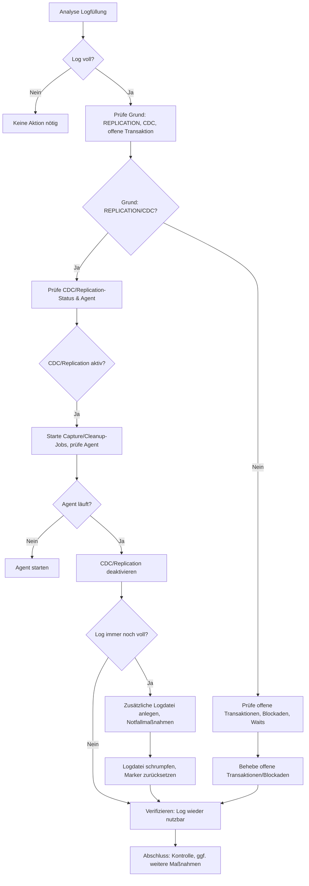

# TransactionLogFull_Replication

**Quelle:** `T-SQL\68_TemporalTables_CDC_CT\TransactionLogFull_Replication.ipynb`  
**Generiert:** 2026-04-18 21:13:31  
**Markdown-Zellen:** 43  
**SQL-Zellen:** 19  

---

# Entscheidungsbaum & Einleitung

## Ablaufdiagramm: Vorgehen bei vollem Transaktionslog



Dieses Ablaufdiagramm zeigt die empfohlene Reihenfolge zur Analyse und Behebung eines vollen Transaktionslogs. Folge den Pfaden je nach Situation und Ursache.

---

**Einleitung:**

Dieses Notebook hilft dir, ein volles Transaktionslog in SQL Server systematisch zu analysieren und zu beheben. Die Kapitel und Scripts sind nach dem Entscheidungsbaum geordnet. Obsolete Abschnitte sind entsprechend markiert.


# 0 | Analyse

Im ersten Schritt überprüfen wir zu einer Datenbank, wie der Stand des Logs ist. Ob er wirklich hängt.


## 0.1 | Füllungsgrad des Transaktionslogs


### 0.1.1 | Schnellüberblick über alle DBs:


```sql
DBCC SQLPERF(LOGSPACE);
```

**Beschreibung:**

Dieses Script liefert einen schnellen Überblick über den Füllungsgrad aller Transaktionslogs in allen Datenbanken des SQL Servers. Es zeigt für jede Datenbank die Größe und den aktuellen Füllstand des Logs an. Dies ist der erste Schritt, um festzustellen, ob ein Log-Problem vorliegt und in welcher Datenbank.

- Befehl: `DBCC SQLPERF(LOGSPACE);`
- Ergebnis: Tabelle mit Log-Größen und Füllungsgrad für alle Datenbanken.
- Anwendung: Immer als Startpunkt zur Analyse von Log-Problemen.


### 0.1.2 | Füllungsgrad für eine bestimmte Datenstand


```sql
DECLARE @db  sysname      = N'BI_STAGE';
DECLARE @sql nvarchar(max) =
N'SELECT
    db                 = ' + QUOTENAME(@db,'''') + N',
    total_log_size_mb  = total_log_size_in_bytes/1024.0/1024.0,
    used_log_space_mb  = used_log_space_in_bytes/1024.0/1024.0,
    used_log_space_pct = 100.0 * used_log_space_in_bytes / NULLIF(total_log_size_in_bytes,0)
  FROM ' + QUOTENAME(@db) + N'.sys.dm_db_log_space_usage;';

EXEC (@sql);

```

**Beschreibung:**

Dieses Script zeigt den Füllungsgrad des Transaktionslogs für eine bestimmte Datenbank (`@db`). Es berechnet die Gesamtgröße, die genutzte Größe und den prozentualen Füllstand des Logs. Damit kann gezielt geprüft werden, wie kritisch die Situation in einer einzelnen Datenbank ist.

- Parameter: Datenbankname (`@db`)
- Ergebnis: Detaillierte Log-Auslastung für die gewählte Datenbank
- Anwendung: Wenn ein Problem in einer bestimmten Datenbank vermutet wird.


### 0.1.3 | Grund für „Log nicht wiederverwendbar“ (z. B. REPLICATION / ACTIVE\_TRANSACTION)


```sql
DECLARE @db sysname = N'BI_STAGE';

SELECT name, recovery_model_desc, log_reuse_wait_desc
FROM sys.databases
WHERE name = @db;

```

**Beschreibung:**

Dieses Script prüft, warum das Transaktionslog nicht wiederverwendet werden kann. Es zeigt den Recovery-Modus und den aktuellen Status des Log-Reuse-Waits für die angegebene Datenbank (`@db`). Typische Gründe sind z.B. aktive Transaktionen, REPLICATION oder CDC.

- Parameter: Datenbankname (`@db`)
- Ergebnis: Recovery-Modus und log_reuse_wait_desc
- Anwendung: Um die Ursache für ein volles Log zu identifizieren.


### 0.1.4 | Älteste offene Transaktion prüfen


```sql
DECLARE @db sysname = N'BI_STAGE';
DECLARE @sql nvarchar(max) = N'USE ' + QUOTENAME(@db) + N'; DBCC OPENTRAN WITH TABLERESULTS, NO_INFOMSGS;'
EXEC(@sql);

```

**Beschreibung:**

Dieses Script prüft, ob es in der angegebenen Datenbank (`@db`) eine offene (nicht abgeschlossene) Transaktion gibt. Offene Transaktionen können verhindern, dass das Log geleert wird. Das Ergebnis zeigt Details zur ältesten offenen Transaktion.

- Parameter: Datenbankname (`@db`)
- Ergebnis: Informationen zur ältesten offenen Transaktion
- Anwendung: Um festzustellen, ob eine offene Transaktion das Log blockiert.


## 0.2 | Prüfen, ob „Lock/Blockade“ das Log bzw. Log-Operationen betrifft

In SQL gibt es keine klassische LCK\_M\_\*-Sperre **auf der LDF-Datei selbst**; relevant sind 

(a) FILE/DATABASE-Locks, 

(b) aktive Wartevorgänge rund ums Log und (c) Gründe, warum das Log nicht geleert werden kann.


### 0.2.1 | FILE/DATABASE-Locks, die z. B. Shrinks/Änderungen blockieren könnten:


```sql
DECLARE @db sysname = N'BI_STAGE';

DECLARE @sql nvarchar(max) = N'USE ' + QUOTENAME(@db) + N';
DECLARE @log_file_id int = (SELECT TOP(1) file_id FROM sys.database_files WHERE type_desc = ''LOG'');

SELECT
    l.resource_type,
    l.request_mode,
    l.request_status,
    l.request_session_id AS session_id,
    s.login_name,
    s.host_name,
    r.command,
    r.status,
    r.blocking_session_id,
    wt.wait_type,
    wt.wait_duration_ms,
    sql_text = SUBSTRING(t.text, (r.statement_start_offset/2)+1,
                         CASE WHEN r.statement_end_offset = -1
                              THEN LEN(CONVERT(nvarchar(max), t.text))
                              ELSE (r.statement_end_offset - r.statement_start_offset)/2 + 1 END)
FROM sys.dm_tran_locks AS l
LEFT JOIN sys.dm_exec_sessions      AS s ON s.session_id = l.request_session_id
LEFT JOIN sys.dm_exec_requests      AS r ON r.session_id = l.request_session_id
OUTER APPLY sys.dm_exec_sql_text(r.sql_handle) AS t
LEFT JOIN sys.dm_os_waiting_tasks   AS wt ON wt.session_id = l.request_session_id
WHERE l.resource_database_id = DB_ID()
  AND (
        (l.resource_type = ''FILE''     AND l.resource_associated_entity_id = @log_file_id)
     OR (l.resource_type = ''DATABASE'')
      )
ORDER BY l.request_status DESC, l.request_mode DESC;
';
EXEC(@sql);
```

**Beschreibung:**

Dieses Script sucht nach FILE- und DATABASE-Locks, die z.B. Shrinks oder Änderungen am Log blockieren könnten. Es zeigt alle relevanten Sperren, die auf die Logdatei oder die Datenbank wirken, inklusive Session- und Warteinformationen.

- Parameter: Datenbankname (`@db`)
- Ergebnis: Übersicht über Locks und blockierende Sessions
- Anwendung: Um festzustellen, ob Sperren das Log-Management behindern.


### 0.2.2. | Aktive Log-bezogene Waits (Hinweis auf Druck/Engpässe im Log):


```sql
DECLARE @db sysname = N'BI_STAGE';

DECLARE @sql nvarchar(max) = N'USE ' + QUOTENAME(@db) + N';
SELECT
    r.session_id,
    r.command,
    r.status,
    wt.wait_type,
    wt.wait_duration_ms,
    s.login_name,
    s.host_name,
    txt.text AS running_sql
FROM sys.dm_os_waiting_tasks wt
JOIN sys.dm_exec_requests   r ON r.session_id = wt.session_id
JOIN sys.dm_exec_sessions   s ON s.session_id = wt.session_id
CROSS APPLY sys.dm_exec_sql_text(r.sql_handle) txt
WHERE wt.wait_type IN (''WRITELOG'', ''LOGMGR'', ''LOGMGR_RESERVE_APPEND'', ''LOGMGR_FLUSH'')
  AND r.database_id = DB_ID()
ORDER BY wt.wait_duration_ms DESC;
';
EXEC(@sql);
```

**Beschreibung:**

Dieses Script zeigt alle aktiven Log-bezogenen Waits (z.B. WRITELOG, LOGMGR), die auf Druck oder Engpässe im Transaktionslog hinweisen. Es listet alle Sessions, die aktuell auf Log-Operationen warten, inklusive Dauer und SQL-Befehl.

- Parameter: Datenbankname (`@db`)
- Ergebnis: Übersicht über Log-bezogene Wartevorgänge
- Anwendung: Um Performance-Engpässe oder Blockaden im Log zu erkennen.


### 0.2.3. | **falls CDC/Replication im Spiel ist**  <span style="font-size: 14px; color: var(--vscode-foreground);">&nbsp;– prüfe Capture/Cleanup-Jobs:</span>

Damit siehst du sauber, ob die **CDC-Jobs** (`capture`/`cleanup`) laufen, wann sie zuletzt angefordert/gestartet/gestoppt wurden und wie der **letzte Lauf** ausgegangen ist.


```sql
DECLARE @db sysname = N'BI_STAGE';

;WITH jobs AS (
  SELECT j.job_id, j.name, j.enabled
  FROM msdb.dbo.sysjobs j
  WHERE j.name IN (N'cdc.' + @db + N'_capture', N'cdc.' + @db + N'_cleanup')
),
last_act AS (
  SELECT a.job_id, a.run_requested_date, a.start_execution_date, a.stop_execution_date,
         ROW_NUMBER() OVER (PARTITION BY a.job_id ORDER BY a.start_execution_date DESC) AS rn
  FROM msdb.dbo.sysjobactivity a
)
SELECT
  j.name,
  j.enabled,
  a.run_requested_date,
  a.start_execution_date,
  a.stop_execution_date,
  is_running = CASE WHEN a.start_execution_date IS NOT NULL AND a.stop_execution_date IS NULL THEN 1 ELSE 0 END,
  last_run_time   = msdb.dbo.agent_datetime(h.run_date, h.run_time),
  last_run_status = CASE h.run_status
                      WHEN 0 THEN 'Failed'
                      WHEN 1 THEN 'Succeeded'
                      WHEN 2 THEN 'Retry'
                      WHEN 3 THEN 'Canceled'
                      WHEN 4 THEN 'In Progress'
                      ELSE 'Unknown'
                    END,
  last_message    = h.message
FROM jobs j
LEFT JOIN last_act a
  ON a.job_id = j.job_id AND a.rn = 1
OUTER APPLY (
  SELECT TOP (1) h.run_date, h.run_time, h.run_status, h.message
  FROM msdb.dbo.sysjobhistory h
  WHERE h.job_id = j.job_id AND h.step_id = 0
  ORDER BY msdb.dbo.agent_datetime(h.run_date, h.run_time) DESC
) h
ORDER BY j.name;

```

**Beschreibung:**

Dieses Script prüft, ob CDC-Jobs (`capture`/`cleanup`) für die angegebene Datenbank existieren und wie deren Status ist. Es zeigt, ob die Jobs laufen, wann sie zuletzt gestartet wurden und wie der letzte Lauf ausgegangen ist. Dies ist wichtig, um festzustellen, ob CDC-Operationen das Log blockieren.

- Parameter: Datenbankname (`@db`)
- Ergebnis: Status und Historie der CDC-Jobs
- Anwendung: Bei Problemen mit CDC und vollem Log.


# 1 | CDC

Der Log bleibt "voll wegen Replication" wenn noch

(a) CDC-Reste aktiv sind

(b) Replikations-Metadaten/Jobs hängen

(c) der Log-Reader nie "abgezeichnet" hat.


## 1.1 | Diagnose - was hält den Log fest?


```sql
DECLARE @db   sysname      = N'BI_STAGE';
DECLARE @dbq  sysname      = QUOTENAME(@db);
DECLARE @sql  nvarchar(MAX);

-- DB-Status
SELECT name, recovery_model_desc, log_reuse_wait_desc,
       is_cdc_enabled, is_published, is_distributor, is_subscribed
FROM sys.databases
WHERE name = @db;

-- CDC-Instanzen (falls noch vorhanden)
SET @sql = N'USE ' + @dbq + N'; EXEC sys.sp_cdc_help_change_data_capture;';
EXEC (@sql);

-- Replikations-Publikationen (falls je eingerichtet)
SET @sql = N'USE ' + @dbq + N'; EXEC sp_helppublication;';
EXEC (@sql);

-- Offene (replizierte) Transaktionen sichtbar?
DBCC OPENTRAN(@db);

-- Existieren/aktiv sind CDC-/Repl.-Jobs?
SELECT name, enabled
FROM msdb.dbo.sysjobs
WHERE name IN (N'cdc.' + @db + N'_capture', N'cdc.' + @db + N'_cleanup')
   OR name LIKE N'Log Reader Agent%';

```

**Beschreibung:**

Dieses Script diagnostiziert, ob CDC oder Replikation den Log festhalten. Es prüft den Status der Datenbank, listet CDC-Instanzen und Publikationen auf, zeigt offene replizierte Transaktionen und prüft, ob die relevanten SQL Agent Jobs existieren und aktiv sind.

- Parameter: Datenbankname (`@db`)
- Ergebnis: Status von CDC, Replikation und offenen Transaktionen
- Anwendung: Um die Ursache für Log-Blockaden durch CDC/Replication zu identifizieren.


## 1.2 | Prüfen, ob der Agent läuft? ggf. neu starten.


```sql
/* === Agent-Status prüfen & ggf. starten =============================== */
DECLARE @AutoStartAgent bit = 1;  -- 0 = nur prüfen, 1 = falls gestoppt -> starten
DECLARE @InstanceName sysname = CAST(SERVERPROPERTY('InstanceName') AS sysname);
DECLARE @AgentWinService sysname =
    CASE WHEN @InstanceName IS NULL THEN N'SQLSERVERAGENT'       -- Default-Instanz
         ELSE N'SQLAgent$' + @InstanceName END;                  -- Named Instance

-- 1) Verfügbare Infos aus DMV (falls Rechte vorhanden)
DECLARE @StatusDesc nvarchar(60) = NULL,
        @StartupDesc nvarchar(60) = NULL,
        @SvcDisplayName nvarchar(256) = NULL;

IF EXISTS (SELECT 1 FROM sys.all_objects WHERE name = 'dm_server_services')
BEGIN
    SELECT TOP (1)
        @SvcDisplayName = servicename,
        @StartupDesc    = startup_type_desc,
        @StatusDesc     = status_desc
    FROM sys.dm_server_services
    WHERE servicename LIKE N'SQL Server Agent (%';
END

-- 2) Zusatz-Check über xp_servicecontrol (Windows, sysadmin)
DECLARE @x nvarchar(4000);
DECLARE @State TABLE (msg nvarchar(4000));
BEGIN TRY
    INSERT INTO @State
    EXEC master.dbo.xp_servicecontrol N'QUERYSTATE', @AgentWinService;
END TRY
BEGIN CATCH
    -- Ignorieren, wenn nicht verfügbar oder keine Rechte
END CATCH;

DECLARE @StateMsg nvarchar(4000) =
    (SELECT TOP 1 msg FROM @State);

-- Normalisieren (Running/Stopped etc.)
DECLARE @IsRunning bit = CASE
    WHEN @StatusDesc = N'Running' THEN 1
    WHEN @StateMsg LIKE N'%Running%' THEN 1
    ELSE 0 END;

-- 3) Handlungsempfehlung + optionaler Start
IF @IsRunning = 1
BEGIN
    PRINT N'✅ SQL Server Agent läuft.';
    SELECT
      [Agent Windows Service] = @AgentWinService,
      [Anzeige-Name]          = @SvcDisplayName,
      [Starttyp]              = ISNULL(@StartupDesc, N'Unbekannt'),
      [Status]                = N'Running',
      [Empfehlung]            = N'Capture- und Cleanup-Jobs für CDC/Repl. starten, dann erneut CDC deaktivieren.';
END
ELSE
BEGIN
    PRINT N'⚠️  SQL Server Agent läuft NICHT.';
    SELECT
      [Agent Windows Service] = @AgentWinService,
      [Anzeige-Name]          = @SvcDisplayName,
      [Starttyp]              = ISNULL(@StartupDesc, N'Unbekannt'),
      [Status]                = N'Stopped',
      [Empfehlung]            = CASE WHEN @AutoStartAgent=1
                                     THEN N'Wird jetzt automatisch gestartet…'
                                     ELSE N'Bitte Agent starten (Services.msc oder SQL Server-Konfigurationsmanager).' END;

    IF @AutoStartAgent = 1
    BEGIN
        BEGIN TRY
            EXEC master.dbo.xp_servicecontrol N'START', @AgentWinService;
            -- kurze Wartezeit + erneute Prüfung
            WAITFOR DELAY '00:00:05';
            DELETE FROM @State;
            INSERT INTO @State EXEC master.dbo.xp_servicecontrol N'QUERYSTATE', @AgentWinService;
            SET @StateMsg = (SELECT TOP 1 msg FROM @State);
            SET @IsRunning = CASE WHEN @StateMsg LIKE N'%Running%' THEN 1 ELSE 0 END;

            IF @IsRunning = 1
                PRINT N'✅ Agent wurde erfolgreich gestartet.';
            ELSE
                PRINT N'❌ Agent konnte nicht gestartet werden. Bitte Rechte/Windows-Eventlog prüfen.';
        END TRY
        BEGIN CATCH
            PRINT N'❌ Startversuch über xp_servicecontrol fehlgeschlagen (Rechte/Umgebung).';
        END CATCH
    END
END

-- 4) Nächste Schritte, wenn Agent läuft (für dein 9002/REPLICATION-Problem)
IF @IsRunning = 1
BEGIN
    PRINT N'ℹ️  Nächste Schritte bei "Log full due to REPLICATION":';
    PRINT N'   1) EXEC sys.sp_cdc_start_job   @job_type = N''capture'';';
    PRINT N'   2) EXEC sys.sp_cdc_change_job  @job_type = N''cleanup'', @retention = 1, @threshold = 50000;';
    PRINT N'   3) EXEC sys.sp_cdc_start_job   @job_type = N''cleanup'';';
    PRINT N'   4) Warten bis log_reuse_wait_desc <> ''REPLICATION'', dann CDC deaktivieren: EXEC sys.sp_cdc_disable_db;';
END
ELSE
BEGIN
    PRINT N'➡️  Ohne laufenden Agent bleibt das Transaktionslog wegen REPLICATION blockiert.';
    PRINT N'   Bitte Agent manuell starten (oder Dienstrechte anpassen), dann die obigen Schritte ausführen.';
END

```

**Beschreibung:**

Dieses Script prüft, ob der SQL Server Agent läuft und startet ihn bei Bedarf automatisch. Es gibt Empfehlungen für die nächsten Schritte, falls der Agent nicht läuft, und zeigt, wie man die CDC-Jobs für Capture und Cleanup startet. Dies ist essenziell, da CDC und Replikation ohne laufenden Agent das Log nicht freigeben können.

- Parameter: Automatischer Start (`@AutoStartAgent`)
- Ergebnis: Status des Agents und Handlungsempfehlungen
- Anwendung: Vor dem Deaktivieren von CDC/Replication immer sicherstellen, dass der Agent läuft.


## 1.2 |


```sql
/* === CDC-Drain + Warteschleife mit Handlungsempfehlung ================= */
DECLARE @db  sysname = N'BI_STAGE';
DECLARE @dbq sysname = QUOTENAME(@db);

-- Agent-Dienstname ermitteln (für Hinweise)
DECLARE @InstanceName sysname = CAST(SERVERPROPERTY('InstanceName') AS sysname);
DECLARE @AgentService sysname = CASE WHEN @InstanceName IS NULL THEN N'SQLSERVERAGENT'
                                     ELSE N'SQLAgent$' + @InstanceName END;

PRINT N'== Starte CDC-Capture/Cleanup (falls vorhanden) ==';
EXEC (N'USE ' + @dbq + N';
BEGIN TRY EXEC sys.sp_cdc_start_job   @job_type = N''capture'';  END TRY BEGIN CATCH END CATCH;
BEGIN TRY EXEC sys.sp_cdc_change_job  @job_type = N''cleanup'', @retention = 1, @threshold = 50000; END TRY BEGIN CATCH END CATCH;
BEGIN TRY EXEC sys.sp_cdc_start_job   @job_type = N''cleanup'';  END TRY BEGIN CATCH END CATCH;');

PRINT N'== Warte bis log_reuse_wait_desc <> ''REPLICATION'' (max. 3 Minuten) ==';
DECLARE @i int = 0;
WHILE @i < 36
BEGIN
    IF (SELECT log_reuse_wait_desc FROM sys.databases WHERE name = @db) <> N'REPLICATION' BREAK;
    WAITFOR DELAY '00:00:05';
    SET @i += 1;
END

IF (SELECT log_reuse_wait_desc FROM sys.databases WHERE name = @db) <> N'REPLICATION'
BEGIN
    PRINT N'✅ REPLICATION blockiert nicht mehr. Fahre mit sp_cdc_disable_db fort.';
END
ELSE
BEGIN
    PRINT N'⚠️  Nach ~3 Minuten ist log_reuse_wait_desc immer noch ''REPLICATION''.';
    PRINT N'    Unten stehen konkrete Handlungsempfehlungen und Beispielbefehle.';

    /* Agent-Laufstatus (nur als Hinweis – kann ohne Rechte fehlschlagen) */
    DECLARE @AgentIsRunning bit = NULL;
    BEGIN TRY
        DECLARE @st TABLE (msg nvarchar(4000));
        INSERT INTO @st EXEC master.dbo.xp_servicecontrol N'QUERYSTATE', @AgentService;
        SET @AgentIsRunning = CASE WHEN EXISTS (SELECT 1 FROM @st WHERE msg LIKE N'%Running%') THEN 1 ELSE 0 END;
    END TRY BEGIN CATCH END CATCH;

    /* Pfad/Name für mögliche Zusatz-Logdatei ermitteln (nur Vorschlag) */
    DECLARE @curLogPath nvarchar(4000) =
      (SELECT physical_name FROM sys.master_files
       WHERE database_id = DB_ID(@db) AND type_desc='LOG');
    DECLARE @dir nvarchar(4000) = CASE
        WHEN @curLogPath IS NULL THEN NULL
        ELSE LEFT(@curLogPath, LEN(@curLogPath)-CHARINDEX('\', REVERSE(@curLogPath)))
    END;
    IF @dir IS NOT NULL AND RIGHT(@dir,1) <> '\' SET @dir = @dir + '\';
    DECLARE @log2Logical sysname = @db + N'_Log2';
    DECLARE @log2Path    nvarchar(4000) = CASE WHEN @dir IS NULL THEN NULL ELSE @dir + @log2Logical + N'.ldf' END;

    /* Recovery Model für Log-Backup-Hinweis */
    DECLARE @rm sysname = (SELECT recovery_model_desc FROM sys.databases WHERE name = @db);

    /* Empfehlungen als Tabelle ausgeben */
    DECLARE @Advice TABLE (
        [Prio] int,
        [Empfehlung] nvarchar(400),
        [Beispielbefehl] nvarchar(max)
    );

    INSERT INTO @Advice VALUES
    (1, N'Prüfe, ob der SQL Server Agent läuft – ohne Agent kann CDC das Log nicht leeren.',
        N'-- Dienstname: ' + @AgentService + CHAR(13)+CHAR(10) +
        N'-- Als sysadmin (Windows): EXEC master.dbo.xp_servicecontrol N''QUERYSTATE'', N''' + @AgentService + N''';' + CHAR(13)+CHAR(10) +
        N'-- Starten (falls gestoppt): EXEC master.dbo.xp_servicecontrol N''START'', N''' + @AgentService + N''';'),
    (2, N'Gib dem Transaktionslog kurzfristig mehr Platz (temporäre zweite LDF im gleichen Ordner).',
        CASE WHEN @log2Path IS NULL THEN
            N'-- Pfad konnte nicht ermittelt werden. Lege zusätzliche LDF manuell im gleichen Ordner wie die bestehende an.'
         ELSE
            N'ALTER DATABASE ' + @dbq + N'
 ADD LOG FILE (NAME = N''' + @log2Logical + N''', FILENAME = N''' + @log2Path + N''', SIZE = 2048MB, FILEGROWTH = 512MB);' END),
    (3, N'Notfall: Replikationsmarker hart zurücksetzen (nur wenn keine Replikation aktiv!).',
        N'USE ' + @dbq + N'; EXEC sp_repldone @xactid = NULL, @xact_segno = NULL, @numtrans = 0, @time = 0, @reset = 1; EXEC sp_replflush;'),
    (4, N'CDC tabellenweise und dann DB-weit deaktivieren.',
        N'-- Pro Tabelle: EXEC sys.sp_cdc_disable_table @source_schema=N''<schema>'', @source_name=N''<table>'', @capture_instance=N''<ci>'';' + CHAR(13)+CHAR(10) +
        N'USE ' + @dbq + N'; EXEC sys.sp_cdc_disable_db;'),
    (5, N'Log freigeben: Bei FULL/BULK_LOGGED zuerst Log-Backup; bei SIMPLE: CHECKPOINT.',
        CASE WHEN @rm IN (N'FULL', N'BULK_LOGGED') THEN
            N'BACKUP LOG ' + @dbq + N' TO DISK = N''<Pfad>\' + @db + N'_log_cleanup.trn'' WITH INIT, COMPRESSION;'
         ELSE
            N'USE ' + @dbq + N'; CHECKPOINT;' END),
    (6, N'CDC-Jobs entfernen (falls noch vorhanden).',
        N'EXEC msdb.dbo.sp_delete_job @job_name = N''cdc.' + @db + N'_capture'',  @delete_history = 1;' + CHAR(13)+CHAR(10) +
        N'EXEC msdb.dbo.sp_delete_job @job_name = N''cdc.' + @db + N'_cleanup'', @delete_history = 1;'),
    (7, N'Zusatz-Logdatei nach erfolgreichem Cleanup wieder entfernen (optional).',
        N'ALTER DATABASE ' + @dbq + N' REMOVE FILE ' + QUOTENAME(@log2Logical) + N';');

    -- Optionaler Hinweis zum Agent-Status als erste Zeile nach vorne
    IF @AgentIsRunning = 0
    BEGIN
        UPDATE a SET [Empfehlung] = N'⛔ SQL Server Agent läuft NICHT. Zuerst starten!'
        FROM @Advice a WHERE a.Prio = 1;
    END

    SELECT [Prio], [Empfehlung], [Beispielbefehl]
    FROM @Advice
    ORDER BY [Prio];

    PRINT N'-- Diagnose:';
    -- Aktueller Status
    SELECT name, recovery_model_desc, log_reuse_wait_desc, is_cdc_enabled
    FROM sys.databases WHERE name = @db;

    -- Lognutzung (aus der Ziel-DB-DMV)
    EXEC (N'USE ' + @dbq + N';
          SELECT total_log_size_in_bytes/1024/1024 AS total_log_size_MB,
                 used_log_space_in_percent
          FROM sys.dm_db_log_space_usage;');

    -- Offene Transaktionen (Textausgabe)
    DBCC OPENTRAN (@db);
END
```

**Beschreibung:**

Dieses Script startet die CDC-Jobs (Capture/Cleanup), wartet bis das Log nicht mehr durch REPLICATION blockiert ist und gibt konkrete Handlungsempfehlungen, falls das Problem bestehen bleibt. Es schlägt Notfallmaßnahmen wie das Hinzufügen einer zweiten Logdatei, das Zurücksetzen von Replikationsmarkern und das Deaktivieren von CDC vor.

- Parameter: Datenbankname (`@db`)
- Ergebnis: Status, Empfehlungen und Beispielbefehle
- Anwendung: Wenn das Log nach CDC/Replication weiterhin blockiert ist.


Danach nochmals prüfen


```sql
DECLARE @db   sysname      = N'BI_STAGE';
SELECT name, recovery_model_desc, log_reuse_wait_desc,
       is_cdc_enabled, is_published, is_distributor, is_subscribed
FROM sys.databases
WHERE name = @db;
```

**Beschreibung:**

Dieses Script prüft nach den vorangegangenen Schritten erneut den Status der Datenbank, insbesondere ob das Log noch durch REPLICATION oder CDC blockiert ist. Es zeigt die wichtigsten Flags und den aktuellen Zustand.

- Parameter: Datenbankname (`@db`)
- Ergebnis: Status von Recovery-Modus, log_reuse_wait_desc, CDC und Replikation
- Anwendung: Kontrolle nach Maßnahmen zur Log-Freigabe.


## 1.3 | Wenn noch immer Log Full Replication =\> zusätzlicher Logfile hinzufügen

Wenn das erfolgreich war, Schritt 1.2. nochmals ausführen.


```sql
/* === Zusätzliche Logdatei an DB anhängen (mit frei wählbarem Ordner) === */
DECLARE @db             sysname = N'BI_STAGE';          -- DB-NAME
DECLARE @LogLogicalName sysname = @db + N'_Log_TMP';       -- logischer Name der neuen LDF

-- >>> HIER Ordner festlegen (mit \ oder / am Ende). Wenn NULL -> Auto-Ermittlung.
DECLARE @TargetDir nvarchar(4000) = N'D:\Log\';  
-- Beispiele:
-- Windows: N'D:\SQLLOGS\'
-- Linux:   N'/var/opt/mssql/data/'

DECLARE @InitialSizeMB int = 512;
DECLARE @GrowthMB     int = 15;

DECLARE @dbq sysname = QUOTENAME(@db);

-- 1) Falls kein Zielordner vorgegeben, Ordner der bestehenden LDF ermitteln
DECLARE @curPath nvarchar(4000), @dir nvarchar(4000);
SELECT TOP(1) @curPath = physical_name
FROM sys.master_files
WHERE database_id = DB_ID(@db) AND type_desc = 'LOG'
ORDER BY file_id;

IF @TargetDir IS NULL
BEGIN
    IF @curPath IS NULL
        THROW 50000, 'Konnte Pfad der bestehenden Logdatei nicht ermitteln.', 1;

    DECLARE @slashPos int = LEN(@curPath) - CHARINDEX('/', REVERSE(@curPath)) + 1;
    DECLARE @bslashPos int = LEN(@curPath) - CHARINDEX('\', REVERSE(@curPath)) + 1;
    DECLARE @lastPos int = CASE WHEN @slashPos > @bslashPos THEN @slashPos ELSE @bslashPos END;
    SET @dir = CASE WHEN @lastPos > 1 THEN LEFT(@curPath, @lastPos-1) ELSE @curPath END;
END
ELSE
BEGIN
    SET @dir = @TargetDir;
END

-- 2) Ordner-Separator normalisieren (wenn kein Abschluss-Slash vorhanden)
IF RIGHT(@dir,1) NOT IN ('\','/') SET @dir += CASE WHEN CHARINDEX('/', @dir) > 0 THEN '/' ELSE '\' END;

DECLARE @newPath nvarchar(4000) = @dir + @LogLogicalName + N'.ldf';

-- 3) Doppelte Namen verhindern
IF EXISTS (SELECT 1 FROM sys.master_files WHERE database_id = DB_ID(@db) AND name = @LogLogicalName)
    THROW 50001, 'Es existiert bereits eine Logdatei mit diesem logischen Namen.', 1;

-- 4) Logdatei hinzufügen
DECLARE @sql nvarchar(MAX) = N'
ALTER DATABASE ' + @dbq + N'
ADD LOG FILE (
    NAME = ' + QUOTENAME(@LogLogicalName,'''') + N',
    FILENAME = ' + QUOTENAME(@newPath,'''') + N',
    SIZE = ' + CAST(@InitialSizeMB AS nvarchar(12)) + N'MB,
    FILEGROWTH = ' + CAST(@GrowthMB AS nvarchar(12)) + N'MB
);';

PRINT N'Neue Logdatei: ' + @newPath;
EXEC (@sql);

-- 5) Kontrolle
EXEC (N'USE ' + @dbq + N';
SELECT name, type_desc, size*8/1024 AS size_MB, physical_name
FROM sys.database_files
WHERE type_desc = ''LOG'';');

```

**Beschreibung:**

Dieses Script fügt der Datenbank eine zusätzliche Logdatei hinzu, um kurzfristig mehr Platz im Transaktionslog zu schaffen. Es prüft, ob der Zielordner korrekt gesetzt ist, legt die neue Datei an und zeigt danach alle Logdateien der Datenbank an. Dies ist eine Notfallmaßnahme, wenn das Log trotz aller anderen Schritte weiterhin voll ist.

- Parameter: Datenbankname (`@db`), Zielordner (`@TargetDir`)
- Ergebnis: Neue Logdatei und Übersicht aller Logdateien
- Anwendung: Wenn das Log nicht freigegeben werden kann und mehr Platz benötigt wird.


Ein **sicheres T-SQL-Skript**, das zuerst **prüft, ob (Transaktions-/Merge-)Replikation aktiv ist** (Publikationen/Abos/REPL-Jobs/DB-Flags). **Nur wenn nichts aktiv ist**, setzt es den Replikations-Marker mit `sp_repldone` zurück und versucht danach `sp_cdc_disable_db`. Andernfalls gibt es eine klare **Handlungsempfehlung** aus und führt **keine** riskanten Schritte aus.


```sql
/* ====== Sicherer Replikations-Check -> sp_repldone -> CDC disable ====== */
SET NOCOUNT ON;

DECLARE @db  sysname = N'BI_STAGE';
DECLARE @dbq sysname = QUOTENAME(@db);

-- 1) DB-Flags prüfen
DECLARE @is_published bit = 0, @is_subscribed bit = 0, @is_distributor bit = 0;
SELECT @is_published = is_published,
       @is_subscribed = is_subscribed,
       @is_distributor = is_distributor
FROM sys.databases
WHERE name = @db;

-- 2) Replikations-Jobs in msdb (LogReader/Distribution/Snapshot/QueueReader)
DECLARE @replJobs int = 0;
SELECT @replJobs = COUNT(*)
FROM msdb.dbo.sysjobs j
JOIN msdb.dbo.syscategories c ON c.category_id = j.category_id
WHERE c.name IN (N'REPL-LogReader', N'REPL-Distribution', N'REPL-Snapshot', N'REPL-QueueReader')
  AND (j.name LIKE N'%' + @db + N'%' OR j.description LIKE N'%' + @db + N'%');

-- 3) Optional: in Distribution-DB nachsehen (falls es sie gibt)
DECLARE @hasDistribution bit = CASE WHEN EXISTS (SELECT 1 FROM sys.databases WHERE name = N'distribution') THEN 1 ELSE 0 END;
DECLARE @distPub int = 0, @distSub int = 0;

IF @hasDistribution = 1
BEGIN
    DECLARE @dsql nvarchar(MAX);
    -- Publikationen der Quelle @db
    SET @dsql = N'
        USE [distribution];
        IF OBJECT_ID(N''dbo.MSpublications'') IS NOT NULL
            SELECT @cnt = COUNT(*) FROM dbo.MSpublications WHERE publisher_db = @db;
        ELSE SELECT @cnt = 0;';
    EXEC sp_executesql @dsql, N'@db sysname, @cnt int OUTPUT', @db=@db, @cnt=@distPub OUTPUT;

    -- Subscriptions, die @db betreffen (als Publisher-DB oder Subscriber-DB)
    SET @dsql = N'
        USE [distribution];
        IF OBJECT_ID(N''dbo.MSsubscriptions'') IS NOT NULL
            SELECT @cnt = COUNT(*) FROM dbo.MSsubscriptions
            WHERE publisher_db = @db OR subscriber_db = @db;
        ELSE SELECT @cnt = 0;';
    EXEC sp_executesql @dsql, N'@db sysname, @cnt int OUTPUT', @db=@db, @cnt=@distSub OUTPUT;
END

-- 4) Gesamteinschätzung
DECLARE @replActive bit =
    CASE WHEN @is_published = 1 OR @is_subscribed = 1 OR @replJobs > 0 OR @distPub > 0 OR @distSub > 0
         THEN 1 ELSE 0 END;

PRINT N'== Replikations-Check ==';
SELECT
  DBName        = @db,
  is_published  = @is_published,
  is_subscribed = @is_subscribed,
  replJobs_msdb = @replJobs,
  dist_hasDB    = @hasDistribution,
  dist_pub_cnt  = @distPub,
  dist_sub_cnt  = @distSub,
  replActive    = @replActive,
  log_reuse_wait_desc = (SELECT log_reuse_wait_desc FROM sys.databases WHERE name=@db),
  is_cdc_enabled      = (SELECT is_cdc_enabled FROM sys.databases WHERE name=@db);

IF @replActive = 1
BEGIN
    PRINT N'⛔ Replikation scheint (noch) aktiv/konfiguriert zu sein. Abbruch ohne sp_repldone.';
    PRINT N'Empfehlung:';
    PRINT N'  • Publikationen/Subskriptionen sauber entfernen (sp_droppublication / sp_dropsubscription).';
    PRINT N'  • REPL-Jobs (LogReader/Distribution/Snapshot/QueueReader) prüfen und löschen.';
    PRINT N'  • Danach dieses Skript erneut ausführen.';
    RETURN;
END

PRINT N'✅ Keine aktive Replikation gefunden. Führe sp_repldone (idempotent) aus und deaktiviere anschließend CDC.';

-- 5) Replikations-Marker hart zurücksetzen (idempotent; ok, wenn "not enabled for publication")
BEGIN TRY
    EXEC (N'USE ' + @dbq + N';
           EXEC sp_repldone  @xactid = NULL, @xact_segno = NULL, @numtrans = 0, @time = 0, @reset = 1;
           EXEC sp_replflush;');
    PRINT N'✔ sp_repldone / sp_replflush ausgeführt.';
END TRY
BEGIN CATCH
    PRINT N'Hinweis: sp_repldone nicht erforderlich/aktiv (z. B. "not enabled for publication").';
END CATCH;

-- 6) CDC auf DB-Ebene deaktivieren (falls noch aktiv)
IF (SELECT is_cdc_enabled FROM sys.databases WHERE name=@db) = 1
BEGIN
    BEGIN TRY
        EXEC (N'USE ' + @dbq + N'; EXEC sys.sp_cdc_disable_db;');
        PRINT N'✔ CDC auf DB-Ebene deaktiviert.';
    END TRY
    BEGIN CATCH
        DECLARE @em nvarchar(4000)=ERROR_MESSAGE();
        PRINT N'⚠ sp_cdc_disable_db meldete: ' + @em;
        PRINT N'   Hinweis: ggf. zuerst alle Capture-Instanzen tabellenweise mit sys.sp_cdc_disable_table entfernen.';
    END CATCH
END
ELSE
BEGIN
    PRINT N'ℹ CDC war bereits DB-weit deaktiviert.';
END

-- 7) Abschlussstatus
SELECT name, log_reuse_wait_desc, is_cdc_enabled
FROM sys.databases WHERE name=@db;

```

**Beschreibung:**

Dieses Script prüft, ob Replikation aktiv ist (Publikationen, Abos, REPL-Jobs, DB-Flags). Nur wenn keine Replikation aktiv ist, wird der Replikationsmarker mit `sp_repldone` zurückgesetzt und CDC deaktiviert. Andernfalls gibt das Script eine klare Handlungsempfehlung aus und führt keine riskanten Schritte aus.

- Parameter: Datenbankname (`@db`)
- Ergebnis: Status von Replikation und CDC, ggf. Rücksetzen der Marker
- Anwendung: Sicheres Deaktivieren von CDC und Freigabe des Logs, nur wenn keine Replikation aktiv ist.


## 1.3 | Alle Capture-Instanzen deaktivieren, dann CDC auf DB-Ebene

Das Skript **schaltet CDC tabellenweise aus** und danach **datenbankweit** – für die DB `BI_STAGE`. Im Detail:

1. `@db = 'BI_STAGE'` und `@execute = 'USE [BI_STAGE]; …'`  
    – `QUOTENAME(@db)` setzt eckige Klammern, damit auch Sonderzeichen im DB-Namen sicher sind.
    
2. Prüft: `IF EXISTS (SELECT 1 FROM sys.schemas WHERE name = 'cdc')`  
    – nur wenn das CDC-Schema existiert, läuft der folgende Block.
    
3. Cursor über `cdc.change_tables`  
    – holt je **Capture-Instanz**:
    
    - `OBJECT_SCHEMA_NAME(ct.object_id)` → Quell-Schema der CDC-Tabelle
        
    - `OBJECT_NAME(ct.object_id)` → Quell-Tabellenname
        
    - `ct.capture_instance` → Name der CDC-Instanz  
        – Für **jede** Instanz ruft es:
        
    
    ```
    EXEC sys.sp_cdc_disable_table
         @source_schema    = @schema,
         @source_name      = @tbl,
         @capture_instance = @ci;
    
    ```
    
    Damit wird CDC für diese Tabelle abgestellt (Change-Tabelle + Funktionen der Instanz werden entfernt).  
    Der TRY/CATCH ist leer → Fehler werden **geschluckt** (macht das Skript idempotent, kann aber Ursachen verdecken).
    
4. Danach:
    
    ```
    EXEC sys.sp_cdc_disable_db;
    
    ```
    
    – Schaltet CDC auf **DB-Ebene** ab (entfernt i. d. R. auch CDC-Metadatenobjekte und die beiden SQL Agent-Jobs).
    

Wichtige Hinweise:

- Rechte: Du brauchst i. d. R. **db\_owner** (oder sysadmin), um CDC zu deaktivieren.
    
- Falls `log_reuse_wait_desc = 'REPLICATION'` anliegt (z. B. hängende CDC/Replication-Marker), kann `sp_cdc_disable_db` mit 9002 scheitern. Das Skript behandelt das nicht – dann vorher Capture/Cleanup starten, Platz im Log schaffen oder (wenn sicher keine Replikation aktiv ist) den Repl-Marker zurücksetzen.
    
- Nach dem Lauf prüfen:
    
    ```
    SELECT is_cdc_enabled FROM sys.databases WHERE name = 'BI_STAGE';
    EXEC sys.sp_cdc_help_change_data_capture; -- sollte leer sein
    SELECT name, enabled FROM msdb.dbo.sysjobs
    WHERE name IN (N'cdc.BI_STAGE_capture', N'cdc.BI_STAGE_cleanup');
    
    ```
    
- Kleinigkeiten: `@db` besser als `sysname` deklarieren (statt `varchar(100)`); der Cursor ist `FAST_FORWARD` (nur vorwärts, read-only) → performant für diese administrative Schleife.
    

Kurz: Der Code räumt **alle CDC-Instanzen pro Tabelle** weg und schaltet dann **CDC für die gesamte DB** ab.


```sql
Declare @db varchar(100) = 'BI_STAGE'
DECLARE @sql nvarchar(MAX) = N'
IF EXISTS (SELECT 1 FROM sys.schemas WHERE name = N''cdc'')
BEGIN
    DECLARE @schema sysname, @tbl sysname, @ci sysname;
    DECLARE c CURSOR FAST_FORWARD FOR
        SELECT OBJECT_SCHEMA_NAME(ct.[object_id]),
               OBJECT_NAME(ct.[object_id]),
               ct.[capture_instance]
        FROM cdc.change_tables AS ct;

    OPEN c;
    FETCH NEXT FROM c INTO @schema, @tbl, @ci;
    WHILE @@FETCH_STATUS = 0
    BEGIN
        BEGIN TRY
            EXEC sys.sp_cdc_disable_table
                 @source_schema    = @schema,
                 @source_name      = @tbl,
                 @capture_instance = @ci;
        END TRY BEGIN CATCH END CATCH;

        FETCH NEXT FROM c INTO @schema, @tbl, @ci;
    END
    CLOSE c; DEALLOCATE c;
END';

DECLARE @execute as nvarchar(MAX) = N'USE ' + QUOTENAME(@db) +'; ' + @sql
EXEC (@execute);

-- Jetzt CDC auf DB-Ebene deaktivieren
SET @execute = N'USE ' + QUOTENAME(@db) +'; EXEC sys.sp_cdc_disable_db;'
EXEC (@execute);

```

**Beschreibung:**

Dieses Script deaktiviert CDC tabellenweise für alle Capture-Instanzen und danach datenbankweit für die angegebene Datenbank. Es arbeitet idempotent und schluckt Fehler, damit der Vorgang auch bei bereits deaktivierten Instanzen durchläuft. Nach dem Lauf ist CDC für die gesamte Datenbank entfernt.

- Parameter: Datenbankname (`@db`)
- Ergebnis: CDC ist für alle Tabellen und die Datenbank deaktiviert
- Anwendung: Endgültiges Entfernen von CDC, um das Log freizugeben.


## 1.2 | CDC vollständig deaktivieren (Tabellen → DB), Jobs aufräumen


```sql
/* CDC sauber abbauen + Jobs entfernen + Log freigeben (optional)
   DB-Name HIER setzen: */
DECLARE @db  sysname = N'BI_STAGE';
DECLARE @dbq sysname = QUOTENAME(@db);

/* 0) Status zeigen */
SELECT name, recovery_model_desc, log_reuse_wait_desc, is_cdc_enabled
FROM sys.databases WHERE name = @db;

/* 1) Kurz Capture/Cleanup starten, damit das Log frei wird */
EXEC (N'USE ' + @dbq + N';
BEGIN TRY EXEC sys.sp_cdc_start_job   @job_type = N''capture'';  END TRY BEGIN CATCH END CATCH;
BEGIN TRY EXEC sys.sp_cdc_change_job  @job_type = N''cleanup'', @retention = 1, @threshold = 5000; END TRY BEGIN CATCH END CATCH;
BEGIN TRY EXEC sys.sp_cdc_start_job   @job_type = N''cleanup'';  END TRY BEGIN CATCH END CATCH;

-- Bis zu ~2 Minuten warten, bis REPLICATION nicht mehr das Reuse blockt
DECLARE @i int = 0;
WHILE @i < 12
BEGIN
    IF (SELECT log_reuse_wait_desc FROM sys.databases WHERE database_id = DB_ID()) <> N''REPLICATION'' BREAK;
    WAITFOR DELAY ''00:00:10'';
    SET @i += 1;
END
');

/* 2) Alle Capture-Instanzen tabellenweise deaktivieren (richtige Spaltennamen!) */
DECLARE @sql nvarchar(MAX) = N'
IF EXISTS (SELECT 1 FROM sys.schemas WHERE name = N''cdc'')
BEGIN
    DECLARE @schema sysname, @tbl sysname, @ci sysname;
    DECLARE c CURSOR FAST_FORWARD FOR
        SELECT OBJECT_SCHEMA_NAME(ct.[object_id]),
               OBJECT_NAME(ct.[object_id]),
               ct.[capture_instance]
        FROM cdc.change_tables AS ct;

    OPEN c;
    FETCH NEXT FROM c INTO @schema, @tbl, @ci;
    WHILE @@FETCH_STATUS = 0
    BEGIN
        BEGIN TRY
            EXEC sys.sp_cdc_disable_table
                 @source_schema    = @schema,
                 @source_name      = @tbl,
                 @capture_instance = @ci;
        END TRY BEGIN CATCH END CATCH;

        FETCH NEXT FROM c INTO @schema, @tbl, @ci;
    END
    CLOSE c; DEALLOCATE c;
END';
EXEC (N'USE ' + @dbq + N'; ' + @sql);

/* 3) CDC auf DB-Ebene deaktivieren (kann jetzt durchgehen) */
EXEC (N'USE ' + @dbq + N'; EXEC sys.sp_cdc_disable_db;');

/* 4) CDC-Jobs sicher stoppen/löschen */
DECLARE @cap sysname = N'cdc.' + @db + N'_capture';
DECLARE @cln sysname = N'cdc.' + @db + N'_cleanup';

-- laufen sie? dann stoppen
IF EXISTS (
    SELECT 1
    FROM msdb.dbo.sysjobs j
    JOIN msdb.dbo.sysjobactivity a ON a.job_id = j.job_id
    WHERE j.name IN (@cap, @cln)
      AND a.start_execution_date IS NOT NULL
      AND a.stop_execution_date  IS NULL
)
BEGIN
    IF EXISTS (SELECT 1 FROM msdb.dbo.sysjobs WHERE name = @cap)
        EXEC msdb.dbo.sp_stop_job @job_name = @cap;
    IF EXISTS (SELECT 1 FROM msdb.dbo.sysjobs WHERE name = @cln)
        EXEC msdb.dbo.sp_stop_job @job_name = @cln;
END

-- löschen
IF EXISTS (SELECT 1 FROM msdb.dbo.sysjobs WHERE name = @cap)
    EXEC msdb.dbo.sp_delete_job @job_name = @cap, @delete_history = 1;
IF EXISTS (SELECT 1 FROM msdb.dbo.sysjobs WHERE name = @cln)
    EXEC msdb.dbo.sp_delete_job @job_name = @cln, @delete_history = 1;

/* 5) (Optional) Alt-Replikation hart entfernen, falls je konfiguriert */
BEGIN TRY
    EXEC (N'USE ' + @dbq + N'; EXEC sp_removedbreplication @type = ''both'';');
END TRY BEGIN CATCH END CATCH;

/* 6) Log freigeben & (optional) schrumpfen
   - FULL/BULK_LOGGED: zuerst Logbackup machen
   - SIMPLE: CHECKPOINT reicht */
DECLARE @rm sysname = (SELECT recovery_model_desc FROM sys.databases WHERE name = @db);
IF @rm IN (N'FULL', N'BULK_LOGGED')
BEGIN
    DECLARE @bkp nvarchar(4000) = N'C:\Temp\' + @db + N'_log_cleanup.trn'; -- Pfad anpassen
    DECLARE @bkpsql nvarchar(MAX) = N'BACKUP LOG ' + @dbq + N' TO DISK = N''' + @bkp + N''' WITH INIT, COMPRESSION;';
    EXEC (@bkpsql);
END
ELSE
BEGIN
    EXEC (N'USE ' + @dbq + N'; CHECKPOINT;');
END

-- moderat schrumpfen (Dateinamen anpassen, z.B. <DB>_log)
-- EXEC (N'USE ' + @dbq + N'; DBCC SHRINKFILE (N''' + @db + N'_log'', 2048);');  -- optional

/* 7) Kontrolle */
SELECT name, log_reuse_wait_desc, is_cdc_enabled
FROM sys.databases WHERE name = @db;

SELECT name, enabled
FROM msdb.dbo.sysjobs
WHERE name IN (@cap, @cln);

DBCC OPENTRAN(@db);

```

**Beschreibung:**

Dieses Script baut CDC sauber ab, entfernt die zugehörigen Jobs und gibt das Log frei. Es startet die Capture/Cleanup-Jobs, deaktiviert CDC für alle Tabellen und die Datenbank, stoppt und löscht die CDC-Jobs und entfernt ggf. Alt-Replikation. Abschließend wird das Log freigegeben (Backup oder Checkpoint) und der Status kontrolliert.

- Parameter: Datenbankname (`@db`)
- Ergebnis: CDC und Jobs entfernt, Log freigegeben
- Anwendung: Vollständige Bereinigung nach CDC/Replication-Problemen.


## 1.3 | Transaktionale Replikation restlos entfernen


## 1.4 | „Hänger“ auflösen

Achtung: nur dann wenn Schritt 1.1-1.3 erledigt sind:

  

**Nur wenn du sicher bist, dass weder CDC noch Replikation aktiv sind.** Das markiert alle ausstehenden Log-Einträge als „verteilt“ und löst die REPLICATION-Sperre.


```sql
USE <DEIN_DBNAME>;
EXEC sp_repldone @xactid = NULL, @xact_segno = NULL, @numtrans = 0, @time = 0, @reset = 1;
EXEC sp_replflush;
```

**Beschreibung:**

Dieses Script setzt den Replikationsmarker hart zurück und löst die REPLICATION-Sperre im Transaktionslog. Es sollte nur ausgeführt werden, wenn sicher keine CDC oder Replikation mehr aktiv ist, da es alle ausstehenden Log-Einträge als verteilt markiert.

- Parameter: Datenbankname (`USE <DEIN_DBNAME>`)
- Ergebnis: Replikationsmarker zurückgesetzt, Log kann wieder verwendet werden
- Anwendung: Notfallmaßnahme nach vollständiger Bereinigung von CDC/Replication.


## 1.5 | Log wirklich freigeben (Backup/Checkpoint) und ggf. schrumpfen

- **FULL/BULK\_LOGGED**<span style="color: var(--vscode-foreground);">: Logbackup machen → erst dann kann SQL Server das Log truncaten.</span>
- **SIMPLE**<span style="color: var(--vscode-foreground);">: </span> `CHECKPOINT;` <span style="color: var(--vscode-foreground);"> genügt (sofern nichts anderes blockiert).</span>


```sql
SET NOCOUNT ON;

DECLARE @db  sysname = N'BI_STAGE';
DECLARE @dbq sysname = QUOTENAME(@db);

-- 5) Kontrolle
EXEC (N'USE ' + @dbq + N';
SELECT name, type_desc, size*8/1024 AS size_MB, physical_name
FROM sys.database_files
WHERE type_desc = ''LOG'';');
```

**Beschreibung:**

Dieses Script zeigt die aktuellen Logdateien der Datenbank und deren Größe. Es dient der Kontrolle nach Log-Freigabe, Backup oder Shrink-Operationen und hilft zu überprüfen, ob das Log wieder nutzbar ist.

- Parameter: Datenbankname (`@db`)
- Ergebnis: Übersicht der Logdateien und deren Status
- Anwendung: Abschlusskontrolle nach allen Maßnahmen.


```sql
/* ========= Hartnäckiges Log schrinken (fix: keine QUOTENAME() im EXEC) ========= */
SET NOCOUNT ON;

-- 0) ZIEL-DB setzen
USE [BI_STAGE];

-- 1) Variablen & Basisstatus
DECLARE 
    @rm              sysname,
    @reuse           sysname,
    @total_bytes     bigint,
    @used_pct        decimal(6,3),
    @totalMB         decimal(18,2),
    @usedMB          decimal(18,2),
    @minTargetMB     int,
    @curLogPath      nvarchar(4000),
    @dir             nvarchar(4000),
    @bkp             nvarchar(4000),
    @primary_file_id int,
    @tmpLogName      sysname,
    @tmpLogPath      nvarchar(4000),
    @pass            int;

SELECT @rm = recovery_model_desc, @reuse = log_reuse_wait_desc
FROM sys.databases WHERE name = DB_NAME();

PRINT N'== Basisstatus ==';
SELECT name, recovery_model_desc, log_reuse_wait_desc
FROM sys.databases WHERE name = DB_NAME();

-- 2) Lognutzung
SELECT
    @total_bytes = total_log_size_in_bytes,
    @used_pct    = used_log_space_in_percent
FROM sys.dm_db_log_space_usage;

SET @totalMB = @total_bytes/1024.0/1024.0;
SET @usedMB  = @totalMB * @used_pct/100.0;
SET @minTargetMB = CONVERT(int, CEILING(CASE WHEN @usedMB < 256 THEN 256 ELSE (@usedMB + 128) END));

PRINT N'== Lognutzung ==';
PRINT N'Gesamt: '  + CONVERT(varchar(40), @totalMB) + N' MB';
PRINT N'Genutzt: ' + CONVERT(varchar(40), @usedMB)  + N' MB (' + CONVERT(varchar(20), @used_pct) + N' %)';

-- 3) Logfiles & Pfad ermitteln
PRINT N'== Aktuelle Logfiles ==';
SELECT file_id, name AS log_name, size*8/1024 AS size_MB, physical_name
FROM sys.database_files
WHERE type_desc = 'LOG'
ORDER BY file_id;

SELECT TOP (1)
    @primary_file_id = file_id,
    @curLogPath      = physical_name
FROM sys.database_files
WHERE type_desc = 'LOG'
ORDER BY file_id;

-- Ordner (Windows / Linux) extrahieren
DECLARE @slashPos int = LEN(@curLogPath) - CHARINDEX('/', REVERSE(@curLogPath)) + 1;
DECLARE @bslashPos int = LEN(@curLogPath) - CHARINDEX('\', REVERSE(@curLogPath)) + 1;
DECLARE @lastPos  int = CASE WHEN @slashPos > @bslashPos THEN @slashPos ELSE @bslashPos END;

SET @dir = CASE WHEN @lastPos > 1 THEN LEFT(@curLogPath, @lastPos-1) ELSE @curLogPath END;
IF RIGHT(@dir,1) NOT IN ('\','/') SET @dir += CASE WHEN CHARINDEX('/', @dir) > 0 THEN '/' ELSE '\' END;

SET @bkp        = @dir + DB_NAME() + N'_log_shrink.trn';
SET @tmpLogName = DB_NAME() + N'_Log_TMP';
SET @tmpLogPath = @dir + @tmpLogName + N'.ldf';

-- vorab: gequotete Token vorbereiten (damit kein QUOTENAME() mehr in EXEC nötig ist)
DECLARE 
    @dbIdent          nvarchar(300) = N'[' + REPLACE(DB_NAME(), N']', N']]') + N']',   -- [DB]
    @tmpNameIdent     nvarchar(300) = N'[' + REPLACE(@tmpLogName, N']', N']]') + N']', -- [logical_file_name]
    @tmpNameString    nvarchar(4000)= N'''' + REPLACE(@tmpLogName, N'''', N'''''''') + N'''', -- 'logical'
    @tmpPathString    nvarchar(4000)= N'''' + REPLACE(@tmpLogPath, N'''', N'''''''') + N'''', -- 'c:\path\file.ldf'
    @backupPathString nvarchar(4000)= N'''' + REPLACE(@bkp,       N'''', N'''''''') + N'''';  -- 'c:\path\backup.trn'

-- 4) Temporäre zweite LDF anlegen (falls nicht vorhanden)
IF NOT EXISTS (SELECT 1 FROM sys.database_files WHERE name = @tmpLogName)
BEGIN
    DECLARE @sqlAdd nvarchar(MAX) =
        N'ALTER DATABASE ' + @dbIdent + N'
          ADD LOG FILE ( NAME = ' + @tmpNameString + N',
                         FILENAME = ' + @tmpPathString + N',
                         SIZE = 1024MB, FILEGROWTH = 256MB );';
    PRINT N'Füge temporäre Logdatei hinzu: ' + @tmpLogPath;
    EXEC (@sqlAdd);
END
ELSE
    PRINT N'Temporäre Logdatei existiert bereits: ' + @tmpLogPath;

-- 5) Reuse/Truncation
IF @rm IN (N'FULL', N'BULK_LOGGED')
BEGIN
    DECLARE @sqlBkp nvarchar(MAX) =
        N'BACKUP LOG ' + @dbIdent + N' TO DISK = ' + @backupPathString + N' WITH INIT, COMPRESSION;';
    PRINT N'Log-Backup (1): ' + @bkp;  EXEC (@sqlBkp);
    PRINT N'Log-Backup (2): ' + @bkp;  EXEC (@sqlBkp);
END
ELSE
BEGIN
    PRINT N'CHECKPOINTs (SIMPLE).';
    CHECKPOINT; CHECKPOINT; CHECKPOINT;
END

-- 6) Shrink bis zu 3 Durchläufe
DECLARE @passMax int = 3;
SET @pass = 1;
WHILE @pass <= @passMax
BEGIN
    PRINT N'== Shrink-Durchlauf #' + CONVERT(varchar(10), @pass) + N' ==';

    DECLARE @fid int, @lname sysname, @target int;
    DECLARE c CURSOR FAST_FORWARD FOR
        SELECT file_id, name FROM sys.database_files WHERE type_desc='LOG' ORDER BY file_id;
    OPEN c;
    FETCH NEXT FROM c INTO @fid, @lname;
    WHILE @@FETCH_STATUS = 0
    BEGIN
        SET @target = CASE WHEN @fid = @primary_file_id THEN @minTargetMB ELSE 64 END;
        PRINT N'  DBCC SHRINKFILE ' + @lname + N' -> ' + CAST(@target AS nvarchar(20)) + N' MB';
        DBCC SHRINKFILE(@lname, @target);
        DBCC SHRINKFILE(@lname, @target);  -- zweiter Versuch
        FETCH NEXT FROM c INTO @fid, @lname;
    END
    CLOSE c; DEALLOCATE c;

    IF @rm IN (N'FULL', N'BULK_LOGGED')
    BEGIN
        DECLARE @sqlBkp2 nvarchar(MAX) =
            N'BACKUP LOG ' + @dbIdent + N' TO DISK = ' + @backupPathString + N' WITH INIT, COMPRESSION;';
        EXEC (@sqlBkp2);
    END
    ELSE
        CHECKPOINT;

    SET @pass += 1;
END

-- 7) Temp-LDF entfernen (wenn möglich)
BEGIN TRY
    IF EXISTS (SELECT 1 FROM sys.database_files WHERE name = @tmpLogName)
    BEGIN
        DECLARE @sqlRem nvarchar(MAX) =
            N'ALTER DATABASE ' + @dbIdent + N' REMOVE FILE ' + @tmpNameIdent + N';';
        EXEC (@sqlRem);
        PRINT N'Temporäre Logdatei entfernt.';
    END
END TRY
BEGIN CATCH
    PRINT N'Hinweis: Temporäre Logdatei konnte (noch) nicht entfernt werden – später erneut versuchen.';
END CATCH

-- 8) Ergebnis
PRINT N'== Ergebnis ==';
SELECT file_id, name AS log_name, size*8/1024 AS size_MB, physical_name
FROM sys.database_files
WHERE type_desc = 'LOG'
ORDER BY file_id;

SELECT total_log_size_in_bytes/1024/1024 AS total_log_size_MB,
       used_log_space_in_percent
FROM sys.dm_db_log_space_usage;

PRINT N'-- Wenn weiterhin "start of the last logical log file":';
PRINT N'   • DBCC OPENTRAN() prüfen (lange Transaktionen).';
PRINT N'   • log_reuse_wait_desc prüfen (REPLICATION/ACTIVE_TRANSACTION/…).';
PRINT N'   • Bei FULL/BULK_LOGGED weiteres Log-Backup, bei SIMPLE weitere CHECKPOINTs.';
PRINT N'   • Temp-LDF größer anlegen (z. B. 4096 MB) und erneut shrinken.';
/* ============================================================================= */

```

**Beschreibung:**

Dieses Script schrumpft hartnäckige Logdateien, indem es eine temporäre zweite Logdatei anlegt, das Log mehrfach sichert oder Checkpoints ausführt und die Logdateien in mehreren Durchläufen schrumpft. Am Ende wird die temporäre Logdatei entfernt und der Status ausgegeben. Es ist eine fortgeschrittene Notfallmaßnahme bei extremen Log-Problemen.

- Parameter: Datenbankname (`USE [BI_STAGE]`)
- Ergebnis: Logdateien geschrumpft, Status ausgegeben
- Anwendung: Wenn das Log trotz aller anderen Maßnahmen nicht schrumpft.


## 1.6 | Verifizieren


```sql
SELECT name, log_reuse_wait_desc
FROM sys.databases
WHERE name = N'BI_STAGE';

DBCC OPENTRAN('BI_STAGE');

```

**Beschreibung:**

Dieses Script dient der abschließenden Verifizierung: Es prüft, ob das Log wieder nutzbar ist und ob noch offene Transaktionen existieren. Es sollte nach allen Maßnahmen zur Log-Freigabe ausgeführt werden.

- Parameter: Datenbankname (`'BI_STAGE'`)
- Ergebnis: Status von log_reuse_wait_desc und offenen Transaktionen
- Anwendung: Abschlusskontrolle nach Log-Problemen.

