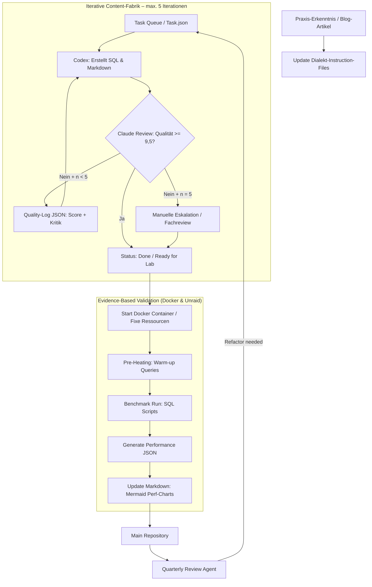

# Architektur-Konzept: AI-Driven Multi-Dialect SQL Factory

Dieses Dokument beschreibt die systemische Architektur, den Lifecycle und die Validierungsstrategie für die Erstellung, Überprüfung und Pflege der SQL-Schulungsunterlagen. Das Ziel ist ein nachhaltiges, qualitativ hochwertiges Lehr- und Referenzsystem, das:

- menschliche Fachexpertise mit KI-gestützter Generierung kombiniert,
- dialektübergreifende Konsistenz sicherstellt,
- reale Hardware-Performance in die Bewertung einbezieht.

## 1. Ziele und Leitprinzipien

### 1.1 Primäre Ziele

- **Verlässliche Qualität**: Automatisierte Qualitätssicherung auf Code-, Dokumentations- und Architektur-Ebene.
- **Dialektfähigkeit**: Unterstützung mehrerer SQL-Dialekte mit klaren Regeln und Referenzpunkten.
- **Praxisnahe Validierung**: Validierung auf echter Hardware, um Prognosen und Empfehlungen zu stützen.
- **Lebenszyklussteuerung**: Kontinuierliche Aktualisierung nach technologischen Veränderungen und neuen Best Practices.

### 1.2 Grundprinzipien

- **Experten-DNA** statt vollständiger Automatisierung: Menschlicher Input bleibt Kern der Qualitätsdefinition.
- **Iterativer Review**: Jede erzeugte Einheit durchläuft mindestens eine automatisierte und eine semantische Prüfung.
- **Kontextbewusste Regeln**: Dialektspezifische Vorgaben werden getrennt von generellen SQL-Prinzipien behandelt.
- **Messbare Validierung**: Ergebnisse werden quantitativ erfasst, um Vergleiche über Zeit und Plattformen zu ermöglichen.

## 2. Kernkomponenten

### 2.1 Anchor-Sets (Experten-DNA)

Die Anchor-Sets bilden die stabile Basis des Systems. Sie werden als Master-Vorlagen gepflegt und umfassen:

- ca. **140 T-SQL Master-Skripte**
- ca. **60 PostgreSQL Master-Skripte**

Diese Master-Skripte dienen als:

- **Stilreferenz**: Definition des „Instructor-Tons“ – pragmatisch, lösungsorientiert, erklärend.
- **Qualitätsbenchmark**: Vorlage für Kommentierung, SARGability-Hinweise, Performance-Hinweise und Best Practices.
- **Dialektleitplanken**: Gültige idiomatische Muster und anti-patterns für jeden Dialekt.

Die Anchor-Sets sind nicht statisch: Mit jeder neuen KI-Generation steigt die Fähigkeit der Agenten, fehlerhafte oder veraltete Muster eigenständig zu erkennen. Der Review-Agent prüft daher auch die Anchor-Sets selbst und stellt Optimierungsvorschläge als reguläre Tasks ein.

### 2.2 Agenten-Rollen

Das System folgt einer asymmetrischen Agentenarchitektur. Die Rollen sind klar getrennt, um Qualität und Verantwortlichkeit zu schärfen. Da alle Instruction-Files im Repository versioniert sind, lassen sich Creator und Auditor jederzeit auf andere Modelle oder Anbieter umstellen, ohne die Prozesslogik zu ändern.

- **Creator (OpenAI Codex)**
  - Erzeugt SQL-Beispiele, Erklärtexte und Schulungsinhalte.
  - Arbeitet auf Basis dialektspezifischer Instruction-Files und Fixpunkt-Vorlagen.

- **Auditor (Claude 3.5/4.5 Sonnet)**
  - Übernimmt die kritische Review-Phase.
  - Bewertet jeden Entwurf anhand des auditierbaren Bewertungsschemas (→ Abschnitt 4.4).
  - Gibt präzise Rückmeldungen zur Optimierung; das Ziel sind **9,5 / 10**.
  - **Iterationslimit**: Maximal **5 Iterationen** pro Task. Jede Iteration wird mit Score, Evidenz und Kritik in einem Quality-Log-JSON dokumentiert.
  - Wird das Zielniveau nach 5 Iterationen nicht erreicht, erfolgt **keine automatische Freigabe**, sondern eine **manuelle Eskalation** gemäß Operating Model (→ Abschnitt 8.1).
  - Die zuständige Person entscheidet dann, ob der Entwurf verworfen, gezielt überarbeitet oder mit dokumentierter Einschränkung übernommen wird.

- **Review-Agent**
  - Wird über einen definierten Schedule (vierteljährlich) gestartet.
  - Prüft das gesamte Repository auf veraltete Syntax, neue Best Practices und aktuelle DB-Versionen.
  - **Schreibt ausschließlich neue Task-Einträge in `_internal/Task/Task.json`** – er modifiziert keine Inhalte direkt.
  - Creator und Auditor arbeiten die erzeugten Tasks anschließend in der regulären Pipeline ab.

### 2.3 Validierungs-Infrastruktur

Die Validierung ist physisch und softwareseitig ausgerichtet.

- **Hardware**
  - Unraid-Server mit **96 Threads** und **256 GB RAM**.

- **Containerisierte Umgebung**
  - Docker-Container mit festen Ressourcen: **32 GB RAM, 16 Kerne**.
  - Standardisierte Images für jede Zielplattform.

- **Methodik**
  - **Warm-Cache-Measurement**: Vorab mehrere Warm-up-Abfragen (10–20 Durchläufe), um deterministische Benchmark-Bedingungen zu erreichen. Warm-Cache spiegelt **reale Produktionsbedingungen** wider, in denen häufig genutzte Abfragen im Buffer-Pool verbleiben – das ist die bewusst gewählte Referenzumgebung. Cold-Cache-Verhalten wird dort gesondert ausgewiesen, wo es didaktisch relevant ist.
  - **Performance-JSON**: Ergebnisse werden standardisiert als JSON exportiert.
  - **Vergleichbar**: Diese JSONs erlauben den Vergleich von Varianten und Versionen.

## 3. Prozessablauf

### 3.1 Input-Phase

Quellen für neue Inhalte und Aktualisierungen sind:

- internes Expertenwissen,
- Praxisfälle aus Kundenprojekten,
- aktuelle Blog-Artikel, Whitepaper oder Community-Beiträge.

Diese Erkenntnisse werden in die **Dialekt-Instruction-Files** eingespeist.

### 3.2 Generierungs-Loop

Der Kernprozess besteht aus einer iterativen Schleife zwischen Erzeugung und Review. Die Schleife ist auf **maximal 5 Iterationen** begrenzt.

- Aufgabe wird aus `Task.json` entnommen.
- **Creator** erstellt SQL- und Markdown-Entwürfe.
- **Auditor** bewertet anhand des Bewertungsschemas und gibt strukturierte Kritik zurück.
- **Jede Iteration** wird als Eintrag im Quality-Log-JSON des Tasks dokumentiert (Score, Kritik, Zeitstempel).
- Wird **9,5 / 10** erreicht, wird der Inhalt sofort als **Ready for Lab** markiert.
- Nach **5 Iterationen ohne Zielerreichung** wechselt der Task in den Status **manual_escalation_required**.
- In diesem Fall greift ein **menschlicher Qualitätsschritt**: Ein Fachautor kann den Artikel gezielt auf ein höheres Niveau heben, einzelne Schwächen korrigieren und anschließend eine neue Freigabeentscheidung treffen.

### 3.3 Physische Validierung

Nach erfolgreichem Review erfolgt die technische Verifikation:

- Docker-Container werden gestartet.
- Warm-up-Queries werden ausgeführt.
- Benchmarkläufe werden auf den Skripten durchgeführt.
- Ergebnisse werden als Performance-JSON gespeichert.
- Ausgewählte Kennzahlen werden in die Dokumentation übernommen.

### 3.4 Lifecycle & Review

Die validierten Inhalte fließen in das Repository zurück und werden regelmäßig überprüft.

- **Repository-Update**: Fertige Inhalte werden committet.
- **Review-Zyklus**: Der Review-Agent wird per Schedule gestartet und scannt den Bestand.
- **Refactor-Trigger**: Bei Erkennung veralteter Patterns oder Versions-Updates schreibt der Agent neue Einträge in `_internal/Task/Task.json`. Creator und Auditor übernehmen die Abarbeitung über die reguläre Pipeline.

### Prozess-Visualisierung



## 4. Validierungslogik und Regeln

### 4.1 Kontext-sensitive Regeln

Die Architektur trennt allgemeine SQL-Prinzipien von dialektspezifischen Regeln.

- **Global**: Lesbarkeit, Sicherheit, Vermeidung von SQL-Injection, klare Signalwörter.
- **Dialekt-spezifisch**: Syntaxpräferenzen, unterstützte Funktionen, Performance-Idiomatik.

Beispiel: **SELECT INTO** darf nicht pauschal ausgeschlossen werden.

- In Ad-hoc-Snapshots ist es oft praktikabel.
- In hochvolumigen Replikationsszenarien ist es meist ungeeignet.

Die KI-Agenten prüfen daher immer den **Szenario-Kontext**, bevor sie Empfehlungen ableiten.

### 4.2 Performance-Metriken und JSON-Schema

Die Validierung erfasst standardisierte Kennzahlen für jeden Dialekt.

- **T-SQL**: Logical Reads, CPU Time, Worker Time
- **PostgreSQL**: Shared Hit Blocks, Read Blocks, EXPLAIN ANALYZE Metriken
- **SAP HANA**: Memory Consumption, Peak Threads, Execution Time

Diese Metriken werden in einen gemeinsamen JSON-Standard überführt, damit Vergleiche und Trendanalysen möglich sind.

### 4.3 Regelbetrieb und Audit

Der Review-Agent führt vierteljährliche Scans durch, um driftende Inhalte zu erkennen:

- **Model-Drift Check**: Profitieren ältere Skripte von neuen LLM-Fähigkeiten?
- **Instruction-Sync**: Wurden neu identifizierte Best Practices in die Dialekt-Files eingepflegt?
- **Engine-Update**: Sind die Skripte mit den neuesten Docker-Images und DB-Versionen kompatibel?

Beispiele für Trigger:

- Upgrade von PostgreSQL 16 auf 17
- neue Optimierungsregeln in SQL Server
- geänderte HANA-Memory-Profile

### 4.4 Auditierbares Bewertungsschema

Jede Review-Iteration wird anhand eines auditierbaren Rubrik-Schemas bewertet. Der Gesamtscore ergibt sich als gewichteter Durchschnitt (Skala 1–10). Damit die Bewertung reproduzierbar wird, muss der Auditor zu jedem Kriterium konkrete Evidenz benennen: betroffene Stelle, Problemtyp und empfohlene Korrektur.

| Kriterium | Gewicht | Bewertungsgrundlage |
|---|---|---|
| **Technische Korrektheit** | 30 % | Syntax fehlerfrei, logisch konsistent, sicherheitskonform |
| **Didaktische Qualität** | 25 % | Klare Progression, verständliche Erklärungen, praxisnahe Beispiele |
| **SARGability & Performance** | 20 % | Korrekte Hinweise auf Indexnutzung, Predicate-SARGability, Execution-Plan-Implikationen |
| **Kommentierung & Stil** | 15 % | Inline-Kommentare, YAML-Header, Instructor-Ton, Konsistenz mit Anchor-Sets |
| **Dialektgerechtigkeit** | 10 % | Idiomatischer Code für den Zieldialekt, keine Cross-Dialect-Leakage |

#### Bewertungslogik

- **10,0 bis 9,5**: Freigabefähig, nur marginale Verbesserungen möglich.
- **9,4 bis 8,5**: Fachlich gut, aber noch mit klaren Optimierungspunkten.
- **8,4 bis 7,0**: Brauchbar, aber didaktisch, stilistisch oder technisch sichtbar unzureichend.
- **unter 7,0**: Nicht veröffentlichungsfähig.

#### Harte Gates

- Ein Gesamtscore ≥ 9,5 ist nur erreichbar, wenn **kein Einzelkriterium unter 8,0** fällt.
- Ein Task ist **nie freigabefähig**, wenn eines der folgenden Kriterien verletzt ist:
  - Syntaxfehler oder nicht lauffähiger Code
  - sicherheitskritische Fehler
  - falsche fachliche Aussage
  - nicht dialektkonforme Kernsyntax
  - fehlende YAML- oder Dokumentationspflichtfelder

#### Evidenzpflicht pro Iteration

Jede Iteration muss zusätzlich zu den Scores mindestens enthalten:

- **fundstellen**: konkrete Datei-, Abschnitts- oder Zeilenreferenzen
- **befund**: was genau falsch oder schwach ist
- **auswirkung**: warum das relevant ist
- **empfohlene_massnahme**: wie Creator den Punkt beheben soll
- **severity**: `critical`, `major`, `minor`

#### Freigabestatus

- `approved`: Score-Ziel erreicht und keine harten Gates verletzt
- `needs_revision`: weitere automatische Iteration sinnvoll
- `manual_escalation_required`: 5 Iterationen erreicht oder inhaltliche Blockade
- `rejected`: fachlich oder technisch untragbar

**Quality-Log-JSON-Schema** (ein Eintrag pro Iteration, angehängt an den Task in `Task.json`):

```json
{
  "task_id": "sql-0042",
  "dialect": "T-SQL",
  "iterations": [
    {
      "iteration": 1,
      "score_total": 7.8,
      "status": "needs_revision",
      "breakdown": {
        "technische_korrektheit": 8.0,
        "didaktische_qualitaet": 7.0,
        "sargability_performance": 8.0,
        "kommentierung_stil": 8.0,
        "dialektgerechtigkeit": 8.0
      },
      "findings": [
        {
          "severity": "major",
          "fundstelle": "Markdown-Abschnitt Performance-Hinweis",
          "befund": "SARGability-Hinweis fuer Filter auf berechnete Ausdruecke fehlt.",
          "auswirkung": "Lernende erkennen den Index-Nachteil nicht.",
          "empfohlene_massnahme": "Expliziten Vorher/Nachher-Hinweis mit sargable Alternative ergänzen."
        },
        {
          "severity": "minor",
          "fundstelle": "SQL-Kommentar bei CROSS APPLY",
          "befund": "Didaktische Einordnung unvollständig.",
          "auswirkung": "Der dialektspezifische Mehrwert bleibt unklar.",
          "empfohlene_massnahme": "Kurzkommentar zum Unterschied zu OUTER APPLY ergänzen."
        }
      ],
      "timestamp": "2026-04-19T10:15:00Z"
    }
  ],
  "final_decision": {
    "status": "manual_escalation_required",
    "reason": "Nach 5 Iterationen weiterhin didaktische Defizite",
    "approved_by": null
  }
}
```

## 5. Ausblick und Weiterentwicklung

### 5.1 Erweiterbare Dialekt- und Versionsstrategie

Das System ist so ausgelegt, dass weitere Dialekte aufgenommen werden können.

- neue Dialekt-Instruction-Files
- zusätzliche Anchor-Sets
- erweiterte Validierungscontainer

**Praktisch umsetzbare Versionsstrategie**: Nicht jede Datenbankversion erhält automatisch eine vollständige eigene Skriptkopie. Stattdessen arbeitet das System mit drei Ebenen:

- **Basis-Skript pro Dialekt und Thema**: Standardfall, auf möglichst breite Kompatibilität ausgelegt.
- **Versionsprofile**: Zusätzliche Metadaten beschreiben, für welche Versionen das Basis-Skript gültig ist.
- **Gezielte Varianten nur bei echtem Mehrwert**: Eine separate Version wird nur dann erzeugt, wenn mindestens eines der folgenden Kriterien erfüllt ist:
  - neue Syntax oder neue Funktion steht erst ab einer Version zur Verfügung
  - der Optimizer verhält sich messbar anders
  - Performance oder Planstabilität ändern sich relevant
  - der didaktische Nutzen einer spezifischen Variante ist hoch

Dadurch wird die Variantenanzahl beherrschbar gehalten. Der AI-Agent erstellt also nicht pauschal für jede Version eine Vollkopie, sondern zunächst ein robustes Basis-Skript und nur bei Bedarf gezielte Delta-Varianten.

**Empfohlene Metadaten im YAML-Header**:

- `dialect`
- `topic`
- `tested_versions`
- `recommended_min_version`
- `variant_of`
- `variant_reason`

**Beispiel einer praktikablen Umsetzung**:

- Ein Basis-Skript gilt für SQL Server 2017 bis 2022.
- Eine Zusatzvariante existiert nur für SQL Server 2022, weil dort `STRING_SPLIT` mit Ordinalität oder ein neuer Optimizer-Hinweis didaktisch relevant ist.
- Im Markdown wird die Delta-Stelle erläutert, statt das gesamte Skript künstlich zu duplizieren.

### 5.2 Messbare Qualitätssteigerung

Ziel ist ein kontinuierliches Monitoring von:

- Codequalität
- Durchlaufzeiten
- Review-Feedback
- Hardware-Performance

### 5.3 Nachhaltigkeit und Kostenstrategie

Durch den kombinierten Einsatz von:

- Expertenwissen,
- KI-Unterstützung,
- physischer Validierung,
- automatischer Lifecycle-Steuerung

wird das Material zu einer belastbaren, praxisorientierten technischen Referenz.

**Kostenmodell**: Ein lokales Modell wird bereits produktionsnah auf einer **RTX 3090** betrieben; **Ollama** ist vorhanden und einsatzfähig. Der operative Standard nutzt derzeit dennoch große externe Modelle, weil deren Qualität bei komplexen SQL- und Review-Aufgaben aktuell höher ist.

Die Strategie ist daher **hybrid statt entweder-oder**:

- **lokale Modelle** für Voranalysen, einfache Transformationsaufgaben, Batch-Vorbereitung und kostensensitive Hintergrundläufe
- **große Remote-Modelle** für anspruchsvolle Generierung, Review, Grenzfälle und Qualitätsentscheidungen

Dadurch wird bestehende Hardware aktiv genutzt, ohne Qualitätsverlust in kritischen Prozessschritten zu riskieren. Da alle Instruction-Files im Repository versioniert sind, bleibt ein späterer Shift hin zu stärker lokaler Verarbeitung ohne Architekturbruch möglich.

## 6. Reviewer-Agent Prompt

Der folgende Prompt ist für einen Review-Agent gedacht, der **keine Inhalte direkt ändert**, sondern **hochwertige, präzise und priorisierte Tasks** für `_internal/Task/Task.json` erzeugt.

```text
Du bist der Review-Agent der AI-Driven Multi-Dialect SQL Factory.

Deine Aufgabe ist es, das Repository read-only zu analysieren und daraus hochwertige, umsetzbare Tasks fuer die Task-Queue abzuleiten. Du darfst keine Inhalte direkt aendern. Du erzeugst ausschliesslich Review-Ergebnisse und konkrete Task-Vorschlaege.

Ziele:
1. Identifiziere fachliche, didaktische, stilistische, performancebezogene und versionsbedingte Schwachstellen.
2. Formuliere nur Tasks, die fuer Creator und Auditor direkt bearbeitbar sind.
3. Vermeide vage Hinweise wie "Dokumentation verbessern" oder "Performance pruefen" ohne konkreten Befund.
4. Priorisiere nach Nutzen, Risiko und Dringlichkeit.

Pruefregeln:
- Pruefe SQL-Skripte, Markdown-Dokumentation, YAML-Header und bekannte Dialektkonventionen.
- Achte auf technische Korrektheit, Dialektgerechtigkeit, SARGability, Lehrbarkeit, Konsistenz mit Anchor-Sets und Versionstauglichkeit.
- Beruecksichtige Unterschiede zwischen Datenbankversionen nur dann als separaten Task, wenn daraus echter technischer oder didaktischer Mehrwert entsteht.
- Wenn ein Problem bereits durch einen bestehenden Task abgedeckt ist, erzeuge keinen Dubletten-Task.
- Bevorzuge wenige, praezise und hochwertige Tasks gegenueber vielen allgemeinen Notizen.

Jeder erzeugte Task muss enthalten:
- einen klaren Titel
- einen konkreten Problemfokus
- betroffene Dateien oder Zielpfade
- eine nachvollziehbare fachliche Begruendung
- eine schaetzbare Bearbeitungsrichtung
- Acceptance Criteria, die objektiv pruefbar sind
- eine Prioritaet

Nutze fuer jeden vorgeschlagenen Task dieses Denkmuster:
1. Was ist konkret falsch, veraltet, unklar oder unvollstaendig?
2. Warum ist das fuer Lernende, technische Korrektheit oder Performance relevant?
3. Welche minimale, hochwertige Aenderung loest das Problem?
4. Woran erkennt Auditor spaeter eindeutig, dass der Task erfolgreich erledigt wurde?

Ausgabeformat:
Liefere fuer jeden Task ein JSON-Objekt, das in die bestehende Struktur von `_internal/Task/Task.json` passt.

Pflichtfelder:
- id
- title
- type
- status = "todo"
- priority
- created_at
- depends_on
- topic
- target_paths
- prompt
- acceptance_criteria
- retry_count = 0
- last_error = null
- lease = null

Qualitaetsmassstab fuer gute Tasks:
- spezifisch statt allgemein
- umsetzbar statt diagnostisch-offen
- priorisiert statt unsortiert
- ohne Dubletten
- mit klarer fachlicher Absicht

Wenn du unsicher bist, ob ein Befund relevant genug ist, erzeuge keinen Task. Bevorzuge Signal vor Rauschen.
```

## 7. Formale Schemas: Vertragsbasis für Creator, Auditor und Reviewer-Agent

Die folgenden JSON-Schemas definieren die exakte Struktur der zentralen Datenstrukturen. Sie dienen als verbindliche Vertragsbasis zwischen allen beteiligten Agenten und ermöglichen automatisierte Validierung, Typprüfung und eindeutige Schnittstellen.

### 7.1 Task-Schema

Das Task-Schema beschreibt die Struktur eines einzelnen Tasks in `_internal/Task/Task.json`.

```json
{
  "$schema": "http://json-schema.org/draft-07/schema#",
  "$id": "https://sql-training.internal/schemas/task.schema.json",
  "title": "SQL Training Task",
  "description": "Ein einzelner Task in der SQL Factory Pipeline",
  "type": "object",
  "required": [
    "id",
    "title",
    "type",
    "status",
    "priority",
    "created_at",
    "depends_on",
    "topic",
    "target_paths",
    "prompt",
    "acceptance_criteria",
    "retry_count",
    "last_error",
    "lease"
  ],
  "properties": {
    "id": {
      "type": "string",
      "description": "Eindeutige Task-ID im Format sql-NNNN oder review-NNNN",
      "pattern": "^(sql|review|refactor)-[0-9]{4,}$"
    },
    "title": {
      "type": "string",
      "description": "Kurzer, aussagekräftiger Task-Titel",
      "minLength": 10,
      "maxLength": 150
    },
    "type": {
      "type": "string",
      "description": "Task-Typ",
      "enum": [
        "write_sql_script",
        "refactor_script",
        "update_documentation",
        "review_quality",
        "benchmark_validation",
        "version_migration"
      ]
    },
    "status": {
      "type": "string",
      "description": "Aktueller Bearbeitungsstatus",
      "enum": [
        "todo",
        "in_progress",
        "done",
        "manual_escalation_required",
        "blocked",
        "rejected"
      ]
    },
    "priority": {
      "type": "integer",
      "description": "Priorität (1000 = höchste, 1 = niedrigste)",
      "minimum": 1,
      "maximum": 1000
    },
    "created_at": {
      "type": "string",
      "description": "ISO 8601 Zeitstempel der Task-Erstellung",
      "format": "date-time"
    },
    "depends_on": {
      "type": "array",
      "description": "Liste der Task-IDs, die vor diesem Task abgeschlossen sein müssen",
      "items": {
        "type": "string",
        "pattern": "^(sql|review|refactor)-[0-9]{4,}$"
      }
    },
    "topic": {
      "type": "string",
      "description": "Fachliche Kurzbeschreibung oder Themenzuordnung",
      "minLength": 5,
      "maxLength": 300
    },
    "target_paths": {
      "type": "array",
      "description": "Liste der zu erstellenden oder zu bearbeitenden Dateien",
      "items": {
        "type": "string"
      },
      "minItems": 1
    },
    "prompt": {
      "type": "string",
      "description": "Detaillierte Aufgabenbeschreibung für den Creator",
      "minLength": 20
    },
    "acceptance_criteria": {
      "type": "array",
      "description": "Objektiv prüfbare Kriterien zur Abnahme",
      "items": {
        "type": "string"
      },
      "minItems": 1
    },
    "retry_count": {
      "type": "integer",
      "description": "Anzahl bisheriger Wiederholungsversuche",
      "minimum": 0
    },
    "last_error": {
      "type": ["string", "null"],
      "description": "Fehlermeldung des letzten Fehlversuchs oder null"
    },
    "lease": {
      "type": ["object", "null"],
      "description": "Lease-Informationen bei verteilter Verarbeitung",
      "properties": {
        "agent_id": {
          "type": "string"
        },
        "expires_at": {
          "type": "string",
          "format": "date-time"
        }
      }
    },
    "result": {
      "type": "object",
      "description": "Ergebnisobjekt nach erfolgreicher Bearbeitung",
      "properties": {
        "completed_at": {
          "type": "string",
          "format": "date-time"
        },
        "files_changed": {
          "type": "array",
          "items": {
            "type": "string"
          }
        },
        "assumptions": {
          "type": "array",
          "items": {
            "type": "string"
          }
        }
      }
    },
    "quality_log": {
      "$ref": "#/definitions/QualityLog"
    }
  },
  "definitions": {
    "QualityLog": {
      "type": "object",
      "description": "Quality-Log für iterative Review-Prozesse",
      "required": ["task_id", "dialect", "iterations", "final_decision"],
      "properties": {
        "task_id": {
          "type": "string"
        },
        "dialect": {
          "type": "string",
          "enum": ["T-SQL", "PostgreSQL", "Oracle", "MySQL", "SAP HANA"]
        },
        "iterations": {
          "type": "array",
          "items": {
            "$ref": "#/definitions/Iteration"
          }
        },
        "final_decision": {
          "$ref": "#/definitions/FinalDecision"
        }
      }
    },
    "Iteration": {
      "type": "object",
      "required": [
        "iteration",
        "score_total",
        "status",
        "breakdown",
        "findings",
        "timestamp"
      ],
      "properties": {
        "iteration": {
          "type": "integer",
          "minimum": 1,
          "maximum": 5
        },
        "score_total": {
          "type": "number",
          "minimum": 1.0,
          "maximum": 10.0
        },
        "status": {
          "type": "string",
          "enum": [
            "approved",
            "needs_revision",
            "manual_escalation_required",
            "rejected"
          ]
        },
        "breakdown": {
          "type": "object",
          "required": [
            "technische_korrektheit",
            "didaktische_qualitaet",
            "sargability_performance",
            "kommentierung_stil",
            "dialektgerechtigkeit"
          ],
          "properties": {
            "technische_korrektheit": {
              "type": "number",
              "minimum": 1.0,
              "maximum": 10.0
            },
            "didaktische_qualitaet": {
              "type": "number",
              "minimum": 1.0,
              "maximum": 10.0
            },
            "sargability_performance": {
              "type": "number",
              "minimum": 1.0,
              "maximum": 10.0
            },
            "kommentierung_stil": {
              "type": "number",
              "minimum": 1.0,
              "maximum": 10.0
            },
            "dialektgerechtigkeit": {
              "type": "number",
              "minimum": 1.0,
              "maximum": 10.0
            }
          }
        },
        "findings": {
          "type": "array",
          "items": {
            "$ref": "#/definitions/Finding"
          }
        },
        "timestamp": {
          "type": "string",
          "format": "date-time"
        }
      }
    },
    "Finding": {
      "type": "object",
      "required": [
        "severity",
        "fundstelle",
        "befund",
        "auswirkung",
        "empfohlene_massnahme"
      ],
      "properties": {
        "severity": {
          "type": "string",
          "enum": ["critical", "major", "minor"]
        },
        "fundstelle": {
          "type": "string",
          "description": "Konkrete Datei-, Abschnitts- oder Zeilenreferenz"
        },
        "befund": {
          "type": "string",
          "description": "Was genau falsch oder schwach ist"
        },
        "auswirkung": {
          "type": "string",
          "description": "Warum das relevant ist"
        },
        "empfohlene_massnahme": {
          "type": "string",
          "description": "Wie Creator den Punkt beheben soll"
        }
      }
    },
    "FinalDecision": {
      "type": "object",
      "required": ["status", "reason"],
      "properties": {
        "status": {
          "type": "string",
          "enum": [
            "approved",
            "manual_escalation_required",
            "rejected"
          ]
        },
        "reason": {
          "type": "string",
          "description": "Begründung der finalen Entscheidung"
        },
        "approved_by": {
          "type": ["string", "null"],
          "description": "Name oder Identifikator des genehmigenden Reviewers"
        },
        "approved_at": {
          "type": ["string", "null"],
          "format": "date-time"
        }
      }
    }
  }
}
```

### 7.2 Verwendung der Schemas

#### Validierung

Die Schemas können zur automatischen Validierung von Task- und Quality-Log-Dateien verwendet werden:

```bash
# Validierung mit ajv-cli (Node.js)
ajv validate -s task.schema.json -d Task.json

# Validierung mit Python jsonschema
python -c "import json, jsonschema; jsonschema.validate(json.load(open('Task.json')), json.load(open('task.schema.json')))"
```

#### Integration in Agenten

**Creator**: Erzeugt Tasks mit vollständiger Struktur gemäß Task-Schema.

**Auditor**: Schreibt Quality-Logs mit vollständiger Iteration- und Finding-Struktur.

**Reviewer-Agent**: Generiert neue Tasks in validem Format und prüft bestehende Tasks gegen das Schema.

#### Änderungsmanagement

Wenn sich die Struktur ändern muss:

1. Schema anpassen und Versionsnummer im `$id`-Feld erhöhen.
2. Alle beteiligten Agenten auf die neue Version anpassen.
3. Bestehende Tasks optional migrieren oder Schema abwärtskompatibel erweitern.

### 7.3 Validierungshinweise

- **Harte Gates**: Tasks mit `status: "manual_escalation_required"` dürfen nicht automatisch auf `done` wechseln.
- **Iterationslimit**: Das `iterations`-Array darf maximal 5 Einträge enthalten.
- **Score-Konsistenz**: Der `score_total` muss der gewichteten Summe der `breakdown`-Werte entsprechen.
- **Severity-Kontrolle**: Ein Task mit mindestens einem `critical`-Finding darf nicht `approved` sein.

Diese Schemas stellen sicher, dass alle Agenten dieselbe Datenstruktur verstehen und nutzen, und erlauben automatisierte Qualitätsprüfungen auf Prozessebene.

## 8. Betriebsmodell und Governance

Die folgenden Abschnitte definieren konkrete Betriebsregeln, die über die reine Architektur hinausgehen und sicherstellen, dass das System praktisch betreibbar bleibt.
### 8.1 Operating Model: Manuelle Eskalation

Wenn ein Task nach 5 Iterationen den Freigabescore nicht erreicht, erfolgt eine strukturierte Eskalation:

**Verantwortlichkeiten**

- **Eskalationsziel**: Senior SQL Architect oder bestimmter Fachautor (rotierend, wöchentlich)
- **Benachrichtigung**: Automatischer Slack/E-Mail-Alert mit Link zum Quality-Log
- **Entscheidungsbefugnis**: Vollständig – kann verwerfen, Task neu schreiben oder mit dokumentierter Einschränkung freigeben

**SLA**

- **Standard-Tasks**: Reaktion innerhalb von 48 Stunden
- **Kritische Tasks** (Sicherheitsfixes, Produktionsblocker): Reaktion innerhalb von 24 Stunden
- **Nicht-kritische Refactorings**: Reaktion innerhalb von 5 Werktagen

**Wiedereintritt in den Flow**

- **Bei Überarbeitung**: Task wechselt Status zu `in_progress`, Creator erhält gezielten Korrekturauftrag mit dokumentierten Änderungsanforderungen
- **Bei Freigabe mit Einschränkung**: Status wird auf `done`, aber mit Flag `conditional_approval` und dokumentierter Begründung in `final_decision.reason`
- **Bei Verwerfung**: Status `rejected`, Task wird archiviert, optional wird ein neuer Task mit präzisierten Anforderungen erstellt

### 8.2 Testkonzept: Funktionale Korrektheit

Performance-Messungen allein reichen nicht. Jedes Skript durchläuft zusätzlich folgende Tests:

**Test-Harness-Struktur**

```
<Dialekt>/<Kapitel>/Tests/
├── <SkriptName>_test.sql
├── expected_results.json
└── edge_cases.json
```

**Testebenen**

1. **Resultset-Verifikation**: Erwartete Spalten, Datentypen, Zeilenanzahl
2. **Wertebereichsprüfung**: Aggregate, Null-Handling, Extremwerte
3. **Edge Cases**: leere Tabellen, sehr große Datasets, Collation-Unterschiede
4. **Versionsabweichungen**: Unterschiedliche Verhalten je DB-Version werden explizit dokumentiert

**Beispiel expected_results.json**

```json
{
  "script": "BcnfDecompositionStarter.sql",
  "version": "SQL Server 2019+",
  "test_cases": [
    {
      "name": "basic_decomposition",
      "expected_rowcount": 12,
      "expected_columns": ["StudentID", "CourseCode", "InstructorName"],
      "key_assertions": [
        {"column": "StudentID", "null_count": 0}
      ]
    }
  ]
}
```

**Testausführung**

- Teil der physischen Validierungsphase (Abschnitt 3.3)
- Bei Fehlschlag: Task bleibt in `manual_escalation_required` statt auf `done` zu wechseln

### 8.3 Routing-Policy: Lokale vs. Remote Modelle

Festgelegte Regeln, wann welches Modell genutzt wird:

**Lokale Modelle (RTX 3090 / Ollama)**

- Task-Typ `refactor_script` mit erwarteter Score-Verbesserung < 2 Punkte
- Batch-Vorbereitung (z. B. Codestyle-Normalisierung)
- Voranalysen für Review-Agent
- Einfache Transformationsaufgaben (Markdown-Sync)

**Remote-Modelle (OpenAI / Anthropic)**

- Alle `write_sql_script` Tasks
- `review_quality` Tasks (Auditor-Rolle)
- Grenzfälle nach 3. Iteration ohne Score-Fortschritt
- Sicherheitskritische oder hochkomplexe Refactorings

**Eskalationslogik**

- Wenn lokales Modell nach 2 Iterationen Score < 7,0 liefert → automatischer Wechsel auf Remote-Modell
- Bei Remote-API-Ausfall → lokales Modell übernimmt, Task erhält Flag `fallback_mode` und wird später manuell nachgeprüft

**Schwellwerte**

- Lokale Modelle dürfen nur Tasks mit initialer Komplexität ≤ 6/10 annehmen
- Bei Qualitätsdrift (3 aufeinanderfolgende lokale Tasks mit Score < 8,0) → temporärer Stopp lokaler Verarbeitung

### 8.4 Variantenkonvention

Klare Regeln für Versionsvarianten, um Wildwuchs zu verhindern:

**Ordnerstruktur**

```
<Dialekt>/<Kapitel>/SQLScripts/
├── <SkriptName>.sql                     # Basis-Skript (breit kompatibel)
├── <SkriptName>.md                      # Basis-Dokumentation
├── variants/
│   ├── <SkriptName>_v2022.sql          # Version-spezifische Variante
│   └── <SkriptName>_v2022.md           # Delta-Dokumentation
```

**Naming-Convention**

- Basis: `<SkriptName>.sql`
- Variante: `<SkriptName>_v<Version>.sql` (z. B. `_v2022`, `_v16`)
- Nicht: `<SkriptName>_neu.sql` oder `<SkriptName>_fixed.sql`

**YAML-Header-Pflichtfelder für Varianten**

```yaml
variant_of: "BcnfDecompositionStarter.sql"
variant_reason: "Nutzt STRING_SPLIT mit Ordinalität (ab SQL Server 2022)"
min_version: "SQL Server 2022"
tested_versions: ["SQL Server 2022"]
```

**Lifecycle-Regeln**

- Varianten werden gelöscht, wenn die `min_version` der Variante zur neuen `min_version` des Basis-Skripts wird
- Jährlicher Review: Sind alle Varianten noch didaktisch sinnvoll oder kann das Basis-Skript nachgezogen werden?
- Synchronisation: Bei Änderung am Basis-Skript wird automatisch geprüft, ob Varianten ebenfalls angepasst werden müssen (via Review-Agent)

**Maximale Variantenanzahl**

- Pro Skript maximal **3 aktive Varianten**
- Bei mehr als 3 Varianten: Basis-Skript muss refactored werden, um häufigste Use Cases abzudecken

### 8.5 Reviewer-Kalibrierung: Score-Ankerbeispiele

Um Bewertungen intersubjektiv stabil zu machen, existieren für jedes Rubrik-Kriterium konkrete Ankerbeispiele.

**Beispiel: Didaktische Qualität**

| Score | Ankerbeispiel |
|---|---|
| **10** | Progressiver Aufbau, klare Lernziele, Vorher/Nachher-Vergleiche, didaktische Hinweise auf häufige Fehler |
| **8** | Solide Erklärungen, aber ohne explizite Lernziele oder fehlende Kontextualisierung |
| **6** | Funktionaler Code, aber Kommentare zu technisch oder zu knapp für Lernende |
| **4** | Code ohne Erklärung oder inkonsistente Progression |

**Beispiel: SARGability & Performance**

| Score | Ankerbeispiel |
|---|---|
| **10** | Explizite Hinweise auf Index-Nutzung, SARGable vs. Non-SARGable Alternativen gezeigt, Execution-Plan-Referenz |
| **8** | Performance-Hinweise vorhanden, aber ohne konkreten Vorher/Nachher-Vergleich |
| **6** | Code ist performant, aber keine didaktischen Hinweise auf Optimierungen |
| **4** | Suboptimale Patterns ohne Erklärung oder Warnung |

**Verwendung**

- Diese Ankerbeispiele sind in den Dialekt-Instruction-Files hinterlegt
- Der Auditor nutzt sie als Referenz bei jeder Iteration
- Bei Kalibrierungsabweichungen (zwei Reviewer bewerten dasselbe Skript mit > 1,5 Punkten Differenz) wird ein Alignment-Review durchgeführt

### 8.6 Anchor-Set-Regression

Die Anchor-Sets sind die Qualitätsbasis des Systems, dürfen aber selbst nicht fehlerhaft werden.

**Testprozess**

1. **Vierteljährlich**: Review-Agent prüft alle Anchor-Sets gegen aktuelle Best Practices
2. **Automatische Prüfung**: Syntaxfehler, veraltete Funktionen, deprecated Syntax
3. **Manuelle Stichprobe**: 10 % der Anchor-Sets werden von einem Experten nachgeprüft

**Trigger für Anchor-Set-Korrektur**

- Mehr als 3 Tasks desselben Themas scheitern mit ähnlicher Kritik
- Neue SQL-Version macht Patterns obsolet
- Community-Feedback zeigt systematischen Fehler

**Korrekturprozess**

- Anchor-Set-Korrektur wird als **hochpriorisierter Task** in die Queue geschrieben
- Nach Korrektur: Alle abgeleiteten Skripte werden auf Betroffenheit geprüft
- Optional: Retroaktive Korrektur bereits generierter Inhalte via Batch-Refactor

### 8.7 Task-Deduplizierung

Um Dubletten zu verhindern, nutzt der Review-Agent folgende Mechanismen:

**Fachlicher Fingerprint**

Jeder Task erhält einen Hash aus Topic, Zielpfaden und Problemkategorie.

**Ähnlichkeitsprüfung**

Vor Erzeugung eines neuen Tasks:

1. Bestehende offene Tasks (`status != done`) werden durchsucht
2. Textähnlichkeit (Cosine-Similarity auf Topic + Prompt) wird berechnet
3. Bei Ähnlichkeit > 0,85 → Task wird nicht erzeugt, stattdessen Hinweis im Review-Log

**Manuelle Deduplizierung**

- Wöchentlicher Report: Liste potenzieller Dubletten (Ähnlichkeit 0,70–0,85)
- Manueller Review entscheidet, ob Tasks zusammengelegt oder beibehalten werden

### 8.8 Ausblick: Artefakttrennung

Langfristig sollten Tasks, Quality-Logs und Execution-Results getrennt verwaltet werden:

**Aktuell**: Quality-Log ist Teil der Task-Struktur (pragmatisch, aber eng gekoppelt)

**Zukünftig**:

- `Task.json` enthält nur Task-Metadaten und Referenzen
- `QualityLogs/<task_id>.json` für Review-Historie
- `ExecutionResults/<task_id>.json` für Benchmark- und Testergebnisse

**Vorteile**:

- Einfachere Historisierung
- Geringere Task-Dateigröße
- Flexiblere Abfragen (z. B. „alle Tasks mit Score-Trend abwärts")
- Vereinfachte Migration bei Schema-Änderungen

**Migrationsaufwand**: mittel bis hoch, daher erst bei > 500 Tasks oder nach 1 Jahr Betrieb empfohlen.
