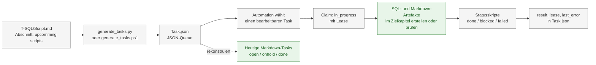

# Archiv: ehemalige JSON-Task-Queue

Dieser Ordner bewahrt die frühere, JSON-basierte Queue und ihre Hilfsdateien
als nachvollziehbare Historie auf. Die Queue selbst sowie ihre temporären
Arbeitsdateien wurden entfernt. Maßgeblich sind jetzt die einzelnen
Markdown-Tasks unter [`_internal/Task`](../../Task/).

## Aktueller Task-Ablauf

1. Wähle einen Task aus [`_internal/Task/open`](../../Task/open/), bevorzugt
   nach hoher `priority` und fachlicher Dringlichkeit.
2. Lies den Task vollständig, insbesondere Zielpfade, Umsetzungsauftrag und
   Akzeptanzkriterien. Beachte zusätzlich [`ai_agents.md`](../../../ai_agents.md)
   und den SQL-Standard in
   [`_internal/SQL-Script/instruction_SQL_Script.md`](../../SQL-Script/instruction_SQL_Script.md).
3. Setze ausschließlich die im Task beschriebenen Änderungen um und prüfe die
   Akzeptanzkriterien.
4. Dokumentiere Entscheidungen, Änderungen und Validierungen im
   Agentenprotokoll des Tasks.
5. Verschiebe einen erfolgreich geprüften Task nach `done`. Wenn Artefakte
   vorhanden sind, aber Anforderungen fehlen oder ein fachlicher Blocker
   besteht, gehört er nach `onhold` und erhält eine konkrete Begründung.

Die Statusordner sind:

| Ordner | Bedeutung |
|---|---|
| [`open`](../../Task/open/) | noch umzusetzende Tasks |
| [`onhold`](../../Task/onhold/) | vorhandene, aber unvollständige oder blockierte Umsetzungen |
| [`done`](../../Task/done/) | strukturell geprüfte, abgeschlossene Tasks |
| [`idea`](../../Task/idea/) | separat erfasste, noch nicht in die Initialserie überführte Themen |

## Rekonstruktion der Initialserie

Die ursprüngliche Roadmap stand in `T-SQL/Script.md`, Abschnitt
`upcomming scripts`. Sie enthielt 1.000 geplante SQL-/Markdown-Paare. Die
stabile Sicherung `Task.rebuilt.json` ergänzte dafür IDs, Prioritäten,
Akzeptanzkriterien und vorhandene Abschlüsse.

Daraus wurden 1.000 Dateien nach dem Muster
`MSSQL_TASK_initial_XXXX.md` erstellt. Jede Datei folgt
[`_internal/task_template.md`](../../task_template.md) und enthält:

- YAML-Frontmatter mit Status, Priorität, Quellreferenz und Zielpfaden,
- Anlass, vorhandene Abdeckung und konkreten Umsetzungsauftrag,
- prüfbare Akzeptanzkriterien sowie
- ein fortzuschreibendes Agentenprotokoll.

### Finaler Rekonstruktionsstand

| Status | Anzahl | Einordnung |
|---|---:|---|
| `done` | 425 | SQL und Markdown vorhanden; Header, Pflichtfelder, SQLDOC-Marker, Mermaid, SQL-Codeblock und Annahmen oder Einordnung strukturell geprüft |
| `open` | 575 | weder SQL- noch Markdown-Zielartefakt vorhanden |
| `onhold` | 0 | kein Task ist aktuell zurückgestellt |

Die ursprünglich 22 `onhold`-Tasks wurden nach einer erneuten Prüfung nach
`done` überführt. Bei 17 Fällen war die erste Prüfung zu eng (eine
**Einordnung** erfüllt die geforderte fachliche Kontextangabe, und
`~~~sql` ist ein gültiger Markdown-Codezaun). Bei fünf Fällen wurden
fehlerhafte Markdown-Codezäune korrigiert:

- drei SQL-Codezäune,
- zwei Mermaid- und SQL-Codezäune.

Die Rekonstruktion war eine statische Repository-Prüfung; die SQL-Skripte
wurden dabei nicht gegen einen SQL-Server ausgeführt.

## Inhalt dieses Archivordners

| Datei | Historische Rolle |
|---|---|
| `01_Skill.md` | frühere Arbeitsanweisung für die Erstellung eines SQL-/Markdown-Paars |
| `02_Automations.md` | früheres Status- und Claiming-Modell der JSON-Queue |
| `generate_tasks.py`, `generate_tasks.ps1` | frühere Generierung der Queue aus `T-SQL/Script.md` |
| `update_task_status.ps1`, `update_task_lease.ps1`, `complete_task_sql_0399.ps1` | frühere Status- und Lease-Hilfsskripte |

Diese Dateien sind Archivmaterial und sollen nicht mehr gegen eine neue
`Task.json` ausgeführt werden. Neue oder überarbeitete Aufgaben werden direkt
als Markdown-Task nach der aktuellen Ordnerstruktur gepflegt.

## Historischer Ablauf der JSON-Queue

Das folgende Diagramm dokumentiert den früheren Ablauf. Es dient nur der
Einordnung des Archivs; der rechte Teil mit `Task.json` und den Statusskripten
ist nicht mehr aktiv.

