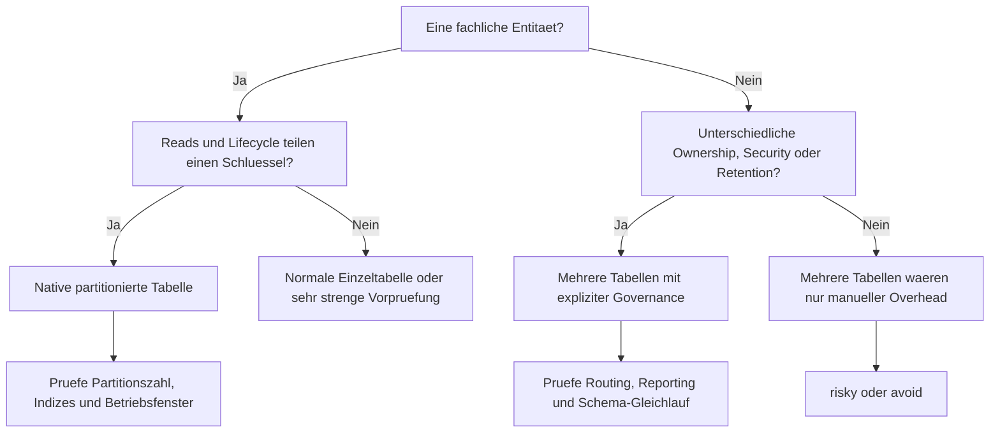

# Horizontale Partitionierung: eine partitionierte Tabelle oder mehrere Tabellen?

## Versions- und Geltungsbereich

- Stand: 2026-03-09
- Fuehrendes System: PostgreSQL 18.3
- Behandelte Versionen:
  - SQL Server 2025 (17.x)
  - PostgreSQL 18.3
  - Oracle AI Database 26ai
  - MySQL 8.4 LTS
- Andere Releases koennen abweichen, besonders bei DDL-Details, Indexfolgen, FK-Grenzen und Maintenance-Operationen.

## Methodischer Status

Dieser Artikel basiert auf:

- offizieller Produktdokumentation
- einem redaktionellen Themenplan
- kleinen dokumentationsbasierten Syntax-Snippets und Micro-Beispielen

Nicht enthalten in dieser Fassung:

- ausgefuehrte Demo-Skripte
- Testlaeufe auf echten Instanzen
- Benchmark-Messungen
- planbasierte Vergleichsexperimente

Daher sind die Aussagen hier primaer dokumentationsbasiert. Architektururteile ueber mehrere Tabellen sind bewusst als vorsichtige Ableitung aus Herstellerdokumentation und produktneutraler Betriebslogik formuliert.

## Leserleitfaden in 30 Sekunden

- Wenn du zwischen nativer Partitionierung und Jahrestabellen entscheiden musst, lies zuerst "Die wichtigste praktische Unterscheidung", "Vor jeder produktiven Umsetzung" und "Ein praxisnahes Entscheidungsmodell".
- Wenn du PostgreSQL betreibst, lies den Artikel linear. Die Fuehrungsachse liegt auf virtueller Root-Tabelle, Partition Pruning und den Alternativen ueber Inheritance oder `UNION ALL`.
- Wenn du aus SQL Server kommst, achte besonders auf die Gegenueberstellung von partitioned tables und partitioned views.
- Wenn dein Schmerz eher in Reporting, ETL oder Deployments liegt, lies "Wovon die Wahl abhaengt" und "Welche Rolle Indizes, Constraints, Routing, Logging und Betrieb spielen".

## Warum PostgreSQL in dieser Episode fuehrt

PostgreSQL fuehrt diese Episode nicht, weil es die groesste Featureliste haette. Es fuehrt, weil die Dokumentation die eigentliche Architekturfrage hier besonders klar macht: eine partitionierte Tabelle ist eine virtuelle Tabelle mit echten Partitionen darunter, waehrend Inheritance oder `UNION ALL`-Views alternative Formen mit anderer Verantwortung und anderen Folgen sind. Genau dieser Kontrast trifft den Kern des Themas.

## Verfuegbare Schulungsunterlagen im Repository

- [T-SQL - Partitionierung](../../T-SQL/65_Partitioning/65_Partitioning.md)
- [T-SQL - Views und Schemata](../../T-SQL/22_Views_Schemata/22_Views_Schemata.md)
- [T-SQL - Data Integrity und Constraints](../../T-SQL/16_DataIntegrity_Constraints/16_DataIntegrity_Constraints.md)
- [T-SQL - Index Basics](../../T-SQL/26_Indexes_Basics/26_Indexes_Basics.md)
- [T-SQL - ETL-Muster](../../T-SQL/75_SSVEPatterns_for_ETL/75_SSVEPatterns_for_ETL.md)

## Weitere Dialekte in dieser Episode

SQL Server, Oracle und MySQL werden in diesem Artikel fachlich mitbehandelt. Eigenstaendig ausgebaute themenspezifische Trainingskapitel in diesen Root-Ordnern folgen spaeter.

## Inhaltsverzeichnis

- [TL;DR gesamt](#tldr-gesamt)
- [TL;DR pro relevantem System](#tldr-pro-relevantem-system)
- [Syntax-Oberflaeche im Schnellvergleich](#syntax-oberflaeche-im-schnellvergleich)
- [Systemvergleich auf einen Blick](#systemvergleich-auf-einen-blick)
- [Drei Muster zur ersten Orientierung](#drei-muster-zur-ersten-orientierung)
- [1. Was horizontale Partitionierung hier bedeutet](#1-was-horizontale-partitionierung-hier-bedeutet)
- [2. Warum die intuitive Sicht zu kurz greift](#2-warum-die-intuitive-sicht-zu-kurz-greift)
- [3. Welche internen Klassen es gibt](#3-welche-internen-klassen-es-gibt)
- [4. Wovon die Wahl abhaengt](#4-wovon-die-wahl-abhaengt)
- [5. Was intern passiert: eine Tabelle gegen viele Tabellen](#5-was-intern-passiert-eine-tabelle-gegen-viele-tabellen)
- [6. Deep Dive: PostgreSQL als fuehrendes System](#6-deep-dive-postgresql-als-fuehrendes-system)
- [7. Die wichtigste praktische Unterscheidung](#7-die-wichtigste-praktische-unterscheidung)
- [8. Welche Rolle Indizes, Constraints, Routing, Logging und Betrieb spielen](#8-welche-rolle-indizes-constraints-routing-logging-und-betrieb-spielen)
- [9. Vor jeder produktiven Umsetzung: technische Vorpruefung](#9-vor-jeder-produktiven-umsetzung-technische-vorpruefung)
- [10. Die Hauptstrategien sauber eingeordnet](#10-die-hauptstrategien-sauber-eingeordnet)
- [11. Ein praxisnahes Entscheidungsmodell](#11-ein-praxisnahes-entscheidungsmodell)
- [Verwandte Themen](#verwandte-themen)
- [12. Fazit](#12-fazit)
- [13. Kurzform fuer die Praxis](#13-kurzform-fuer-die-praxis)

## TL;DR gesamt

- Native horizontale Partitionierung und mehrere Tabellen loesen nicht dasselbe Problem.
- Native Partitionierung ist stark, wenn eine logische Tabelle erhalten bleiben soll, aber Pruning, Wartung und Lifecycle auf Teilmengen profitieren.
- Mehrere Tabellen sind erst dann robust, wenn fachlich wirklich getrennte Datenraeume gewollt sind, etwa wegen Ownership, Security, Retention oder Deployment.
- Wer eine einzelne Entitaet nur aus Groessenangst in Jahrestabellen aufspaltet, verschiebt Komplexitaet fast immer in Reporting, ETL, Routing und Schema-Governance.
- PostgreSQL, SQL Server, Oracle und MySQL zeigen dieselbe Problemklasse in vier verschiedenen Datenbankkulturen, nicht als eine Leitform mit drei Uebersetzungen.

## TL;DR pro relevantem System

- PostgreSQL: Stark, wenn der Parent die natuerliche Oberflaeche bleibt und Partition Pruning sowie Detach oder Drop echte Vorteile bringen. Alternativen ueber Inheritance oder `UNION ALL` sind bewusst andere Formen.
- SQL Server: Stark, wenn eine einzige Tabelle mit Partition Function, Scheme und aligned indexes sinnvoll ist. Partitioned views sind kein Alias fuer dasselbe, sondern eine andere Architektur ueber mehrere Member-Tabellen.
- Oracle: Stark, wenn Lifecycle, Partition Independence und Indexstrategie zusammen gedacht werden. Gerade lokale gegen globale Indizes entscheiden mit ueber die Robustheit.
- MySQL: Die Grundidee ist dieselbe, aber das System setzt engere Grenzen. Eine einfache Tabelle oder einfache Partitionierung ist oft robuster als eine improvisierte Tabellenfamilie.

## Syntax-Oberflaeche im Schnellvergleich

Die folgenden Snippets zeigen bewusst nur die Oberflaeche. Sie erklaeren nicht die ganze Architektur, aber sie machen sichtbar, wie jedes System native horizontale Partitionierung als eine Tabelle mit Teilmengen ausdrueckt.

### SQL Server

```sql
CREATE PARTITION FUNCTION pf_order_date (date)
AS RANGE RIGHT FOR VALUES ('2026-01-01', '2026-04-01');

CREATE PARTITION SCHEME ps_order_date
AS PARTITION pf_order_date ALL TO ([PRIMARY]);
```

### PostgreSQL

```sql
CREATE TABLE orders (
  order_id bigint,
  order_date date not null
) PARTITION BY RANGE (order_date);

CREATE TABLE orders_2026_q1
  PARTITION OF orders
  FOR VALUES FROM ('2026-01-01') TO ('2026-04-01');
```

### Oracle

```sql
CREATE TABLE orders (
  order_id number,
  order_date date not null
)
PARTITION BY RANGE (order_date)
(
  PARTITION p_2026_q1 VALUES LESS THAN (DATE '2026-04-01')
);
```

### MySQL

```sql
CREATE TABLE orders (
  order_id bigint not null,
  order_date date not null
)
PARTITION BY RANGE COLUMNS(order_date) (
  PARTITION p2026q1 VALUES LESS THAN ('2026-04-01')
);
```

## Systemvergleich auf einen Blick

| System | Native Leitidee | Kontrast zu mehreren Tabellen | Typische Warnung |
|---|---|---|---|
| PostgreSQL | virtueller Parent mit echten Partitionen | `Inheritance` oder `UNION ALL` sind Alternativen, aber nicht dieselbe Standardform | zu viele Partitionen kosten Planung und Speicher |
| SQL Server | Partition Functions, Schemes und aligned indexes | partitioned views zeigen explizit die alternative Tabellenfamilie | viele Partitionen und falscher Indexvertrag verteuern den Betrieb |
| Oracle | Partitioning als Manageability-, Availability- und Performance-Disziplin | lokale oder globale Indizes entscheiden mit ueber die echte Robustheit | global index fallout nicht zu spaet erkennen |
| MySQL | horizontale Teilung einer Tabelle mit engeren Limits | einfaches Modell oft robuster als manuelle Tabellenfamilie | FK- und Engine-Grenzen frueh lesen |

## Drei Muster zur ersten Orientierung

Die formalen Risikoklassen folgen spaeter in Abschnitt 3. Die drei Muster hier sind nur ein frueher Kompass.

### Eine logische Orders-Tabelle, engine-seitig in Quartale aufgeteilt

```text
Ein Objekt fuer DML und Reporting
-> Partition Key auf order_date
-> Quartalsgrenzen
-> alte Quartale als ganze Einheiten detach, switch, exchange oder truncate
```

Das ist die robuste Grundfigur fuer native horizontale Partitionierung: eine Entitaet bleibt eine Tabelle, aber Wartung und Lifecycle koennen auf Teilmengen arbeiten.

### Jahrestabellen als Volumenreaktion

```text
orders_2024, orders_2025, orders_2026
-> UNION ALL fuer Reporting
-> jedes neue Jahr braucht neue DDL, neue Routing-Regeln und neue Governance
```

Das ist der haeufigste Fehlstart. Nicht die Groesse der Tabelle entscheidet, sondern die Frage, wer Routing, Reporting und Strukturvertrag kuenftig tragen soll.

### Getrennte Datenraeume nur mit ausdruecklicher Governance

```text
orders_eu und orders_us nur dann getrennt halten,
wenn Security, Ownership oder Retention wirklich unterschiedlich sind
und Reporting nicht so tut, als sei es heimlich doch nur eine Tabelle
```

Mehrere Tabellen koennen robust sein. Aber nur dann, wenn die Trennung kein Versehen ist.

## 1. Was horizontale Partitionierung hier bedeutet

Pete sah auf das Whiteboard und sagte: "Ihr diskutiert ueber Partitionierung. Aber eigentlich diskutiert ihr ueber ein Objekt."

Sam legte nach. "Und ueber Betrieb. SQL Server zeigt ziemlich brutal, ob du eine Tabelle oder eine View-Familie gebaut hast."

Ora nickte nur. "Und ueber Verantwortung. Wer traegt Routing, Indizes und Wartung?"

My hob die Hand. "Und wer meine Limits zuerst liest und nicht erst nach dem Go-Live."

Mutter ANSI-95 sagte trocken: "Sehr gut. Erst die Problemklasse, dann die DDL."

Die eigentliche Frage lautet hier nicht: "Soll die Tabelle horizontal geteilt werden?" Die haertere Frage lautet: "Soll fachlich eine Tabelle bleiben, deren Teilmengen intern verwaltet werden, oder sollen bewusst mehrere Tabellen mit eigener Verantwortung entstehen?"

### Ein Fehlersymptom, das man sich merken sollte

Die 2026er Daten sind im System, aber das Reporting bleibt zu niedrig. Nicht weil der Optimizer versagt haette, sondern weil `orders_2026` noch nicht in der gemeinsamen `UNION ALL`-View steckt. Das ist ein gutes Ankersymptom fuer diese Episode: Das Problem sitzt nicht auf der Storage-Ebene, sondern in der Architekturgrenze zwischen einem Objekt und mehreren Objekten.

### Was der Standard hier leistet - und was nicht

Der SQL-Standard hilft hier vor allem als Denkrahmen. Er trennt Problemklasse, Produktsyntax und Produktsemantik. Er liefert dir aber keine portable Alltagsoberflaeche, die quer ueber SQL Server, PostgreSQL, Oracle und MySQL dieselbe Partitionierungsrealitaet beschreibt.

Darum bleibt ANSI in diesem Artikel bewusst Meta-Ebene:

- Problemklasse: Daten werden entlang eines Schluessels in Teilmengen organisiert.
- Produktsyntax: Jedes System zeigt eigene DDL fuer Partitionierung.
- Produktsemantik: Routing, Pruning, Indexfolgen, FK-Grenzen und Betriebskosten sind real unterschiedlich.

## 2. Warum die intuitive Sicht zu kurz greift

Die intuitive Sicht lautet oft: grosse Tabelle gleich Partitionierung, und wenn das nicht reicht, eben mehrere Tabellen. Genau diese Abkuerzung fuehrt in die Irre.

Native Partitionierung ist keine kosmetische Aufteilung. Sie ist ein Modell, in dem eine logische Tabelle erhalten bleibt, waehrend das System intern Teilmengen fuer Pruning, Wartung oder Lifecycle nutzt. Mehrere Tabellen sind ebenfalls keine falsche Form. Aber sie sind ein anderes Modell: Routing, Reporting, DDL-Gleichlauf und oft auch Sicherheits- oder Besitzlogik liegen dann nicht mehr im selben Objekt.

Ich wuerde mehrere Tabellen nie allein aus Groessenangst waehlen. Wer eine einzelne Entitaet nur deshalb in `orders_2024`, `orders_2025` und `orders_2026` zerlegt, verschiebt das Problem meistens aus der Storage- und Wartungsebene in Query-Logik, Deployments und Governance.

## 3. Welche internen Klassen es gibt

Die Architekturfrage laesst sich sinnvoll in vier Risikoklassen ordnen:

| Klasse | Bedeutung | Typische Form |
|---|---|---|
| `robust` | logische und technische Form stimmen ueberein | eine logische Tabelle mit nativer Partitionierung oder bewusst getrennte Datenraeume mit echter Governance |
| `conditionally_safe` | das Modell kann tragen, braucht aber Disziplin | mehrere Tabellen mit automatisierter Reporting- und Migrationsschicht oder maintenance-first Partitionierung |
| `risky` | die Form ist technisch moeglich, kippt aber leicht in Zusatzkosten | Jahrestabellen nur wegen Volumen oder zu viele kleine Partitionen |
| `avoid` | die Architektur verschiebt ungeloste Probleme nur in andere Schichten | Tabellenfamilie als Performance-Reflex oder Partitionierung als Ersatz fuer Index- und Query-Disziplin |

Wichtig ist: Die Klassen beschreiben keine Dialekte, sondern Konstellationen. Dasselbe System kann in einem Projekt `robust` und im naechsten klar `avoid` sein.

## 4. Wovon die Wahl abhaengt

Die Entscheidung kippt selten an einem einzigen Detail. Sie kippt an Ketten.

- Logische Einheit: Bleibt fuer Anwendung, Reporting und DML wirklich eine Entitaet erhalten?
- Routing: Soll die Engine Teilmengen intern zuordnen, oder soll Anwendung, ETL oder View-Schicht das tun?
- Lifecycle: Gibt es echte Fenster fuer Archivierung, Purge, Ladewege oder Hot-Cold-Trennung?
- Reporting: Braucht das Team fast immer wieder eine Gesamtansicht, oder sind die Datenraeume absichtlich getrennt?
- Governance: Kannst du Schema-Gleichlauf, neue Tabellenmitglieder und Rollen ueber alle Objekte hinweg wirklich kontrollieren?
- Constraints und Indizes: Unterstuetzt die Plattform deine Idee, oder baust du gegen dokumentierte Regeln?

### Der wichtigste Fehlerfall explizit

```sql
CREATE VIEW orders_all AS
SELECT order_id, order_date FROM orders_2024
UNION ALL
SELECT order_id, order_date FROM orders_2025;

-- orders_2026 wurde spaeter angelegt, aber die View nicht erweitert.
```

Das ist kein spektakulaerer Syntaxfehler. Genau deshalb ist es gefaehrlich. Das Fehlersymptom ist still: Reports sind unvollstaendig, Tests greifen zu spaet, und die Trennung wird erst sichtbar, wenn Zahlen nicht mehr stimmen.

## 5. Was intern passiert: eine Tabelle gegen viele Tabellen

Der Unterschied ist nicht nur DDL. Es sind zwei verschiedene Verantwortungsmodelle.

Bei einer partitionierten Tabelle bleibt fuer Anwendung und Reporting ein gemeinsames Objekt erhalten. Das System routet Inserts oder Updates in passende Partitionen, der Optimizer kann Partitionen ausschliessen, und Lifecycle-Operationen koennen auf Teilmengen arbeiten, ohne dass die Anwendung ploetzlich mehrere Basistabellen kennen muss.

Bei mehreren Tabellen passiert das Gegenteil. Routing liegt in der Anwendung, in ETL-Strecken oder in einer View-Schicht. Reporting braucht `UNION ALL`, Migrationen muessen ueber mehrere Objekte gleichgezogen werden, und jede neue Tabelle ist auch ein neues Governance-Element.

### Eine Tabelle gegen viele Tabellen

```text
Eine logische Tabelle:
Anwendung -> orders -> Engine routet in Partitionen -> Pruning und Lifecycle auf Teilmengen

Mehrere Tabellen:
Anwendung oder ETL -> Routing-Regeln -> orders_2025 / orders_2026 / orders_archive
-> UNION ALL, Reporting und Migration pro Tabelle

Kernfrage: Willst du Teilmengen innerhalb eines Objekts oder bewusst getrennte Datenraeume?
```

Dieser Unterschied ist der eigentliche Kernkonflikt. Native Partitionierung spart nicht nur I/O oder Wartungszeit. Sie spart oft auch Architekturarbeit, weil das gemeinsame Objekt erhalten bleibt.

## 6. Deep Dive: PostgreSQL als fuehrendes System

PostgreSQL fuehrt diese Episode, weil es die logische Einheit am deutlichsten ausspricht. Die Dokumentation beschreibt die partitionierte Tabelle als virtuelle Tabelle. Die eigentlichen Daten liegen in den Partitionen, aber die Anwendung arbeitet gegen den Parent. Genau dadurch wird klar, warum deklarative Partitionierung etwas anderes ist als eine selbstgebaute Familienarchitektur.

Das macht PostgreSQL stark fuer Faelle wie:

- eine Orders- oder Events-Tabelle mit gemeinsamer Query-Oberflaeche
- planbare Zeitfenster fuer Archivierung oder Purge
- klare Bereichsfilter, die Partition Pruning tragen

PostgreSQL ist aber nicht deshalb naiv. Die Dokumentation nennt auch Alternativen ueber Inheritance oder `UNION ALL`-Views und sagt zugleich, dass diese nicht dieselben Vorteile liefern. Dazu kommt die Warnung vor zu vielen Partitionen: Planung und Speicher werden selbst zum Thema. Genau deshalb passt PostgreSQL als Fuehrungssystem so gut zu dieser Episode. Es erklaert nicht nur Partitionierung, sondern auch die Grenze zu den Alternativen.

## 7. Die wichtigste praktische Unterscheidung

Die wichtigste praktische Unterscheidung lautet nicht "partitioniert" gegen "nicht partitioniert". Sie lautet:

- Bleibt fachlich eine Tabelle erhalten, und soll das System nur Teilmengen innerhalb dieses Objekts verwalten?
- Oder sollen wirklich getrennte Datenraeume mit eigener Verantwortung entstehen?

| Kriterium | Eine partitionierte Tabelle | Mehrere Tabellen |
|---|---|---|
| Logische Oberflaeche | ein Objekt fuer DML, Reporting und Constraints | mehrere Objekte; gemeinsame Sicht nur ueber View, `UNION ALL` oder App-Routing |
| Routing | Engine oder deklarative Regeln routen intern | Anwendung, ETL oder View-Design tragen das Routing |
| Lifecycle | `DETACH`, `SWITCH`, `EXCHANGE`, `DROP` oder `TRUNCATE` auf Teilmengen moeglich | Trennung ist schon physisch da, aber Governance liegt ausserhalb der Partitionslogik |
| Schema-Governance | ein DDL-Vertrag fuer die ganze Familie | Migrationen, Views und Rollen muessen ueber alle Tabellen gleichgezogen werden |
| Typischer Kipppunkt | falscher Partition Key oder zu viele Partitionen | Schema-Drift, fehlende Tabellen im Reporting und Routing-Code |

> **Achtung:** Wenn eine Entitaet fachlich eine Tabelle bleibt, aber das Team sie aus Groessenangst in Jahres- oder Monatstabellen aufspaltet, wandern Routing, `UNION ALL`-Reporting, Migrationsgleichlauf und Schema-Governance aus der Datenbankstruktur in Deployments und Anwendungscode.

### Anti-Pattern vs. robuste Form

| Anti-Pattern | Robuste Form | Warum |
|---|---|---|
| `orders_2024`, `orders_2025`, `orders_2026` nur deshalb bauen, weil `orders` gross geworden ist | Wenn die Entitaet eine bleibt, normale Tabelle oder native Partitionierung waehlen | Die Tabellenfamilie loest kein Query- oder Indexproblem von selbst |
| getrennte Tabellen, obwohl Security und Retention gleich bleiben | getrennte Tabellen nur bei echter Ownership-, Security- oder Retention-Trennung | Sonst ist die Trennung nur Organisationsschuld |
| native Partitionierung einfuehren, obwohl reale Queries den Key kaum nutzen | zuerst Query- und Indexlogik klaeren | Partitionierung ersetzt keine saubere Zugriffsschicht |

## 8. Welche Rolle Indizes, Constraints, Routing, Logging und Betrieb spielen

Indizes und Constraints sind hier kein Beiwerk. Sie entscheiden mit ueber die Architektur.

- SQL Server koppelt Partitionierung stark an aligned indexes, Unique-Regeln und die Unterscheidung zwischen partitioned tables und partitioned views.
- PostgreSQL entlastet die Anwendung ueber den Parent, verlangt aber trotzdem saubere Partitionsgrenzen und eine beherrschbare Partitionsfamilie.
- Oracle macht lokale gegen globale Indizes zu einer echten Architekturfrage.
- MySQL zieht mit FK- und Engine-Grenzen eine besonders harte Linie.

Dazu kommt der Betrieb:

- Mehrere Tabellen bedeuten mehr Migrationspunkte.
- Mehrere Tabellen bedeuten mehr Reporting-Vertraege.
- Mehrere Tabellen bedeuten haeufig mehr ETL- und Routing-Code.
- Native Partitionierung bedeutet mehr Plattformdisziplin, aber oft weniger Architekturfragmente.

Ich wuerde eine neue Tabellenfamilie nie freigeben, bevor Tabellenvertrag, Reporting-Schicht und Drift-Pruefung in derselben Besprechung sichtbar geworden sind.

## 9. Vor jeder produktiven Umsetzung: technische Vorpruefung

Vor der Einfuehrung reichen Fragen allein nicht. Die Vorpruefung braucht konkrete Muster.

### SQL Server

```sql
SELECT name
FROM sys.views
WHERE name LIKE 'orders%';

SELECT t.name, COUNT(*) AS column_count
FROM sys.tables t
JOIN sys.columns c ON c.object_id = t.object_id
WHERE t.name LIKE 'orders[_]20%'
GROUP BY t.name;
```

Natuerliche Arbeitsweise in SQL Server: erst klaeren, ob du eine echte Member-Tabellenfamilie vor dir hast, und dann die Struktur ueber alle Tabellen pruefen. Wenn dieselbe Entitaet erhalten bleiben soll, ist eine partitionierte Tabelle meistens die sauberere Standardform als eine View-Familie.

### PostgreSQL

```sql
EXPLAIN
SELECT *
FROM orders
WHERE order_date >= DATE '2026-01-01'
  AND order_date < DATE '2026-04-01';

SELECT table_name, COUNT(*) AS column_count
FROM information_schema.columns
WHERE table_schema = 'public'
  AND table_name LIKE 'orders\_20%' ESCAPE '\'
GROUP BY table_name;
```

PostgreSQLs natuerliche sichere Arbeitsweise ist klar: ueber den Parent pruefen, ob Bounds und Pruning tragen. Erst wenn du wirklich mehrere Tabellen brauchst, folgt die Governance-Pruefung fuer die Familienstruktur.

### Oracle

```sql
EXPLAIN PLAN FOR
SELECT *
FROM orders
WHERE order_date >= DATE '2026-01-01'
  AND order_date < DATE '2026-04-01';

SELECT table_name, COUNT(*) AS column_count
FROM user_tab_columns
WHERE table_name LIKE 'ORDERS\_20%' ESCAPE '\'
GROUP BY table_name;
```

Oracle denkt hier nicht wie eine Uebersetzung von PostgreSQL. Die natuerliche Pruefung verbindet Pruning, Lifecycle und Indexstrategie. Wenn mehrere Tabellen im Raum stehen, musst du zugleich pruefen, ob die Trennung wirklich fachlich beabsichtigt ist oder nur ein Ersatz fuer ungeklaerte Partitions- und Indexfragen.

### MySQL

```sql
EXPLAIN PARTITIONS
SELECT *
FROM orders
WHERE order_date >= '2026-01-01'
  AND order_date < '2026-04-01';

SELECT table_name, COUNT(*) AS column_count
FROM information_schema.columns
WHERE table_schema = DATABASE()
  AND table_name LIKE 'orders\_20%' ESCAPE '\'
GROUP BY table_name;
```

MySQLs sichere Arbeitsweise beginnt frueher als in vielen Teams gewohnt: erst dokumentierte Limits lesen, dann das Modell pruefen. Wenn FK-Grenzen oder Engine-Grenzen deine native Form schon frueh einschraenken, ist oft eine einfache Einzeltabelle robuster als eine notduerftige Tabellenfamilie.

## 10. Die Hauptstrategien sauber eingeordnet

### Keine Partitionierung

Das ist keine Niederlage. Wenn die Entitaet eine bleibt, aber weder Lifecycle noch Query-Muster sinnvoll auf einem stabilen Schluessel laufen, ist eine gute Einzeltabelle mit sauberer Indexstrategie oft die robustere Form.

Risikoklasse: haeufig `robust`.

### Native partitionierte Tabelle

Das ist die Standardstrategie fuer diese Episode, wenn eine Entitaet erhalten bleibt und derselbe Schluessel sowohl fuer wichtige Reads als auch fuer Lifecycle auf Teilmengen taugt.

```sql
CREATE TABLE orders (
  order_id bigint not null,
  order_date date not null,
  customer_id bigint not null
) PARTITION BY RANGE (order_date);

CREATE TABLE orders_2026_q1
  PARTITION OF orders
  FOR VALUES FROM ('2026-01-01') TO ('2026-04-01');

-- Die naechste Partition vor dem neuen Zeitraum anlegen.
-- Alte Partition erst detachen oder archivieren,
-- wenn das Quartal fachlich abgeschlossen ist.
```

Der caveat ist wichtig: Zeitfenster brauchen eine klare Terminierung, und Deployment wie Naming sollten idempotent sein. Sonst kippt selbst das robuste Muster in hektische DDL.

Risikoklasse: meist `robust`, manchmal `conditionally_safe`.

### Mehrere getrennte Tabellen

Diese Strategie ist nicht automatisch falsch. Sie wird robust, wenn du bewusst getrennte Datenraeume brauchst, etwa wegen Ownership, Security, Retention oder Deployment. Dann soll die Architektur aber auch ehrlich dazu stehen. Das Reporting darf nicht so tun, als sei es heimlich doch nur eine einzige Tabelle, waehrend jede neue Tabelle einen stillen Governance-Punkt eroefnet.

Risikoklasse: `robust` nur bei echter Trennschaerfe, sonst schnell `conditionally_safe` oder `risky`.

### Hybrides Modell

Auch das gibt es: eine aktuelle operative Tabelle oder eine partitionierte Haupttabelle plus bewusst getrenntes Archivobjekt. Das kann sinnvoll sein, wenn Betriebsziele und fachliche Leselogik nicht mehr exakt dieselbe Achse teilen, die Trennung aber trotzdem kontrolliert und sichtbar bleibt.

Risikoklasse: meist `conditionally_safe`.

## 11. Ein praxisnahes Entscheidungsmodell



Das Diagramm ist kein nettes Extra, sondern ein Navigationswerkzeug fuer die Risikoklassen:

1. Wenn eine Entitaet bleibt, ist native Partitionierung oder eine normale Einzeltabelle der erste Denkraum.
2. Wenn Reads und Lifecycle denselben Schluessel teilen, bewegt sich der Fall in Richtung `robust`.
3. Wenn Ownership, Security oder Retention bewusst unterschiedlich sind, koennen mehrere Tabellen eine ehrliche Architektur sein.
4. Wenn Routing, Reporting und Schema-Gleichlauf nicht automatisiert kontrollierbar sind, kippt der Fall in `risky` oder `avoid`.

## Verwandte Themen

- [Partitionierung: Wann mehrere Partitionen wirklich helfen - und wann nicht](../partitionierung/README.md)

## 12. Fazit

Horizontale Partitionierung ist hier keine Frage von "wie viele Teile moechte ich haben?". Sie ist eine Frage von Objektgrenzen. Native Partitionierung ist stark, wenn du eine logische Tabelle behalten und trotzdem mit Teilmengen arbeiten willst. Mehrere Tabellen sind stark, wenn du bewusst mehrere Datenraeume willst und die Verantwortung dafuer auch wirklich uebernimmst.

PostgreSQL macht diese Grenze ueber die virtuelle Root-Tabelle besonders klar. SQL Server schaerft den Kontrast mit partitioned views. Oracle zeigt, wie sehr Index- und Lifecycle-Disziplin mitentscheiden. MySQL erinnert daran, dass einfache Modelle oft robuster sind als heroische Ausweicharchitekturen.

## 13. Kurzform fuer die Praxis

Wenn fachlich eine Tabelle gemeint ist, denke zuerst in einer Tabelle und nur dann in Partitionen oder Teilmengen. Wenn fachlich mehrere Datenraeume gemeint sind, trenne sie ehrlich und plane Routing, Reporting und Governance mit. Das Schlechteste aus beiden Welten ist eine Tabellenfamilie, die nur aus Groessenangst entstanden ist.

Pete faltete das Whiteboard zusammen. "Wenn der Parent die richtige Oberflaeche ist, dann lass ihn auch einer bleiben."

Sam nickte. "Und wenn du mehrere Tabellen willst, nenn es Architektur und nicht nur Performance."

Ora sagte ruhig: "Die Trennung ist erst dann gut, wenn Indizes, Lifecycle und Governance dieselbe Geschichte erzaehlen."

My zuckte mit den Schultern. "Und wenn meine Limits frueh gelesen wurden."

Mutter ANSI-95 schloss den Stift. "Sehr gut. Erst das Objekt klaeren, dann die Teilmengen."
