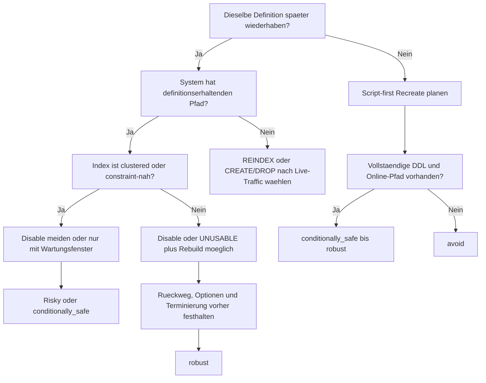

# Index Disable + Rebuild vs. Drop + Create: Wann welche Strategie sinnvoll ist

## Versions- und Geltungsbereich

- Stand: 2026-03-09
- Fuehrendes System: Microsoft SQL Server 2022 (16.x)
- Behandelte Versionen:
  - SQL Server 2022 (16.x)
  - PostgreSQL 18
  - Oracle AI Database 26ai
  - MySQL 8.4 LTS
- Andere Releases koennen abweichen, besonders bei Online-Optionen, Constraint-Folgen und den moeglichen Objektzustaenden waehrend eines Rebuilds.

## Methodischer Status

Dieser Artikel basiert auf:

- offizieller Produktdokumentation
- einem redaktionellen Themenplan
- einer quellengebundenen Recherchebasis
- dokumentationsbasierten Micro-Beispielen

Nicht enthalten in dieser Fassung:

- ausgefuehrte Demo-Skripte
- Testlaeufe auf echten Instanzen
- Benchmark-Messungen
- planbasierte Vergleichsexperimente

Daher sind alle starken Aussagen hier dokumentationsbasiert. Quersystemische Urteile bleiben bewusst als vorsichtige Ableitung formuliert.

## Leserleitfaden in 30 Sekunden

- Wenn du vor allem SQL Server betreibst, lies den Artikel linear. Dort liegt die Fuehrungsachse auf `DISABLE`, `REBUILD`, `DROP_EXISTING` und dem Unterschied zwischen clustered und nonclustered.
- Wenn du aus PostgreSQL kommst, achte besonders auf die Abschnitte zu `REINDEX`, `CREATE INDEX CONCURRENTLY` und den `INVALID`-Resten nach Fehlschlaegen.
- Wenn du aus Oracle kommst, sind `UNUSABLE` gegen `INVISIBLE` und die Rolle von `REBUILD ONLINE` die entscheidenden Kontrastpunkte.
- Wenn du aus MySQL kommst, lies vor allem die Teile zu `INVISIBLE` gegen `DROP`: Das eine testet Read-Pfade, das andere spart wirklich Schreibpflege.
- Wenn du nur eine Produktionsentscheidung absichern willst, spring direkt zu "Die wichtigste praktische Unterscheidung", "Vor jeder produktiven Umsetzung" und "Ein praxisnahes Entscheidungsmodell".

## Warum SQL Server in dieser Episode fuehrt

SQL Server fuehrt diese Episode nicht deshalb, weil er jede Teilfrage automatisch am besten loest. Das fuehrende System ist hier SQL Server, weil die Dokumentation die Kernfrage besonders schaerfbar macht: Ein Index kann dort tatsaechlich deaktiviert werden, die Definition bleibt sichtbar, der Rueckweg ist dokumentiert, und gerade dadurch werden die Grenzen von clustered, constraint-nahen und definitionsaendernden Faellen sehr klar.

## Verfuegbare Schulungsunterlagen im Repository

- [T-SQL - Index Basics](../../T-SQL/26_Indexes_Basics/26_Indexes_Basics.md)
- [T-SQL - Data Integrity Constraints](../../T-SQL/16_DataIntegrity_Constraints/16_DataIntegrity_Constraints.md)
- [T-SQL - Bulk Load und Export](../../T-SQL/30_BulkLoad_BCP_BULKINSERT/30_BulkLoad_BCP_BULKINSERT.md)
- [T-SQL - Performance Tuning Advanced](../../T-SQL/64_PerformanceTuning_Advanced/64_PerformanceTuning_Advanced.md)
- [T-SQL - Partitionierung](../../T-SQL/65_Partitioning/65_Partitioning.md)

## Weitere Dialekte in dieser Episode

PostgreSQL, Oracle und MySQL werden in dieser Episode fachlich mitbehandelt. Eigene themenspezifische Trainingskapitel in diesen Root-Ordnern folgen spaeter.

## Inhaltsverzeichnis

- [TL;DR gesamt](#tldr-gesamt)
- [TL;DR pro relevantem System](#tldr-pro-relevantem-system)
- [Syntax-Oberflaeche im Schnellvergleich](#syntax-oberflaeche-im-schnellvergleich)
- [Systemvergleich auf einen Blick](#systemvergleich-auf-einen-blick)
- [Drei Muster zur ersten Orientierung](#drei-muster-zur-ersten-orientierung)
- [1. Was das Problem eigentlich ist](#1-was-das-problem-eigentlich-ist)
- [2. Warum die intuitive Sicht zu kurz greift](#2-warum-die-intuitive-sicht-zu-kurz-greift)
- [3. Welche internen Klassen es gibt](#3-welche-internen-klassen-es-gibt)
- [4. Wovon Verhalten, Risiko und Kosten abhaengen](#4-wovon-verhalten-risiko-und-kosten-abhaengen)
- [5. Was intern eigentlich passiert](#5-was-intern-eigentlich-passiert)
- [6. Deep Dive: SQL Server als fuehrendes System](#6-deep-dive-sql-server-als-fuehrendes-system)
- [7. Die wichtigste praktische Unterscheidung](#7-die-wichtigste-praktische-unterscheidung)
- [8. Welche Rolle Indizes, Constraints, Logging und Locks spielen](#8-welche-rolle-indizes-constraints-logging-und-locks-spielen)
- [9. Vor jeder produktiven Umsetzung: technische Vorpruefung](#9-vor-jeder-produktiven-umsetzung-technische-vorpruefung)
- [10. Die Hauptstrategien sauber eingeordnet](#10-die-hauptstrategien-sauber-eingeordnet)
- [11. Ein praxisnahes Entscheidungsmodell](#11-ein-praxisnahes-entscheidungsmodell)
- [12. Verwandte Themen](#12-verwandte-themen)
- [13. Fazit](#13-fazit)
- [14. Kurzform fuer die Praxis](#14-kurzform-fuer-die-praxis)

## TL;DR gesamt

- `DISABLE + REBUILD` und `DROP + CREATE` sind keine austauschbaren Synonyme. Die eigentliche Frage lautet: Soll dieselbe Definition resident bleiben oder bewusst neu entstehen?
- In SQL Server ist `DISABLE + REBUILD` nur dann die robuste Standardform, wenn es um einen isolierten nonclustered Index mit unveraenderter Definition geht.
- Sobald clustered, PK-, UNIQUE- oder definitionsaendernde Faelle ins Spiel kommen, wird `DROP + CREATE` oder `CREATE INDEX ... WITH (DROP_EXISTING = ON)` oft ehrlicher und kontrollierbarer.
- PostgreSQL kennt keinen echten Disable-Zustand fuer normale Indizes. Dort lautet die Praxisfrage eher `REINDEX` gegen `DROP/CREATE`, haeufig mit `CONCURRENTLY`.
- Oracle trennt `UNUSABLE` und `INVISIBLE` sauber. Das eine stoppt Pflege, das andere nur die Optimizer-Nutzung.
- MySQLs `INVISIBLE` ist ein Read-Test, keine Write-Optimierung. Wer Schreibpflege wirklich sparen will, muss an `DROP` oder echte Recreate-Pfade denken.

## TL;DR pro relevantem System

- SQL Server: Stark, wenn du dieselbe nonclustered Definition spaeter gezielt wiederhaben willst. Schwach bis gefaehrlich, wenn clustered oder constraint-nahe Indizes beteiligt sind.
- PostgreSQL: Dieselbe Problemklasse wird ueber `REINDEX`, `CREATE INDEX CONCURRENTLY` und `DROP INDEX CONCURRENTLY` geloest. Der Knackpunkt ist weniger "disable", sondern Locking gegen Cleanup.
- Oracle: `UNUSABLE` ist der naechste echte Verwandte zu SQL Servers Disable-Pfad. `INVISIBLE` ist ein anderes Werkzeug mit anderem Ziel.
- MySQL: `INVISIBLE` ist gut, um zu pruefen, ob Reads den Index noch brauchen. Fuer weniger Write-Overhead reicht das nicht.

## Syntax-Oberflaeche im Schnellvergleich

Die folgenden Snippets zeigen bewusst nur die Oberflaeche. Sie sind klein genug fuer Orientierung und gross genug, um die natuerliche Ausdrucksform des jeweiligen Systems sichtbar zu machen.

### SQL Server

```sql
ALTER INDEX IX_Sales_OrderDate ON dbo.Sales DISABLE;
ALTER INDEX IX_Sales_OrderDate ON dbo.Sales REBUILD;

CREATE INDEX IX_Sales_OrderDate
ON dbo.Sales (OrderDate)
WITH (DROP_EXISTING = ON);
```

### PostgreSQL

```sql
REINDEX INDEX CONCURRENTLY sales_orderdate_idx;

DROP INDEX CONCURRENTLY sales_orderdate_idx;
CREATE INDEX CONCURRENTLY sales_orderdate_idx
  ON sales (order_date);
```

### Oracle

```sql
ALTER INDEX sales_orderdate_ix UNUSABLE;
ALTER INDEX sales_orderdate_ix REBUILD ONLINE;

ALTER INDEX sales_orderdate_ix INVISIBLE;
```

### MySQL

```sql
ALTER TABLE sales ALTER INDEX idx_order_date INVISIBLE;

DROP INDEX idx_order_date ON sales;
CREATE INDEX idx_order_date ON sales (order_date);
```

## Systemvergleich auf einen Blick

| System | Definition bleibt sichtbar? | Schreibpflege pausiert? | Natuerlicher Rueckweg | Kritischer Fallstrick |
|---|---|---|---|---|
| SQL Server | ja, bei `DISABLE` | ja | `REBUILD` oder `CREATE ... WITH (DROP_EXISTING = ON)` | clustered und constraint-nahe Indizes haben grossen Blast Radius |
| PostgreSQL | nicht als eigener Disable-Zustand | nur indirekt ueber `REINDEX` oder `DROP/CREATE` | `REINDEX`, `CREATE INDEX`, `DROP INDEX`, oft `CONCURRENTLY` | Fehlschlaege koennen `INVALID`-Indizes mit Update-Overhead hinterlassen |
| Oracle | ja, bei `UNUSABLE` und `INVISIBLE` | bei `UNUSABLE` ja, bei `INVISIBLE` nein | `REBUILD ONLINE` oder `CREATE` | `INVISIBLE` ist kein Ersatz fuer `UNUSABLE` |
| MySQL | ja, bei `INVISIBLE` | nein | `DROP` oder `CREATE` als `ALTER TABLE` | Read-Test und Write-Entlastung werden leicht verwechselt |

## Drei Muster zur ersten Orientierung

Die formalen Risikoklassen folgen spaeter in Abschnitt 3. Die folgenden Muster sind nur ein frueher Kompass.

### Gleiche Definition, isolierter nonclustered Index

```text
Indexdefinition bleibt unveraendert
Rueckweg ist vorab bekannt
Schreibfenster ist temporaer
```

Das ist die robuste Grundfigur fuer SQL Server. Dieselbe Idee taucht in PostgreSQL als `REINDEX` und in Oracle als `UNUSABLE + REBUILD` wieder auf.

### Clustered Index deaktivieren, um schneller zu updaten

```text
Schreiblast ist hoch
Clustered Index wird deaktiviert
Tabelle verliert ihren normalen DML-Zugriff
```

Das ist kein cleverer Short-cut, sondern der typische Kipppunkt in `risky` oder `avoid`.

### Neue Definition sowieso geplant

```text
Key oder INCLUDE aendert sich
Optionen, Compression oder Speicherort aendern sich
Rueckweg soll versioniert und bewusst sein
```

Dann ist ein script-first Recreate-Pfad oft die sauberere Form. Genau hier fuehlt sich `DROP + CREATE` oder `DROP_EXISTING` haeufig ehrlicher an als ein scheinbar pragmatisches Disable.

## 1. Was das Problem eigentlich ist

Sam sah auf die Tabelle und sagte: "40 Millionen Zeilen. 13 Millionen Updates. Dann schalte ich die Indizes eben kurz aus."

Pete verschraenkte die Arme. "In meiner Welt heisst die Frage nicht Disable oder nicht Disable. Sie heisst eher Reindex oder Drop plus Create."

Ora schob den Stuhl heran. "Und bei mir musst du erst entscheiden, ob du wirklich einen nicht gepflegten Index willst oder nur testen moechtest, ob der Optimizer ohne ihn auskommt."

My hob die Hand. "Und wenn du mich fragst: Unsichtbar ist nicht deaktiviert."

Mutter ANSI-95 nickte. "Sehr schoen. Erst den Objektzustand klaeren, dann das Statement."

### Ein Fehlersymptom, das im Kopf bleiben sollte

Der eigentliche Schreibvorgang ist gar nicht das teure Stueck. Teuer ist die laufende Pflege der vorhandenen Indizes. Genau das fuehrt in vielen Teams zu derselben Kurzreaktion: "Dann weg mit den Indizes, spaeter bauen wir sie wieder."

Diese Reaktion klingt pragmatisch und ist trotzdem zu grob. Denn "weg mit dem Index" kann vier sehr verschiedene Dinge meinen:

- Die Definition bleibt sichtbar, aber der Index wird nicht mehr gepflegt.
- Die Definition bleibt sichtbar, aber nur der Optimizer ignoriert sie.
- Die Definition bleibt sichtbar, der Rueckweg ist ein Rebuild.
- Die Definition ist komplett weg, und der Rueckweg braucht ein vollstaendiges DDL-Skript.

Genau deshalb ist das Thema keine kleine DBA-Geschmacksfrage. Es ist eine Entscheidung ueber Objektzustand, Rueckweg, Abhaengigkeiten und Betriebsrisiko.

### Was der Standard hier leistet - und was nicht

Der SQL-Standard hilft hier nur als Meta-Ebene. Er trennt Problemklasse und Produktausdruck, liefert dir aber keine portable Alltagssyntax fuer "Index kurz aus dem Weg raeumen und spaeter sauber zurueckholen".

Darum bleibt ANSI in diesem Artikel bewusst auf Distanz:

- Problemklasse: Ein Index soll temporaer keinen Einfluss auf Schreibkosten oder Zugriffswege haben.
- Produktsyntax: `DISABLE`, `UNUSABLE`, `INVISIBLE`, `REINDEX`, `DROP INDEX`, `CREATE INDEX`.
- Produktsemantik: Metadatenzustand, DML-Folgen, Constraint-Effekte und Online-Pfade unterscheiden sich real.

Wer nur ueber Syntax redet, redet hier fast immer ueber das unwichtigste Drittel des Themas.

## 2. Warum die intuitive Sicht zu kurz greift

Die intuitive Frage lautet: "Was ist besser, Disable oder Drop?" Das ist zu kurz.

Die fachlich bessere Frage lautet: "Will ich dieselbe Definition spaeter kontrolliert wiederhaben, oder will ich das Objekt bewusst neu aufbauen?"

Daran haengen sofort weitere Unterfragen:

- Bleibt die Definition im Katalog sichtbar?
- Wird der Index waehrenddessen weiter gepflegt?
- Kann die Tabelle selbst noch normal gelesen und beschrieben werden?
- Braucht der Rueckweg nur `REBUILD`, oder brauche ich ein vollstaendiges `CREATE INDEX`-Skript?
- Aendere ich dabei ohnehin Key, INCLUDE, Filter, Compression, Filegroup oder Tablespace?

Ich behandle diese Entscheidung deshalb nicht als Performance-Schalter, sondern als Objektzustandsmodell. Genau dort kippt die Diskussion von "bequem" gegen "aufwendig" in "kontrollierbar" gegen "unsauber".

Disable wirkt oft naeher an der bestehenden Struktur. Das ist sein Vorteil. Es wirkt aber nur so lange unkompliziert, wie der Index nicht clustered, constraint-nah oder komprimiert ist und wie der Rueckweg bereits sauber feststeht.

Drop plus Create wirkt brutaler. Das ist sein Nachteil. Es ist aber gleichzeitig haeufig ehrlicher, wenn du ohnehin neu definieren willst, einen klaren Skriptpfad brauchst oder in einem System arbeitest, das gar keinen echten Disable-Zustand anbietet.

## 3. Welche internen Klassen es gibt

Die Problemklasse laesst sich sinnvoll in vier Risikoklassen ordnen:

| Klasse | Fachliche Bedeutung | Typische Form |
|---|---|---|
| robust | Definition, Rueckweg und Objektrolle sind klar. | isolierter nonclustered Index in SQL Server, gleicher Index per `REINDEX` in PostgreSQL |
| conditionally_safe | Die Strategie ist vertretbar, aber nur mit sauberem DDL und klarer Live-Traffic-Planung. | `DROP + CREATE`, `DROP_EXISTING`, `CREATE INDEX CONCURRENTLY` |
| risky | Die technische Form kann funktionieren, aber der Blast Radius ist leicht unterschaetzt. | clustered disable, invalid concurrent index, unusable unique index |
| avoid | Das Team optimiert am falschen Objektzustand oder ohne vollen Rueckweg. | `INVISIBLE` als Schreiboptimierung, DROP ohne DDL-Sicherung |

Wichtig ist: Diese Klassen sind keine Dialektklassen. Dasselbe System kann je nach Indexart und Betriebsziel in allen vier Klassen landen.

Die Schluesselfrage fuer spaeter lautet deshalb:

- Willst du dieselbe Definition spaeter nur wieder aktiv haben?
- Oder willst du die Definition bewusst neu festlegen?

## 4. Wovon Verhalten, Risiko und Kosten abhaengen

Das Verhalten kippt selten an einem einzelnen Statement. Es kippt an einer Kette:

- Indexart: clustered oder nonclustered ist im SQL-Server-Teil die groesste Sicherheitslinie.
- Objektrolle: ist der Index nur Performance-Helfer oder auch PK-, UNIQUE- oder FK-traegend?
- Definitionstreue: bleibt wirklich alles gleich oder aendern sich Key, INCLUDE, Filter, Compression oder Platzierung?
- Live-Traffic: brauchst du waehrenddessen weiter Reads, Writes oder beides?
- Rueckweg: reicht `REBUILD`, oder braucht das Team die komplette DDL in versionierter Form?
- Nebenkosten: Online-Rebuilds, concurrent Builds und Online-DDL sind selten kostenlos.

### Der wichtigste Fehlerfall explizit

```sql
ALTER INDEX PK_FactSales ON dbo.FactSales DISABLE;

UPDATE dbo.FactSales
SET    Status = 'done'
WHERE  LoadDate >= '2026-03-01';
```

Das ist genau die Sorte vermeintlich pragmatischer Abkuerzung, die in SQL Server kippt. Wenn `PK_FactSales` der clustered Index der Tabelle ist, hast du nicht nur die Indexpflege "kurz abgeschaltet". Du hast die Tabelle fuer normalen DML-Zugriff aus dem Weg geraeumt und den Rueckweg in einen Offline-Rebuild gezwungen.

Die wichtigste Praxisbeobachtung dazu: Teams sagen an dieser Stelle oft "wir deaktivieren nur kurz". In Wahrheit aendern sie den gesamten Objektzustand der Tabelle.

## 5. Was intern eigentlich passiert

```text
DISABLE / UNUSABLE
  -> Definition bleibt im Katalog
  -> Segment oder Datenpfad ist nicht nutzbar oder nicht gepflegt
  -> Rueckweg ist REBUILD

DROP
  -> Definition ist weg
  -> Rueckweg braucht vollstaendige DDL
  -> CREATE baut bewusst neu auf

INVISIBLE
  -> Definition bleibt sichtbar
  -> Optimizer nutzt den Index nicht
  -> Schreibpflege laeuft weiter
```

Dieses Bild ist die eigentliche Hauptunterscheidung des Themas.

In SQL Server bleibt bei `DISABLE` die Definition erhalten. Bei einem deaktivierten nonclustered Index wird er nicht weiter gepflegt, und spaeter kann dieselbe Definition per `REBUILD` zurueckkommen. Bei einem deaktivierten clustered Index ist der Preis aber viel hoeher: Die Tabellendaten selbst sind fuer normalen Zugriff nicht mehr verfuegbar.

In Oracle hat `UNUSABLE` eine aehnliche Richtung, aber nicht dieselbe Semantik. Der Index wird vom Optimizer ignoriert und nicht gepflegt, das Segment wird freigegeben, und der Rueckweg ist `REBUILD` oder bewusstes Recreate. `INVISIBLE` ist dort gerade nicht dieselbe Idee, weil DML den Index weiter pflegt.

PostgreSQL zeigt dieselbe Problemklasse anders. Es gibt keinen alltaeglichen Disable-Zustand fuer normale Indizes. Die Praxisfrage lautet dort eher: dieselbe Definition per `REINDEX` neu aufbauen oder per `DROP INDEX` und `CREATE INDEX` bewusst neu erzeugen, jeweils unter der Zusatzfrage, ob `CONCURRENTLY` noetig ist.

MySQL macht den Kontrast noch schaerfer. `INVISIBLE` ist dort explizit ein Optimizer-Werkzeug, kein DML-Werkzeug. Wenn es wirklich um weniger Write-Pflege geht, ist `DROP` der eigentliche strukturelle Schritt.

## 6. Deep Dive: SQL Server als fuehrendes System

SQL Server ist fuer dieses Thema ein starkes Fuehrungssystem, weil die Dokumentation die Trennlinie zwischen denselben Begriffen sehr deutlich macht.

### Nonclustered: hier fuehrt `DISABLE + REBUILD`

Wenn ein einzelner nonclustered Index dieselbe Definition spaeter wiederhaben soll, ist `DISABLE + REBUILD` oft die robusteste Standardform:

- Die Definition bleibt erhalten.
- Die laufende Pflege pausiert.
- Der Rueckweg ist klar.
- Bei reinem Same-Definition-Fall ist kein neues DDL aus Erinnerung noetig.

Ein feiner, aber wichtiger Produktionshinweis aus der Dokumentation: Wenn ein komprimierter nonclustered Index deaktiviert wird, gehen die Kompressionsmetadaten verloren. Ein spaeterer Rebuild ohne explizites `DATA_COMPRESSION` baut den Index dann unkomprimiert wieder auf. Genau solche Details machen aus "nur kurz deaktivieren" schnell eine unbemerkte Drift.

### Clustered, PK und UNIQUE: hier kippt dieselbe Idee

Sobald clustered oder constraint-nahe Indizes beteiligt sind, aendert sich der Charakter der Entscheidung vollstaendig:

- Ein deaktivierter clustered Index macht die Tabelle fuer normalen DML-Zugriff unbrauchbar.
- Ein deaktivierter UNIQUE- oder PK-naher Index zieht Constraint- und FK-Folgen nach sich.
- Bestimmte Constraints muessen nach dem Rebuild manuell wieder aktiviert werden.
- Ein deaktivierter clustered Index kann nicht online rebuilt werden.

Das ist der Punkt, an dem dieselbe Syntax von `robust` in `risky` oder `avoid` kippt.

### Wo `DROP_EXISTING` staerker ist als ein nostalgisches Disable

Wenn du die Definition ohnehin aenderst, ist `CREATE INDEX ... WITH (DROP_EXISTING = ON)` oft der sauberere SQL-Server-Pfad:

- Key oder INCLUDE aendern sich.
- Sortierreihenfolge aendert sich.
- Compression oder Platzierung aendern sich.
- Filegroup oder Partition Scheme aendern sich.

Microsoft dokumentiert dazu sogar einen praktischen Vorteil: Beim Neuerstellen eines clustered Indexes auf Tabellen mit nonclustered Indizes kann `DROP_EXISTING` guenstiger sein als ein getrenntes Drop plus Create, weil die nonclustered Indizes nicht zweimal angefasst werden muessen.

## 7. Die wichtigste praktische Unterscheidung

Die wichtigste praktische Unterscheidung lautet nicht "Disable oder Drop", sondern:

- Will ich spaeter exakt dieselbe Definition wiederhaben?
- Oder will ich die Definition bewusst neu festlegen?

### Wenn dieselbe Definition spaeter wiederkommen soll

Dann fuehren definitionserhaltende Pfade:

- SQL Server: `DISABLE + REBUILD`, aber nur fuer die richtigen Indexarten.
- PostgreSQL: `REINDEX`, unter Live-Traffic oft `REINDEX ... CONCURRENTLY`.
- Oracle: `UNUSABLE + REBUILD`.
- MySQL: kein echter Disable-Pfad; hier bleibt nur Recreate oder ein Read-Test mit `INVISIBLE`.

### Wenn die Definition sich sowieso aendert

Dann ist script-first fast immer ehrlicher:

- SQL Server: `CREATE INDEX ... WITH (DROP_EXISTING = ON)`
- PostgreSQL: neues `CREATE INDEX`, bei Bedarf `CONCURRENTLY`
- Oracle: neues `CREATE INDEX`
- MySQL: neues `CREATE INDEX` nach gesicherter DDL

> **Achtung:** Deaktiviere in SQL Server keinen clustered Index auf einer produktiv genutzten Tabelle, nur weil ein grosses Update teuer ist. Du sparst damit nicht nur Indexpflege, sondern nimmst der Tabelle auch ihren normalen DML-Zugriff und zwingst den Rueckweg in einen Offline-Rebuild.

### Anti-Pattern vs. robuste Form

| Anti-Pattern | Robuste Form | Warum |
|---|---|---|
| "Wir deaktivieren einfach alle Indizes kurz." | Nur isolierte nonclustered Indizes mit klarer Rueckkehrdefinition deaktivieren. | Der Blast Radius ist nicht gleichmaessig verteilt. |
| `INVISIBLE` als vermeintliche Write-Optimierung lesen | `INVISIBLE` nur fuer Read-Tests nutzen, `DROP` fuer echte Write-Entlastung | Optimizer-Sichtbarkeit und DML-Pflege sind zwei verschiedene Achsen. |
| Drop ohne gesicherte DDL | Definition, Optionen und Platzierung zuerst versionieren | Sonst wird der Rueckweg zur Rekonstruktion aus Erinnerung. |
| Disable, obwohl Key oder Optionen sich ohnehin aendern | Bewusster Recreate-Pfad oder `DROP_EXISTING` | Dann ist Disable nur eine Zwischenform ohne echten Vorteil. |

## 8. Welche Rolle Indizes, Constraints, Logging und Locks spielen

Indizes sind hier nicht nur Performance-Zubehoer. Sie sind Vertragsobjekte.

In SQL Server wird das am deutlichsten: Sobald ein Index zugleich PK-, UNIQUE- oder clustered Traeger ist, wird aus einer lokalen Wartungsentscheidung eine Tabellen- und Constraint-Entscheidung.

PostgreSQL verschiebt den Schwerpunkt. Dort ist die Kernfrage weniger "darf ich deaktivieren?" als "welcher Lock-Fussabdruck bleibt bei `REINDEX`, `CREATE INDEX` oder `DROP INDEX`, und wie gehe ich mit einem fehlgeschlagenen concurrent Build um?"

Oracle bringt eine eigene Trennung mit:

- `UNUSABLE` fuer "nicht benutzen und nicht pflegen"
- `INVISIBLE` fuer "vom Optimizer nicht benutzen, aber weiter pflegen"

Genau diese Trennung ist fachlich stark, weil sie einen typischen Denkfehler verhindert: Ein unsichtbarer Index ist eben noch nicht aus dem Write-Pfad verschwunden.

MySQL erzaehlt dieselbe Geschichte knapper. `INVISIBLE` ist gut fuer Read-Tests. `DROP` und `CREATE` laufen als `ALTER TABLE`, fuer InnoDB-sekundaere Indizes haeufig mit concurrent DML. Aber auch hier gilt: Der semantisch schmale Pfad ist nicht automatisch der risikoaermste.

Die Praxisbeobachtung dahinter ist konstant: Teams reden gern ueber "das Statement", obwohl sie ueber Vertragsobjekte, Laufzeitfenster und Rueckwege reden sollten.

## 9. Vor jeder produktiven Umsetzung: technische Vorpruefung

Vor einem produktiven Eingriff reichen Bauchgefuehl und Objektname nicht. Diese vier Vorpruefungen gehoeren auf den Tisch:

1. Bleibt die Definition exakt gleich?
2. Welche Abhaengigkeiten haengen an diesem Index?
3. Welcher Online- oder Offline-Pfad ist fuer dieses System realistisch?
4. Ist der Rueckweg als kleine, terminierbare Arbeitsanweisung bereits vorhanden?

### SQL Server

```sql
SELECT name, type_desc, is_disabled, is_primary_key, is_unique_constraint
FROM sys.indexes
WHERE object_id = OBJECT_ID('dbo.Sales');
```

Die natuerliche sichere Arbeitsweise in SQL Server ist: clustered und constraint-nahe Indizes zuerst aussortieren, den Rueckweg vorab fixieren und bei komprimierten nonclustered Indizes `DATA_COMPRESSION` explizit im Rueckweg halten.

### PostgreSQL

```sql
SELECT indexname, indexdef
FROM pg_indexes
WHERE schemaname = 'public'
  AND tablename = 'sales';
```

PostgreSQL denkt natuerlich in `REINDEX`, `CREATE INDEX CONCURRENTLY` und `DROP INDEX CONCURRENTLY`. Die sichere Arbeitsweise ist hier weniger ein Disable-Ersatz als ein sauber geplanter Lock- und Cleanup-Pfad.

### Oracle

```sql
SELECT index_name, status, visibility, uniqueness
FROM user_indexes
WHERE table_name = 'SALES';
```

Oracle will, dass du `STATUS` und `VISIBILITY` getrennt liest. Genau das ist auch die sichere Vorbereitungsform: erst klarmachen, ob du Pflege stoppen willst oder nur Planverhalten testen.

### MySQL

```sql
SELECT INDEX_NAME, NON_UNIQUE, IS_VISIBLE
FROM INFORMATION_SCHEMA.STATISTICS
WHERE TABLE_SCHEMA = DATABASE()
  AND TABLE_NAME = 'sales';
```

MySQLs natuerliche sichere Arbeitsweise beginnt mit einer sauberen DDL-Sicherung per `SHOW CREATE TABLE` und der klaren Trennung zwischen Read-Test mit `INVISIBLE` und echter Write-Entlastung per `DROP`.

## 10. Die Hauptstrategien sauber eingeordnet

### 1. Definitionserhaltender Pfad

Das ist die starke Form, wenn dieselbe Definition spaeter wiederkommen soll.

```sql
ALTER INDEX IX_Sales_OrderDate ON dbo.Sales DISABLE;
-- Bulk-Load oder Batch-Update nur fuer das geplante Wartungsfenster
ALTER INDEX IX_Sales_OrderDate ON dbo.Sales
REBUILD WITH (ONLINE = ON, DATA_COMPRESSION = PAGE);
```

Diese Form ist nur dann robust, wenn der Index isoliert und nichtclustered ist und wenn der Rueckweg bereits vor dem Disable feststeht. Die operative Caveat-Zeile ist kein Schmuck: Ohne klare Terminierung und ohne explizite Rueckoptionen wird aus der "kurzen" Massnahme ein Dauerzustand.

Risikoklasse: meist `robust`, bei clustered oder constraint-nahen Indizes sofort `risky`.

### 2. Bewusste Neudefinition

Wenn sich die Definition ohnehin aendert, ist der Recreate-Pfad meist sauberer.

```sql
CREATE INDEX IX_Sales_OrderDate
ON dbo.Sales (OrderDate, CustomerID)
INCLUDE (Status)
WITH (DROP_EXISTING = ON, ONLINE = ON, DATA_COMPRESSION = PAGE);
```

Hier liegt die Staerke nicht in der kuerzeren Schreibweise, sondern in der Ehrlichkeit: Alles, was spaeter gelten soll, steht explizit im DDL.

Risikoklasse: meist `conditionally_safe`, mit vollstaendiger DDL und sauberem Wartungsfenster auch `robust`.

### 3. Live-Traffic-Pfad in PostgreSQL

```sql
REINDEX INDEX CONCURRENTLY sales_orderdate_idx;
-- oder bei neuer Definition:
CREATE INDEX CONCURRENTLY sales_orderdate_idx_new
  ON sales (order_date);
```

PostgreSQL ist hier kein uebersetzter SQL-Server-Fall. Die Kultur ist eine andere: Locking und Cleanup bestimmen die Entscheidung staerker als ein fehlender Disable-Befehl.

Risikoklasse: `conditionally_safe`, bei fehlendem Cleanup-Pfad schnell `risky`.

### 4. Oracle: `UNUSABLE` gegen `INVISIBLE`

Oracle ist besonders hilfreich, weil es zwei verschiedene Intentionen sichtbar macht:

- `UNUSABLE`, wenn Pflege und Nutzung wirklich pausieren sollen
- `INVISIBLE`, wenn du erst lesen willst, was ohne den Index passiert

Das ist fachlich sauberer als der uebliche Team-Satz "wir schalten den Index mal kurz ab".

Risikoklasse: `robust` fuer klar geplantes `UNUSABLE + REBUILD`, `avoid`, wenn `INVISIBLE` als Write-Optimierung missverstanden wird.

### 5. MySQL: Testen ist nicht Entlasten

In MySQL ist die wichtigste strategische Klarstellung kurz:

- `INVISIBLE` testet den Read-Pfad
- `DROP` oder `CREATE` aendert den Write-Pfad

Gerade deshalb ist MySQL als Kontrastsystem wertvoll. Es zwingt zur Klarheit ueber das eigentliche Ziel der Aktion.

Risikoklasse: `conditionally_safe` fuer bewusstes Drop/Create mit gesicherter DDL, `avoid` fuer `INVISIBLE` als vermeintlichen Ersatz.

## 11. Ein praxisnahes Entscheidungsmodell



Das Diagramm ist kein nettes Extra, sondern das Navigationswerkzeug fuer die Risikoklassen:

1. Gleiche Definition spaeter wiederhaben: zuerst definitionserhaltende Pfade pruefen.
2. Clustered oder constraint-nahe Rolle: Disable nur noch unter strenger Vorsicht.
3. Neue Definition ohnehin geplant: nicht nostalgisch an Disable festhalten.
4. Live-Traffic noetig: Lock- und Cleanup-Pfad systemtypisch lesen.
5. Kein sauberes DDL und kein sauberer Rueckweg: Fall in `avoid`.

## 12. Verwandte Themen

- [Update with Join: Warum Kardinalitaet wichtiger ist als Syntax](../update-with-join/README.md)
- [Partitionierung: Wann mehrere Partitionen wirklich helfen - und wann nicht](../partitionierung/README.md)

## 13. Fazit

`DISABLE + REBUILD` und `DROP + CREATE` sind nicht zwei Worte fuer dieselbe Handlung. Sie beschreiben zwei verschiedene Antworten auf dieselbe Problemklasse.

Die robuste Form beginnt deshalb nicht mit dem Statement, sondern mit der Frage nach dem gewuenschten Objektzustand:

- Soll dieselbe Definition spaeter kontrolliert zurueckkehren?
- Oder soll das Objekt bewusst neu definiert werden?

SQL Server zeigt diese Trennlinie am schaerfsten. PostgreSQL zeigt, wie dieselbe Frage ohne Disable-Zustand ueber Rebuild- und Recreate-Pfade lesbar wird. Oracle zeigt, dass `UNUSABLE` und `INVISIBLE` zwei verschiedene Werkzeuge sind. MySQL zeigt, dass Testen und Entlasten nicht verwechselt werden duerfen.

Wer aus allen vier Systemen liest, bekommt keine Uebersetzungen. Er bekommt vier sehr nuetzliche Warnungen derselben Art.

## 14. Kurzform fuer die Praxis

Wenn dieselbe Definition spaeter wiederkommen soll und der Index isoliert genug ist, fuehrt der definitionserhaltende Pfad. Wenn clustered, constraint-nahe oder definitionsaendernde Faelle im Spiel sind, ist der script-first Recreate-Pfad oft die ehrlichere und sicherere Form.

Sam lehnte sich zurueck. "Also geht es nicht zuerst um schneller oder langsamer."

Pete nickte. "Sondern darum, ob dein Rueckweg schon vor dem ersten Statement klar ist."

Ora sagte ruhig: "Und ob du wirklich Pflege stoppen willst oder nur den Optimizer testest."

My hob die Schultern. "Unsichtbar ist eben nicht deaktiviert."

Mutter ANSI-95 stand auf. "Sehr gut. Erst den Objektzustand klaeren, dann die DDL schreiben."
