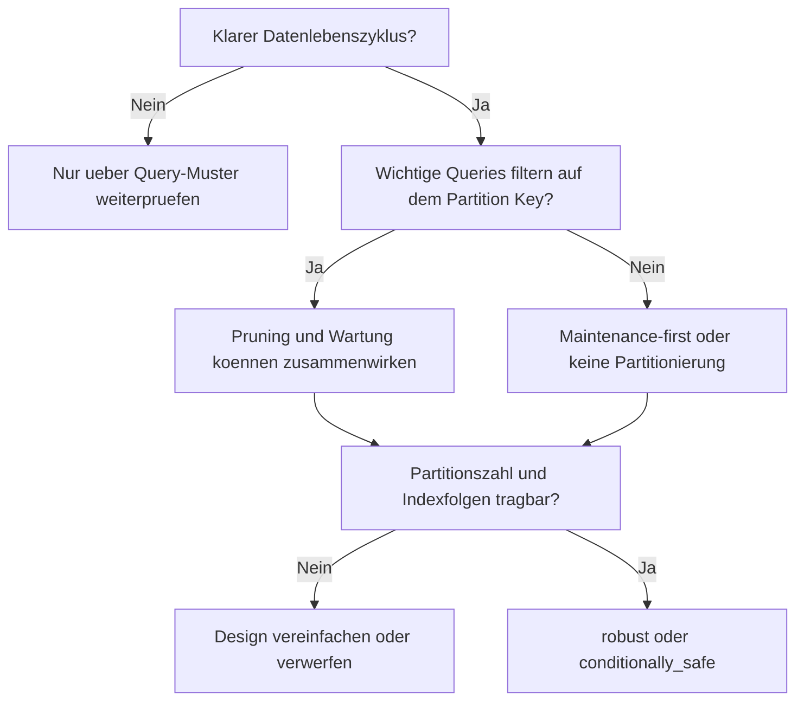

# Partitionierung: Wann mehrere Partitionen wirklich helfen - und wann nicht

## Versions- und Geltungsbereich

- Stand: 2026-03-08
- Fuehrendes System: Microsoft SQL Server 2022 (16.x)
- Behandelte Versionen:
  - SQL Server 2022 (16.x)
  - PostgreSQL 18
  - Oracle AI Database 26ai
  - MySQL 8.4 LTS
- Andere Releases koennen abweichen, besonders bei Partitionierungsdetails, Indexfolgen und Maintenance-Operationen.

## Methodischer Status

Dieser Artikel basiert auf:

- offizieller Produktdokumentation
- einem redaktionellen Themenplan
- einer quellengebundenen Recherchebasis

Nicht enthalten in dieser Fassung:

- ausgefuehrte Demo-Skripte
- Testlaeufe auf echten Instanzen
- Benchmark-Messungen
- planbasierte Vergleichsexperimente

Daher sind die Aussagen hier dokumentationsbasiert und an wenigen Stellen bewusst als vorsichtige Ableitung aus mehreren Herstellerquellen formuliert.

## Leserleitfaden in 30 Sekunden

- Wenn du vor allem SQL Server betreibst, lies den Artikel linear. Die Fuehrungsachse liegt auf Partition Functions, aligned indexes und Sliding-Window-Praxis.
- Wenn du aus PostgreSQL kommst, achte besonders auf die Abschnitte zu Pruning, Planner-Kosten und dem Unterschied zwischen virtueller Parent-Tabelle und echten Partitionen.
- Wenn du aus Oracle kommst, lies die Teile zu Indexstrategie und Wartungsdisziplin. Dort liegt der staerkste Kontrast.
- Wenn du nur eine Einfuehrungsentscheidung absichern willst, spring direkt zu "Die wichtigste praktische Unterscheidung", "Vor jeder produktiven Umsetzung" und "Ein praxisnahes Entscheidungsmodell".

## Warum SQL Server in dieser Episode fuehrt

SQL Server fuehrt diese Episode nicht deshalb, weil Partitionierung dort automatisch am staerksten waere. Das fuehrende System ist hier SQL Server, weil sich an ihm der operative Kernkonflikt besonders klar zeigen laesst: Partitionierung lebt nicht von der Existenz vieler Partitionen, sondern von der Disziplin aus Partition Function, passendem Schluessel, aligned indexes und einem geplanten Wartungspfad.

## Verfuegbare Schulungsunterlagen im Repository

- [T-SQL - Partitionierung](../../T-SQL/65_Partitioning/65_Partitioning.md)
- [T-SQL - Index Basics](../../T-SQL/26_Indexes_Basics/26_Indexes_Basics.md)
- [T-SQL - ETL-Muster](../../T-SQL/75_SSVEPatterns_for_ETL/75_SSVEPatterns_for_ETL.md)
- [T-SQL - Columnstore Indexes](../../T-SQL/78_ColumnstoreIndexes/78_ColumnstoreIndexes.md)
- [T-SQL - Backup und Restore Strategien](../../T-SQL/71_BackupRestore_Strategies/71_BackupRestore_Strategies.md)

## Weitere Dialekte in dieser Episode

PostgreSQL, Oracle und MySQL werden in diesem Artikel fachlich mitbehandelt. Eigenstaendig ausgebaute themenspezifische Trainingskapitel in diesen Root-Ordnern folgen spaeter.

## Inhaltsverzeichnis

- [TL;DR gesamt](#tldr-gesamt)
- [TL;DR pro relevantem System](#tldr-pro-relevantem-system)
- [Syntax-Oberflaeche im Schnellvergleich](#syntax-oberflaeche-im-schnellvergleich)
- [Systemvergleich auf einen Blick](#systemvergleich-auf-einen-blick)
- [Drei Muster zur ersten Orientierung](#drei-muster-zur-ersten-orientierung)
- [1. Was das Problem eigentlich ist](#1-was-das-problem-eigentlich-ist)
- [2. Warum die intuitive Sicht zu kurz greift](#2-warum-die-intuitive-sicht-zu-kurz-greift)
- [3. Welche internen Klassen es gibt](#3-welche-internen-klassen-es-gibt)
- [4. Wovon Verhalten, Risiko und Kosten abhaengen](#4-wovon-verhalten-risiko-und-kosten-abhaengen)
- [5. Was intern eigentlich passiert](#5-was-intern-eigentlich-passiert)
- [6. Deep Dive: SQL Server als fuehrendes System](#6-deep-dive-sql-server-als-fuehrendes-system)
- [7. Die wichtigste praktische Unterscheidung](#7-die-wichtigste-praktische-unterscheidung)
- [8. Welche Rolle Indizes, Constraints, Logging und Locks spielen](#8-welche-rolle-indizes-constraints-logging-und-locks-spielen)
- [9. Vor jeder produktiven Umsetzung: technische Vorpruefung](#9-vor-jeder-produktiven-umsetzung-technische-vorpruefung)
- [10. Die Hauptstrategien sauber eingeordnet](#10-die-hauptstrategien-sauber-eingeordnet)
- [11. Ein praxisnahes Entscheidungsmodell](#11-ein-praxisnahes-entscheidungsmodell)
- [12. Fazit](#12-fazit)
- [13. Kurzform fuer die Praxis](#13-kurzform-fuer-die-praxis)

## TL;DR gesamt

- Partitionierung ist zuerst ein Verwaltungs- und Lebenszyklusthema, erst danach ein moeglicher Performancehebel.
- Sie wird robust, wenn derselbe Schluessel sowohl typische Filter als auch Wartung, Archivierung oder Purge logisch organisiert.
- Sie bleibt riskant, wenn Teams nach Tabellenvolumen partitionieren, waehrend die echten Abfragen am Partition Key vorbeilaufen.
- SQL Server, PostgreSQL, Oracle und MySQL erklaeren dieselbe Problemklasse in vier verschiedenen Datenbankkulturen.
- Wer Partitionierung als Ersatz fuer Indizes oder fuer unscharfe Query-Logik einsetzt, baut meistens nur Metadaten auf ein ungelöstes Grundproblem.

## TL;DR pro relevantem System

- SQL Server: Stark, wenn du Partition Function, Scheme, aligned indexes und einen echten Sliding-Window-Pfad planst. Schwach, wenn viele Partitionen ohne passende Filter oder ohne Wartungsmodell nur Verwaltungsaufwand erzeugen.
- PostgreSQL: Deklarative Partitionierung ist sauber und gut lesbar, aber der Planner und die Partitionszahl muessen mitgedacht werden. Detach und Drop koennen operativ weit mehr bringen als die blosse Hoffnung auf schnellere Reads.
- Oracle: Partitionierung ist hier eine ausgereifte Disziplin fuer Pruning, Wartung und Indexstrategie. Gerade deshalb kippt ein halb geplantes Design schnell in teure globale Indexfolgen.
- MySQL: Die Grundidee ist dieselbe, aber das System arbeitet mit engeren Grenzen. Pruning hilft nur bei passendem Ausdruck, und Storage-Engine- oder FK-Einschraenkungen muessen frueh gelesen werden.

## Syntax-Oberflaeche im Schnellvergleich

Die folgenden Snippets zeigen bewusst nur die Oberflaeche. Sie sind klein genug fuer Orientierung und gross genug, um die natuerliche Ausdrucksform des jeweiligen Systems sichtbar zu machen.

### SQL Server

```sql
CREATE PARTITION FUNCTION pf_salesdate (date)
AS RANGE RIGHT FOR VALUES ('2026-01-01', '2026-02-01');

CREATE PARTITION SCHEME ps_salesdate
AS PARTITION pf_salesdate ALL TO ([PRIMARY]);
```

### PostgreSQL

```sql
CREATE TABLE measurement (
  logdate date NOT NULL,
  city_id int NOT NULL
) PARTITION BY RANGE (logdate);

CREATE TABLE measurement_y2026m01
  PARTITION OF measurement
  FOR VALUES FROM ('2026-01-01') TO ('2026-02-01');
```

### Oracle

```sql
CREATE TABLE sales_interval (
  id number,
  sale_date date
)
PARTITION BY RANGE (sale_date)
INTERVAL (NUMTOYMINTERVAL(1, 'MONTH'))
(
  PARTITION p_before_2026 VALUES LESS THAN (DATE '2026-01-01')
);
```

### MySQL

```sql
CREATE TABLE sales_range (
  id bigint not null,
  sale_date date not null
)
PARTITION BY RANGE (TO_DAYS(sale_date)) (
  PARTITION p202601 VALUES LESS THAN (TO_DAYS('2026-02-01')),
  PARTITION pmax VALUES LESS THAN MAXVALUE
);
```

## Systemvergleich auf einen Blick

| System | Natuerliche Leitidee | Pruning-Story | Wartungshebel | Typischer Kipppunkt |
|---|---|---|---|---|
| SQL Server | Partition Function plus Scheme, oft mit Sliding Window | stark bei sargierbaren Filtern auf dem Partition Key | `SWITCH`, `SPLIT`, `MERGE`, aligned indexes | falscher Key oder nicht alignede Indexstruktur |
| PostgreSQL | deklarative Partitionierung ueber Parent und Child-Tabellen | Pruning ueber passende Bounds, aber Planner-Kosten zaehlen mit | `ATTACH`, `DETACH`, `DROP PARTITION` | zu viele Partitionen mit wachsender Planungslast |
| Oracle | breite Partitioning-Disziplin fuer Wartung und Performance | Pruning plus lokale oder globale Indexstrategie | `EXCHANGE`, `INTERVAL`, lokale oder globale Indexpfade | globale Indexfolgen nicht mitgeplant |
| MySQL | einfachere Partitionierungsformen mit engeren Engine-Grenzen | hilft nur bei wirklich passendem Partitionsausdruck | `REORGANIZE`, `TRUNCATE`, `EXCHANGE PARTITION` | Engine- oder FK-Grenzen zu spaet gelesen |

## Drei Muster zur ersten Orientierung

Die formalen Risikoklassen folgen spaeter in Abschnitt 3. Die folgenden drei Muster sind nur ein frueher Kompass.

### Monatsgrenzen plus echte Monatsfilter

```text
Partition Key: sale_date pro Monat
Hauptabfragen: WHERE sale_date >= :from AND sale_date < :to
Betrieb: neue Periode anlegen, alte Periode archivieren oder abhaengen
```

Das ist die robuste Grundfigur: Die Leselogik und die Wartungslogik benutzen denselben Schluessel.

### Zeitpartitionierung, aber die echten Filterschaeden liegen woanders

```text
Partition Key: sale_date
Hauptabfragen: WHERE customer_id = :id
Folge: fast jede wichtige Query bleibt partitionierungsblind
```

Das ist der klassische Fehlstart. Die DDL sieht modern aus, aber die eigentliche Problemklasse bleibt unberuehrt.

### Vorbereiteter Wartungspfad statt heroisches Delete

```text
Neue Periode vorbereiten
-> Daten laden oder einspielen
-> alte Periode switchen, detachen, exchangen oder truncaten
```

Hier verschiebt sich der Nutzen sichtbar in Richtung Wartung. Genau dort wird Partitionierung oft erstmals fachlich plausibel.

## 1. Was das Problem eigentlich ist

Sam sah auf die Tabelle und sagte: "Sie ist gross. Dann partitionieren wir sie eben."

Pete schob den Stuhl zurueck. "Nur wenn du zuerst sagen kannst, welche Queries davon profitieren und welche gar nicht."

Ora legte trocken nach. "Und wenn du den Lebenszyklus kennst. Partitionierung ist nie nur ein Lesethema."

My hob die Hand. "Und bevor ihr mich anschaut: Bei mir musst du die Engine-Grenzen frueh lesen, nicht spaet."

Mutter ANSI-95 nickte. "Sehr schoen. Erst Problemklasse, dann Produktsyntax."

### Ein Fehlersymptom, das man sich merken sollte

Die Tabelle ist monatsweise partitioniert. Trotzdem laeuft das Monatsreporting weiter ueber fast alle Partitionen, und der Purge fuer alte Daten blockiert mehr als erwartet, weil er als breites `DELETE` statt als vorbereitete Partition-Operation gebaut wurde. Das sichtbare Symptom ist paradox: mehr DDL, mehr Metadaten, mehr Betriebsaufwand, aber kaum weniger I/O in den kritischen Abfragen.

Genau an dieser Stelle wird klar, was Partitionierung fachlich eigentlich ist. Sie zerlegt nicht bloss Daten. Sie organisiert eine Tabelle entlang eines Schluessels so, dass Leselogik, Wartungslogik oder idealerweise beides in kleineren Einheiten arbeiten koennen.

Die relevante Frage lautet darum nicht: "Kann mein System Partitionierung?" Die relevante Frage lautet: "Passt mein Partition Key gleichzeitig zu den Zugriffsmustern, zum Datenlebenszyklus und zu den operativen Nebenbedingungen?"

### Was der Standard hier leistet - und was nicht

Der SQL-Standard hilft hier vor allem als Denkhilfe. Er trennt Problemklasse und Produktausdruck, liefert dir aber keine portable Alltagsoberflaeche fuer Partitionierung, die quer ueber SQL Server, PostgreSQL, Oracle und MySQL identisch waere.

Darum bleibt ANSI in diesem Artikel bewusst Meta-Ebene:

- Problemklasse: Daten werden entlang eines Schluessels in Verwaltungs- oder Lesebereiche zerlegt.
- Produktsyntax: Jedes System hat seine eigene DDL-Oberflaeche.
- Produktsemantik: Pruning, Indexfolgen, Maintenance-Pfade und Grenzen unterscheiden sich real.

Wer ueber Partitionierung nur als Syntax spricht, spricht fast immer ueber das unwichtigste Drittel des Themas.

## 2. Warum die intuitive Sicht zu kurz greift

Die naive Sicht lautet: grosse Tabelle gleich Partitionierung. Das klingt plausibel und ist trotzdem oft zu kurz.

Groesse allein ist kein Designgrund. Eine unpartitionierte Tabelle mit passendem Index, sargierbaren Filtern und sauberem Datenmodell kann fuer viele OLTP-Faelle die robustere Form sein. Umgekehrt kann eine partitionierte Tabelle mit dem falschen Schluessel operativ schwerer, planerisch teurer und fachlich schlechter lesbar werden.

Partitionierung lohnt sich am staerksten dann, wenn zwei Dinge zusammenkommen:

- typische Abfragen filtern entlang des Partition Keys
- Laden, Archivieren, Purgen oder Abhaengen folgen derselben Achse

Fehlt eine dieser beiden Linien, bleibt oft nur ein halber Nutzen uebrig. Ich halte Partitionierung deshalb fuer eine Wartungsdisziplin mit moeglichem Performance-Nebeneffekt, nicht fuer einen Performance-Trick mit etwas Wartung drumherum.

Der zweite Denkfehler ist noch haeufiger: Teams messen nur das Volumen, aber nicht das Zugriffsmuster. Eine Tabelle mit Milliarden Zeilen ist nicht automatisch ein Partitionskandidat. Eine Tabelle mit klaren Monatsfenstern, planbarem Datenabwurf und sauberen Datumsfiltern dagegen sehr wohl.

## 3. Welche internen Klassen es gibt

Die Problemklasse laesst sich sinnvoll in vier Risikoklassen ordnen:

| Klasse | Fachliche Bedeutung | Typische Form |
|---|---|---|
| robust | Partition Key passt zu Reads und Lifecycle. | Monats- oder Bereichspartitionierung mit echten Bereichsfiltern und geplantem Archivpfad |
| conditionally_safe | Ein Teil des Nutzens ist real, aber nicht beide Achsen sind stark. | Wartungsorientierte Partitionierung mit gemischten Query-Mustern |
| risky | Der Key passt nur teilweise, oder die Partitionszahl wird selbst zum Problem. | ueberfeine Zeitpartitionierung, waehrend die echten Abfragen anders filtern |
| avoid | Partitionierung wird als Ersatz fuer Datenmodell, Indizierung oder Query-Disziplin missbraucht. | "Die Tabelle ist gross, also partitionieren wir" |

Wichtig ist: Diese Klassen beschreiben keine Dialekte, sondern Konstellationen. Dasselbe System kann in einem Projekt robust und im naechsten klar zu vermeiden sein.

Fuer die Einfuehrungsentscheidung helfen vier besonders brauchbare Unterfragen:

- Laufen die wichtigsten Reads wirklich entlang des Partition Keys?
- Wird der Lebenszyklus ueber ganze Datenfenster verwaltet?
- Bleibt die Partitionszahl ueberschaubar?
- Stehen Index- und Constraint-Regeln der Strategie nicht im Weg?

## 4. Wovon Verhalten, Risiko und Kosten abhaengen

Partitionierung kippt selten an einem einzigen Detail. Sie kippt an Ketten.

- Partition Key: Der Schluessel muss fachlich stabil und technisch sargierbar sein.
- Query-Muster: Nicht die Modellidee, sondern die echten `WHERE`- und `JOIN`-Praedikate entscheiden ueber Pruning.
- Datenverteilung: Schieflast macht einzelne Partitionen schnell wieder zu Hotspots.
- Partitionszahl: Zu viele kleine Partitionen kosten Planung, Speicher und Verwaltungszeit.
- Wartungsfenster: Ohne klares Modell fuer Split, Attach, Exchange, Detach oder Drop bleibt nur DDL ohne Betriebsvorteil.
- Indexfolgen: Lokale, globale oder aligned Indexstrukturen muessen zum Wartungspfad passen.
- Systemkultur: MVCC, Undo, Log, Locks und Engine-Grenzen sind nicht gleich.

### Der wichtigste Fehlerfall explizit

```sql
SELECT *
FROM sales
WHERE YEAR(sale_date) = 2026
  AND customer_id = 42;
```

Das ist ein idealer Anschauungsfall fuer eine riskante Form. Die Tabelle kann perfekt nach `sale_date` partitioniert sein, und trotzdem bleibt der Nutzen schwach, wenn die Praxis ueber Funktionen auf dem Partition Key oder vor allem ueber andere Schluessel arbeitet.

Der Fehler ist hier nicht "falsche Syntax". Der Fehler ist die Luecke zwischen Modellabsicht und realem Zugriff.

## 5. Was intern eigentlich passiert

Intern verfolgen alle vier Systeme dieselbe Grundidee: Eine logische Tabelle wird in Partitionen zerlegt, und der Optimizer oder der Verwaltungsweg soll moeglichst wenige davon anfassen.

Was sich aendert, ist die Art, wie diese Idee operationalisiert wird.

- SQL Server denkt stark in Partition Function, Scheme, aligned indexes und klaren Grenzoperationen.
- PostgreSQL denkt in einer virtuellen Parent-Tabelle und realen Child-Partitionen, bei denen Planner und Bounds sauber zusammenpassen muessen.
- Oracle denkt viel staerker in einer reifen Partitioning-Disziplin inklusive Range, List, Hash, Interval, Reference und Indexwahl.
- MySQL denkt dieselbe Problemklasse mit einfacherem Werkzeug und schaerferen Engine-Grenzen.

Partition Pruning ist dabei nicht dasselbe wie Partitionierung. Partitionierung ist nur die Voraussetzung. Pruning ist der Gewinnfall, in dem das System nachweisen kann, dass bestimmte Partitionen fuer die konkrete Abfrage unnoetig sind.

Wenn diese Nachweisbarkeit fehlt, passiert fachlich nichts Magisches. Dann liest das System eben viele oder alle Partitionen, und die vermeintliche "Optimierung" ist nur noch physische Zerlegung ohne selektiven Nutzen.

Cross-Partition-Joins und quer laufende Berichte machen genau hier sichtbar, warum Partitionierung keine generelle Beschleunigungsgarantie ist. Sie kann das Problem sogar unruhiger machen, wenn Teams die Union-oder-Append-artige Denkarbeit der Engine mit einer echten Ausgrenzung verwechseln.

## 6. Deep Dive: SQL Server als fuehrendes System

SQL Server ist fuer dieses Thema ein starkes Fuehrungssystem, weil die DDL und die Betriebslogik eng miteinander verkoppelt sind.

Die Partition Function beschreibt die Grenzwerte. Das Partition Scheme ordnet diese Partitionen der physischen Zielstruktur zu. Dazu kommen aligned indexes als Voraussetzung fuer bestimmte administrative Pfade. Genau daraus entsteht die operative Wahrheit: Eine gute Partitionierung in SQL Server beginnt nicht mit "wir haengen mal viele Monate an", sondern mit dem Entwurf des spaeteren Wartungswegs.

Das zeigt auch die zentrale SQL-Server-Lehre: Viele Partitionen sind nicht automatisch gut. Microsoft dokumentiert explizit zusaetzlichen Verwaltungs- und Speicherbedarf bei grossen Partitionszahlen. Dazu kommt die Regel, dass eindeutige Indizes auf partitionierten Tabellen den Partition Key enthalten muessen. Beides zusammen verhindert genau die Art von lockerem "machen wir spaeter schoen", die in der Praxis teuer wird.

SQL Server ist deshalb stark fuer:

- range-orientierte Zeitachsen
- Sliding-Window-Betrieb
- klar geplante Purge- oder Archivpfade
- gemessenes Zusammenspiel mit aligned Indexstrukturen

SQL Server ist schwach, wenn Teams glauben, eine Partition Function koenne fehlende Query-Disziplin ersetzen.

Ein weiterer praktischer Punkt: Die leere oder vorbereitete Randpartition ist kein Detail, sondern Teil des Betriebskonzepts. Ohne diese Denke wird aus Partitionierung schnell nur DDL mit guter Absicht.

Default- oder Auffangbereiche haben denselben Charakter wie `MAXVALUE`- oder Default-Partitionen in anderen Systemen: als Sicherheitsnetz nuetzlich, als Dauerzustand oft ein Zeichen, dass das Grenzmodell nicht wirklich gepflegt wird.

## 7. Die wichtigste praktische Unterscheidung

Die wichtigste praktische Unterscheidung lautet nicht "partitioniert" gegen "nicht partitioniert". Sie lautet:

- Liegt der Nutzen auf derselben Achse wie der Partition Key?
- Oder lebt nur die DDL davon, waehrend Queries und Wartung in Wahrheit anders denken?

### Leselogik vs. Wartungslogik

```text
Leselogik:   WHERE sale_date im Fenster  -> wenige Partitionen lesen -> weniger unnoetiges I/O
Wartungslogik: neue Periode vorbereiten -> Daten einspielen -> alte Periode detach, switch oder drop
Kernfrage: Nutzen beide Pfade denselben Partition Key, oder lebt nur die DDL davon?
```

Wenn beide Pfade dieselbe Achse nutzen, bewegt sich die Strategie in Richtung `robust`. Wenn nur einer davon profitiert, ist `conditionally_safe` oft die ehrlichere Einstufung. Wenn keiner davon wirklich passt, bleibt `risky` oder `avoid`.

> **Achtung:** Partitioniere keine grosse Tabelle nur deshalb, weil sie gross ist. Wenn Query-Muster und Lebenszyklus nicht auf dem Partition Key liegen, steigen Metadaten-, Planungs- und Betriebsaufwand oft schneller als der Nutzen.

### Anti-Pattern vs. robuste Form

| Anti-Pattern | Robuste Form | Warum |
|---|---|---|
| Monatlich partitionieren, obwohl die wichtigsten Abfragen nach `customer_id` oder freier Suche filtern | Erst Query- und Indexpfade korrigieren; nur danach ueber Zeitpartitionierung entscheiden | Partitionierung ersetzt keine Zugriffslogik |
| Immer feinere Partitionen anlegen, weil "mehr Granularitaet besser sein muss" | Partitionszahl am Lebenszyklus und an den echten Betriebsfenstern ausrichten | Overpartitioning ist ein eigenes Risiko |
| Wartung weiter als grosses `DELETE` fahren, obwohl ganze Zeitfenster geloescht werden | Switch-, Detach-, Exchange- oder Truncate-Pfade vorbereiten | Der staerkste Nutzen liegt haeufig in der Wartung |
| Default- oder Auffangpartition als Dauerzustand tolerieren | Grenzen aktiv pflegen und Auffangbereiche regelmaessig leeren oder aufloesen | Sonst sammeln sich genau die Faelle, die das Modell eigentlich sauber trennen sollte |

## 8. Welche Rolle Indizes, Constraints, Logging und Locks spielen

Indizes sind in diesem Thema nicht nur Performance-Zubehoer. Sie sind Teil des Vertrags.

In SQL Server muessen eindeutige Indizes auf partitionierten Tabellen den Partition Key enthalten. In Oracle ist die Wahl zwischen lokalen und globalen Indizes eine echte Architekturfrage. In PostgreSQL muss die reale Arbeit auf den Partitionen selbst mitgedacht werden, nicht nur die DDL des Parent. In MySQL treten zusaetzlich Engine-Grenzen sichtbar hervor, besonders dort, wo Foreign Keys erwartet werden.

Dazu kommt die Betriebsseite:

- SQL Server koppelt Partitionierung eng an physische Ausrichtung und administrative Metadatenpfade.
- PostgreSQL zahlt grosse Aenderungen immer auch ueber MVCC-Folgen und Planner-Kosten.
- Oracle macht Indexstrategie und Maintenance sehr bewusst zu einem gemeinsamen Thema.
- MySQL fordert fruehe Architekturdisziplin, weil Engine-Grenzen spaete Improvisation schlecht verzeihen.

Ich wuerde die Einfuehrung einer neuen Partitionierungsstrategie nie freigeben, bevor Indexvertrag, Purge-Pfad und Rueckfallpfad in derselben Besprechung sichtbar geworden sind.

## 9. Vor jeder produktiven Umsetzung: technische Vorpruefung

Vor der Einfuehrung reichen Fragen allein nicht. Die Vorpruefung braucht konkrete Muster.

### SQL Server

```sql
SELECT COUNT(*) AS candidate_rows
FROM dbo.sales
WHERE sale_date >= '2026-01-01'
  AND sale_date < '2026-02-01';

ALTER PARTITION FUNCTION pf_salesdate()
SPLIT RANGE ('2026-03-01');
```

Die natuerliche sichere Arbeitsweise in SQL Server ist ein klarer Bereichsfilter plus vorbereitete Randpartition. Wenn spaeter `SWITCH` geplant ist, muessen Check-Constraints, Staging-Tabelle und aligned indexes vorab stimmen.

### PostgreSQL

```sql
EXPLAIN
SELECT *
FROM measurement
WHERE logdate >= DATE '2026-01-01'
  AND logdate < DATE '2026-02-01';

ALTER TABLE measurement
DETACH PARTITION measurement_y2025m12;
```

PostgreSQL denkt natuerlich ueber den Parent, aber mit Bounds, die Partition Pruning wirklich tragen. Die sichere Vorbereitung ist nicht ein spaetes `DELETE`, sondern das fruehe Planen von Partitionen und ein klarer Detach- oder Drop-Pfad fuer alte Fenster.

### Oracle

```sql
SELECT COUNT(*)
FROM sales_interval
WHERE sale_date >= DATE '2026-01-01'
  AND sale_date < DATE '2026-02-01';

ALTER TABLE sales_range
EXCHANGE PARTITION p2026_01
WITH TABLE sales_stage;
```

Oracle wirkt hier nicht wie eine Uebersetzung von SQL Server, sondern wie eine eigene Wartungskultur. Die sichere Vorbereitung liegt in der Kombination aus sauberem Zeitmodell und einer bewusst gewaehlten Indexstrategie. Gerade lokale gegen globale Indizes gehoeren hier vor den ersten Produktivlauf, nicht erst danach.

### MySQL

```sql
EXPLAIN PARTITIONS
SELECT *
FROM sales_range
WHERE sale_date >= '2026-01-01'
  AND sale_date < '2026-02-01';

ALTER TABLE sales_range
TRUNCATE PARTITION p202501;
```

MySQLs sichere Arbeitsweise beginnt frueher als in vielen Teams gewohnt: erst Engine- und FK-Grenzen lesen, dann das DDL entwerfen. Wenn Partition Pruning und Retention nicht sauber zum Modell passen, ist keine Partitionierung oft die bessere Entscheidung.

## 10. Die Hauptstrategien sauber eingeordnet

### Keine Partitionierung

Das ist keine Niederlage. Wenn die wichtigsten Queries nicht entlang eines stabilen Partition Keys laufen und kein klarer Lebenszyklus auf ganzen Datenfenstern existiert, ist eine unpartitionierte Tabelle mit guter Indexstrategie meistens die robustere Form.

Risikoklasse: haeufig `robust`, wenn das eigentliche Problem gar keines fuer Partitionierung ist.

### Einfache Bereichs- oder Zeitpartitionierung

Das ist die klassische Form, wenn Query-Muster und Retention grob auf derselben Zeitachse liegen. Sie ist besonders stark, wenn die Partitionszahl moderat bleibt und die Grenzen fachlich lesbar sind.

Risikoklasse: oft `robust`, manchmal `conditionally_safe`, wenn nur die Wartungsseite voll ueberzeugt.

### Sliding Window oder vorbereiteter Wartungspfad

Das ist fuer viele grosse Bestandsobjekte die bessere Standardstrategie, weil sie den eigentlichen Nutzen sichtbar macht: neue Daten vorbereitet aufnehmen, alte Daten als ganzes Fenster verschieben oder entfernen.

```sql
ALTER PARTITION FUNCTION pf_salesdate()
SPLIT RANGE ('2026-03-01');

-- Daten nur fuer Februar 2026 in dbo.sales_stage bereitstellen.
-- Wenn der Load wiederholt werden muss, staging vor dem naechsten Lauf
-- idempotent leeren oder neu aufbauen.
ALTER TABLE dbo.sales_stage
SWITCH TO dbo.sales PARTITION 2;

-- Alte Periode danach ausswitchen oder archivieren.
```

Der Punkt dieses Skeletts ist nicht das einzelne Statement, sondern die vorbereitete Betriebslogik. Der caveat ist bewusst sichtbar: Ohne Terminierung des Fensters und ohne idempotente Staging-Regel wird aus dem Muster schnell hektische DDL statt robuster Wartung.

Risikoklasse: meist `robust`, manchmal `conditionally_safe`, wenn Query-Muster weniger gut passen als der Lebenszyklus.

### Hot-Cold- oder Archiv-Muster

Diese Strategie ist stark, wenn heisse Daten anders behandelt werden sollen als kalte. Oracle zeigt hier die groesste Reife, PostgreSQL die klare Parent-Child-Logik, SQL Server die operative Switch-Disziplin und MySQL die Grenze, dass das Modell einfach bleiben sollte.

Risikoklasse: `conditionally_safe` bis `robust`, je nachdem wie klar Index-, Retention- und Zugriffsmodell abgestimmt sind.

## 11. Ein praxisnahes Entscheidungsmodell



Das Diagramm ist kein Spielzeug, sondern ein Navigationswerkzeug fuer die Risikoklassen:

1. Ohne klaren Lebenszyklus bleibt nur noch die Query-Achse als Begruendung.
2. Ohne passende Query-Muster darf Partitionierung nicht als Performance-Massnahme verkauft werden.
3. Wenn die Partitionszahl selbst zum Problem wird, kippt der Fall in `risky`.
4. Wenn Index- oder Engine-Folgen nicht mitgeplant sind, ist der Fall hoechstens `conditionally_safe`.
5. Erst wenn Query- und Wartungspfad zusammenziehen, wird die Strategie wirklich `robust`.

## 12. Fazit

Partitionierung ist keine elegante Antwort auf das Wort "gross". Sie ist eine konkrete Antwort auf drei haertere Fragen: Wo laufen meine wichtigsten Reads? Wie bewege ich ganze Datenfenster operativ? Und welche Nebenbedingungen erzeugt das System dabei?

SQL Server zeigt diese Logik ueber Functions, Schemes und aligned indexes. PostgreSQL zeigt sie ueber Parent, Child und Planner-Kosten. Oracle zeigt sie ueber eine ausgereifte Maintenance- und Indexdisziplin. MySQL zeigt dieselbe Problemklasse unter strengeren Grenzen. Wer aus allen vier liest, bekommt keine vier Uebersetzungen, sondern vier ehrliche Warnungen derselben Art.

## 13. Kurzform fuer die Praxis

Partitioniere nur dann, wenn derselbe Schluessel sowohl fuer wichtige Abfragen als auch fuer Wartung oder Lebenszyklus taugt. Wenn nur das Volumen gross ist, aber die fachliche Achse fehlt, ist gute Indizierung meistens wertvoller als viele Partitionen.

Sam sah noch einmal auf die Tabelle. "Also nicht mehrere Partitionen, weil ich mehrere Partitionen haben kann."

Pete nickte. "Sondern nur dann, wenn der Planner und dein Datenlebenszyklus dieselbe Geschichte erzaehlen."

Ora sagte ruhig: "Und wenn die Indexfolgen nicht erst im Wartungsfenster sichtbar werden."

My hob die Schultern. "Und wenn du meine Grenzen vor dem Entwurf liest."

Mutter ANSI-95 stand auf. "Sehr gut. Erst die Problemklasse klaeren, dann die DDL schreiben."
