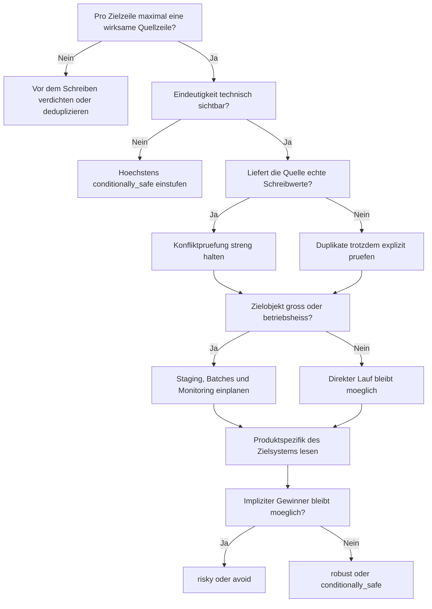

# Update with Join: Warum Kardinalitaet wichtiger ist als Syntax

## Leserleitfaden in 30 Sekunden

- Wenn du vor allem mit SQL Server arbeitest, lies den Artikel linear. Die Hauptachse liegt auf Determinismus, Sperrverhalten und operativer Tragfaehigkeit in SQL Server.
- Wenn du aus PostgreSQL, Oracle oder MySQL kommst, konzentriere dich besonders auf die Abschnitte zur Trefferklasse und zur Produktspezifik. Dort liegen die echten Abweichungen.
- Wenn du nur eine produktive Entscheidung absichern willst, spring direkt zu "Die wichtigste praktische Unterscheidung", "Vor jeder produktiven Umsetzung" und "Ein praxisnahes Entscheidungsmodell".

## Versions- und Geltungsbereich

- Stand: 2026-03-08
- Fuehrendes System: Microsoft SQL Server 2022 (16.x)
- Behandelte Versionen:
  - SQL Server 2022 (16.x)
  - PostgreSQL 18
  - Oracle AI Database 26ai, mit Oracle Database 19c als historische Kontrastfolie
  - MySQL 8.4 LTS
- Andere Releases koennen abweichen, besonders Oracle zwischen 19c und 26ai sowie kuenftige Major Releases aller Systeme.

## Methodischer Status

Dieser Artikel basiert auf:

- offizieller Produktdokumentation
- einem redaktionellen Themenplan
- einem quellengebundenen Claim-Register

Nicht enthalten in dieser Fassung:

- ausgefuehrte Demo-Skripte
- Testcases auf realen VMs
- Performance-Messungen
- planbasierte oder empirische Validierung

Daher sind operative Aussagen in diesem Artikel dokumentationsbasiert, nicht benchmarkbasiert.

## Warum SQL Server in dieser Episode fuehrt

SQL Server fuehrt diese Episode nicht deshalb, weil joined updates dort automatisch am sichersten waeren. Das fuehrende System ist hier SQL Server, weil der Ausdruck "Update with Join" im praktischen Sprachgebrauch am direktesten auf die T-SQL-Form `UPDATE ... FROM` zeigt und die Produktdokumentation die Determinismusfrage besonders klar und scharf offenlegt.

## Verfuegbare Schulungsunterlagen im Repository

- [T-SQL - UPDATE Uebersicht](../../T-SQL/08_Update/08_Update.md)
- [T-SQL - JOIN Uebersicht](../../T-SQL/03_JOIN/03_Join.md)
- [T-SQL - MERGE Uebersicht](../../T-SQL/13_Merge/13_Merge.md)
- [T-SQL - Transaktionen](../../T-SQL/19_Transaktions/19_Transactions.md)
- [T-SQL - Isolation Levels](../../T-SQL/60_IsolationLevels/60_IsolationLevels.md)

## Weitere Dialekte in dieser Episode

PostgreSQL, Oracle und MySQL werden in diesem Artikel fachlich mitbehandelt. Gleichwertig ausgebaute themenspezifische Trainingskapitel im Repository folgen spaeter.

## Inhaltsverzeichnis

- [TL;DR gesamt](#tldr-gesamt)
- [TL;DR pro relevantem System](#tldr-pro-relevantem-system)
- [Syntax-Oberflaeche im Schnellvergleich](#syntax-oberflaeche-im-schnellvergleich)
- [Systemvergleich auf einen Blick](#systemvergleich-auf-einen-blick)
- [Drei Muster zur ersten Orientierung](#drei-muster-zur-ersten-orientierung)
- [1. Was das Problem eigentlich ist](#1-was-das-problem-eigentlich-ist)
- [2. Warum die intuitive Sicht zu kurz greift](#2-warum-die-intuitive-sicht-zu-kurz-greift)
- [3. Welche internen Klassen es gibt](#3-welche-internen-klassen-es-gibt)
- [4. Wovon Verhalten, Risiko und Kosten abhaengen](#4-wovon-verhalten-risiko-und-kosten-abhaengen)
- [5. Was intern eigentlich passiert](#5-was-intern-eigentlich-passiert)
- [6. Deep Dive: SQL Server als fuehrendes System](#6-deep-dive-sql-server-als-fuehrendes-system)
- [7. Die wichtigste praktische Unterscheidung](#7-die-wichtigste-praktische-unterscheidung)
- [8. Welche Rolle Indizes, Constraints, Logging und Locks spielen](#8-welche-rolle-indizes-constraints-logging-und-locks-spielen)
- [9. Vor jeder produktiven Umsetzung: technische Vorpruefung](#9-vor-jeder-produktiven-umsetzung-technische-vorpruefung)
- [10. Die Hauptstrategien sauber eingeordnet](#10-die-hauptstrategien-sauber-eingeordnet)
- [11. Ein praxisnahes Entscheidungsmodell](#11-ein-praxisnahes-entscheidungsmodell)
- [12. Fazit](#12-fazit)
- [13. Kurzform fuer die Praxis](#13-kurzform-fuer-die-praxis)

## TL;DR gesamt

- "Update with Join" ist kein Join-Thema, sondern ein Schreibthema mit Kardinalitaetsvertrag.
- Robust wird die Operation erst dann, wenn pro Zielzeile fachlich und technisch hoechstens eine wirksame Quellzeile existiert.
- SQL Server und PostgreSQL sehen an der Oberflaeche aehnlich aus, gehen mit Mehrfachtreffern aber nicht gleich sicher um.
- Oracle macht die Ein-Zeilen-Regel je nach Version expliziter sichtbar als andere Systeme.
- MySQL hat eine eigene Multi-Table-Logik und bringt zusaetzliche Restriktionen und FK-nahe Betriebsrisiken mit.

## TL;DR pro relevantem System

- SQL Server: Maechte dir nie ein, dass die `FROM`-Quelle schon deshalb sicher ist, weil sie bequem aussieht. Sobald dieselbe Zielzeile mehr als eine relevante Quellzeile sieht, spricht die offizielle Doku von undefinierten Ergebnissen.
- PostgreSQL: Die sichtbare Form ist aehnlich, aber die Dokumentation warnt ebenfalls vor Mehrfachtreffern. Wenn mehr als eine Join-Zeile auf eine Zielzeile zeigt, wird nur eine verwendet, und welche das ist, ist nicht verlaesslich vorhersagbar.
- Oracle: Im aktuellen 26ai-Scope gibt es direkte Joins in `UPDATE`, aber dieselbe Zielzeile darf dabei nicht mehrfach getroffen werden. Historisch zeigt 19c noch deutlicher, dass eine exakt-eine-Zeile-Regel im Zentrum steht.
- MySQL: Joined updates laufen ueber die Multi-Table-Update-Form. Das ist nicht nur ein anderer Dialekt, sondern auch eine andere Betriebsoberflaeche mit eigenen Restriktionen wie dem Wegfall von `ORDER BY` und `LIMIT` in dieser Form.

## Syntax-Oberflaeche im Schnellvergleich

Die folgenden Snippets zeigen bewusst nur die Kernoberflaeche. Sie machen die Sprachform sichtbar, nicht den vollstaendigen Demo-Rahmen.

### SQL Server

```sql
UPDATE t
SET t.target_value = s.new_value
FROM dbo.target AS t
JOIN dbo.source AS s ON s.id = t.id;
```

### PostgreSQL

```sql
UPDATE target AS t
SET target_value = s.new_value
FROM source AS s
WHERE s.id = t.id;
```

### Oracle 26ai

```sql
UPDATE target t
SET t.target_value = s.new_value
FROM source s
WHERE s.id = t.id;
```

### Oracle 19c

```sql
UPDATE target t
SET t.target_value = (
  SELECT s.new_value
  FROM source s
  WHERE s.id = t.id
);
```

Historische Kontrastfolie in Oracle 19c: Die Subquery muss pro Zielzeile genau eine Rueckgabezeile liefern.

### MySQL 8.4

```sql
UPDATE target AS t
JOIN source AS s ON s.id = t.id
SET t.target_value = s.new_value;
```

## Systemvergleich auf einen Blick

| System | Sichtbare Form | Verhalten bei Mehrfachtreffern | Sichtbare Fehlerkante | Operative Vorsicht |
|---|---|---|---|---|
| SQL Server | `UPDATE ... FROM` | undefiniert, wenn die Quellzuordnung nicht deterministisch ist | oft keine freundliche Schutzschranke, sondern semantische Unsicherheit | Locks, Log und heisse Zielobjekte |
| PostgreSQL | `UPDATE ... FROM` | eine nicht gut vorhersagbare Join-Zeile gewinnt | dokumentierte Unvorhersagbarkeit statt harter Fehler | Bloat, Replica Lag, Lock Contention |
| Oracle 26ai | `UPDATE ... SET ... FROM ... WHERE ...` | dieselbe Zielzeile darf hoechstens einmal getroffen werden | `ORA-30926` | versionsscharf lesen, 19c anders modelliert |
| MySQL 8.4 | `UPDATE ... JOIN ... SET ...` | jede passende Zeile wird einmal aktualisiert; konfliktierende Quellwerte bleiben fachlich gefaehrlich | Restriktionen und Rollback-Risiken statt einer klaren Gewinnerlogik | FK-/Optimizer-Kontext, kein `ORDER BY`/`LIMIT` in der Multi-Table-Form |

## Drei Muster zur ersten Orientierung

Die formalen Risikoklassen werden in Abschnitt 3 sauber eingefuehrt. Die folgenden drei Muster sind nur ein frueher Vorgriff auf typische Konstellationen.

### Eindeutige Lookup-Quelle

```sql
UPDATE t
SET t.status = s.new_status
FROM dbo.customer AS t
JOIN dbo.customer_status AS s
  ON s.customer_id = t.customer_id;
```

Diese Form wird spaeter robust, wenn `customer_status.customer_id` fachlich und technisch eindeutig ist, zum Beispiel ueber einen Unique Key.

### Rohquelle mit Mehrfachtreffern

```sql
UPDATE t
SET t.status = s.new_status
FROM dbo.customer AS t
JOIN dbo.staging_status AS s
  ON s.customer_id = t.customer_id;
```

> **Achtung:** Wenn `staging_status` pro `customer_id` mehrere wirksame Zeilen liefert, ist das keine "bequeme Kurzform" mehr. SQL Server dokumentiert undefinierte Ergebnisse, PostgreSQL eine nicht gut vorhersagbare Gewinnerzeile und Oracle 26ai bricht mit `ORA-30926` ab.

### Vorbereitete Quelle

```sql
WITH prepared_source AS (
  SELECT customer_id, MAX(new_status) AS new_status
  FROM dbo.staging_status
  GROUP BY customer_id
)
UPDATE t
SET t.status = s.new_status
FROM dbo.customer AS t
JOIN prepared_source AS s
  ON s.customer_id = t.customer_id;
```

Hier wird die Konfliktaufloesung von der eigentlichen Schreiboperation getrennt. Genau das macht aus einer lesbaren Form spaeter eher eine schreibreife Form.

## 1. Was das Problem eigentlich ist

Sam legte die Haende auf den Tisch. "Ein Update mit Join ist doch nur ein Select mit Schreibabsicht."

Pete hob eine Augenbraue. "Nur solange du beweisen kannst, dass dein Join pro Zielzeile genau das liefert, was du fuer den Schreibvorgang glaubst."

Ora schob trocken nach: "Und solange dein System nicht ploetzlich verlangt, dass aus mehreren Treffern genau keiner, genau einer oder im Fehlerfall gar keiner werden darf."

My nickte. "Oder solange du nicht vergisst, dass ein Multi-Table-Update nicht nur Syntax, sondern auch Betriebsverhalten ist."

Mutter ANSI-95 sagte nur: "Kinder, verwechselt mir das Problem nicht mit seiner Oberflaeche."

### Ein Fehlerbild, das im Kopf bleiben sollte

Stell dir einen Montagmorgen vor: Ein Wartungslauf soll eigentlich nur den Status von Kunden aktualisieren, fuer die genau ein neuer Bewertungsdatensatz vorliegt. In der Quellmenge stecken aber fuer 312 Kunden doppelte oder widerspruechliche Rohzeilen. Nach dem Lauf melden Vertrieb und Support, dass einzelne Kunden ploetzlich den Status eines anderen Importzeitpunkts tragen. Auffaellig wird das erst, als Reporting und Fachanwendung fuer dieselben Kunden unterschiedliche Bilder zeigen. Genau an dieser Stelle kippt "bequeme Join-Syntax" in ein Produktionsproblem mit sichtbarem Fehlersymptom.

Ein joined update ist keine harmlose Erweiterung eines Lesestatements. Es ist eine Schreiboperation, deren Zielmenge mit Hilfe einer zweiten Menge bestimmt oder mit Werten aus dieser zweiten Menge versorgt wird. Genau dort beginnt die eigentliche Problemklasse.

Die relevante Frage lautet nicht: "Kann mein System einen Join in einer `UPDATE`-Anweisung formulieren?" Die relevante Frage lautet: "Kann ich fuer jede Zielzeile sauber beweisen, welche Quellzeile schreiben darf, welche nur filtern darf und was bei Mehrfachtreffern passieren soll?"

### Was der Standard hier leistet - und was nicht

Der SQL-Standard hilft hier, Problemklasse und Produktsyntax voneinander zu trennen. Er sagt dir, dass du ueber eine Schreiboperation mit Quellbezug nachdenkst. Er gibt dir aber keine universelle, produktuebergreifende Oberflaeche fuer "joined update", auf die du dich im Alltag blind verlassen koenntest.

Darum bleibt ANSI in diesem Artikel bewusst Meta-Ebene. Praktisch ist das Thema in drei Ebenen zu lesen:

- Problemklasse: Eine Zielmenge wird ueber eine andere Menge gefiltert oder mit Werten versorgt.
- Produktsyntax: SQL Server, PostgreSQL, Oracle und MySQL zeigen unterschiedliche Schreiboberflaechen.
- Produktsemantik: Mehrfachtreffer, Fehlerverhalten, Locking und Betriebsfolgen sind nicht identisch.

Starke Produktaussagen stuetzen sich deshalb hier auf Herstellerdokumentation, nicht auf eine vermeintlich einheitliche Standardoberflaeche.

Die Aussage, dass es hier keine portable Einheitsform gibt, ergibt sich aus dem Vergleich der vier Produktdokumentationen und nicht aus einer angeblich universellen Schreiboberflaeche. Genau deshalb bleibt ANSI in diesem Artikel bewusst Meta-Ebene und nicht Hauptbeweis.

Genau deshalb ist "Update with Join" ein schlechter Titel fuer eine gute Entscheidung, aber ein guter Titel fuer eine wichtige Warnung.

## 2. Warum die intuitive Sicht zu kurz greift

Die naive Sicht lautet: Wenn das zugehoerige Select korrekt aussieht, wird das Update schon korrekt sein. Das ist zu kurz gedacht.

Ein Select darf Mehrfachtreffer sichtbar machen. Ein Update muss entscheiden, was diese Mehrfachtreffer fuer den Schreibvorgang bedeuten. Sollen mehrere Rohzeilen zuerst verdichtet werden? Soll exakt eine Zeile gewinnen? Soll der Fall als Fehler enden? Soll ueberhaupt nicht direkt geschrieben werden, sondern erst ueber Staging?

Hier liegt die Trennlinie zwischen Leselogik und Schreiblogik. Lesen kann Unschaerfen oft tolerieren. Schreiben fast nie.

Dazu kommt ein zweiter Kurzschluss: Viele Teams reden ueber Syntax, obwohl sie ueber Kardinalitaet reden sollten. "PostgreSQL kann das doch auch", "Oracle hat dafuer doch jetzt auch eine Form", "In MySQL geht das seit Jahren" - all das kann gleichzeitig wahr und fachlich unzureichend sein. Entscheidend ist nicht, ob eine Schreiboberflaeche existiert, sondern welches Verhalten bei Mehrfachtreffern, grossen Zielmengen und konkurrierenden Sessions dokumentiert ist.

In der Praxis ist genau hier oft der Denkfehler: Die Diskussion beginnt bei der sichtbaren Syntax, obwohl die eigentliche Unsicherheit in der Quellform steckt.

## 3. Welche internen Klassen es gibt

Die Problemklasse laesst sich sinnvoll in vier Risikoklassen aufteilen:

| Klasse | Fachliche Bedeutung | Typische Form |
|---|---|---|
| robust | Pro Zielzeile ist die Quelle nachweisbar eindeutig. | Lookup- oder Staging-basierte Aenderung mit belegter 1:1-Regel |
| conditionally_safe | Die Operation ist beherrschbar, aber nur nach vorbereiteter Verdichtung, Deduplikation oder mit klarer Batch-Disziplin. | vorbereitete Quellmenge, begrenztes Zeitfenster |
| risky | Die Schreibwirkung haengt von impliziten Annahmen ueber Mehrfachtreffer oder vom Produktionszustand ab. | rohe Join-Quelle ohne harte Eindeutigkeit |
| avoid | Das Muster sollte in dieser Form nicht produktiv eingesetzt werden. | tolerierte Mehrfachtreffer, gemischte Mehrtabellen-Schreiblogik ohne Not |

Wichtig ist: Diese Klassen sind keine Syntaxklassen. Dieselbe Oberflaeche kann in einem Fall robust und im anderen Fall riskant sein. Der Unterschied entsteht nicht am Keyword, sondern an der Form der Quelle.

Aus Sicht des Artikels sind besonders drei Unterfaelle relevant:

- Filternder Join: Die Quelle bestimmt nur, welche Zielzeilen ueberhaupt betroffen sind.
- Wertliefernder Join: Die Quelle liefert konkrete Schreibwerte fuer Zielspalten.
- Konfliktlastiger Join: Mehrere Quellzeilen koennten dieselbe Zielzeile beeinflussen.

Je mehr die Quelle nicht nur filtert, sondern Werte liefert, desto haerter muss die Eindeutigkeit abgesichert sein.

## 4. Wovon Verhalten, Risiko und Kosten abhaengen

Das Verhalten joined updates haengt nicht von einem einzelnen Faktor ab, sondern von einer Kette:

- Kardinalitaet: Ist die Beziehung fachlich 1:1, 1:n oder n:m?
- Sichtbare Eindeutigkeit: Ist die angenommene 1:1-Regel durch Keys, Constraints, vorbereitete Verdichtung oder Staging nachweisbar?
- Wertquelle: Werden nur Zielzeilen ausgewaehlt oder stammen die neuen Werte selbst aus der Quelle?
- Groesse der Aenderung: Wenige Zeilen und viele Millionen Zeilen sind betriebspraktisch verschiedene Themen.
- Indexierung: Gute Join- und Filterindizes senken nicht nur Kosten, sondern machen die zugrunde liegende Regel oft erst pruefbar.
- Logging und Versionierung: Jede Aenderung erzeugt Folgeeffekte fuer Log, Undo, MVCC- oder Version-Store-Mechanismen.
- Konkurrenz: Schreiber kollidieren anders als Leser. Ein System mit freundlicher Lesesemantik schreibt nicht automatisch freundlich.

Operativ kippt das Thema meist nicht an der Syntax, sondern an ungesicherten Annahmen ueber 1:1-Beziehungen, Volumen und Konkurrenz.

PostgreSQL ist hier ein guter Kontrast zu SQL Server. Die sichtbare `FROM`-Form wirkt vertraut, aber grosse Updates bringen dort laut offizieller Dokumentation Themen wie Table Bloat, Replica Lag und Lock Contention mit. Das erinnert daran, dass korrekte Semantik und saubere Betriebsfaehigkeit zwei getrennte Pruefungen sind.

MySQL erweitert die Liste um eine eigene Gefahr: Die Multi-Table-Form ist nicht nur eine andere Schreiboberflaeche, sondern im InnoDB- und FK-Kontext auch eine Stelle, an der Optimizer-Reihenfolgen operativ relevant werden koennen.

## 5. Was intern eigentlich passiert

Logisch betrachtet laufen joined updates immer ueber dieselbe Grundfigur:

1. Eine Zielzeile wird als Kandidat erkannt.
2. Eine Quellmenge wird mit dieser Zielzeile in Beziehung gesetzt.
3. Das System entscheidet, ob genau eine, mehrere oder keine wirksamen Quellzeilen vorliegen.
4. Erst danach wird geschrieben oder abgebrochen.

Was sich zwischen den Produkten aendert, ist nicht diese Grundfigur, sondern die Art, wie unsicheres Material behandelt wird.

### PostgreSQL als naher Syntaxverwandter

PostgreSQL dokumentiert offen, dass bei `UPDATE ... FROM` der Join pro Zielzeile hoechstens eine Ausgaberow erzeugen sollte. Sonst wird nur eine dieser Zeilen verwendet, und welche das ist, ist nicht gut vorhersagbar. Das ist keine akademische Fussnote, sondern die ganze Wahrheit ueber riskante Join-Updates in einem System, das SQL Server an der Oberflaeche sehr aehnlich sieht.

### Oracle als versionsscharfer Kontrastfall

Oracle zeigt im Vergleich eine andere Kultur der Sichtbarkeit. In 26ai gibt es direkte Joins in `UPDATE`, aber die Zielzeile darf nicht mehrfach wirksam getroffen werden; sonst kommt `ORA-30926`. Oracle 19c als historische Gegenfolie macht dasselbe Prinzip noch strenger sichtbar: Die Subquery fuer die neue Wertbildung muss pro aktualisierter Zielzeile genau eine Zeile liefern. Gerade deshalb darf man Oracle nicht pauschal, sondern nur versionsscharf in die Diskussion nehmen.

### MySQL als eigene Schreiboberflaeche

MySQL formuliert die Operation ueber Multi-Table-Update. Die Dokumentation sagt, dass jede passende Zeile einmal aktualisiert wird, und schliesst in dieser Form `ORDER BY` und `LIMIT` aus. Zusaetzlich warnt sie im InnoDB- und FK-Kontext vor Fehlverhalten durch Optimizer-Reihenfolgen. Das ist wichtig, aber nicht genug, um Mehrfachtreffer entspannt zu behandeln. Sobald konfliktierende Quellwerte moeglich sind, bleibt die fachliche Pflicht zur vorgelagerten Eindeutigkeit bestehen.

## 6. Deep Dive: SQL Server als fuehrendes System

SQL Server ist fuer dieses Thema nicht deshalb das fuehrende System, weil es immer die "beste" Form haette. Es fuehrt, weil an ihm die Kernthese besonders gut sichtbar wird: Ein joined update ist nur so gut wie seine Kardinalitaetsdisziplin.

Die T-SQL-Oberflaeche macht joined updates angenehm erreichbar. Genau deshalb ist sie gefaehrlich unterschaetzt. Wer in SQL Server ein `UPDATE ... FROM` sieht, liest schnell "bequeme Lookup-Aktualisierung". Die Doku sagt jedoch unmissverstaendlich, dass die Ergebnisse undefiniert sind, wenn die Quelle fuer die zu aktualisierende Zeile nicht sauber eindeutig ist. Das ist kein Stilhinweis, sondern ein semantischer Warnhinweis.

Viele Teams pruefen an dieser Stelle die Zielmenge, aber nicht die Eindeutigkeit der Quelle. Fuer einen plausiblen Select mag das kurzfristig reichen. Fuer ein robustes Update reicht es nicht.

Dazu kommt das Sperrmodell. SQL Server kann durch Row Versioning das Lesen entspannen, aber Schreiben bleibt Schreiben. Fuer Datenaenderungen werden exklusive Sperren gehalten, und auch der Weg zur Zielzeile ist kein freier Spaziergang: Update Locks und spaetere X Locks muessen in das Betriebsbild mit hineingedacht werden. Wer joined updates als rein logisches Mapping behandelt, laesst die halbe Wahrheit aus.

Gerade in SQL Server wird deshalb der Unterschied zwischen robust und riskant schnell praktisch:

- Robust ist das Muster, wenn die Quelle bereits als eindeutige Arbeitsmenge vorliegt.
- Bedingt sicher ist es, wenn vor dem Schreiben eine deduplizierte oder voraggregierte Zwischenmenge erzeugt wird.
- Riskant ist es, wenn sich mehrere Rohzeilen dieselbe Zielzeile teilen, ohne dass die Gewinnerregel vorher materialisiert wurde.
- Zu vermeiden ist es, wenn die Operation gleichzeitig Kardinalitaetsunsicherheit, grosses Volumen und betriebsheisse Tabellen zusammenbringt.

Dasselbe fuehrt direkt zur naechsten Einsicht: Ein gutes SQL-Server-Join-Update beginnt oft nicht mit dem Update, sondern mit der Konstruktion einer belastbaren Quellmenge davor.

## 7. Die wichtigste praktische Unterscheidung

Die wichtigste praktische Unterscheidung lautet nicht "mit Join" gegen "ohne Join", sondern:

- Ist die Quellmenge bereits schreibreif?
- Oder ist sie nur lesepraktisch, aber noch nicht schreibreif?

Schreibreif ist eine Quellmenge erst dann, wenn pro Zielzeile klar ist:

- ob sie ueberhaupt geaendert werden soll,
- welche einzige Regel dafuer gilt,
- welche einzige Zeile oder welche vorbereitete Verdichtung den neuen Wert liefert,
- und wie das System reagieren soll, falls diese Eindeutigkeit verletzt wird.

Hier unterscheiden sich die Systeme nicht in der Fachlogik, sondern in der Sichtbarkeit des Fehlers:

- SQL Server macht Mehrdeutigkeit ueber "undefined" besonders gefaehrlich.
- PostgreSQL macht sie ueber "eine nicht gut vorhersagbare Zeile" besonders anschaulich.
- Oracle 26ai macht sie ueber den expliziten Fehlerfall `ORA-30926` besonders sichtbar.
- MySQL macht sie ueber die eigene Multi-Table-Schreibform besonders leicht zu unterschaetzen.

Praktisch bedeutet das: Sobald du Mehrfachtreffer nicht mit einer vorgelagerten, dokumentierten Regel aufloest, arbeitest du nicht an einem robusten Update, sondern an einer Wette.

> **Achtung:** Wenn dieselbe Zielzeile mehrere wirksame Quellzeilen sehen kann, hast du kein Komfortproblem, sondern ein Korrektheitsproblem. Dann entscheidet nicht mehr deine Absicht, sondern die Produktsemantik.

### Anti-Pattern vs. robuste Form

| Anti-Pattern | Robuste Form | Warum |
|---|---|---|
| Rohdaten direkt in ein `UPDATE ... FROM` oder `UPDATE ... JOIN` kippen | Quellmenge erst deduplizieren oder voraggregieren | Konfliktaufloesung wird explizit statt implizit |
| Nur auf einen "gut aussehenden" Select vertrauen | Ziel-, Quell- und Konfliktlogik getrennt pruefen | Lesen toleriert Unschaerfe, Schreiben nicht |
| Kardinalitaet als Fachwissen im Team belassen | Eindeutigkeit ueber Keys, Constraints oder vorbereitete Quelle sichtbar machen | Annahmen werden pruefbar |
| Grosses Update direkt auf heisser Tabelle starten | Staging, Batches und Rueckfallpfad einplanen | Betriebsrisiko sinkt deutlich |

## 8. Welche Rolle Indizes, Constraints, Logging und Locks spielen

Indizes und Constraints sind in diesem Thema nicht bloss Performance-Zubehoer. Sie sind Belegmaterial.

Ein Unique Key auf der wirksamen Quellseite macht aus einer behaupteten Eindeutigkeit eine pruefbare Eindeutigkeit. Ein passender Join-Index macht nicht nur den Lauf billiger, sondern reduziert oft auch den Druck, unter Zeitnot in riskante Vereinfachungen zu rutschen. Praktisch ist das oft die Stelle, an der eine Variante aus Abschnitt 3 von `conditionally_safe` in Richtung `robust` kippt.

Constraints zeigen ausserdem, ob das Datenmodell die Schreibannahme ueberhaupt traegt. Wenn eine Fachregel "genau ein aktiver Datensatz pro Geschaeftsschluessel" behauptet, aber weder Datenmodell noch vorbereitete Quelle das sichtbar machen, ist der Join nicht robust, selbst wenn er in einer Testmenge harmlos aussieht. Im Zweifel bleibt die Operation dann `risky`.

Beim Logging zeigt sich die operative Seite:

- SQL Server erzeugt Log und haelt Schreibsperren bis zum Transaktionsende.
- PostgreSQL bezahlt grosse Updates zusaetzlich mit MVCC-Folgeeffekten wie Bloat und moeglicher Replikationsverzoegerung.
- Oracle denkt staerker in stabilen Ein-Zeilen-Kontrakten, was die Fehlerkante klarer macht, aber die Vorarbeit nicht ersetzt.
- MySQL bringt bei Multi-Table-Updates und InnoDB-FKs eine weitere Schicht betrieblicher Vorsicht hinein.

Wer joined updates ernst nimmt, prueft deshalb immer zwei Dinge getrennt:

- Ist die Schreiblogik korrekt?
- Ist der Betriebspfad fuer Volumen, Konkurrenz und Rueckfallpfad tragbar?

## 9. Vor jeder produktiven Umsetzung: technische Vorpruefung

Vor einem produktiven joined update sollten mindestens diese Fragen beantwortet sein:

1. Welche fachliche Regel erzwingt, dass pro Zielzeile hoechstens eine wirksame Quellzeile existiert?
2. Wo ist diese Regel technisch sichtbar: im Datenmodell, in der vorbereiteten Quelle oder nur als Hoffnung?
3. Welche Faelle mit doppelten, fehlenden oder widerspruechlichen Quellzeilen wurden explizit geprueft?
4. Liefert die Quelle nur Filterlogik oder auch Schreibwerte?
5. Wie gross ist die betroffene Zielmenge, und was bedeutet das fuer Log, Undo, MVCC, Replikation oder Version Store?
6. Welche Sperr- oder Konkurrenzmuster sind waehrend des Laufs realistisch?
7. Gibt es Trigger, Historisierung, CDC, Replikation oder Auditing, die den Preis der Aenderung erhoehen?
8. Wie lautet der Wiederanlauf- oder Ruecksetzpfad, wenn Anzahl, Dauer oder Nebenwirkungen aus dem Rahmen laufen?

Praktisch reichen Fragen allein aber nicht. Diese vier Query-Patterns gehoeren fast immer in die Vorpruefung:

Ich halte genau diese Vorpruefung fuer den eigentlichen Pflichtschritt. Wer sie ueberspringt, arbeitet nicht robust, sondern hofft.

### Mehrfachtreffer sichtbar machen

```sql
SELECT s.customer_id, COUNT(*) AS match_count
FROM source AS s
GROUP BY s.customer_id
HAVING COUNT(*) > 1;
```

### Fehlende Matches sichtbar machen

```sql
SELECT t.customer_id
FROM target AS t
LEFT JOIN source AS s
  ON s.customer_id = t.customer_id
WHERE s.customer_id IS NULL;
```

### Zielzeilenanzahl vorab abschaetzen

```sql
SELECT COUNT(*) AS candidate_rows
FROM target AS t
JOIN source AS s
  ON s.customer_id = t.customer_id;
```

### Widerspruechliche Quellwerte finden

```sql
SELECT s.customer_id
FROM source AS s
GROUP BY s.customer_id
HAVING COUNT(DISTINCT s.new_status) > 1;
```

Wenn auf mehrere dieser Fragen nur "muesste eigentlich passen" folgt oder die Query-Patterns unerwartete Treffer liefern, ist die Operation noch nicht schreibreif.

## 10. Die Hauptstrategien sauber eingeordnet

Fachlich sinnvoll sind in der Praxis vor allem vier Strategien. Sie sind nicht nur unterschiedliche Schreibstile, sondern verschieben eine Operation aktiv zwischen den Risikoklassen aus Abschnitt 3.

### Direkter joined write

Das ist die knappste Form. Sie ist dann vertretbar, wenn die Quelle bereits eindeutig und klein genug ist, um keine zusaetzliche Vorbereitung zu verlangen. Diese Strategie lebt von Disziplin, nicht von Kuerze.

Risikoklasse: Im Idealfall `robust`, bei nur behaupteter Eindeutigkeit schnell `risky`.

### Vorbereitete Quelle

Das ist fuer viele produktive Faelle die bessere Standardstrategie. Rohdaten werden zunaechst in eine eindeutige, schreibreife Menge ueberfuehrt. Erst diese Menge wird zur eigentlichen Zielkorrektur verwendet. Das wirkt haeufig unspektakulaer, ist aber fachlich die sauberste Trennung von Konfliktaufloesung und Schreibvorgang.

Risikoklasse: Hauefig `robust`, mindestens aber der sauberste Weg aus `risky` heraus.

### Staging oder Batch-orientierter Lauf

Sobald Volumen, Replikation, Locking oder Undo-/Log-Kosten kritisch werden, ist eine vorgelagerte Arbeitsmenge plus kontrollierte Batches oft die bessere Architektur. PostgreSQLs Hinweise zu grossen Updates und SQL Servers Lock-/Log-Seite laufen an dieser Stelle fachlich zusammen.

Risikoklasse: Typischerweise `conditionally_safe`, mit vorbereiteter Quelle und sauberem Batching auch `robust`.

Ein minimales T-SQL-Skelett sieht dann eher so aus:

```sql
WHILE 1 = 1
BEGIN
    ;WITH next_batch AS (
        SELECT TOP (1000)
            t.customer_id,
            s.new_status
        FROM dbo.customer AS t
        JOIN dbo.prepared_source AS s
          ON s.customer_id = t.customer_id
        WHERE t.needs_update = 1
        ORDER BY t.customer_id
    )
    UPDATE t
    SET t.status = b.new_status
    FROM dbo.customer AS t
    JOIN next_batch AS b
      ON b.customer_id = t.customer_id;

    -- Falls `needs_update` ein persistentes Flag ist, muss es hier
    -- zurueckgesetzt oder die Batch-Auswahl anders terminierbar gemacht werden.
    IF @@ROWCOUNT = 0
        BREAK;
END;
```

Der Punkt an diesem Muster ist nicht die Schleife selbst, sondern die Kombination aus vorbereiteter Quelle, begrenzter Aenderungsmenge und kontrollierbarem Wiederanlauf.

### Alternative Muster statt ueberladenem joined update

Nicht jedes Synchronisationsproblem sollte als direktes joined update formuliert werden. Oracle 19c fuehrt hier gedanklich in Richtung vorbereiteter Subquery- oder anderer Muster. In SQL Server fuehrt derselbe Gedanke oft zu einer sauberen Zweiphasen-Logik, wenn der eigentliche Fall schon in Richtung Synchronisation oder Upsert kippt. MySQL erinnert zusaetzlich daran, dass Mehrtabellen-Schreibflaechen nicht automatisch der robusteste Weg sind.

Risikoklasse: Genau dann sinnvoll, wenn das joined update sonst bei `risky` oder `avoid` landen wuerde.

## 11. Ein praxisnahes Entscheidungsmodell



Das Modell ist damit keine akademische Checkliste, sondern ein Navigationsinstrument zwischen den Klassen aus Abschnitt 3: weg von `risky` und `avoid`, hin zu `conditionally_safe` oder `robust`.

1. Klaere zuerst die fachliche Kardinalitaet, nicht die Syntax.
2. Wenn pro Zielzeile mehr als eine Rohzeile moeglich ist, verdichte oder dedupliziere vor dem Schreiben.
3. Wenn die Eindeutigkeit nur implizit ist, stufe das Muster hoechstens als `conditionally_safe` ein.
4. Wenn das Zielobjekt betriebsheiss oder gross ist, plane Staging, Batches und Monitoring ein.
5. Lies danach erst die Produktspezifik des konkreten Systems, besonders bei Oracle und MySQL.
6. Sobald ein impliziter Gewinner bei Mehrfachtreffern uebrig bleibt, ist das Muster `risky` oder `avoid`.

## 12. Fazit

Joined updates sehen wie ein Komfortthema aus. In Wahrheit sind sie ein Disziplinthema.

Der Join ist selten das eigentliche Problem. Das eigentliche Problem ist, ob eine schreibreife Quellmenge vorliegt. SQL Server zeigt das ueber seine harte Warnung zu undefinierten Ergebnissen, PostgreSQL ueber die nicht gut vorhersagbare Gewinnerzeile, Oracle ueber seine explizite Ein-Zeilen-Logik und MySQL ueber eine eigene Multi-Table-Schreiboberflaeche mit zusaetzlichen Restriktionen.

Wer diese Systeme gegeneinander ausspielen will, lernt wenig. Wer aus allen vier liest, lernt dieselbe Hauptregel in vier Dialekten: Vor dem Schreiben muss die Quelle eindeutig werden.

## 13. Kurzform fuer die Praxis

Wenn du joined updates produktiv verantworten willst, entscheide nie nach der kuerzesten Schreibweise. Entscheide danach, ob deine Quelle pro Zielzeile nachweisbar genau eine wirksame Aussage hat. Ist das nicht klar belegt, baue zuerst eine schreibreife Quelle. Erst danach darf das Update bequem werden.

Sam lehnte sich zurueck. "Also war mein Fehler nicht der Join."

Pete nickte. "Sondern dein Vertrauen in einen Join ohne Vertrag."

Ora sagte: "Eine gute Schreiboperation erkennt man daran, dass sie Mehrdeutigkeit nicht charmant findet."

My zuckte mit den Schultern. "Und daran, dass sie im Betrieb nicht erst erklaert werden muss, wenn es schon zu spaet ist."

Mutter ANSI-95 stand auf. "Sehr gut. Erst Klarheit, dann Komfort."
